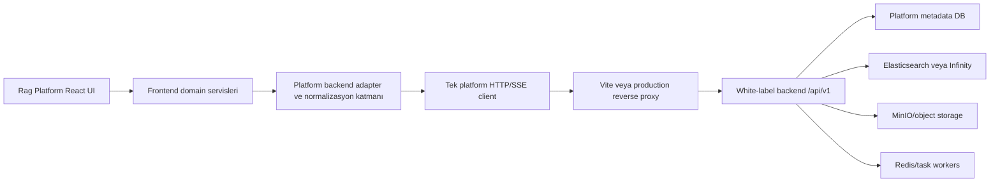
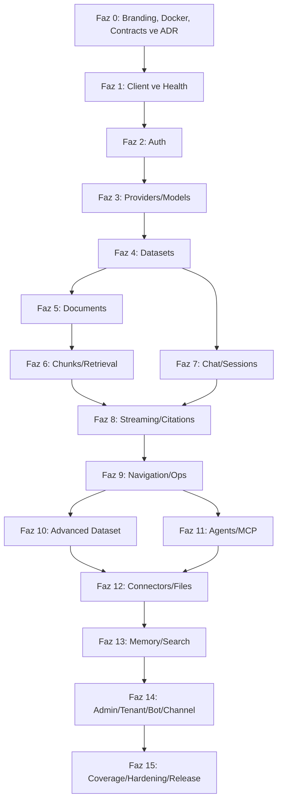

# Rag Platform — Backend Entegrasyon, White-label ve Ürünleştirme Planı

> Bu belge, `acrbaran/rag-frontend` ve `acrbaran/rag-backend` olarak ayrılmış iki repository'nin **Rag Platform** ürünü altında fazlar halinde bütünleştirilmesi için hazırlanmış uygulama planıdır. Her faz, ayrı bir yapay zekâ/kodlama oturumunda uygulanabilecek kadar sınırlandırılmıştır.

> **Normatif belge:** Faz sırası, kapsam, mimari karar ve release kriterlerinde tek otorite bu dosyadır. `docs/rag-platform-integration/00-MASTER-PLAN.md` yalnızca teknik keşif referansıdır; iki belge çelişirse bu plan uygulanır. Teknik referanstaki endpoint veya davranış iddiaları kullanılmadan önce güncel `rag-backend` kaynağından doğrulanmalıdır.

## 1. Belgenin amacı

Bu planın amacı yalnızca birkaç endpoint'i frontend'e bağlamak değildir. Hedef:

- Rag Platform backend'ini RAG, doküman, retrieval, chat ve agent işlemleri için ana backend yapmak,
- mevcut frontend tasarımını ve kullanılabilir parçaları korumak,
- Rag Platform backend ile eşleşmeyen eski backend sözleşmelerini kontrollü biçimde değiştirmek,
- frontend'de henüz karşılığı bulunmayan Rag Platform backend yeteneklerini önem sırasına göre eklemek,
- backend'deki kullanıcıya anlamlı bütün public yetenekleri frontend ekranı, mevcut ekran aksiyonu veya belgeli API-only kullanım olarak eksiksiz sınıflandırmak,
- release anında sınıflandırılmamış public endpoint ve karşılıksız kullanıcı özelliği bırakmamak,
- her fazı test edilebilir, geri alınabilir ve ayrı teslim edilebilir tutmak,
- yapay zekâ ajanlarının varsayım yaparak geniş ve kırılgan değişiklikler üretmesini engellemektir.

Bu belge bir “tek seferde migration” talimatı değildir. Bir faz tamamlanıp kabul kriterleri sağlanmadan sonraki faza geçilmemelidir.

### 1.1 Kesin ürün ve marka kararı

- Ürünün kullanıcıya görünen resmi adı **Rag Platform** olacaktır.
- İlk fazdan itibaren kullanıcı arayüzünde, document title'da, favicon/logo alt metinlerinde, onboarding'de, hata metinlerinde ve yardım içeriklerinde yalnızca **Rag Platform** ürün adı gösterilecektir.
- Sahip olunan kaynak kod, yapılandırma, Docker kimliği ve geliştirme dokümanlarında eski ürün/vendor adı yeni bir identifier olarak kullanılmayacaktır.
- Zorunlu üçüncü taraf lisans, telif ve attribution metinleri değiştirilmeden korunacaktır; bunlar ürün markası değil hukuki kaynak bildirimidir.
- Upstream `LICENSE`, mevcut telif başlıkları ve ilgili attribution kayıtları silinmeyecektir.
- Sahip olunan frontend runtime kimlikleri `Rag Platform` veya nötr `platform-backend`/`knowledge-backend` isimlerini kullanacaktır.
- Docker Compose proje adı, çalıştırılan container adı, yerel image etiketi, network ve yeni volume adları `rag-platform` namespace'i altında olacaktır.
- Container içindeki upstream zorunlu path/import/package adları toplu search-replace ile değiştirilmeyecektir; teknik uyumluluk için korunan bu değerler kullanıcıya gösterilmez.


### 1.2 Marka kimliği standardı


| Kullanım                     | Değer                                           |
| ---------------------------- | ----------------------------------------------- |
| Görünen ürün adı             | `Rag Platform`                                  |
| URL/package slug             | `rag-platform`                                  |
| Frontend repository adı      | `rag-frontend`                                  |
| Frontend yerel yolu          | `/Users/baran/Desktop/rag-frontend`             |
| Frontend GitHub repo         | `acrbaran/rag-frontend`                         |
| Backend repository adı       | `rag-backend`                                   |
| Backend yerel yolu           | `/Users/baran/Desktop/rag-backend`              |
| Backend GitHub repo          | `acrbaran/rag-backend`                          |
| Docker Compose project       | `rag-platform`                                  |
| Backend container            | `rag-platform-backend`                          |
| CPU/GPU service kimliği      | `platform-backend-cpu` / `platform-backend-gpu` |
| Yerel image etiketi          | `rag-platform-backend:<sürüm>`                  |
| Docker network               | `rag-platform-network`                          |
| Frontend integration klasörü | `src/integrations/platform-backend`             |
| Frontend client adı          | `platformRequest`                               |
| Frontend hata sınıfı         | `PlatformApiError`                              |
| Frontend env prefix'i        | `VITE_RAG_PLATFORM_`                            |


Bu değerler Faz 0 sonunda oluşturulacak branding ADR'si dışında değiştirilmemelidir.

### 1.3 İki repository ve GitHub standardı

- Frontend'in kalıcı repository'si `acrbaran/rag-frontend`, yerel yolu `/Users/baran/Desktop/rag-frontend` olacaktır.
- Backend'in kalıcı repository'si `acrbaran/rag-backend`, yerel yolu `/Users/baran/Desktop/rag-backend` olacaktır.
- İki repository bağımsız Git geçmişine, bağımsız CI akışına ve bağımsız release yaşam döngüsüne sahip olacaktır; monorepo'ya dönüştürülmeyecektir.
- Her iki repository'de kullanıcının GitHub repository'si `origin` olacaktır.
- Backend repository'sinde resmî kaynak remote'u `upstream` adıyla korunacaktır. Kaynak URL dokümana sabitlenmeyecek; gerektiğinde `git remote get-url upstream` ile mevcut repository yapılandırmasından okunacaktır.
- Backend repository'si tam kaynak geçmişiyle GitHub'a aktarılmıştır; yeni baseline geçmişi uydurulmayacaktır.
- Upstream güncellemeleri doğrudan `main` üzerine alınmayacak; `chore/upstream-sync-<sürüm>` branch'i, compatibility testleri ve ayrı pull request kullanılacaktır.
- `.env`, private/public key çiftlerinin private bölümü, loglar, Docker volume içerikleri, yüklenen belgeler, model dosyaları, veritabanı dump'ları ve provider secret'ları GitHub'a gönderilmeyecektir.
- `LICENSE`, telif başlıkları ve `THIRD_PARTY_NOTICES.md` repository'de korunacaktır.
- Deployment tanımı frontend repository içindeki `infra/rag-platform` alanından iki repository'yi açık path/config ile birleştirebilir; repository sınırları korunacaktır.

---


## 2. İncelenen mevcut durum


### 2.1 Frontend

Frontend'in ana uygulaması `studio/frontend` altındadır ve aşağıdaki temellere sahiptir:

- React 19 + TypeScript + Vite,
- TanStack Router,
- Zustand,
- Assistant UI tabanlı chat ekranı,
- `/api` ve `/v1` yollarını şu anda `127.0.0.1:8888` hedefine proxy eden Vite yapılandırması,
- bearer access token + refresh token bekleyen özel bir auth sözleşmesi,
- OpenAI biçimli `/v1/chat/completions` stream tüketicisi,
- RAG için halihazırda bilgi tabanı, doküman yükleme, indeksleme işi, önizleme, proje/thread kaynakları ve retrieval ayarları içeren ekranlar.

Önemli mevcut dosyalar:

- `studio/frontend/src/features/rag/api/rag-api.ts`
- `studio/frontend/src/features/rag/types/rag.ts`
- `studio/frontend/src/features/rag/components/*`
- `studio/frontend/src/features/chat/api/chat-api.ts`
- `studio/frontend/src/features/chat/api/chat-adapter.ts`
- `studio/frontend/src/features/chat/runtime-provider.tsx`
- `studio/frontend/src/features/auth/api.ts`
- `studio/frontend/src/features/auth/session.ts`
- `studio/frontend/src/features/auth/components/auth-form.tsx`
- `studio/frontend/src/app/auth-guards.ts`
- `studio/frontend/src/lib/api-base.ts`
- `studio/frontend/vite.config.ts`

Mevcut RAG frontend sözleşmesi Rag Platform backend sözleşmesi değildir. Örneğin frontend şu anda `/api/rag/knowledge-bases`, `/api/rag/jobs/{id}/events`, `/api/rag/threads/{id}/documents` gibi özel endpoint'ler beklemektedir. Rag Platform backend ise `/api/v1/datasets`, `/api/v1/datasets/{id}/documents`, `/api/v1/chat/completions` gibi endpoint'ler sunar.

Auth guard ve 401 yönlendirmesinin bazı kısımları, backend henüz bağlı olmadığı için kaynak kodda geçici olarak devre dışıdır. Entegrasyon sırasında bunlar kontrollü biçimde tekrar etkinleştirilmelidir.

### 2.2 Rag Platform backend

İncelenen yerel Rag Platform backend sürümü `v0.26.4`, API sürümü `v1`, varsayılan dış API portu `9380`'dir. Kaynak image adı ürün dokümanına kopyalanmayacak; backend Docker yapılandırmasından okunacaktır.

Temel API prefix'i:

```text
http://127.0.0.1:9380/api/v1
```

Rag Platform backend'inin kritik davranışları:

- response gövdesi çoğunlukla `{ code, message, data }` zarfındadır,
- bazı iş hataları HTTP 200 içinde `code !== 0` olarak dönebilir; yalnızca `response.ok` kontrolü yeterli değildir,
- login `POST /api/v1/auth/login` endpoint'idir,
- login alanları `email` ve RSA ile şifrelenmiş `password` değeridir,
- oturum token'ı response `Authorization` header'ında döner,
- mevcut frontend'in beklediği refresh-token endpoint'i ve token çifti Rag Platform backend native auth sözleşmesinde yoktur,
- doküman yükleme ile parsing iki ayrı işlemdir,
- doküman parsing ilerlemesi mevcut frontend'deki özel job SSE sözleşmesine sahip değildir; doküman durumu polling ile takip edilmelidir,
- chat stream'i OpenAI `choices[].delta` biçimiyle aynı değildir; SSE içindeki Rag Platform backend zarfı normalize edilmelidir,
- chat stream'inin terminal frame'i `[DONE]` yerine `data: { code: 0, data: true, ... }` olabilir.


### 2.3 Entegrasyonda korunacak parçalar

- mevcut görsel tasarım ve UI component sistemi,
- TanStack Router yapısı,
- Assistant UI tabanlı chat deneyimi,
- mevcut bilgi tabanı/doküman dialoglarının uygun kısımları,
- citation/source gösterimi için var olan UI bileşenleri,
- Zustand store yaklaşımı,
- mevcut hata toast ve yükleniyor durumları,
- mevcut chat sayfasının genel kullanıcı deneyimi.


### 2.4 Doğrudan kullanılamayacak parçalar

- refresh-token tabanlı auth akışı,
- `/api/rag/*` özel endpoint sözleşmesi,
- job-id + job SSE indeksleme modeli,
- `/api/chat/threads` ve `/api/chat/projects` özel persistence sözleşmesi,
- Rag Platform backend stream'ini OpenAI stream'i gibi doğrudan tüketmek,
- `nativePathLease` ile dosya yükleme,
- Rag Platform backend'inde karşılığı olmayan Unsloth'a özel model load/unload, training, export, image/video ve API monitor özellikleri.

---


## 3. Hedef mimari




### 3.1 Zorunlu mimari kararlar

1. Frontend bileşenleri doğrudan `fetch('/api/v1/...')` çağrıları yapmayacaktır.
2. Tüm Rag Platform backend çağrıları tek bir typed client üzerinden geçecektir.
3. Rag Platform backend response zarfı client katmanında açılacaktır.
4. UI, Rag Platform backend'inin ham snake_case modellerine değil frontend domain modellerine bağımlı kalacaktır.
5. Rag Platform backend, dataset/document/chat/session/message verisinin source of truth'ü olacaktır.
6. İlk entegrasyon fazlarında Rag Platform backend kaynak kodu değiştirilmemelidir. Backend değişikliği gerçekten gerekiyorsa ayrı ADR ve ayrı faz açılmalıdır.
7. Her unsupported özellik feature flag ile görünmez veya disabled yapılmalıdır; sahte başarı ve boş ekran üretilmemelidir.
8. Secret ve provider API key'leri frontend bundle'ına veya `.env` dosyasına gömülmemelidir.
9. Sahip olunan yeni frontend dosya, class, env ve runtime isimleri `Rag Platform` marka standardına uymalıdır; vendor adı component ve kullanıcı mesajlarına taşınmamalıdır.
10. Upstream lisans/telif metinleri rebranding kapsamında silinmemelidir.
11. Docker rebranding upstream compose dosyalarını körlemesine search-replace ederek değil, Rag Platform'ın sahip olduğu deployment tanımı/override katmanı üzerinden yapılmalıdır.
12. Backend route envanteri kaynak koddan üretilmeli; hiçbir public route yalnızca dokümanda görünmediği için kapsam dışında varsayılmamalıdır.
13. Her backend route'u `frontend-screen`, `frontend-action`, `api-only`, `external-callback`, `internal` veya `unsupported` sınıflarından tam olarak birine atanmalıdır.
14. Kullanıcıya anlamlı public bir yetenek `unsupported` bırakılamaz; release öncesinde ekran/aksiyon karşılığı eklenmeli veya ürün sahibi tarafından gerekçeli ADR ile `api-only` kararı verilmelidir.


### 3.2 Önerilen entity eşlemesi


| Frontend kavramı        | Rag Platform backend kavramı       | Karar                                                                                           |
| ----------------------- | ---------------------------------- | ----------------------------------------------------------------------------------------------- |
| Knowledge Base          | Dataset                            | Birebir domain adapter ile eşleştir                                                             |
| Knowledge Base Document | Dataset Document                   | Birebir eşleştir; status normalize et                                                           |
| Project                 | Chat/Assistant                     | Proje, dataset scope ve prompt taşıyan Rag Platform backend Chat olarak ele alınır              |
| Thread                  | Chat Session                       | Thread ID olarak Rag Platform backend session ID kullanılır                                     |
| Message                 | Session message                    | Rag Platform backend session history source of truth olur                                       |
| Retrieval settings      | Chat ve retrieval request ayarları | Alan bazlı normalize edilir                                                                     |
| Citation/source         | `reference.chunks` ve `doc_aggs`   | Mevcut source UI modeline dönüştürülür                                                          |
| Thread-level document   | Native birebir karşılık yok        | İlk sürümde kapalı; ileri fazda session dataset veya manual retrieval yaklaşımı değerlendirilir |
| Project-level document  | Projeye bağlı dataset              | Chat'in `dataset_ids` alanına bağlanır                                                          |
| Job SSE                 | Doküman `run/progress` durumu      | Polling state machine ile değiştirilir                                                          |


Bu eşleme Faz 0 sonunda ADR olarak kesinleştirilmelidir. Özellikle Project → Chat ve Thread → Session kararı daha sonra sessizce değiştirilmemelidir.

---


## 4. Rag Platform backend kapsam matrisi

Rag Platform backend'indeki her endpoint için ayrı ekran üretmek doğru değildir; fakat hiçbir public yetenek sınıflandırılmadan bırakılamaz. Aşağıdaki ürün matrisi başlangıç kapsamını gösterir, Faz 0'da kaynak koddan üretilecek route envanteri ise eksiksizliğin otoritesidir.


| Backend alanı                                   | Öncelik     | Hedef faz | Frontend kararı                                                               |
| ----------------------------------------------- | ----------- | --------- | ----------------------------------------------------------------------------- |
| Runtime/proxy mode ve servis yüzeyleri          | P0          | 0         | Hybrid proxy, dört API/admin servisi ve route hedefi doğrulanır               |
| System ping/version/health                      | P0          | 1         | Bağlantı ve readiness göstergesi                                              |
| Login/logout/register/profile/password          | P0          | 2         | Auth, profil, parola değiştirme ve kurtarma akışları                           |
| OAuth/login channels/callback                   | P0          | 2         | Kullanıcıya görünen giriş seçenekleri ve güvenli callback işleme              |
| Provider, model defaults ve pipeline catalog    | P0          | 3         | İlk kurulum, parser seçimi ve ayarlar ekranı                                  |
| Model utility/OCR/parse/audio araçları           | P1          | 3         | Yetkili model/provider test ve araç çalışma alanı                              |
| Datasets                                        | P0          | 4         | Mevcut Knowledge Base UI adapte edilir                                        |
| Documents/upload/parse/status                   | P0          | 5         | Mevcut doküman UI adapte edilir                                               |
| Document preview/media/artifact/thumbnail       | P0          | 5         | Güvenli önizleme, indirme ve medya görüntüleme                                |
| Chunks ve retrieval                             | P0          | 6         | Yeni dataset detail/retrieval test UI                                         |
| Chats                                           | P0          | 7         | Project/assistant eşlemesi                                                    |
| Sessions                                        | P0          | 7         | Thread/history eşlemesi                                                       |
| Chat completion + references                    | P0          | 8         | Chat stream ve citation entegrasyonu                                          |
| Chat mindmap/recommendation/voice               | P1          | 8         | Mindmap, öneri ve ses giriş/çıkış kontrolleri                                 |
| Feedback                                        | P1          | 8         | Assistant mesaj aksiyonuna eklenir                                            |
| System tokens                                   | P1          | 9         | Ayarlar/API token yönetimi                                                    |
| Stats ve Langfuse                               | P1          | 9         | Gözlemlenebilirlik ekranı                                                     |
| Dataset metadata/tags                           | P1          | 10        | Dataset detay ekranına eklenir                                                |
| Dataset graph/artifacts/navigation/skills/index | P1          | 10        | Advanced dataset sekmeleri                                                    |
| Global skill spaces/config/index/compilation    | P1          | 10        | Skill yaşam döngüsü ve compilation durum ekranları                            |
| Agents                                          | P1          | 11        | Ayrı Agents/Workflows alanı                                                   |
| Agent lifecycle/run/publish/reset/rerun/cancel  | P1          | 11        | Agent yaşam döngüsü ve güvenli çalışma aksiyonları                            |
| Agent sessions/debug/log/version/webhook/files  | P1          | 11        | Agent detay, form, ek, dosya ve webhook ekranları                             |
| MCP servers ve plugin tools                     | P1          | 11        | Ayarlar/Tools alanı                                                           |
| Connectors                                      | P1          | 12        | Harici veri kaynağı bağlantıları                                              |
| Files, file-to-dataset, file commits            | P1          | 12        | Dosya kütüphanesi ve versiyonlama                                             |
| Memories/messages                               | P1          | 13        | Zorunlu memory yönetimi ve chat bağlantısı                                    |
| Search apps                                     | P1          | 13        | Zorunlu arama uygulaması yönetimi ve deneyimi                                 |
| Admin auth/users/services/variables/config      | P1          | 14        | Yetkili yönetim, kullanıcı ve servis operasyon ekranları                      |
| Admin queue/store/engine/ingestor/sandbox/tasks | P1          | 14        | Sağlık, kuyruk, sandbox ve ingestion operasyon ekranları                      |
| Tenants/team users/roles                        | P1          | 14        | Yetkili çok kullanıcılı yönetim ekranları                                     |
| Chat channels                                   | P1          | 14        | Kanal yönetimi, yayınlama ve durum ekranları                                  |
| Bot/public/embed                                | P1          | 14        | Bot paylaşımı, token lifecycle ve abuse koruması                              |
| Dify/OpenAI compatibility                       | P1          | 14        | Çekirdek chat'ten ayrı API/integration yönetimi                               |
| Compilation template groups/presets             | P1          | 14        | CRUD, builtin ve wiki preset yönetimi                                         |
| AIMLAPI authorization                           | P1          | 14        | Provider/integration yetkilendirme yönetimi                                   |
| Task cancel/patch                               | Destek      | 5, 10, 12 | İlgili uzun iş UI'larında kullanılır                                          |
| Unsloth training/export/image/video             | Kapsam dışı | 9         | Rag Platform backend karşılığı olmadığı için gizlenir veya ayrı backend ister |


Bu tablo tek başına kapsamın tam olduğunu kanıtlamaz. `docs/rag-platform/endpoint-coverage-matrix.md` içinde route envanterindeki her endpoint için owner, auth rolü, tüketici, sınıf, hedef faz, uygulama durumu, test kanıtı ve gerekçe bulunmalıdır. Faz 15 release kapısında `unclassified=0` ve kullanıcıya anlamlı public endpoint'lerde `planned=0` / `in-progress=0` zorunludur.

---


## 5. Tüm fazlar için çalışma kuralları

Bir yapay zekâ ajanına her faz verildiğinde aşağıdaki kurallar prompt'a eklenmelidir:

1. Yalnızca verilen fazı uygula; sonraki faza başlama.
2. Değişiklikten önce ilgili frontend dosyalarını ve Rag Platform backend route/service kaynaklarını tekrar incele.
3. Yerel Rag Platform backend kaynağını sözleşmenin otoritesi kabul et; internetten hatırlanan eski Rag Platform backend endpoint'lerini kullanma.
4. Rag Platform backend'i değiştirme; gerekiyorsa dur ve gerekçeli ADR öner.
5. Mevcut kullanıcı değişikliklerini geri alma.
6. Response alanlarını tahmin etme; gerçek response fixture veya backend kaynağı ile doğrula.
7. Secret, token, parola veya provider key loglama.
8. Mutasyonları otomatik retry etme.
9. AbortSignal, timeout, empty state, loading state ve hata state'lerini uygula.
10. UI componentlerinden network çağrısı yapma; domain servis/adapter kullan.
11. Yeni davranış için unit/contract test ekle.
12. Faz sonunda typecheck, lint, test ve build çalıştır; başarısızlıkları raporla.
13. Dokunulan ve keşfedilen endpoint'leri route envanteri ile endpoint kapsam matrisinde işaretle; yeni endpoint keşfedilirse hedef faz ve sınıf atamadan işi tamamlanmış sayma.
14. Değişen dosyaları, test kanıtını, bilinen sınırlamaları ve sonraki faza bırakılan işleri raporla.
15. Kullanıcıya görünen yeni metin ve görsellerde resmi ürün adı olarak yalnızca `Rag Platform` kullan.
16. Sahip olunan runtime identifier'larında `VITE_RAG_PLATFORM_`, `platform-backend` ve `rag-platform` standardını kullan; upstream lisans/telif bildirimlerine dokunma.
17. Her faz sonunda source ve build çıktısında branding audit çalıştır; kullanıcıya sızan vendor/legacy marka eşleşmelerini allowlist dışında hata kabul et.
18. `frontend-screen` ve `frontend-action` sınıfındaki endpoint'ler için görünür UI erişim yolu ve E2E/contract kanıtı üret; `api-only`, `external-callback`, `internal` ve `unsupported` kararlarında gerekçe ve güvenlik testi yaz.
19. Backend kaynakta bulunan kullanıcıya anlamlı bir yeteneği “seçime bağlı”, “sonraki alt faz” veya yalnızca kapalı feature flag olarak bırakma; runtime'da kapalıysa kaynak, proxy ve smoke kanıtıyla `runtime-disabled` işaretle.
20. Her route kaydında aktif proxy modu, hedef servis/port ve runtime sonucu yer alsın; proxy tarafından sunulmayan bir rotayı uygulanmış kabul etme.

### Her faz prompt'una eklenecek zorunlu coverage eki

Faz 1–14 için aşağıdaki paragraf, ilgili fazın hazır prompt'unun sonuna aynen eklenmelidir:

```text
Bu faza ait endpoint ailelerini güncel route inventory ile yeniden doğrula ve endpoint coverage matrix'i güncelle. Keşfedilen hiçbir route'u sınıflandırmadan bırakma. frontend-screen/frontend-action kayıtlarına UI yolu ve test kanıtı; api-only/external-callback/internal/unsupported kayıtlarına gerekçe ve contract/güvenlik kanıtı ekle. Kullanıcıya anlamlı bir public yeteneği sessizce atlama veya rollout flag'i arkasında uygulanmamış bırakma.
```


### Her faz için branch ve commit önerisi

```text
branch: feature/rag-platform-phase-N-kisa-ad
commit: feat(rag-platform): complete phase N <kısa açıklama>
```


### Global Definition of Done

Bir faz ancak aşağıdakilerin tamamı sağlanırsa bitmiştir:

- kabul kriterlerinin tamamı sağlandı,
- TypeScript typecheck başarılı,
- ilgili unit/contract testleri başarılı,
- production build başarılı,
- yeni lint hatası yok,
- manuel smoke senaryosu uygulandı,
- loading/empty/error/success durumları görülebiliyor,
- auth/token/secrets loglarda görünmüyor,
- dokümantasyon ve `.env.example` güncel,
- feature flag'in varsayılan değeri belgelenmiş,
- kullanıcıya görünen bütün yüzeylerde ürün adı yalnızca `Rag Platform`; eski ürün/vendor marka ifadeleri bulunmuyor,
- Docker Compose project, container, image alias, network ve yeni volume adları Rag Platform standardıyla uyumlu,
- upstream `LICENSE` ve mevcut telif/attribution kayıtları korunmuş,
- endpoint kapsam matrisi güncel ve fazın keşfettiği hiçbir route sınıflandırılmamış değil,
- rollback yöntemi belirtilmiş.

---


# FAZLAR


## Faz 0 — Rag Platform markalama, Docker kimliği, sözleşme envanteri ve ADR


### Amaç

Entegrasyon kodu yazılmadan önce ürünün `Rag Platform` kimliğini yerleştirmek, Docker çalışma adlarını white-label yapmak ve iki sistem arasındaki kesin sözleşme/entity eşlemesini sabitlemek.

### 0A — Önce uygulanacak marka ve Docker işleri

- `Rag Platform` için tek bir branding config oluştur: product name, short name, slug, document title ve varsayılan metadata bu kaynaktan gelsin.
- Mevcut frontend'de kullanıcıya görünen eski ürün/vendor metinlerini envanterle; lisans/telif dosyalarını bu taramadan hariç tutan açık allowlist oluştur.
- Uygulama adı, document title, login/onboarding metinleri, alt text'ler, favicon/logo referansları, About/Settings içeriği ve hata mesajlarını `Rag Platform` olarak değiştir.
- Geçici logo gerekiyorsa yalnızca tipografik `Rag Platform` wordmark kullan; upstream logoyu yeniden renklendirip kullanma.
- `docs/adr/0000-rag-platform-branding-and-white-label.md` oluştur.
- Backend klasörünün `/Users/baran/Desktop/rag-backend` olduğunu doğrula. Önceki backend klasör yoluna bağlı script, IDE config, documentation, Docker context veya symlink bırakma.
- `docs/adr/0000a-rag-backend-repository-and-upstream-sync.md` oluştur.
- Backend repository Git durumunu doğrula. `main` dalının `origin/main` ile aynı commit'te olduğunu ve tam upstream geçmişinin korunduğunu kanıtla.
- Backend `.gitignore` dosyasını secret, log, volume, upload, model ve generated config kapsamı için denetle.
- Secret scan çalıştır; gerçek credentials, log, database/object-store verisi veya kullanıcı dokümanı bulunursa sonraki commit/push işlemlerini durdur.
- Backend `origin` remote'unu doğrula:
  ```bash
  git remote get-url origin
  # Beklenen: https://github.com/acrbaran/rag-backend.git
  ```
- Resmî kaynak takibi için ayrı `upstream` remote'unun mevcut olduğunu doğrula; URL'yi repository yapılandırmasından oku:
  ```bash
  git remote get-url upstream
  ```
- `origin` ve `upstream` remote'larını karıştırmayı engelleyen `docs/maintenance/upstream-sync.md` runbook'u oluştur.
- GitHub'da branch protection, pull-request zorunluluğu, secret scanning/Dependabot ve backend CI kontrollerini yapılandır. Bunlar mevcut planın yetki kapsamı dışında ise uygulanacak kesin adımları belgeleyip kullanıcı onayı iste.
- Sahip olunan deployment dosyalarını `infra/rag-platform/` altında oluştur. Upstream `docker/` klasörünü toplu rename ile bozma.
- Docker Compose project adını `rag-platform` yap.
- Aktif backend container adını `rag-platform-backend` yap; CPU/GPU aynı anda açılamıyorsa profile doğrulaması ekle.
- Sahip olunan service kimliklerini `platform-backend-cpu` ve `platform-backend-gpu`, network'ü `rag-platform-network`, yeni volume'leri `rag-platform-*` olarak adlandır.
- Backend'in mevcut Docker tanımındaki kaynak image'ı ve digest'i doğrula; sürümü sabitlenmiş image'dan yerel alias oluştur:
  ```bash
  docker pull <source-image>:v0.26.4
  docker tag <source-image>:v0.26.4 rag-platform-backend:0.26.4
  ```
- Rag Platform compose tanımında `image: rag-platform-backend:0.26.4` kullan. Kaynak image ve sürüm bilgisini `THIRD_PARTY_NOTICES.md` içinde belirt.
- Host üzerindeki log/config klasörlerini `rag-platform-logs` ve `rag-platform-config` gibi sahip olunan adlarla sun; container içindeki upstream path/import/package adlarını değiştirme.
- Yeni kurulumda gerçek database/bucket prefix'lerini uygun olduğu yerde `rag_platform` olarak yapılandır; upstream environment değişken adlarını veya mevcut veri volume'lerini körlemesine rename etme.
- `LICENSE`, kaynak telif başlıkları ve üçüncü taraf lisanslarını koru; `THIRD_PARTY_NOTICES.md` ekle.
- `docker compose config`, CPU profile start ve gerekiyorsa GPU config doğrulaması yap.
- `docker ps` çıktısında ana backend container'ının kullanıcı tarafından görünen adı `rag-platform-backend` olmalıdır.


### 0B — Sözleşme ve migration işleri

- Rag Platform backend container'ını yerel olarak ayağa kaldır.
- Başlangıç denetiminde `rag-backend/docker/.env` içinde `API_PROXY_SCHEME=python` seçilidir; bu durumda Go API/admin yüzeylerinin tamamı dış proxy üzerinden kullanılamaz. Faz 0 bu durum değiştirilip smoke test edilmeden tamamlanmış sayılmaz.
- Entegrasyon ve production kapsam hedefi olarak backend proxy ayarını `API_PROXY_SCHEME=hybrid` yap; bu ayarı sahip olunan `infra/rag-platform/` deployment katmanında açıkça sabitle.
- Python API `9380`, Python admin `9381`, Go admin `9383` ve Go API `9384` servislerinin tamamını başlat; health/readiness ve doğrudan servis smoke testlerini kaydet.
- Saf `python` veya `go` proxy modu ancak gerekli bütün kullanıcıya anlamlı public endpoint'lerin route parity'si kanıtlanır ve hiçbirinin `runtime-disabled` kalmadığı CI raporuyla gösterilirse kullanılabilir.
- `GET /api/v1/system/ping` ve `GET /api/v1/system/version` çağrılarını doğrula.
- Python ve Go route registration kaynaklarını, blueprint/router prefix'lerini ve aktif proxy şemasını tarayan tekrar çalıştırılabilir bir route inventory script'i oluştur.
- Inventory çıktısını `docs/rag-platform/route-inventory.json` ve insan tarafından okunabilir `docs/rag-platform/route-inventory.md` olarak üret; her kayıtta en az `method`, `path`, `service`, `service_port`, `proxy_mode`, `proxy_destination`, `auth/role`, `source`, `runtime-enabled` ve `notes` alanları bulunsun.
- Aynı method+path için farklı servis implementasyonları varsa bunları ezme; aktif proxy yönlendirmesini ve alternatif implementasyonları ayrı alanlarda göster.
- Login, dataset, document, chunk, retrieval, chat, session ve stream için gerçek örnek request/response kaydet.
- Hassas alanları fixture'lardan temizle.
- Aşağıdaki ADR'leri oluştur:
  - `docs/adr/0001-platform-backend-as-primary-backend.md`
  - `docs/adr/0002-platform-auth-strategy.md`
  - `docs/adr/0003-project-chat-session-mapping.md`
  - `docs/adr/0004-unsupported-unsloth-features.md`
- `docs/rag-platform/contract-matrix.md` içinde mevcut frontend fonksiyonunu, eski endpoint'i, backend endpoint'ini, dönüşüm fonksiyonunu ve hedef fazı listele.
- `docs/rag-platform/endpoint-coverage-matrix.md` oluştur. Route inventory'deki her endpoint için `frontend-screen`, `frontend-action`, `api-only`, `external-callback`, `internal` veya `unsupported` sınıfı; hedef faz; owner; auth rolü; uygulama durumu; test kanıtı ve gerekçe yaz.
- UI gerektirmeyen health, webhook callback, protocol compatibility ve worker/internal endpoint'lerini silme; uygun sınıf ve gerekçeyle matriste tut.
- Route inventory ile coverage matrix arasında otomatik doğrulama ekle: kayıp, mükerrer veya sınıflandırılmamış endpoint varsa CI başarısız olmalıdır.
- Rag Platform backend sürümünü sabitle: image tag ve API version belgede yer alsın.
- Thread-level doküman, fork, archive, native path upload ve server-side cancellation için karar kaydı yaz.


### Çıktılar

- `Rag Platform` branding config ve white-label UI temeli,
- `/Users/baran/Desktop/rag-backend` yerel repository kimliği,
- doğrulanmış `acrbaran/rag-frontend` ve `acrbaran/rag-backend` repository sınırları,
- backend origin/upstream remote düzeni ve upstream sync runbook'u,
- `infra/rag-platform/` deployment tanımı,
- `rag-platform-backend:0.26.4` yerel Docker image alias'ı,
- `rag-platform-backend` container ve `rag-platform` Compose project adı,
- `API_PROXY_SCHEME=hybrid` çalışma hedefi ile `9380`, `9381`, `9383` ve `9384` servis smoke kanıtları,
- branding ADR'si ve `THIRD_PARTY_NOTICES.md`,
- gerçek ve anonimleştirilmiş JSON/SSE fixture'ları,
- branding/repository ADR'leri dahil altı ADR,
- endpoint sözleşme matrisi,
- makine tarafından üretilmiş route inventory ve eksiksiz endpoint coverage matrix,
- “yapılacak / ertelenecek / desteklenmeyecek” listesi.


### Kabul kriterleri

- Uygulama açıldığında görünen ürün adı yalnızca `Rag Platform`'dur.
- Backend'in kalıcı yerel klasörü `/Users/baran/Desktop/rag-backend`, repository adı `rag-backend`'dir ve eski klasör yoluna aktif referans kalmamıştır.
- `origin` kullanıcının `acrbaran/rag-backend` repository'sini, `upstream` resmî kaynak repository'yi gösterir.
- GitHub'a gönderilecek dosya ağacında `.env`, private key, log, volume, upload, model, dump veya gerçek provider secret bulunmaz.
- Backend `main` commit'i `origin/main` ile eşleşir ve kaynak sürüm/image/digest provenance kaydıyla ilişkilidir.
- `docker compose -p rag-platform ... ps` çıktısında ana backend container adı `rag-platform-backend`'dir.
- Aktif proxy `hybrid` modundadır; Python API/admin ve Go API/admin servislerinin dördü de health/readiness kontrolünü geçer.
- Gerekli kullanıcıya anlamlı public route'ların hiçbiri yanlış proxy modu nedeniyle `runtime-disabled` değildir.
- Çalışan backend image referansı `rag-platform-backend:0.26.4` alias'ıdır; upstream kaynak/sürüm attribution belgesinde kayıtlıdır.
- Sahip olunan Docker project, container, service, network ve yeni volume adlarında allowlist dışı vendor marka adı bulunmaz.
- Upstream `LICENSE` ve kaynak telif başlıkları korunmuştur.
- P0 endpoint'lerinin request/response örnekleri mevcuttur.
- Backend kaynak ağacındaki bütün keşfedilebilir route'lar inventory'de kayıtlıdır; aktif runtime/proxy kapsamı ayrıca işaretlenmiştir.
- Route inventory'deki her endpoint coverage matrix'te tam bir sınıfa ve hedef faza sahiptir; `unclassified=0` doğrulaması geçer.
- Project → Chat, Thread → Session kararı yazılıdır.
- Refresh token kullanılmayacağı açıkça kararlaştırılmıştır.
- Rag Platform backend değişikliği gerektiren hiçbir belirsizlik gizlenmemiştir.
- Bir sonraki fazın client sözleşmesi fixture'lardan üretilebilir durumdadır.


### Bu fazda yapılmayacaklar

- branding dışı ürün/UI yeniden tasarımı,
- auth guard açılması,
- mevcut API fonksiyonlarının Rag Platform backend'ine yönlendirilmesi,
- upstream Python/Go backend kaynak kodunda toplu rename,
- container içindeki upstream path/import/package adlarını değiştirme,
- mevcut veri volume'lerini doğrulanmış migration olmadan yeniden adlandırma,
- mevcut remote geçmişini yeniden başlatma veya force-push yapma,
- dirty backend içeriğini yedek ve secret taraması olmadan commit/push yapma.


### Yapay zekâya verilecek prompt

```text
RAG_PLATFORM_BACKEND_ENTEGRASYON_PLANI.md içindeki yalnızca Faz 0'ı uygula. İki bağımsız repository kullan: frontend /Users/baran/Desktop/rag-frontend ve origin https://github.com/acrbaran/rag-frontend.git; backend /Users/baran/Desktop/rag-backend ve origin https://github.com/acrbaran/rag-backend.git. Backend main dalının origin/main ile eşleştiğini, upstream remote'un mevcut olduğunu ve tam kaynak geçmişinin korunduğunu doğrula; remote geçmişini yeniden başlatma veya force-push yapma. Secret scan sonrasında 0A markalamasını tamamla: kullanıcıya görünen tek ürün adı Rag Platform olsun, merkezi branding config oluştur ve sahip olunan infra/rag-platform deployment tanımıyla Compose project/container/image alias/network/volume adlarını plandaki standarda taşı. Upstream LICENSE ve telif başlıklarını koru; THIRD_PARTY_NOTICES.md ekle. Ana container docker ps içinde rag-platform-backend, yerel image alias'ı rag-platform-backend:0.26.4 olmalı. Upstream source içindeki container path/import/package adlarında toplu rename yapma. 0B'de API_PROXY_SCHEME=hybrid hedefini sabitle; Python API 9380, Python admin 9381, Go admin 9383 ve Go API 9384 servislerini başlatıp health/readiness ve doğrudan smoke kanıtı üret. Saf python/go moduna ancak gerekli public route parity'si kanıtlanırsa izin ver. Python/Go route kaynakları ile aktif proxy şemasından tekrar çalıştırılabilir route inventory üret; her kayda proxy_mode, service_port, proxy_destination ve runtime-enabled ekle. Her endpoint'i endpoint-coverage-matrix içinde frontend-screen, frontend-action, api-only, external-callback, internal veya unsupported sınıfına ve hedef faza ata; unclassified=0 doğrulaması ekle. Secret içermeyen fixture'lar, altı ADR, contract matrix, route inventory ve coverage matrix üret. Project→Chat ve Thread→Session eşlemesini karara bağla. Faz 1'e başlama. Sonuçta iki repository'nin Git durumu, remote/provenance, secret scan, branding audit, docker compose config/ps, dört servis smoke'u, lisans koruma, route coverage ve contract kanıtını raporla.
```

---


## Faz 1 — Rag Platform backend transport, config, response envelope ve health


### Amaç

Frontend'in geri kalanından bağımsız, test edilebilir ve tek merkezli bir Rag Platform backend client oluşturmak.

### Önerilen dosyalar

```text
studio/frontend/src/integrations/platform-backend/config.ts
studio/frontend/src/integrations/platform-backend/client.ts
studio/frontend/src/integrations/platform-backend/envelope.ts
studio/frontend/src/integrations/platform-backend/errors.ts
studio/frontend/src/integrations/platform-backend/sse.ts
studio/frontend/src/integrations/platform-backend/system-api.ts
studio/frontend/src/integrations/platform-backend/types.ts
studio/frontend/src/integrations/platform-backend/__tests__/*
studio/frontend/.env.example
```


### Yapılacaklar

- `VITE_RAG_PLATFORM_BASE_URL`, `VITE_RAG_PLATFORM_API_PREFIX` ve `VITE_RAG_PLATFORM_PROXY_TARGET` yapılandırmasını ekle.
- Dev varsayılanında relative `/api/v1` kullan; Vite proxy target'ını env üzerinden `http://127.0.0.1:9380` yap.
- Production'da same-origin reverse proxy'yi önerilen deployment biçimi olarak belgele.
- Mevcut genel `api-base.ts` ile Rag Platform backend base URL'sini birbirine karıştırma; iki backend ihtimali açık kalsın.
- `platformRequest<TData>()` yaz:
  - bearer token ekleyebilsin,
  - JSON, query, multipart ve raw blob desteklesin,
  - `{ code, message, data }` zarfını açsın,
  - HTTP 2xx olsa bile `code !== 0` için typed hata atsın,
  - 204 ve boş body'yi doğru ele alsın,
  - AbortSignal ve timeout desteklesin,
  - mutation retry yapmasın,
  - GET retry varsa yalnızca sınırlı ve jitter'lı olsun.
- `PlatformApiError` içine `httpStatus`, `code`, `message`, `endpoint` ve varsa request/correlation id koy.
- SSE parser'ını network client'tan ayır; CRLF, parçalanmış frame, çok satırlı `data:` ve terminal frame testleri ekle.
- `getSystemPing`, `getSystemVersion`, `getSystemHealth` fonksiyonlarını ekle.
- Uygulamada küçük bir backend bağlantı durumu store'u oluştur; henüz ana UI'ı Rag Platform backend'ine bağlama.
- Mevcut pakette aktif test script'i bulunmadığı için Vitest + MSW + Testing Library/jsdom test altyapısını kur, `test` ve `test:watch` script'lerini ekle. Lockfile'ı kullanılan `npm` akışına uygun güncelle.


### Testler

- success envelope,
- `code !== 0` + HTTP 200,
- HTTP 401/403/404/500,
- JSON olmayan gateway hatası,
- boş response,
- abort ve timeout,
- multipart'ta Content-Type'ın elle set edilmemesi,
- parçalı SSE frame,
- terminal `data: true` frame'i.


### Kabul kriterleri

- Sistem ping ve version typed client üzerinden okunur.
- Hiçbir component doğrudan Rag Platform backend fetch çağrısı yapmaz.
- Hatalar UI'da gösterilebilir normalize biçimdedir.
- Vite target kod içine sabitlenmemiştir.
- Testler gerçek Faz 0 fixture'larıyla çalışır.


### Rollback

Yeni client hiçbir mevcut API çağrısını devralmadığı için import'ları kaldırmak yeterlidir.

### Yapay zekâya verilecek prompt

```text
RAG_PLATFORM_BACKEND_ENTEGRASYON_PLANI.md içindeki yalnızca Faz 1'i uygula. Faz 0 fixture, branding standardı ve ADR'lerini kaynak kabul et. Sahip olunan kodda integrations/platform-backend, platformRequest, PlatformApiError ve VITE_RAG_PLATFORM_* isimlerini kullan. Merkezi config/client/envelope/error/SSE katmanını ve system health fonksiyonlarını ekle. Mevcut auth, rag ve chat çağrılarını henüz taşımadan Vite proxy'yi env tabanlı yap. HTTP 200 içinde code!=0 durumunu hata kabul et. Mutation retry ekleme. Kullanıcı mesajlarına vendor adı sızdırma. Unit/contract testleri, branding audit, typecheck, lint ve build çalıştır. Faz 2'ye başlama.
```

---


## Faz 2 — Native Rag Platform backend kimlik doğrulaması ve kullanıcı oturumu


### Amaç

Mevcut frontend'in özel access+refresh token sözleşmesini kaldırıp Rag Platform backend kimlik doğrulama modeline geçirmek.

### Endpoint'ler

- `POST /api/v1/auth/login`
- `POST /api/v1/auth/logout`
- `GET /api/v1/users/me`
- `PATCH /api/v1/users/me`
- `POST /api/v1/users` ile kullanıcı kaydı,
- parola değiştirme endpoint'i,
- forgot-password captcha, OTP gönderme, OTP doğrulama ve reset-password endpoint'leri,
- kayıt captcha, OTP ve doğrulama endpoint'leri,
- login channel listeleme ve OAuth login/callback endpoint'leri,
- kullanıcı settings, metadata, aktif tenant ve model görünümüyle ilgili `/api/v1/users/*` endpoint'leri.

Kesin method/path değerleri Faz 0 route inventory'sinden alınır. Kaynakta bulunup build/runtime'da kapalı olan enterprise veya harici kimlik sağlayıcı rotaları silinmez; `runtime-disabled` olarak kanıtlanır ve kullanıcıya yanlış giriş seçeneği gösterilmez.


### Yapılacaklar

- Login formundaki gizli `unsloth` username yaklaşımını kaldır; email alanı ekle.
- Parolayı Rag Platform backend'inin beklediği biçimde Base64 + RSA public-key encryption ile gönder.
- Var olan `node-forge` bağımlılığı uygunsa onu kullan; ikinci bir crypto paketi eklemeden önce gerekçelendir.
- Token'ı response `Authorization` header'ından al.
- Response body'deki kullanıcı bilgisini normalize et.
- Tek token'lı `PlatformSession` modeline geç.
- Refresh token, refresh inflight ve `/api/auth/refresh` akışını Rag Platform backend çağrılarında kaldır.
- 401'de token'ı temizle ve bir kez login'e yönlendir; sonsuz retry yapma.
- `requireAuth`, `requireGuest` ve redirect davranışlarını tekrar etkinleştir.
- `/api/auth/status`, zorunlu ilk parola değişimi ve Tauri auto-auth gibi Rag Platform backend'inde karşılığı olmayan davranışları feature flag arkasına al veya kaldır.
- Logout'ta backend çağrısı başarısız olsa bile local session'ı temizle.
- Kullanıcı profilini `GET /users/me` ile hydrate et.
- Kayıt, e-posta doğrulama/captcha, OTP doğrulama, parola unuttum/reset ve parola değiştirme ekranlarını tamamla.
- Login channel sonucuna göre kullanılabilir OAuth sağlayıcılarını login ekranında göster; callback route'unda state/CSRF, hata, iptal ve güvenli dönüş URL'si davranışlarını uygula.
- Kullanıcı settings/metadata, aktif tenant ve model profil alanlarını typed mapper ile ayarlar ekranına bağla; admin-only alanları normal kullanıcıya açma.
- Capability/runtime probe tamamlanmadan kayıt, parola kurtarma veya OAuth seçeneğini görünür ve çalışabilir gösterme; desteklenen akışları ise uygulanmamış bırakma.
- Token'ı URL, analytics, error body veya console log'a yazma.


### Güvenlik kararları

- Public key secret değildir; fakat backend private key ile eşleştiği test edilmelidir.
- LocalStorage kullanımı Rag Platform backend'inin kendi web istemcisiyle uyumludur fakat XSS riskini ADR'de yaz.
- Production CSP, same-origin proxy ve dependency audit Faz 15'te zorunludur.
- Frontend içinde admin/provider API key tutulmamalıdır.


### Testler

- doğru email + encrypted password payload,
- login header token extraction,
- response header eksikliği,
- yanlış parola ve `code !== 0`,
- expired/invalid token 401,
- logout network hatası,
- reload sonrası `/users/me` hydration,
- auth guard redirect loop testi,
- kayıt captcha/OTP doğrulama ve duplicate-user hatası,
- forgot-password captcha → OTP → verify → reset zinciri ve süre aşımı,
- parola değiştirme ve mevcut parola hatası,
- login channel görünürlüğü,
- OAuth callback success/error/cancel/state mismatch/open-redirect testleri,
- runtime-disabled auth route'unun UI'da yanlış seçenek üretmemesi.


### Kabul kriterleri

- Gerçek Rag Platform backend kullanıcısı ile login/logout çalışır.
- Reload sonrası session korunur ve kullanıcı profili okunur.
- Kod artık Rag Platform backend için refresh token beklemez.
- Protected route'lar tokensız açılamaz.
- Auth hataları Türkçe UI'da anlaşılır fakat hassas olmayan mesajla gösterilir.
- Runtime'da desteklenen kayıt, parola kurtarma/reset, parola değiştirme ve OAuth giriş akışlarının tamamına UI'dan erişilebilir.
- Auth route ailesinde kullanıcıya anlamlı hiçbir kayıt `planned`, `in-progress` veya gerekçesiz `unsupported` durumda değildir.


### Yapay zekâya verilecek prompt

```text
Yalnızca Faz 2'yi uygula. Rag Platform backend native auth ve users route ailesini güncel route inventory'den doğrula. RSA parola şifrelemesini ve Authorization response header'ını kullan; mevcut gizli unsloth username ve refresh-token varsayımını backend akışından kaldır. Login/logout ve /users/me yanında kayıt, kayıt captcha/OTP doğrulama, forgot-password captcha/OTP/verify/reset, parola değiştirme, login channels, OAuth login/callback ve kullanıcı settings/metadata/tenant/model profil akışlarını typed servis ve erişilebilir UI ile tamamla. OAuth state/CSRF/open-redirect güvenliğini, redirect loop ve 401 davranışını test et. Runtime'da kapalı route'ları kanıtlı runtime-disabled olarak sınıflandır; runtime'da desteklenen hiçbir auth yeteneğini erteleme. Tauri/legacy auth davranışını açık feature flag olmadan sessizce silme. Secret loglama. Faz 3'e geçme.
```

---


## Faz 3 — Provider, model ve ilk kurulum readiness akışı


### Amaç

Kullanıcı dataset oluşturmadan veya chat başlatmadan önce Rag Platform backend'inin embedding ve chat model gereksinimlerinin hazır olmasını sağlamak.

### Endpoint grupları

- `/api/v1/providers`
- `/api/v1/providers/{provider}/instances`
- provider instance task, balance ve connection test endpoint'leri
- `/api/v1/models`
- `/api/v1/models/default`
- `/api/v1/users/me/models`
- `GET /api/v1/pipelines` ve `GET /api/v1/pipelines/{pipeline_id}`
- `/api/v1/chat/to_model`
- `/api/v1/embeddings`
- `/api/v1/rerank`
- `/api/v1/audio/transcriptions`
- `/api/v1/audio/speech`
- `/api/v1/file/ocr`
- `/api/v1/file/parse`

Kesin method, path, request ve response sözleşmesi route inventory ile yerel kaynak/fixture'lardan alınır; yukarıdaki gruplar eski bir internet dokümanından kopyalanmaz.


### UI

- Settings içinde `Rag Platform backend Connection` ve `Models` bölümü,
- provider listesi,
- provider instance ekleme/düzenleme/silme,
- API key alanlarında masked input ve yeniden gösterme yasağı,
- task/balance/connection durumu ve connection test,
- default chat, embedding ve rerank model seçimi,
- parser/pipeline kataloğu ve dataset oluşturma/düzenleme ekranında pipeline seçici,
- yalnızca yetkili kullanıcıya açık model/provider test çalışma alanı: chat-to-model, embedding, rerank, speech-to-text, text-to-speech, OCR ve file parse,
- eksik konfigürasyonda dataset/chat aksiyonlarında açıklayıcı readiness gate.


### Yapılacaklar

- Provider DTO'larını domain modele normalize et.
- Secret alanlarını query cache, Zustand persistence ve loglardan hariç tut.
- Model tiplerini sabit string tahminleriyle değil backend sonucuyla doldur.
- Default model değişikliklerinde optimistic update kullanma; server cevabını bekle.
- Embedding modeli değişiminin mevcut dataset'lere etkisi için destructive warning göster.
- Readiness kontrolü başarısızsa kullanıcıyı doğru Settings sekmesine yönlendir.
- Utility çağrılarında metin/dosya/ses boyutu ve MIME doğrulaması, AbortSignal, süre aşımı ve hassas input/output redaction uygula.
- Model yeteneği uygun değilse kontrolü disable edip nedeni göster; endpoint entegrasyonunu atlama.
- Üretilen ses ve dosya sonuçlarında Blob/Object URL cleanup uygula; embedding vektörlerinin tamamını varsayılan UI/log içinde gösterme.

### Testler

- provider instance CRUD, task/balance ve connection test,
- default chat/embedding/rerank model değişimi ve rollback,
- pipeline list/detail ve dataset parser mapping,
- chat-to-model, embedding ve rerank success/error/capability mismatch,
- transcription/speech MIME, boyut, abort ve Blob cleanup,
- OCR/file-parse partial failure ve timeout,
- secret/cache/log redaction ve permission testleri.

### Kabul kriterleri

- Yeni kurulumda kullanıcı gerekli provider/model yapılandırmasını frontend'den tamamlayabilir.
- Chat ve embedding default modelleri doğrulanır.
- Connection test sonucu doğru gösterilir.
- Provider secret'ları frontend persistence veya loglarda görünmez.
- Hazır olmayan sistemde sonraki fazların UI'ı anlamsız backend hatası üretmez.
- Pipeline kataloğu parser seçicisini besler ve seçilen değer dataset sözleşmesine doğru map edilir.
- Runtime'da etkin chat-to-model, embeddings, rerank, transcription, speech, OCR ve parse araçlarının tamamı yetkili test çalışma alanından kullanılabilir.
- Bu route ailesinde kullanıcıya anlamlı hiçbir endpoint `planned`, `in-progress` veya gerekçesiz `unsupported` durumda değildir.


### Yapay zekâya verilecek prompt

```text
Yalnızca Faz 3'ü uygula. Rag Platform backend provider/model/default-model, provider task/balance/connection, pipeline catalog ve model utility route'larını güncel inventory ve yerel kaynak/fixture ile doğrulayıp typed service üzerinden bağla. Settings'e güvenli provider instance ve chat/embedding/rerank default yönetimi; dataset akışına pipeline/parser seçici; yetkili alana chat-to-model, embedding, rerank, transcription, speech, OCR ve file-parse test çalışma alanı ekle. Secret'ları store/log/cache'e persist etme; input boyutu/MIME, abort/timeout ve Blob cleanup uygula. Model capability uygun değilse nedeni göster, fakat runtime'da desteklenen entegrasyonu erteleme. Embedding ve chat readiness gate'i oluştur. Faz 4'e başlama.
```

---


## Faz 4 — Dataset/Knowledge Base CRUD entegrasyonu


### Amaç

Mevcut Knowledge Base deneyimini Rag Platform backend Dataset source of truth'üne geçirmek.

### Endpoint'ler

- `GET /api/v1/datasets`
- `POST /api/v1/datasets`
- `GET /api/v1/datasets/{dataset_id}`
- `PUT /api/v1/datasets/{dataset_id}`
- `DELETE /api/v1/datasets`


### Yapılacaklar

- `KnowledgeBase` domain modelini koruyup `PlatformDatasetDto → KnowledgeBase` mapper yaz.
- Mevcut `rag-api.ts` fonksiyonlarını adapter'a yönlendir veya deprecated compatibility facade oluştur.
- `knowledge-bases` path'lerini componentlerden tamamen çıkar.
- Liste pagination, search, sort ve total alanlarını destekle.
- Create formuna Rag Platform backend'inin desteklediği alanları aşamalı ekle:
  - name,
  - description,
  - embedding model,
  - permission,
  - chunk method,
  - parser config.
- İleri ayarları varsayılan olarak kapalı disclosure içinde göster.
- Delete işleminde doküman sayısı ve geri alınamazlık uyarısı göster.
- Duplicate name ve validation hatalarını field seviyesine map et.
- Cache invalidation'ı create/update/delete sonrası deterministic yap.


### Kabul kriterleri

- Dataset listesi gerçek Rag Platform backend verisini gösterir.
- Create/update/delete sonrası sayfa yenilemeden doğru state görünür.
- Refresh sonrası veri kaybolmaz.
- Dataset oluşturma için model readiness kontrolü çalışır.
- Eski `/api/rag/knowledge-bases` çağrısı kalmaz.
- Bir dataset'in Rag Platform backend UI'da ve bu frontend'de aynı ID/name ile görüldüğü doğrulanır.


### Yapay zekâya verilecek prompt

```text
Yalnızca Faz 4'ü uygula. Mevcut Knowledge Base UI'ını koruyarak backend sözleşmesini Rag Platform backend /api/v1/datasets CRUD'a taşı. DTO→domain mapper kullan, response envelope'ı componentlere sızdırma. Pagination/search/sort ve destructive delete doğrulaması ekle. Eski /api/rag/knowledge-bases çağrılarını kaldır veya geçici facade arkasına al. Doküman upload/parse entegrasyonuna başlama.
```

---


## Faz 5 — Doküman yükleme, parse lifecycle, durum ve önizleme


### Amaç

Dataset'e doküman yüklemek, parse başlatmak, ilerlemeyi izlemek, durdurmak, silmek ve önizlemek.

### Endpoint'ler

- `POST /api/v1/datasets/{dataset_id}/documents`
- `GET /api/v1/datasets/{dataset_id}/documents`
- `PATCH /api/v1/datasets/{dataset_id}/documents/{document_id}`
- `DELETE /api/v1/datasets/{dataset_id}/documents`
- `POST /api/v1/datasets/{dataset_id}/documents/parse`
- `POST /api/v1/datasets/{dataset_id}/documents/stop`
- `GET /api/v1/documents/{document_id}/preview`
- dataset document download endpoint'i,
- generic document upload/list/get/update/delete/ingest endpoint'leri,
- `/api/v1/documents/images/{image_id}`
- thumbnail endpoint'leri,
- `/api/v1/documents/artifact/{filename}`
- ilgili document/media download endpoint'leri,
- `/api/v1/tasks/{task_id}/cancel`

Kesin çoğul/tekil path ve method değerleri route inventory'den alınır; dataset-scoped ve generic document sözleşmeleri tek endpoint varmış gibi birleştirilmez.


### Kritik sözleşme farkı

Rag Platform backend upload ve parse işlemlerini ayırır. Mevcut frontend'in `documentId + jobId + job SSE` modeli kaldırılmalı veya compatibility state machine'e çevrilmelidir.

Önerilen durum eşlemesi:


| Rag Platform backend run | Frontend status |
| ------------------------ | --------------- |
| `0` / `UNSTART`          | `pending`       |
| `1` / `RUNNING`          | `running`       |
| `2` / `CANCEL`           | `cancelled`     |
| `3` / `DONE`             | `completed`     |
| `4` / `FAIL`             | `failed`        |


Gerçek enum değerleri yerel backend kaynağı ve fixture ile tekrar doğrulanmalıdır.

### Yapılacaklar

- Çoklu dosya upload desteği ekle; tek dosya sonucu varsayma.
- Upload tamamlanınca kullanıcı tercihine göre parse başlat.
- Job SSE hook'unu document polling state machine ile değiştir.
- Polling yalnızca pending/running doküman varken çalışsın.
- Exponential backoff, visibility pause ve AbortController ekle.
- Terminal duruma gelince polling'i durdur.
- Progress, progress message, chunk count, token count ve error alanlarını göster.
- Cancel ve retry parse aksiyonlarını ekle.
- Preview için authenticated fetch → Blob/Object URL yaklaşımını kullan; object URL cleanup yap.
- PDF/text/image türlerinde desteklenen preview'leri ayır; thumbnail, extracted image ve artifact galerisi ekle.
- Generic document kütüphanesi ile dataset-scoped dokümanlar arasındaki ownership/link farkını typed mapper ve UI etiketiyle açık tut.
- Preview, download, thumbnail, image ve artifact isteklerinin tamamında auth/permission, güvenli dosya adı, MIME allowlist, içerik boyutu ve download header doğrulaması uygula.
- Generic ingest ve uzun süren artifact üretimini task state/polling/cancel altyapısına bağla.
- `nativePathLease` ve eski OCR/caption multipart alanlarını Rag Platform backend'ine yanlışlıkla gönderme.
- Tauri'de dosya byte upload mümkün değilse feature flag ile açıkça disabled göster.
- Upload limitini backend config ile uyumlu göster; 413 hatasını kullanıcı dostu işle.


### Testler

- multi-file success/partial failure,
- upload success + parse failure,
- polling state transitions,
- cancel,
- retry,
- deleted document,
- preview blob cleanup,
- download/thumbnail/extracted-image/artifact Blob cleanup,
- unsafe filename, MIME mismatch ve unauthorized media erişimi,
- generic document CRUD/ingest ve dataset ownership ayrımı,
- offline/timeout,
- component unmount sonrası poll iptali.


### Kabul kriterleri

- PDF/TXT/DOCX upload ve parse gerçek Rag Platform backend üzerinde doğrulanır.
- Kullanıcı parse tamamlanana kadar doğru ilerleme görür.
- Eski `/jobs/{id}/events` bağımlılığı kalmaz.
- Cancel/retry/delete sonrası stale polling yoktur.
- Preview token'ı URL query'sine yazılmaz.
- Kullanıcı yetkili olduğu dokümanın preview, download, thumbnail, extracted image ve artifact çıktılarına güvenli UI'dan ulaşabilir.
- Dataset-scoped ve generic document route ailelerinde kullanıcıya anlamlı hiçbir endpoint `planned`, `in-progress` veya gerekçesiz `unsupported` durumda değildir.


### Yapay zekâya verilecek prompt

```text
Yalnızca Faz 5'i uygula. Rag Platform backend'inde upload ile parse'ın ayrı olduğunu koru. Dataset-scoped ve generic document route ailelerini inventory/source ile ayrı ayrı doğrula. Mevcut job SSE varsayımını document status polling state machine ile değiştir. Multi-file upload, generic CRUD/ingest, parse, stop, retry, delete, authenticated preview/download, thumbnail, extracted image ve artifact galerisini typed servis ve güvenli UI ile tamamla. Rag Platform backend run enumlarını fixture/source ile doğrula. Güvenli dosya adı, MIME/boyut, permission ve Blob/Object URL cleanup testlerini ekle. nativePathLease, OCR ve caption alanlarını destek varmış gibi gönderme. Runtime'da desteklenen document/media yeteneğini erteleme. Faz 6'ya geçme.
```

---


## Faz 6 — Chunk yönetimi ve retrieval test ekranı


### Amaç

RAG kalitesini görünür ve yönetilebilir yapmak; yalnızca dosyanın “completed” olmasına güvenmemek.

### Endpoint'ler

- `GET /api/v1/datasets/{dataset_id}/documents/{document_id}/chunks`
- `GET /api/v1/datasets/{dataset_id}/documents/{document_id}/chunks/{chunk_id}`
- chunk create/update/delete endpoint'leri
- `POST /api/v1/retrieval`
- document structure graph endpoint'leri


### UI

- Dataset detail sayfası,
- Documents sekmesi,
- Chunks sekmesi,
- Retrieval Playground sekmesi,
- chunk content, score, keywords, enabled/disabled durumu,
- query, top_k, similarity threshold, vector weight, rerank ve highlight kontrolleri,
- sonuçlarda document/chunk/citation preview.


### Yapılacaklar

- Chunk pagination ve büyük listeler için virtualized rendering kullan.
- Chunk edit/delete işlemlerinde permission ve confirmation uygula.
- Retrieval request alanlarını backend'in gerçek request şemasından üret.
- Mevcut retrieval settings componentini desteklenen alanlar için yeniden kullan.
- Rag Platform backend'inin döndürdüğü score türlerini tek `normalizedScore` alanına map et.
- Sonuç seçildiğinde mevcut document preview sheet'i doğru chunk/page hedefine aç.
- Empty retrieval sonucunu hata gibi gösterme.


### Kabul kriterleri

- Bir dokümanın chunk'ları görüntülenir ve uygun işlemler yapılır.
- Retrieval playground gerçek sonuç ve score gösterir.
- Bir sonuçtan kaynak doküman önizlemesine gidilebilir.
- Threshold/top-k ayarları request'e doğru yansır.
- Büyük chunk listesi UI'ı kilitlemez.


### Yapay zekâya verilecek prompt

```text
Yalnızca Faz 6'yı uygula. Dataset detail altında chunk yönetimi ve retrieval playground oluştur. Rag Platform backend chunk/retrieval request-response şemasını kaynak kod ve fixture ile doğrula. Mevcut retrieval settings ve preview UI'ını mümkün olduğunca yeniden kullan. Pagination/virtualization, score normalization ve citation→preview akışını test et. Chat entegrasyonuna başlama.
```

---


## Faz 7 — Chat/Assistant ve Session persistence


### Amaç

Frontend Project/Thread kavramlarını Rag Platform backend Chat/Session source of truth'üne taşımak.

### Endpoint'ler

- Chat CRUD: `/api/v1/chats`
- Session CRUD: `/api/v1/chats/{chat_id}/sessions`
- Session detail/update/delete,
- session message delete,
- gerekirse chat bulk delete.


### Yapılacaklar

- `ProjectRecord ↔ PlatformChat` mapper yaz.
- `ThreadRecord ↔ PlatformSession` mapper yaz.
- Yeni proje oluşturmayı Rag Platform backend Chat oluşturma işlemine bağla.
- Proje dataset seçimlerini Chat `dataset_ids` içinde sakla.
- Yeni thread oluşturmayı Session create'e bağla.
- Thread listesini seçili Chat'in session listesinden getir.
- Session mesaj history'sini Assistant UI formatına normalize et.
- Rename ve delete işlemlerini backend'e bağla.
- Rag Platform backend'inde native olmayan `archived`, `forkedFrom*`, `pairId`, sandbox ve container alanları için:
  - ya feature flag ile aksiyonu kapat,
  - ya açıkça “local-only overlay” ADR'si uygula,
  - kesinlikle backend'e yazılmış gibi davranma.
- General/unscoped sohbet için idempotent bir “General” Chat oluşturma stratejisi belirle.
- N+1 session/message request sorununu ölç; backend batch endpoint yoksa sınırlı concurrency kullan.


### Kabul kriterleri

- Proje oluşturma Rag Platform backend'inde Chat oluşturur.
- Thread oluşturma Rag Platform backend'inde Session oluşturur.
- Reload ve başka tarayıcı oturumunda history görünür.
- Rename/delete işlemleri iki UI arasında tutarlıdır.
- Unsupported archive/fork özellikleri kullanıcıya sahte başarı vermez.
- Dataset scope seçimi Chat kaydında kalıcıdır.


### Yapay zekâya verilecek prompt

```text
Yalnızca Faz 7'yi uygula. ADR'deki Project→Rag Platform backend Chat ve Thread→Rag Platform backend Session eşlemesini uygula. ProjectRecord/ThreadRecord mapper'ları ile chat/session CRUD ve history persistence ekle. Rag Platform backend'inde olmayan archive/fork/sandbox alanlarını destek varmış gibi göstermeden feature flag veya belgeli local overlay ile ele al. Completion stream'e dokunma; Faz 8'e geçme.
```

---


## Faz 8 — Chat completion stream, reasoning, references ve feedback


### Amaç

Mevcut Assistant UI chat deneyimini Rag Platform backend completion stream'ine bağlamak.

### Endpoint'ler

- `POST /api/v1/chat/completions`
- `PUT /api/v1/chats/{chat_id}/sessions/{session_id}/messages/{msg_id}/feedback`
- message delete endpoint'i
- chat mindmap endpoint'i,
- chat recommendation endpoint'i,
- chat speech ve transcription endpoint'leri,
- Faz 3 model utility `/api/v1/audio/speech` ve `/api/v1/audio/transcriptions` adapter'ları.

Kesin method/path ve streaming/non-streaming sözleşmeleri route inventory ve fixture'lardan doğrulanır. Model capability hazır değilse kontrol açıklamalı biçimde disabled olur; entegrasyon ve test kapsamı atlanmaz.


### Yapılacaklar

- Rag Platform backend stream parser yaz; mevcut OpenAI parser'a if/else yığma.
- Ham SSE frame'lerini normalized event'lere çevir:
  - `text-delta`,
  - `reasoning-start`,
  - `reasoning-delta`,
  - `reasoning-end`,
  - `reference-update`,
  - `usage`,
  - `final`,
  - `error`.
- Rag Platform backend `data: true` terminal frame'ini tamamlanma olarak ele al.
- Backend legacy cumulative answer döndürüyorsa önceki metinle prefix-diff yap; bunun test fixture'ı zorunludur.
- `reference.chunks` ve `doc_aggs` verisini mevcut citation/source modeline map et.
- Citation tıklamasını Faz 5/6 preview akışına bağla.
- Session/chat id'lerini her request'te açık gönder.
- AbortController ile client stream'i kapat; server-side cancel olmadığı durumda UI metnini doğru yaz.
- Mid-stream network drop'u “completed” kabul etme.
- Feedback aksiyonlarını assistant mesajına bağla.
- Mesaj veya oturum bağlamından mindmap üretme aksiyonu, erişilebilir mindmap görünümü, export ve hata/empty state ekle.
- Backend recommendation sonucunu kullanıcı onayıyla mesaja dönüştürülebilen öneri chip/listesi olarak göster; otomatik gönderme yapma.
- Ses girişi için kayıt/izin/dosya seçme → transcription akışını, ses çıkışı için mesaj → speech → güvenli oynatıcı akışını ekle.
- Mikrofon izin reddi, kayıt iptali, süre/boyut/MIME limiti, abort ve Blob/Object URL cleanup uygula.
- Existing external provider/OpenAI stream yolunu ayrı adapter olarak koru veya feature flag ile devre dışı bırak; iki protokolü aynı parse fonksiyonunda karıştırma.


### Testler

- parçalı SSE frame,
- incremental answer,
- cumulative legacy answer,
- reasoning events,
- reference güncellemesi,
- terminal `true`,
- backend error frame,
- bağlantı kesilmesi,
- abort,
- duplicate frame,
- citation preview,
- feedback mutation,
- mindmap success/empty/error/permission ve export,
- recommendation seçme/iptal ve otomatik gönderilmeme,
- transcription/speech capability mismatch, permission denial, MIME/boyut, abort ve Blob cleanup.


### Kabul kriterleri

- Kullanıcı gerçek Rag Platform backend Chat + Session üzerinde mesaj gönderir.
- Yanıt token/delta geldikçe görünür.
- Stream sonunda history backend'de kalıcıdır.
- Kaynaklar doğru doküman/chunk'a açılır.
- Network drop ve backend error kullanıcıya doğru gösterilir.
- OpenAI `choices[]` varsayımı Rag Platform backend path'inde kullanılmaz.
- Runtime'da etkin mindmap, recommendation, speech ve transcription yeteneklerine chat UI'dan erişilir; hazır olmayan model durumu açıkça açıklanır.
- Faz 8 kullanıcıya anlamlı endpoint'lerinde `planned`, `in-progress` veya gerekçesiz `unsupported` kayıt kalmaz.


### Yapay zekâya verilecek prompt

```text
Yalnızca Faz 8'i uygula. Rag Platform backend chat completion, feedback/delete, mindmap, recommendation, speech ve transcription route'larını inventory/source ile doğrula. /api/v1/chat/completions SSE biçimini ayrı parser/adapter ile normalize et; mevcut OpenAI parser'ına protokol karışıklığı ekleme. data:true terminalini, incremental/cumulative answer farkını, reasoning ve reference alanlarını gerçek fixture'larla test et. Citation'ları preview'e, feedback'i backend endpoint'ine bağla. Erişilebilir mindmap görünümü, kullanıcı kontrollü recommendation önerileri, mikrofon/transcription ve speech oynatıcı akışlarını ekle; capability mismatch, izin, MIME/boyut, abort ve Blob cleanup testlerini tamamla. Model hazır değilse nedeni göster, ancak runtime'da desteklenen hiçbir yeteneği erteleme. Mid-stream kopmayı başarı sayma. Faz 9'a geçme.
```

---


## Faz 9 — Navigation sadeleştirme, feature flags ve API token/observability


### Amaç

Rag Platform backend ile çalışmayan eski ürün yüzeylerini güvenli şekilde ayırmak ve operasyon ekranlarını eklemek.

### Yapılacaklar

- Merkezi capability/feature registry oluştur.
- Aşağıdaki Unsloth özel alanlarını yalnızca Rag Platform backend modda gizle veya disabled açıklama göster:
  - local model load/unload,
  - training/studio,
  - export,
  - image generation,
  - video generation,
  - özel API monitor,
  - Rag Platform backend karşılığı olmayan model cache/download özellikleri.
- Chat, Projects, Knowledge/Datasets, Settings ve Agents için net sidebar bilgi mimarisi oluştur.
- `system/status`, `system/stats`, `system/tokens`, Langfuse config endpoint'lerini uygun Settings/Admin sayfalarına ekle.
- API token değerini yalnızca oluşturulduğu anda göster; sonradan masked tut.
- Backend disconnected/degraded durumunu global banner ile göster.
- 401, 403, 429, 5xx ve network error için ortak UI politikası uygula.


### Kabul kriterleri

- yalnızca Rag Platform backend modda dead navigation yoktur.
- Unsupported sayfalar backend'e anlamsız çağrı yapmaz.
- API token create/list/revoke çalışır.
- Health ve stats ekranları hassas veri sızdırmaz.
- Kullanıcı bağlantı problemi ile empty state'i ayırt edebilir.


### Yapay zekâya verilecek prompt

```text
Yalnızca Faz 9'u uygula. yalnızca Rag Platform backend capability registry oluştur, Rag Platform backend karşılığı olmayan Unsloth özelliklerini kontrollü şekilde gizle/disable et ve navigation'ı RAG ürün akışına göre sadeleştir. System status/stats, API token ve Langfuse yönetimini yetkili ayarlar alanına ekle. Dead link veya sahte empty state bırakma. Faz 10'a geçme.
```

---


## Faz 10 — Advanced dataset: metadata, tags, graph, artifacts, navigation ve skills


### Amaç

Rag Platform backend'inin temel dataset CRUD ötesindeki bilgi organizasyonu yeteneklerini frontend'e taşımak.

### Kapsam

- dataset metadata config ve flattened metadata,
- document metadata update/summary,
- dataset tags ve aggregation,
- dataset graph,
- artifacts/topics/structure/alteration,
- dataset navigation tree ve search,
- dataset skills,
- global skill spaces, skill config, search, index ve reindex,
- dataset index create/status/delete,
- ingestion summary ve logs,
- embedding check,
- compilation status ve ilgili uzun iş durumu,
- Faz 3 pipeline/parser kataloğunun dataset yapılandırmasına bağlanması.


### Yapılacaklar

- Her yeteneği dataset detail altında ayrı lazy-loaded sekme yap.
- Endpoint mevcut değilse capability probe ile sekmeyi gizle.
- Uzun süren index/navigation üretim işlerinde task polling/cancel uygula.
- Graph için önce küçük, erişilebilir bir görselleştirme; büyük veri için virtualization/level-of-detail uygula.
- Metadata editlerinde schema doğrulaması ve bulk update confirmation ekle.
- Backend deneysel alanlarını stabil domain API gibi sunma; `experimental` etiketi ekle.
- Dataset skill ile global skill-space sözleşmelerini tek modelmiş gibi birleştirme; ownership ve scope'u UI'da göster.
- Skill config/search/index/reindex ve compilation status işlemlerini polling/cancel, permission ve stale-state korumasıyla tamamla.

### Testler

- metadata/tag/graph/artifact/navigation bağımsız state ve permission,
- dataset skill ile global skill-space scope/ownership ayrımı,
- global skill config/search/index/reindex polling, cancel ve stale response,
- compilation status success/failure/cancel,
- pipeline/parser mapping ve büyük graph performansı.


### Kabul kriterleri

- Her sekme bağımsız hata/loading/empty state taşır.
- Büyük graph veya navigation cevabı ana thread'i kilitlemez.
- Metadata/tag değişiklikleri retrieval sonucunda doğrulanabilir.
- Deneysel endpoint yoksa uygulama kırılmaz.
- Runtime'da etkin global skill space oluşturma/yapılandırma/arama/index/reindex ve compilation status akışlarının tamamı UI'dan tamamlanır.
- Faz 10 kullanıcıya anlamlı endpoint'lerinde `planned`, `in-progress` veya gerekçesiz `unsupported` kayıt kalmaz.


### Yapay zekâya verilecek prompt

```text
Yalnızca Faz 10'u uygula. Rag Platform backend dataset metadata, tags, graph, artifacts, navigation, dataset skills, global skill spaces/config/search/index/reindex, dataset index, ingestion, embedding check ve compilation-status endpoint'lerini inventory/source ile doğrulayıp lazy-loaded advanced dataset sekmelerine ekle. Faz 3 pipeline/parser kataloğunu dataset yapılandırmasına bağla. Dataset skill ve global skill scope'larını ayır. Capability probe, permission, uzun iş polling/cancel, stale-state koruması ve büyük veri performansını uygula. Deneysel özellikleri etiketle; runtime'da kapalıysa kanıtlı runtime-disabled sınıflandır, desteklenen yeteneği erteleme. Faz 11'e geçme.
```

---


## Faz 11 — Agent/Workflow, MCP ve plugin tools


### Amaç

Rag Platform backend Agents backend'ine karşılık gelen ayrı ve yönetilebilir bir frontend alanı oluşturmak.

### Kapsam

- agent list/create/get/update/delete,
- template ve prompt listesi,
- agent tags,
- versions ve logs,
- component input form ve debug,
- agent sessions,
- agent chat completion,
- agent run, publish, reset ve rerun,
- session run cancellation ve session single/bulk delete,
- version delete,
- database connection test,
- upload/attachments ve agent file upload/download,
- attachment preview/download,
- webhook test ve webhook logs,
- MCP server CRUD/import/test,
- plugin tools listesi.


### Yapılacaklar

- Mevcut recipe/graph editor otomatik olarak agent editor kabul edilmemeli; önce payload uyumluluk ADR'si yaz.
- Agent list/detail ve payload ADR'sinden sonra backend component schema'sını kapsayan canvas/editor deneyimini bu faz içinde tamamla.
- Backend'in component schema'sından form üretilebilen alanları typed registry ile map et.
- Debug ve run stream'lerini ayrı event modeline normalize et.
- Run/publish/reset/rerun/cancel aksiyonlarını açık lifecycle state machine, confirmation ve idempotency korumasıyla uygula.
- Session tekli/toplu silme, version silme, database connection test ve webhook test sonuçlarını typed mutation modelleriyle yönet.
- Webhook secret/token değerlerini yalnızca oluşturma anında göster.
- MCP import JSON'ını runtime validation ile doğrula.
- Agent attachment preview/download auth akışını merkezi client ile yap.

### Testler

- agent CRUD/editor schema ve validation,
- run/publish/reset/rerun/cancel lifecycle ve duplicate mutation,
- session tekli/toplu silme ile version delete confirmation,
- database ve webhook connection test success/error/timeout,
- input form/debug/run stream fixture'ları,
- file upload/download ve attachment preview auth/Blob cleanup,
- webhook/MCP secret redaction ve permission.


### Kabul kriterleri

- Basit bir agent oluşturulabilir, düzenlenebilir ve çalıştırılabilir.
- Agent session/history kalıcıdır.
- Debug/log ekranları secret redaction uygular.
- MCP server bağlantı testi doğru sonuç verir.
- Agent ve normal Chat protokolleri birbirine karıştırılmaz.
- Agent publish/reset/rerun/cancel, version delete, session tekli/toplu silme, database/webhook test ve file/attachment akışları UI'dan çalışır.
- Faz 11 kullanıcıya anlamlı endpoint'lerinde `planned`, `in-progress` veya gerekçesiz `unsupported` kayıt kalmaz.


### Yapay zekâya verilecek prompt

```text
Yalnızca Faz 11'i uygula. Rag Platform backend Agents route ailesini inventory/source ile doğrula; CRUD, component input forms, editor/debug, sessions/completion, run/publish/reset/rerun/cancel, session tekli/toplu silme, versions/logs/version delete, database connection test, upload/files/attachment preview-download, webhook test/logs, MCP servers ve plugin tools için ayrı domain/API/UI alanı oluştur. Mevcut recipe editorünü payload eşleşmesini ADR ve fixture ile kanıtlamadan yeniden kullanma; eşleşme sonrası gerekli canvas/editor deneyimini bu fazda tamamla. Lifecycle state machine, confirmation/idempotency, secret redaction, attachment auth, permission ve stream testleri ekle. Runtime'da desteklenen hiçbir agent aksiyonunu sonraki alt faza bırakma. Faz 12'ye geçme.
```

---


## Faz 12 — Connectors, dosya kütüphanesi ve file commits


### Amaç

Harici veri kaynaklarını ve Rag Platform backend dosya yönetimini frontend'den kullanılabilir hale getirmek.

### Kapsam

- connector CRUD/test/rebuild/logs,
- Google/Gmail/Drive/Box OAuth başlangıç/callback/result akışları,
- file CRUD/move/parent/ancestors,
- file-to-dataset link,
- workspace file versions,
- commit create/list/detail/diff/tree/content,
- uncommitted changes.


### Yapılacaklar

- OAuth callback route'ları TanStack Router'a ekle.
- OAuth state/PKCE/CSRF kontrollerini backend sözleşmesine göre doğrula.
- Popup ve full-page callback senaryolarını test et.
- Connector loglarında credential redaction uygula.
- File browser'da breadcrumb, move, selection ve dataset link akışını ekle.
- Büyük dosya/commit listelerinde pagination ve virtualization kullan.
- Rebuild ve commit gibi uzun işleri task UI ile göster.


### Kabul kriterleri

- En az bir connector test ortamında kurulup dataset'e veri taşır.
- OAuth callback sonrası kullanıcı doğru sayfaya döner.
- Dosya kütüphanesinden dataset'e link çalışır.
- Commit history ve diff görüntülenebilir.
- Credential veya OAuth token log/UI'da sızmaz.


### Yapay zekâya verilecek prompt

```text
Yalnızca Faz 12'yi uygula. Rag Platform backend connectors, OAuth callback'leri, file browser, file-to-dataset ve file commit/version endpoint'leri için typed servis ve UI ekle. OAuth state güvenliği, secret redaction, pagination ve uzun iş durumlarını uygula. Faz 13'e geçme.
```

---


## Faz 13 — Memory ve Search uygulamaları


### Amaç

Backend'in kullanıcıya anlamlı memory ve search yeteneklerine tam frontend karşılığı kazandırmak.

### Uygulama sırası


#### 13A — Memory

- memories CRUD,
- messages CRUD/search/content,
- memory config ve lifecycle yönetimi,
- chat memory kullanımı için açık consent, retention ve silme UI,
- permission, ownership, pagination ve empty/error state testleri.


#### 13B — Search apps

- search CRUD,
- search completion ve history,
- ayrı search experience,
- dataset/provider kapsamı ve sonuç kaynağı görünürlüğü,
- permission, pagination, stream ve hata durumları.


### Kabul kriterleri

- 13A ve 13B tamamlanmıştır; herhangi biri ürün kararına bağlı olarak atlanmamıştır.
- Memory ve Search için route inventory'deki bütün public endpoint'ler coverage matrix'te `implemented` veya gerekçeli `api-only` durumundadır.
- Kullanıcının oluşturma, listeleme, güncelleme, silme ve ilgili çalışma akışlarına UI üzerinden erişimi vardır.
- Her alt faz bağımsız rollout flag'i taşıyabilir; flag, implementasyonu erteleme gerekçesi değildir.
- Permission, ownership, pagination, loading/empty/error ve destructive confirmation testleri geçer.
- Faz 13 kapsamındaki kullanıcıya anlamlı endpoint'lerde `planned`, `in-progress`, `unclassified` veya gerekçesiz `unsupported` kayıt kalmaz.


### Yapay zekâya verilecek prompt

```text
Yalnızca Faz 13'ü uygula. Önce route inventory ve endpoint coverage matrix'teki Memory ve Search endpoint'lerini yerel backend kaynağıyla yeniden doğrula. 13A Memory ve 13B Search uygulamalarını typed servis, domain model, erişilebilir UI, permission/ownership kontrolleri ve testlerle tamamla. Her public endpoint'i implemented veya gerekçeli api-only durumuna getir; kullanıcıya anlamlı bir yeteneği unsupported bırakma. Rollout flag'i kullanabilirsin ancak implementasyonu erteleme. Coverage matrix'i ve test kanıtlarını güncelle. Faz 14'e başlama.
```

---


## Faz 14 — Admin, tenant, bot, channel ve compatibility yönetimi


### Amaç

Backend'in rol/yetki gerektiren yönetim, çok kullanıcılı organizasyon, bot paylaşımı, kanal ve dış uyumluluk yeteneklerini güvenli frontend alanlarına taşımak.

### 14A — System ve admin

- admin login/logout ve auth-check,
- admin raporları ile system version/status/stats,
- user list/create/detail/delete, password reset/change, activate/deactivate ve admin grant/revoke,
- service types, service list/detail ve start/stop/restart,
- variables list/get/set,
- configs ve log-level get/set,
- environments list/detail,
- queue görünümü ile publish/list/pull aksiyonları,
- store/cache/search-engine health,
- ingestor listesi ve güvenli shutdown,
- sandbox provider/schema/config/test,
- all-models inventory,
- ingestion task list/stop/remove,
- task/worker durumu ve güvenli operasyon aksiyonları,
- API token yönetimiyle Faz 9 entegrasyonu,
- compilation template groups CRUD, builtin ve wiki preset yönetimi,
- runtime'da etkinse role/permission/whitelist ve enterprise admin route'ları,
- yalnızca yetkili rollere görünür admin navigasyonu.

### 14B — Tenants, teams, users ve roles

- tenant list/detail/update,
- user invite/list/remove,
- role ve permission görünürlüğü,
- tenant değiştirme ve aktif kapsam göstergesi,
- 401/403, ownership, cross-tenant IDOR ve son yönetici koruması.

### 14C — Bots, public/embed ve channels

- chatbot/agentbot completions, info, inputs ve logs dahil bot yönetimi,
- searchbot list/detail/ask/retrieval-test/related-questions/mindmap,
- channel CRUD, runtime durumu ve yayınlama,
- public/embed token oluşturma, rotate ve revoke,
- paylaşım URL/ayarları, public preview ve thumbnail,
- runtime'da etkin public MCP beta yüzeyleri,
- rate limit, abuse, audit ve secret redaction.

### 14D — Compatibility ve harici yetkilendirme

- Dify/OpenAI compatibility endpoint'lerini ana chat akışından ayrı API/integration alanında yönet,
- AIMLAPI ve benzeri harici authorization akışlarını provider güvenlik kurallarıyla uygula,
- compatibility credential'larını frontend bundle/store/log içine yazma,
- callback ve API-only endpoint'leri coverage matrix'te gerekçeli olarak sınıflandır.

### Kapsam kuralları

- Faz 0 route inventory'sindeki admin/tenant/bot/channel/compatibility ailelerini kaynak koddan yeniden doğrula.
- Her yönetim endpoint'i için gereken rolü tanımla; sadece menüyü gizlemeye güvenme, backend 403 davranışını test et.
- UI gerektirmeyen protocol/callback endpoint'leri `api-only` veya `external-callback` olarak tutulabilir; bunların contract ve güvenlik testleri zorunludur.
- Runtime'da bulunmayan veya aktif proxy tarafından sunulmayan route'ları `runtime-disabled` kanıtıyla işaretle; varmış gibi sahte ekran üretme.
- Tehlikeli admin aksiyonlarında yeniden doğrulama, açık confirmation, audit reason, mutation deduplication ve işlem sonrası health kontrolü zorunludur.
- Queue publish/pull, service stop/restart, ingestor shutdown, ingestion remove ve config/log-level değişikliklerini normal kullanıcı ayarlarına koyma.
- Hybrid proxy'nin Python admin ve Go admin yüzeylerini birlikte sunduğunu smoke test et; aynı path çakışmalarında gerçek proxy hedefini matrise yaz.

### Testler

- admin login/logout/auth-check ve report erişimi,
- user CRUD, activate/deactivate, password ve admin grant/revoke yetkileri,
- service start/stop/restart, queue publish/list/pull ve ingestor shutdown confirmation/audit,
- variable/config/log-level/environment değişikliği ve rollback,
- store/cache/engine health, sandbox schema/config/test ve all-models inventory,
- ingestion task stop/remove ve stale-state davranışı,
- role/permission/whitelist ile 401/403/cross-tenant IDOR,
- compilation group CRUD ve builtin/wiki preset bütünlüğü,
- chatbot/agentbot completion-info-inputs-logs,
- searchbot ask/retrieval-test/related-questions/mindmap,
- public preview/thumbnail/MCP beta permission, token revoke, rate limit ve abuse.

### Kabul kriterleri

- Yetkili kullanıcı admin, tenant/user/role, bot, channel ve template yönetimine frontend navigasyonundan ulaşabilir.
- Yetkisiz kullanıcı route ve aksiyonlara erişemez; cross-tenant IDOR testleri geçer.
- Public/embed token rotate/revoke, rate limit ve abuse senaryoları doğrulanır.
- Compatibility akışları çekirdek Faz 8 chat transport'unu değiştirmez.
- Yetkili admin kullanıcıları, servisleri, değişkenleri, config/log level'ı, environment'ları, queue/store/engine/ingestor/sandbox/model/ingestion durumunu ve güvenli aksiyonları UI'dan yönetebilir.
- Chatbot, agentbot ve searchbot çalışma/diagnostic akışları ile public preview/thumbnail yüzeyleri tamamlanmıştır.
- Faz 14 endpoint ailelerinde `planned`, `in-progress`, `unclassified` veya gerekçesiz `unsupported` kayıt kalmaz.
- API-only/callback/internal kararlarının her biri coverage matrix'te gerekçe ve test kanıtına sahiptir.

### Yapay zekâya verilecek prompt

```text
Yalnızca Faz 14'ü uygula. Route inventory ve endpoint coverage matrix'teki system/admin, tenants/teams/users/roles, bots/public/embed, channels, compilation templates, compatibility ve harici authorization endpoint'lerini yerel backend kaynağı ve hybrid proxy şemasıyla doğrula. 14A'da admin auth/reports; user lifecycle ve admin grant/revoke; services/types/start-stop-restart; variables; configs/log level; environments; queue publish/list/pull; store/cache/engine health; ingestors/shutdown; sandbox provider/schema/config/test; all-models; ingestion task list/stop/remove; compilation group CRUD/builtin/wiki ve runtime'da etkin role/permission/whitelist yüzeylerini typed servis, rol bazlı güvenli UI, confirmation ve audit ile tamamla. 14B tenant/team/user/role yönetimini uygula. 14C'de chatbot/agentbot completions-info-inputs-logs; searchbot detail/ask/retrieval-test/related-questions/mindmap; channels; public/embed token lifecycle, preview/thumbnail ve runtime'da etkin MCP beta yüzeylerini tamamla. 14D compatibility/integration alanını çekirdek chat'ten ayır. UI gerektirmeyen callback/protocol endpoint'lerini gerekçeli api-only veya external-callback sınıflandırıp contract/güvenlik testlerini ekle. Yetkisiz erişim, cross-tenant IDOR, tehlikeli admin mutation, token revoke, rate limit, abuse ve secret redaction testlerini çalıştır. Kullanıcıya anlamlı public endpoint'lerde planned, in-progress, unclassified veya gerekçesiz unsupported bırakma. Faz 15'e başlama.
```

---


## Faz 15 — Güvenlik, performans, E2E, migration, tam kapsam doğrulaması ve production release


### Amaç

Entegrasyonu production'a hazır hale getirmek ve backend'deki kullanıcıya anlamlı bütün public yeteneklerin uygulanmış ya da gerekçeli biçimde API-only sınıflandırılmış olduğunu kanıtlamak.

### Tam backend kapsam kapısı

- Route inventory script'ini Faz 15'in başlangıcında güncel `rag-backend` commit'i üzerinde yeniden çalıştır.
- Yeni, silinmiş veya method/path/auth davranışı değişmiş endpoint'leri baseline ile diff et; coverage matrix'i aynı pull request içinde güncelle.
- Inventory ile coverage matrix arasında birebir kapsama doğrulaması çalıştır: eksik, mükerrer ve sınıflandırılmamış route sayısı sıfır olmalıdır.
- `frontend-screen` ve `frontend-action` kayıtlarında route/component erişim yolu, typed service ve otomatik test kanıtı zorunludur.
- `api-only`, `external-callback` ve `internal` kayıtlarında gerekçe, auth/permission davranışı ve contract/güvenlik test kanıtı zorunludur.
- Kullanıcıya anlamlı public endpoint'lerde `planned`, `in-progress`, `unclassified` ve gerekçesiz `unsupported` sayısı sıfır olmalıdır.
- Runtime/proxy tarafından sunulmayan kayıtlar kaynak ve smoke kanıtıyla `runtime-disabled` işaretlenmelidir; sessizce matristen çıkarılmamalıdır.
- `docs/rag-platform/backend-coverage-report.md` üret: toplam route, aktif public route, UI ekranı, UI aksiyonu, API-only, callback, internal, runtime-disabled ve unsupported sayılarını; ayrıca test/kanıt linklerini raporla.

### Güvenlik

- CSP ve XSS hardening,
- token storage ADR'sinin son değerlendirmesi,
- same-origin reverse proxy,
- TLS zorunluluğu,
- CORS'u production'da `*` bırakmama planı,
- dependency ve secret scan,
- log redaction,
- upload MIME/size kontrolleri,
- CSV/HTML/Markdown preview sanitization,
- OAuth callback güvenlik testi,
- IDOR/ownership ve role/permission testleri.


### White-label ve lisans release gate

- Frontend source, production bundle, HTML metadata, manifest, favicon/asset adları, kullanıcı mesajları ve browser network hata yüzeylerinde marka taraması çalıştır.
- `docker compose config`, `docker ps`, image list, network ve volume adlarını tarat.
- Allowlist yalnızca `LICENSE`, `THIRD_PARTY_NOTICES.md`, kaynak telif başlıkları ve zorunlu container-internal path'leri kapsamalıdır.
- Kullanıcıya görünen veya sahip olunan runtime kimliğinde `Rag Platform` dışındaki eski ürün/vendor markası release'i durdurmalıdır.
- Upstream `LICENSE` checksum'ını ve telif başlıklarının korunduğunu doğrula.
- About/Third-Party Licenses sayfası ürün markasını değiştirmeden kullanılan açık kaynak bileşenin kökenini doğru biçimde belirtmelidir.


### Performans

- dataset/document/session pagination,
- React render profiling,
- chat stream backpressure,
- polling deduplication,
- query cancellation,
- list virtualization,
- bundle split ve lazy routes,
- büyük citation/reference payload testleri.


### E2E senaryoları

1. Kayıt → captcha/OTP doğrulama → login → profil/parola değiştirme.
2. Forgot-password captcha → OTP → verify → reset → yeni parola ile login.
3. Login channel → OAuth callback success/error/state-mismatch/open-redirect koruması.
4. Provider ayarla → connection test → default chat/embedding/rerank model seç.
5. Pipeline kataloğundan parser seç; chat-to-model/embedding/rerank/OCR/parse/audio utility testlerini çalıştır.
6. Dataset oluştur → PDF yükle → parse → completed durumunu gör.
7. Generic document CRUD/ingest → preview/download/thumbnail/extracted-image/artifact aç.
8. Büyük dosya ve uzun parse → cancel → retry; stale polling oluşmasın.
9. Retrieval test yap → chunk preview aç.
10. Project/Chat oluştur → dataset bağla → Session/Thread oluştur → stream yanıt al.
11. Citation'a tıkla → doğru doküman/chunk aç → feedback gönder → reload sonrası history devam etsin.
12. Mindmap ve recommendation üret; ses kaydet/transcribe et ve yanıtı speech olarak oynat.
13. Token expire/invalid → güvenli login redirect; backend kapanması/geri gelmesi → doğru degraded/recovery durumu.
14. Yetkisiz dataset/document/media/session erişimi ve cross-owner IDOR reddedilsin.
15. Global skill space/config/search/index/reindex ve compilation status akışını tamamla.
16. Agent oluştur → run → publish → rerun → reset/cancel; session/version silme, DB/webhook test ve attachment/file akışını doğrula.
17. Connector OAuth → file browser → dataset link → commit/diff akışını tamamla.
18. Memory oluştur → mesaj ekle/ara → retention ve silme akışını doğrula.
19. Search app oluştur → completion çalıştır → sonuç kaynağını aç.
20. Tenant oluştur/güncelle → kullanıcı davet et → rol ve 403/IDOR davranışını doğrula.
21. Bot/channel yayınla; chatbot/agentbot diagnostic ve searchbot ask/retrieval/mindmap akışlarını doğrula; public token rotate/revoke sonrası eski token reddedilsin.
22. Admin kullanıcı/rol, servis start-stop-restart, variable/config/log-level, queue, health, ingestor, sandbox ve ingestion task işlemlerini yetkili/yetkisiz rollerle doğrula.
23. Hybrid proxy altında Python API/admin ve Go API/admin servislerini, route hedeflerini ve SSE akışını doğrula.
24. Route inventory/coverage diff gate'inin sınıflandırılmamış sahte bir endpoint ile CI'ı durdurduğunu test et.


### Migration

- Eski local/custom Project/Thread/Message kayıtlarını tespit et.
- Dry-run migration raporu üret.
- Kullanıcıya export imkânı ver.
- Otomatik migration yalnızca desteklenen alanları taşısın.
- Fork/archive/sandbox gibi taşınamayan alanları raporla.
- Her kayda idempotency marker koy.
- Kısmi başarısızlıkta devam/resume desteği sağla.
- Eski veriyi doğrulama tamamlanmadan silme.


### Production deployment

- Rag Platform backend image tag'i sabit olsun; `latest` kullanma.
- Production proxy hedefi `API_PROXY_SCHEME=hybrid` olsun; Python API `9380`, Python admin `9381`, Go admin `9383` ve Go API `9384` readiness kontrolleri deployment gate'ine bağlansın.
- Saf `python` veya `go` moda geçiş yalnızca route parity raporu ve sıfır gerekli `runtime-disabled` kayıtla onaylansın.
- Backend release kaynağı `acrbaran/rag-backend` repository'sindeki protected/tagged commit olmalıdır; geliştirici masaüstü snapshot'ından doğrudan production image üretilmemelidir.
- Backend GitHub Actions içinde minimum olarak secret scan, license/attribution check, backend testleri, image build, image vulnerability scan, SBOM ve provenance artifact üretimi çalıştır.
- `main` branch'e doğrudan push yerine pull request ve zorunlu CI kontrolleri uygula.
- Upstream senkronizasyonu yalnızca `chore/upstream-sync-<sürüm>` branch'i üzerinden yapılmalı; contract ve P0 E2E testleri geçmeden merge edilmemelidir.
- Production deployment'ta çalışan alias `rag-platform-backend:<sürüm>`, Compose project `rag-platform`, ana container `rag-platform-backend` olmalıdır.
- Alias'ın hangi kaynak image ve digest'ten üretildiğini SBOM/third-party manifest içinde kaydet.
- Frontend ve Rag Platform backend için version compatibility tablosu tut.
- Health/readiness/liveness kontrolleri ekle.
- Reverse proxy'de SSE buffering kapat.
- Upload ve streaming timeout'larını açık yapılandır.
- Backup/restore runbook yaz.
- Rollback image/config adımlarını yaz.
- Canary veya feature-flag rollout uygula.


### Kabul kriterleri

- Tüm zorunlu E2E senaryoları CI'da çalışır.
- Kritik/yüksek güvenlik bulgusu yoktur.
- Migration dry-run ve rollback test edilmiştir.
- SSE production proxy arkasında kesilmeden çalışır.
- Hybrid proxy altında dört servis sağlıklıdır ve gerekli public endpoint'lerin hiçbiri yanlış proxy hedefi nedeniyle erişilemez değildir.
- Rag Platform backend kapalıyken veri kaybı veya sonsuz spinner yoktur.
- Release ve rollback runbook'u başka bir geliştirici tarafından uygulanabilir.
- Kullanıcıya görünen marka yalnızca `Rag Platform`'dur ve Docker'ın görünen çalışma kimlikleri marka standardına uyar.
- Lisans, attribution ve upstream image provenance kayıtları korunmuştur.
- Güncel backend commit'i için route inventory yeniden üretilmiş ve coverage diff incelenmiştir.
- Route inventory'de bulunup endpoint coverage matrix'te bulunmayan endpoint sayısı sıfırdır.
- Kullanıcıya anlamlı public endpoint'lerde `planned`, `in-progress`, `unclassified` ve gerekçesiz `unsupported` sayısı sıfırdır.
- `frontend-screen`/`frontend-action` kayıtlarının tamamında UI erişim yolu ve test kanıtı; diğer sınıfların tamamında gerekçe ve contract/güvenlik kanıtı vardır.
- `docs/rag-platform/backend-coverage-report.md` üretilmiş ve CI artifact'i olarak saklanmıştır.


### Yapay zekâya verilecek prompt

```text
Yalnızca Faz 15'i uygula. Önce güncel rag-backend commit'inde route inventory'yi yeniden üret, baseline ile diff et ve endpoint coverage matrix'i doğrula. Eksik, mükerrer veya unclassified endpoint sayısı sıfır; kullanıcıya anlamlı public endpoint'lerde planned, in-progress ve gerekçesiz unsupported sayısı sıfır olmadan release'i durdur. frontend-screen/frontend-action kayıtlarında UI yolu, typed service ve test; api-only/external-callback/internal kayıtlarında gerekçe ile contract/güvenlik kanıtı iste. backend-coverage-report.md ve CI artifact'i üret. Production proxy'yi API_PROXY_SCHEME=hybrid yap; Python API 9380, Python admin 9381, Go admin 9383 ve Go API 9384 health/readiness ile route-target smoke testlerini release gate'e bağla. Ardından entegrasyonu güvenlik, performans, plandaki 24 zorunlu E2E akışı, veri migration, white-label, GitHub source governance ve production deployment açısından tamamla. Auth registration/recovery/OAuth; provider utility/pipeline; document media/artifact; chat voice/mindmap/recommendation; global skill/compilation; agent lifecycle ve ayrıntılı admin operasyon testlerinden herhangi biri başarısızsa release'i durdur. Eski veriyi otomatik silme; dry-run, export, idempotency ve rollback zorunlu. Same-origin TLS proxy, SSE buffering, upload timeout, CSP, permission/IDOR ve secret scan kontrollerini ekle. Frontend source/build ve Docker runtime branding audit uygula: kullanıcıya görünen marka yalnızca Rag Platform, backend repository rag-backend, Compose project rag-platform, container rag-platform-backend ve image alias rag-platform-backend:<sürüm> olmalı. Backend release'i protected acrbaran/rag-backend commit/tag'inden CI ile üretilmeli; secret scan, tests, image scan, SBOM ve provenance artifact zorunlu. LICENSE, telif başlıkları ve THIRD_PARTY_NOTICES korunmalı; upstream image digest kaydedilmeli. Release/upstream-sync runbook'unu ve tüm kanıtları raporla.
```

---


## 6. Faz bağımlılıkları




Faz 6 ve Faz 7, Faz 4 tamamlandıktan sonra ayrı branch'lerde paralel geliştirilebilir; Faz 8 her ikisini de bekler. Faz 13, Faz 14 ve Faz 15 zorunludur; production release bu üç faz atlanarak başlatılamaz.

---


## 7. Önerilen feature flag'ler

```text
VITE_BACKEND_MODE=platform|legacy|hybrid
VITE_RAG_PLATFORM_ENABLED=true|false
VITE_RAG_PLATFORM_AUTH_ENABLED=true|false
VITE_RAG_PLATFORM_REGISTRATION_ENABLED=true|false
VITE_RAG_PLATFORM_PASSWORD_RECOVERY_ENABLED=true|false
VITE_RAG_PLATFORM_OAUTH_ENABLED=true|false
VITE_RAG_PLATFORM_MODEL_TOOLS_ENABLED=true|false
VITE_RAG_PLATFORM_DATASETS_ENABLED=true|false
VITE_RAG_PLATFORM_DOCUMENT_MEDIA_ENABLED=true|false
VITE_RAG_PLATFORM_CHAT_ENABLED=true|false
VITE_RAG_PLATFORM_CHAT_ENRICHMENTS_ENABLED=true|false
VITE_RAG_PLATFORM_CHAT_VOICE_ENABLED=true|false
VITE_RAG_PLATFORM_AGENTS_ENABLED=true|false
VITE_RAG_PLATFORM_AGENT_LIFECYCLE_ENABLED=true|false
VITE_RAG_PLATFORM_CONNECTORS_ENABLED=true|false
VITE_RAG_PLATFORM_ADVANCED_DATASET_ENABLED=true|false
VITE_RAG_PLATFORM_SKILL_SPACES_ENABLED=true|false
VITE_RAG_PLATFORM_MEMORY_ENABLED=true|false
VITE_RAG_PLATFORM_SEARCH_ENABLED=true|false
VITE_RAG_PLATFORM_ADMIN_ENABLED=true|false
VITE_RAG_PLATFORM_ADMIN_OPERATIONS_ENABLED=true|false
VITE_RAG_PLATFORM_TENANTS_ENABLED=true|false
VITE_RAG_PLATFORM_BOTS_ENABLED=true|false
VITE_RAG_PLATFORM_CHANNELS_ENABLED=true|false
VITE_LEGACY_UNSLOTH_FEATURES_ENABLED=true|false
```

Kurallar:

- Flag secret değildir.
- Production default'ları açıkça belgelenir.
- Bir flag kapalıyken ilgili route network çağrısı yapmamalıdır.
- `hybrid` mod geçici migration içindir; kalıcı mimari yapılmamalıdır.
- Runtime backend capability, build-time flag'den ayrı tutulmalıdır.
- Bir rollout flag'inin production'da kapalı olması implementasyonun veya coverage kanıtının eksik bırakılmasına izin vermez.
- Registration/recovery/OAuth, model tools, document media, chat enrichment/voice, skill spaces, agent lifecycle ve admin operations flag'leri yalnızca kontrollü rollout içindir; runtime'da desteklenen kullanıcı yeteneğini sonraki faza erteleme aracı değildir.

---


## 8. Test stratejisi


### Unit

- DTO mapper'lar,
- status enum dönüşümleri,
- auth encryption/token extraction,
- response envelope,
- SSE parser,
- citation mapping,
- migration transforms.


### Contract

- Faz 0 fixture'larına karşı her API fonksiyonu,
- `code !== 0` durumları,
- pagination ve optional field'lar,
- stream terminal/error frame'leri,
- route inventory ile endpoint coverage matrix birebirlik kontrolü,
- yeni/silinmiş/değişmiş endpoint diff testi,
- API-only, callback ve internal endpoint'lerin auth/güvenlik sözleşmeleri.


### Component

- loading/empty/error/success,
- permission denied,
- destructive confirmation,
- polling cleanup,
- stream abort,
- citation click.


### Integration

- Docker'da gerçek Rag Platform backend,
- test kullanıcısı ve test dataset'i,
- upload/parse/retrieval/chat flow,
- memory/search/admin/tenant/bot/channel akışları,
- teardown ile yalnızca test prefix'li kaynakları silme.


### E2E

- Playwright önerilir,
- testler serial shared state yerine fixture setup kullanmalı,
- flaky parse süreleri için sabit sleep değil bounded polling kullanılmalı,
- test failure'da token ve provider key screenshot/log'da maskelenmelidir.

---


## 9. Risk kaydı


| Risk                                                 | Etki                                                | Önlem                                                                                |
| ---------------------------------------------------- | --------------------------------------------------- | ------------------------------------------------------------------------------------ |
| Rag Platform backend API sürümü değişir              | Contract kırılması                                  | Image tag pin + compatibility test                                                   |
| HTTP 200 içinde hata code'u gözden kaçar             | Sahte başarı                                        | Merkezi envelope parser                                                              |
| Auth refresh varsayımı kalır                         | Redirect loop                                       | Tek token session ve auth E2E                                                        |
| Stream formatı OpenAI sanılır                        | Boş/tekrarlı yanıt                                  | Ayrı Rag Platform backend stream adapter                                             |
| Upload parse ile karıştırılır                        | Doküman hiç indekslenmez                            | İki aşamalı state machine                                                            |
| Polling sonsuza kadar sürer                          | Kaynak tüketimi                                     | Terminal state, timeout, abort, backoff                                              |
| Project/Thread mapping belirsiz kalır                | Veri modeli yeniden yazılır                         | Faz 0 ADR                                                                            |
| Thread-level document birebir yok                    | Yanlış retrieval scope                              | Feature flag + ayrı tasarım                                                          |
| Provider secret sızar                                | Kritik güvenlik                                     | No persistence/log + masked UI                                                       |
| Eski özellikler açık kalır                           | Sürekli 404/500                                     | Capability registry                                                                  |
| Rag Platform backend çok büyük kapsamlıdır           | Fazlar kontrolden çıkar                             | Route inventory, hedef faz sahipliği ve zorunlu coverage gate'leri                  |
| Rag Platform backend source ile Docker image uyuşmaz | Yanlış sözleşme                                     | SHA/image version kaydı ve smoke                                                     |
| Tauri file path doğrudan upload edilemez             | Desktop kırılması                                   | Byte upload bridge veya açık disable                                                 |
| Reverse proxy SSE buffer eder                        | Gecikmiş yanıt                                      | `X-Accel-Buffering: no` ve proxy test                                                |
| Toplu rebranding upstream import/path'lerini kırar   | Backend başlamaz veya update alınamaz               | Yalnızca sahip olunan UI/deployment kimliklerini değiştir; internal allowlist kullan |
| Docker service/volume rename mevcut veriyi ayırır    | Veri kaybı veya boş sistem                          | Yeni kurulumda isimlendir; mevcut kurulumda dry-run volume migration ve backup       |
| Vendor adı build çıktısına sızar                     | White-label hedefi bozulur                          | Source/build/container branding audit ve açık lisans allowlist'i                     |
| Lisans/telif metni yanlışlıkla silinir               | Lisans uyumsuzluğu                                  | THIRD_PARTY_NOTICES, LICENSE checksum ve release gate                                |
| Backend GitHub'a secret/veri ile push edilir         | Kritik güvenlik ve veri ihlali                      | Baseline öncesi secret scan, güçlü `.gitignore`, push gate                           |
| `origin` ve `upstream` karıştırılır                  | Yanlış repository'ye push veya fork geçmişi bozulur | İsim standardı, protected main ve upstream sync runbook'u                            |
| Upstream güncellemesi white-label adapter'ı kırar    | Backend/frontend uyumsuzluğu                        | Ayrı sync branch'i, contract/E2E testleri ve version matrix                          |
| Public endpoint coverage dışında kalır               | Backend özelliği frontend'de erişilemez             | Otomatik route inventory, coverage matrix diff ve `unclassified=0` CI kapısı         |
| Rollout flag eksik implementasyonu gizler            | Release tamamlanmış görünür ama özellik yoktur      | Flag'den bağımsız implementasyon/test kanıtı ve Faz 15 coverage gate                  |
| Admin/tenant yetkisi yalnız UI'da kontrol edilir     | Yetki aşımı ve cross-tenant veri ihlali             | Backend 403, role matrisi, ownership ve IDOR E2E testleri                              |


---


## 10. Her faz sonunda zorunlu rapor formatı

```markdown
## Faz N Sonuç Raporu

### Tamamlananlar
- ...

### Değişen dosyalar
- `path`: neden değişti

### Kullanılan Rag Platform backend endpoint'leri
- `METHOD /api/v1/...`

### Endpoint coverage değişimi
- Inventory toplamı: ...
- Bu fazda implemented: ...
- API-only/callback/internal: ...
- Planned/in-progress: ...
- Unclassified: ...
- Coverage matrix ve kanıt: `path`

### Test kanıtı
- `npm run typecheck`: PASS/FAIL
- `npm run lint:all`: PASS/FAIL
- `npm run test`: PASS/FAIL
- `npm run build`: PASS/FAIL
- Frontend ve `/Users/baran/Desktop/rag-backend` Git status/remotes: doğrulandı/doğrulanmadı
- Backend secret scan ve GitHub push gate: PASS/FAIL/UYGULANMAZ
- Branding source/build audit: PASS/FAIL
- `docker compose config` ve ilgiliyse `docker compose ps`: PASS/FAIL
- LICENSE/attribution koruma kontrolü: PASS/FAIL
- Route inventory / endpoint coverage doğrulaması: PASS/FAIL
- Manuel smoke: PASS/FAIL

### Kabul kriterleri
- [x] ...
- [ ] ... (neden)

### Güvenlik ve veri notları
- ...

### Bilinen sınırlamalar
- ...

### Rollback
- ...

### Sonraki faza giriş koşulları
- ...
```

---


## 11. İlk çalıştırma kontrol listesi

Frontend repository doğrulaması:

```bash
cd /Users/baran/Desktop/rag-frontend
git status --short --branch
git remote get-url origin
# Beklenen: https://github.com/acrbaran/rag-frontend.git
```

Backend repository doğrulaması:

```bash
cd /Users/baran/Desktop/rag-backend
git status --short --branch
git remote get-url origin
git remote get-url upstream
```

Beklenen remote rolleri:

```text
origin    https://github.com/acrbaran/rag-backend.git
upstream  resmî kaynak repository (mevcut URL korunur)
```

Rag Platform backend (Faz 0'daki deployment tanımı oluşturulduktan sonra):

```bash
cd /Users/baran/Desktop/rag-frontend/infra/rag-platform
docker compose -p rag-platform --profile cpu up -d
docker compose -p rag-platform ps
curl http://127.0.0.1:9380/api/v1/system/ping
curl http://127.0.0.1:9380/api/v1/system/version
```

Beklenen ana container/image kimliği:

```text
container: rag-platform-backend
image:     rag-platform-backend:0.26.4
project:   rag-platform
```

Frontend:

```bash
cd /Users/baran/Desktop/rag-frontend/studio/frontend
npm ci
npm run dev
```

Önerilen local env:

```dotenv
VITE_BACKEND_MODE=platform
VITE_RAG_PLATFORM_ENABLED=true
VITE_RAG_PLATFORM_BASE_URL=
VITE_RAG_PLATFORM_API_PREFIX=/api/v1
VITE_RAG_PLATFORM_PROXY_TARGET=http://127.0.0.1:9380
```

Not: Gerçek provider API key, Rag Platform backend kullanıcı parolası veya bearer token `.env` içine yazılmamalıdır.

---


## 12. Başarı tanımı

Entegrasyon aşağıdaki durumda tamamlanmış sayılır:

- uygulamanın kullanıcıya görünen tek ürün adı `Rag Platform`'dur,
- frontend'in kalıcı klasör/repository adı `rag-frontend`, GitHub adresi `acrbaran/rag-frontend`'dir,
- backend'in kalıcı klasör/repository adı `rag-backend`, GitHub adresi `acrbaran/rag-backend`'dir; `origin` kullanıcı repository'si ve `upstream` resmî kaynak repository olarak güvenli biçimde ayrılmıştır,
- GitHub release akışı secret scan, test, image scan, SBOM ve provenance kontrollerinden geçer,
- Docker Compose project/container/image alias/network/yeni volume kimlikleri `rag-platform` standardındadır,
- upstream lisans, telif ve image provenance kayıtları korunmuştur,
- kullanıcı frontend üzerinden Rag Platform backend'ine güvenli biçimde login olabilir,
- provider ve default modelleri yapılandırabilir,
- dataset oluşturabilir,
- doküman yükleyip parse durumunu takip edebilir,
- chunk ve retrieval sonuçlarını inceleyebilir,
- dataset scope'lu chat oluşturabilir,
- session history kalıcıdır,
- streaming yanıt ve citation'lar doğru çalışır,
- memory ve search uygulamalarının bütün kullanıcı akışları frontend'den kullanılabilir,
- yetkili kullanıcı admin/system, tenant/user/role, bot, public/embed ve channel yönetimine erişebilir,
- compatibility ve callback endpoint'leri çekirdek chat'ten ayrılmış, güvenli ve coverage matrix'te gerekçeli biçimde sınıflandırılmıştır,
- unsupported eski özellikler açıkça ayrılmıştır,
- route inventory'deki her endpoint coverage matrix'te sınıflandırılmıştır; eksik veya mükerrer kayıt yoktur,
- kullanıcıya anlamlı public endpoint'lerde `planned`, `in-progress`, `unclassified` ve gerekçesiz `unsupported` sayısı sıfırdır,
- tüm advanced ve yönetim modülleri uygulanmış; UI gerektirmeyen endpoint'ler gerekçe ve test kanıtıyla `api-only`, `external-callback` veya `internal` olarak belgelenmiştir,
- test, güvenlik, migration ve rollback süreci belgelenmiştir,
- frontend herhangi bir upstream response detayını component seviyesinde tahmin etmez.

Bu noktadan sonra yeni Rag Platform backend yetenekleri aynı modelle eklenmelidir: önce contract fixture, sonra typed adapter, sonra domain servis, sonra UI, en son E2E ve rollout.
