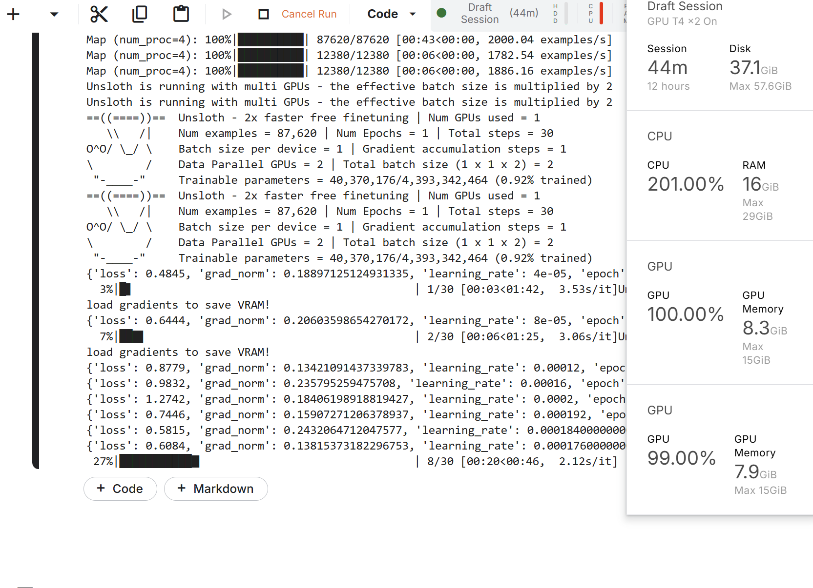

# Multi-GPU Support for Unsloth

## Overview

This repository adds **multi-GPU support** to Unsloth using **Hugging Face Accelerate**. The modifications allow training Unsloth models across multiple GPUs efficiently. The implementation has been **tested on a local multi-GPU system** and on **Kaggle with 2x T4 GPUs**.

## Features

- Implements **multi-GPU training** using `accelerate`
- No modifications to the Unsloth library are required—only a few additional lines in the training script
- Includes both **Python script (`unsloth_Accelerate.py`)** and **Kaggle Notebook (`unsloth-multigpu_KaggleRun.ipynb`)**
- Verified on **local multi-GPU system** and **Kaggle's 2x T4 GPUs** with a screenshot of training progress & GPU utilization

## Files Included

1. **`unsloth_Accelerate.py`**: The Python script with modified code for multi-GPU training.
2. **`unsloth-multigpu_KaggleRun.ipynb`**: The Jupyter notebook version for easy execution on Kaggle.
3. **`kaggle_training_screenshot.png`**: Screenshot showing the training progress and GPU usage.

## Installation & Setup

Follow the official **Unsloth installation instructions** for setting up the environment.

## Running Multi-GPU Training

### **Using Python Script**

Run the modified training script on your local multi-GPU setup:

```bash
accelerate launch unsloth_Accelerate.py
```

### **Running on Kaggle**

1. Open Kaggle Notebook.
2. Upload `unsloth_Accelerate.py` to the **Models** directory.
3. Run the following command to launch the script:

```bash
!accelerate launch /kaggle/input/unsloth_multigpu/transformers/default/1/unsloth_Accelerate.py
```

4. Ensure **2x T4 GPUs** are selected in the Kaggle runtime settings.

## Screenshot

Below is an example screenshot showing the training progress and GPU utilization:



## Contributing

This approach does not require any modification to the **Unsloth** library itself—only minor changes to the training script. Feel free to modify your training scripts based on changes made in  unsloth_Accelerate.py file and train on multi-gpu systems locally, or on cloud.

## Acknowledgments

Special thanks to the **Unsloth team** for the original implementation and to **Hugging Face Accelerate** for simplifying multi-GPU training.

