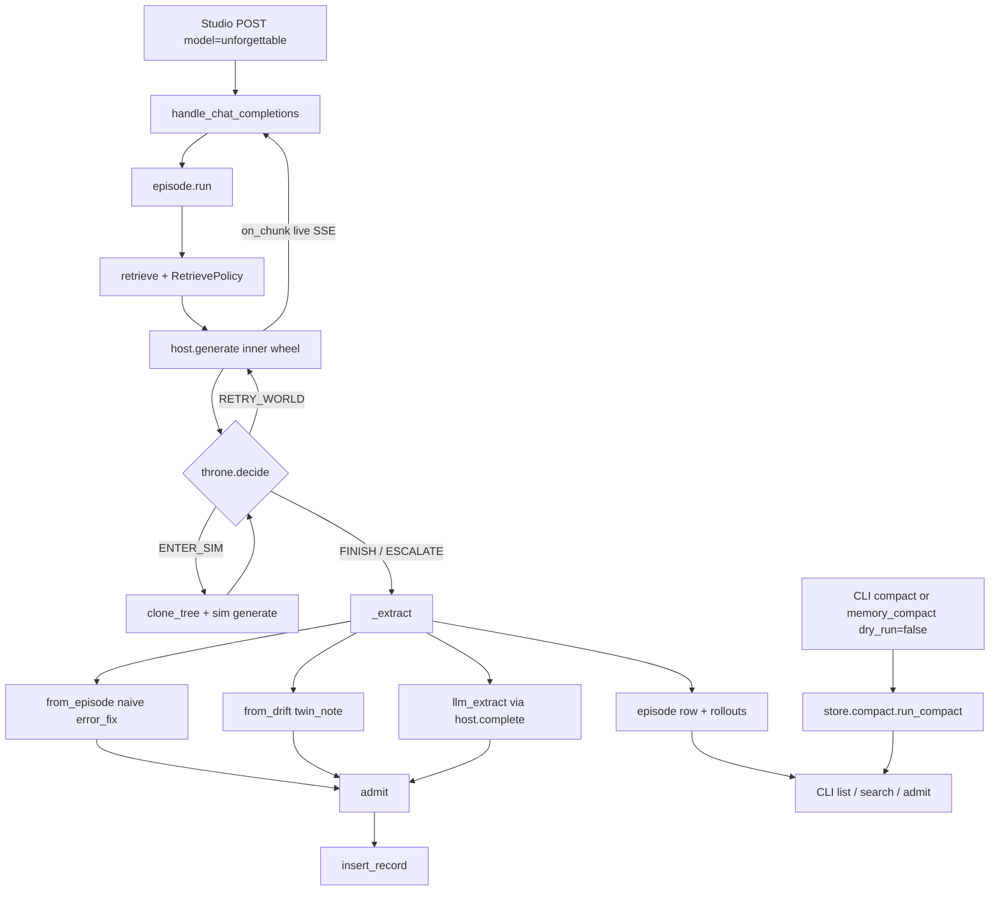

# Phase 2 — Main car that actually learns

**Author:** TBD  
**Date:** 2026-08-13  
**Status:** Draft  
**Companion to:** `MemoryWheels.md` (architecture), `MemoryPhases.md` (roadmap), `MemPhase1.md` (bones already shipped)

Second implementation slice. Phase 1 put every architectural piece in place with stub or trivial bodies. Phase 2 fills the main car: B becomes the notebook the stack trusts — extract, compact, drift, inspect. Still no training.

License rule unchanged: new brains in `unforgettable/` (Apache 2). Studio only grows if the public face needs it (live stream, catalog already shipped). Studio imports Apache; never the reverse.

---

## Overview

Phase 1 shipped a working skeleton: SQLite B store with all record kinds, memory tools, naive fail→success extract, admissions that auto-allow explicit writes, act/sim policy with a filesystem clone, and a Studio virtual model (`unforgettable`) whose inner pass is **one buffered chunk**. The extractor’s LLM path is an empty function. There is no CLI, no compaction, no twin-drift writer, no retrieve budget, no gate-eyes scan, and no episode/rollout rows.

Phase 2 makes that skeleton a notebook you can actually use. Easy wins first (live inner-token stream, deterministic twin-drift notes, inspect CLI), then retrieve policy and compaction, then bounded LLM extract, gate eyes v0, and thin episode/trajectory rows. Everything extracted still goes through `admit()`. `infer` stays proposed. No PEFT, no frontend memory browser, no vec index.

---

## Background & Motivation

### What Phase 1 shipped (cite the tree, not the plan)

| Piece | Where it lives | What it actually does today |
|-------|----------------|-----------------------------|
| Host protocol | `unforgettable/host.py` | `Host.generate(req) -> GenerateResult`. `GenerateRequest.on_chunk` exists. No `complete()`. |
| Episode runner | `unforgettable/loop/episode.py` `run()` | Retrieve inject → `host.generate` loop → throne `decide()` → `_extract()`. |
| Naive extract | `unforgettable/agents/extractor.py` `from_episode()` | One hard-coded `error_fix` if a failure event is later followed by success. |
| LLM extract | `extractor.llm_extract()` | Returns `[]`. Docstring: “Gap.” |
| Admissions | `unforgettable/agents/admissions.py` `admit()` | Explicit + non-infer → `active`. Auto-extract, `infer`, and sim-only **claims** → `proposed`. Logs to `admissions_log`. |
| Retriever | `unforgettable/agents/retriever.py` | `search_records` + `top_k=6`. Provenance weight already applied in `store/search.py`. Body snippet cap 280 chars. No total char/token budget, no stakes flag. |
| Gate eyes | `unforgettable/eyes/protocols.py` `GateEyes.note()` | Log-only protocol. No implementation body beyond the Protocol. |
| Twin notes | kind `twin_note` in `constants.KINDS` | Schema accepts them. Nothing writes them. |
| Episode records | kind `episode` in `KINDS` | Schema accepts them. `run()` never inserts one. |
| Compaction / dream | — | **No stub file.** MemPhase1 named the gap; the module was never added. |
| CLI | — | No `unforgettable/__main__.py`. |
| Studio face | `studio/backend/core/unforgettable_host.py` | `StudioHost.generate` sets `payload.stream = False`, then if `req.on_chunk` dumps the **entire** choice text as one SSE `delta.content`. |
| Memory tools | `unforgettable/tools/{specs,handlers}.py` | `memory_write\|search\|get\|supersede\|deprecate`. Studio `execute_tool` dispatches `memory_*` / `memory.*` to `handlers.dispatch`. |
| Store | `unforgettable/store/{schema,records,search,db}.py` | WAL SQLite, FTS5, CRUD, supersede, deprecate. `list_records` has no limit. No `list_admissions`, no `set_record_status`, no rollouts table. |

Recent commits on this work: `56eb8f748` (Apache package), `c71ba9f62` (Studio wiring), `a9dbfebe3` / `ec66f8c00` (plans).

### Why this phase

A client can already `POST /v1/chat/completions` with `model=unforgettable` and get remember/correct/deprecate via tools. What it cannot do:

1. See tokens while the inner tool loop runs (the virtual model feels broken).
2. Notice when sim said yes and the world still said no.
3. Inspect B without `sqlite3`.
4. Clean a store that will accumulate proposed leftovers.
5. Prefer high-trust records under a real prompt budget.
6. Learn anything except the one fail→success template.
7. Refuse contradictory claims on the way in.
8. Point at “what happened last run” as a row.

Those are MemoryWheels A3, A4 v0, A7, plus the easy-win overrides in `MemoryPhases.md`. They do not require C, a vec index, or a UI.

---

## Goals & Non-Goals

### Goals

1. Live-forward inner tokens and Studio tool frames (`tool_start` / `tool_end` / `tool_output` / `tool_args`) on `stream: true`.
2. Auto-write a `twin_note` when sim succeeded and world retry still failed.
3. `python -m unforgettable` can search / get / list / read the admissions log / compact / promote or reject a proposed row.
4. Compaction dedupes near-identical titles on notebook kinds only (`claim` / `procedure` / `entity`), folds long superseded chains, and drops empty proposed — no LLM rewrite of the store. Bookkeeping rows (`twin_note`, `episode`) are never title-deduped.
5. Retrieve respects a char budget and a stakes flag; still prefers `world` / `mixed` / `human`. Default retrieve and `memory_search` exclude `kind=episode`.
6. Bounded LLM extract proposes typed records from traces; every draft still hits `admit()`; `infer` stays proposed.
7. Gate eyes v0: same-title claim contradiction scan, sim-only dynamics stay proposed, admissions log is queryable.
8. One `episode` record per run plus thin `rollouts` rows (world|sim, pass/fail, pointer).

### Non-goals (explicitly out of Phase 2)

- PEFT / Unsloth training / anything in `sidecar.py` except leaving the stub.
- Frontend memory browser or inspect UI.
- sqlite-vec / vector index (FTS5 is not hurting; `test_store.py` ranking works).
- Physics twins, extra isolation, auto-calibration.
- Procedure compilation (A8) and a trajectory **library** (A9) — only the cheap table A9 will later read.
- Phase 3 sim-as-test-harness, richer failure recognition, human-confirm-before-retry.
- Treating Studio RAG (`rag.db`) or chat history as B.
- Forking or vendoring Grok Build. Lifecycle ideas only (`/dream` analog = compact, not topic rewrite).
- `/v1/messages` and `/v1/responses` wrappers.

---

## Decisions locked (Phase 1 still holds)

Everything in MemPhase1 “Decisions locked by feedback” still holds: Unsloth is the engine room, Grok Build is reference only, face is the existing OpenAI API, world = project sandbox, sim = cloned session dir, store = `$STUDIO_HOME/memory/memory.db`, license split, internal agents.

### Phase 2 additions

| Topic | Decision |
|-------|----------|
| Admit autonomy | Extractor output stays **proposed**. Bookkeeping `episode` rows and deterministic `twin_note`s auto-admit. Gate eyes v0 does **not** auto-promote. Operator promotes via CLI `admit`. Predicate order is locked below. The one intentional change to explicit writes is Decision 8 (sim procedures). |
| Stream | Drain the inner Studio stream. Pass through Studio tool SSE frames unchanged. Remint only OpenAI `chat.completion.chunk`s; null every inner `finish_reason`; drop inner `[DONE]`. Do **not** cancel `produce()`/`run()` on client drop. |
| Extract complete | Add `Host.complete()` — one-shot, no tools, no episode loop. `llm_extract` uses that, not `generate`. `StudioHost.complete` ships in the **same** deploy that wires `llm_extract` into `_extract`. |
| Compact | Deterministic. Exact normalized-title match, not embeddings. Title-dedupe only `claim`/`procedure`/`entity`. Never hard-delete admitted history. Explicit trigger only. Tool `dry_run` defaults **true**. |
| Retrieve budget | Char budget, not tokens (Apache has no tokenizer). Default 2400 chars / 6 records / 280-char snippets. Exclude `episode` from default retrieve / `memory_search`. Cap `twin_note`s in the inject. |
| Trajectory | Additive `rollouts` table. Do not add a new record kind. `episode` kind already exists. |
| Vec | Out. Revisit only if a measured FTS miss shows up after retrieve policy. |

**`admit()` total order** (must be implemented in this sequence; see §7 for the “why”):

1. namespace deny → rejected  
2. namespace propose → proposed  
3. `force_proposed_reason` → proposed  
4. `bookkeeping` → active  
5. sim claim **or** sim procedure → proposed *(Decision 8 — only explicit-write change)*  
6. `not explicit` → proposed  
7. `infer` and kind ≠ directive → proposed  
8. else → active  

---

## Target shape (what “done” means for Phase 2)

A real Studio `unforgettable` episode can:

1. Stream inner tokens to the client instead of one blob.
2. Remember / correct / deprecate via the existing tools (already shipped).
3. Auto-note world-vs-sim drift as an active `twin_note`.
4. Compact the store from the CLI (or a tool call with `dry_run=false`) without rewriting bodies or collapsing twin-notes / episodes.
5. Show up in `python -m unforgettable list` / `search` / `get` / `admissions`.
6. Propose **more than** the one hard-coded error→fix (LLM extract drafts, still `proposed`).
7. Leave one `episode` row and thin rollout rows for the run.

```
POST /v1/chat/completions  { "model": "unforgettable", "stream": true, ... }
        │
        ▼
 handle_chat_completions  (already queues SSE)
        │
        ▼
 loop.episode.run
   retrieve(policy) → inject
   host.generate  ── live chunks ──► client
   on sim-ok + world-retry-fail → twin_note (active)
   llm_extract + from_episode → admit() → proposed
   write episode + rollouts
        │
        ▼
 python -m unforgettable list|search|admit|compact
```

---

## Package layout deltas

Phase 1 tree stays. Additions in **bold**. No Studio imports inside `unforgettable/`.

```
unforgettable/
  __main__.py                      # NEW — python -m unforgettable
  cli.py                           # NEW — argparse commands
  host.py                          # + Host.complete
  agents/
    extractor.py                   # fill llm_extract; add from_drift, episode_summary
    retriever.py                   # RetrievePolicy, char budget, stakes, exclude episode
    admissions.py                  # bookkeeping + force_proposed + sim procedure; locked order
  store/
    compact.py                     # NEW — deterministic compact
    titles.py                      # NEW — normalize_title() shared with gate eyes
    records.py                     # list_admissions, set_record_status, rollouts CRUD
    schema.py                      # additive rollouts table
    search.py                      # optional high-stakes provenance filter (already has provenances=)
  eyes/
    gate.py                        # NEW — GateEyes v0
    protocols.py                   # widen GateEyes beyond note()
  loop/
    episode.py                     # drift + extract + episode/rollout writes; sim teardown in finally
    context.py                     # stakes: Optional[str]
  tools/
    specs.py                       # + memory_compact (dry_run default true)
    handlers.py                    # + compact dispatch; memory_search excludes episode
  tests/
    test_cli.py                    # NEW
    test_compact.py                # NEW
    test_extract.py                # NEW
    test_gate.py                   # NEW
    test_retrieve.py               # NEW
    test_stream_forward.py         # NEW (Apache on_chunk contract)
studio/backend/core/unforgettable_host.py   # drain inner stream; implement complete()
```

`store/compact.py` owns the algorithm (pure store). `store/titles.py` owns `normalize_title()` so compact and gate eyes cannot drift. `tools/handlers.py` and `cli.py` both call `store.compact.run_compact`. SSE rewrite stays in the AGPL host file — Apache does not grow a Studio-frame parser.

---

## Proposed Design

### 1. Live stream of the inner pass (easy, Studio-facing)

**Gap.** `handle_chat_completions` already builds an `asyncio.Queue` and sets `episode.on_chunk` when `payload.stream` is true. `loop.episode.run` already forwards `on_chunk=request.on_chunk` into `GenerateRequest`. The hole is `StudioHost.generate`:

```138:166:studio/backend/core/unforgettable_host.py
        payload.stream = False
        payload.enable_tools = True
        ...
        if req.on_chunk and text:
            chunk = { ... "delta": {"content": text} ... }
            raw = f"data: {json.dumps(chunk)}\n\n".encode("utf-8")
            maybe = req.on_chunk(raw)
```

Inner generate is forced non-stream; the client gets one SSE data event after the whole tool loop.

**Change (mostly Studio).** The inner Studio tool loop does **not** keep the chat UI live via OpenAI `delta.tool_calls`. `studio_tool_loop` emits custom SSE frames; `studio/frontend/src/features/chat/api/chat-api.ts` special-cases `type` in `{tool_start, tool_end, tool_output, tool_args, tool_status}`. `chat-adapter.ts` treats a non-null `choices[0].finish_reason` as end-of-round and clears tool-call id state (`codexRoundToolCallIds = []` around line 5928). Outer `produce()` today emits only `data: [DONE]`, no finish chunk. The wire contract has to match that, not a generic OpenAI proxy.

Locked forwarding rules, implemented in `studio/backend/core/unforgettable_host.py` as `_forward_inner_stream` + `_rewrite_inner_frame` (AGPL; tested with a local async iterator — no Apache SSE module):

| Incoming inner frame | Action |
|----------------------|--------|
| `data: [DONE]` | **Drop.** Outer `produce()` still owns the real `[DONE]` after `run()` returns. |
| JSON with `type` in `{tool_start, tool_end, tool_output, tool_args, tool_status}` (and other non-OpenAI Studio types such as `diffusion_frame`) | **Pass through unchanged.** Do not remint, do not wrap as `chat.completion.chunk`. |
| JSON with `object == "chat.completion.chunk"` (or a `choices[].delta` payload) | Remint `model` to `VIRTUAL_MODEL_ID`. **Force every `choices[].finish_reason` to `null`.** Forward content / role / reasoning deltas. Accumulate `delta.content` into `GenerateResult.text`. |
| In-band `error` chunk | Forward. |
| Anything else | Forward unchanged (do not drop unknown custom frames). |

After `run()` returns, outer `produce()` may emit **one** trailing `chat.completion.chunk` with `finish_reason=stop` and then `[DONE]`. It must not emit a finish chunk per inner pass.

```python
async def generate(self, req: GenerateRequest) -> GenerateResult:
    payload = self.payload.model_copy(deep=True)
    payload.model = req.inner_model or self.inner_model or "default"
    payload.session_id = req.session_id
    if req.thread_id:
        payload.thread_id = req.thread_id
    payload.enable_tools = True
    payload.messages = _as_chat_messages(req.messages)
    want_stream = req.on_chunk is not None
    payload.stream = want_stream
    before = len(current_traces())
    token = _INNER.set(True)
    try:
        resp = await self.inner(payload, self.request, self.current_subject)
    finally:
        _INNER.reset(token)
    if want_stream:
        text = await _forward_inner_stream(resp, req.on_chunk)
    else:
        text = _choice_text(_response_payload(resp))
    return GenerateResult(text=text, tool_traces=current_traces()[before:])
```

`_forward_inner_stream` **must** `aclose()` the inner `body_iterator` on return, error, or cancel. Recursion guard `in_inner_generate()` / `_INNER` stays; do not re-enter `handle_chat_completions`.

**Disconnect — do not cancel `produce()`.** Phase 1 `gen()` `await`s the produce task without cancelling it, so `_extract` and sim teardown still run after a dropped client. Cancelling `produce()` would skip extract **and** (today) leak `sim-*` trees because `run()` only calls `remove_sim_session` on the success path, not in `finally`. Lock:

1. Client drop stops **forwarding** (ignore `on_chunk` errors / broken pipe). `aclose()` the current inner iterator so the in-flight generate does not keep decoding for a gone client.
2. Do **not** cancel `produce()` or `run()`. Extract, twin-note, episode row, and admissions still land (Phase 1 behavior).
3. `run()` moves sim teardown into `finally`: `if state.sim_session and not state.keep_sim: host.remove_sim_session(...)`. `keep_sim` is set during `_extract` when an `error_fix` is written, so `finally` sees the flag. This is a Phase 2 correctness fix independent of streaming.

**Multiple inner passes.** World-fail → sim → retry-world still emits three generate streams into one outer SSE. That is intended. Because inner `finish_reason` is nulled, the desktop adapter will not close the round or wipe tool-card ids between rims. Optional one-line content delta on rim switch (`\n[sim]\n` / `\n[world retry]\n`) from `episode.run` via `on_chunk` — only if it stays a few lines; do not invent a new event type.

**Do not** edit the three Studio tool-loop implementations. Extract still runs in Apache after the last `generate` returns.

---

### 2. Twin-drift notes (A7, easy)

**Gap.** Throne already escalates when sim succeeded and world retry fails (`Policy.max_clones = 1` → `Action.ESCALATE` on the second world failure). `from_episode` then writes the naive `error_fix` (first fail + first later success). Nothing records “the twin lied.”

**Change.** Add `from_drift(state) -> list[dict]` in `unforgettable/agents/extractor.py`. Scan `EpisodeState.trace_events` in order:

```
saw_sim_success = False
for ev in state.trace_events:
    if ev["kind"] == "success" and ev["contact"] == "sim":
        saw_sim_success = True
    elif saw_sim_success and ev["kind"] == "failure" and ev["contact"] == "world":
        → one twin_note
```

Draft:

| Field | Value |
|-------|--------|
| `kind` | `twin_note` |
| `title` | `World/sim disagreement` |
| `body` | Sim success summary + world-retry failure summary (from the events). Cap 800 chars. |
| `provenance` | `mixed` |
| `explicit` | `False` |
| `bookkeeping` | `True` (admissions auto-admits; see §Admit) |

Call it from `_extract()` **before** `llm_extract`. One note per episode max. No calibration loop, no numeric drift estimate, no auto-distrust of prior sim claims (Phase 2 only writes the note). Title may stay the shared `World/sim disagreement`: compact **must not** title-dedupe `twin_note` (see §4), so a second drifted episode does not hide the first. Retrieve still caps how many twin notes occupy the inject (see §5).

Manual twin notes via `memory_write` already work (kind is in the tool enum).

---

### 3. Inspect CLI (easy)

**Gap.** No `__main__.py`. Operators must open SQLite.

**Change.** `unforgettable/__main__.py` calls `cli.main()`. argparse, stdlib only.

```
python -m unforgettable path
python -m unforgettable search QUERY [--kind K] [--top N] [--status S]
python -m unforgettable get ID
python -m unforgettable list [--kind K] [--status S] [--limit N]
python -m unforgettable admissions [--limit N] [--decision D]
python -m unforgettable compact [--dry-run]
python -m unforgettable admit ID
python -m unforgettable reject ID [--reason TEXT]
```

Defaults:

| Flag | Default |
|------|---------|
| `--db` | `UNFORGETTABLE_DB` if set, else `Host`-less `store.db.default_db_path()` (`$UNFORGETTABLE_HOME/memory.db` or `~/.unforgettable/memory.db`) |
| `--top` / `--limit` | 20 |
| `--status` on `search` | `active` (same as `search_records`) |
| `--status` on `list` | all |

Studio operators pass `--db "$STUDIO_HOME/memory/memory.db"` (or set `UNFORGETTABLE_DB`). Document that one line in `--help`. Do not import Studio to discover the path.

`admit` / `reject` are the operator face of admit autonomy: `set_record_status(id, "active"|"rejected")` plus an `admissions_log` row (`reason="cli admit"` / `"cli reject"`). Without these, LLM extract is a write-only graveyard.

Print JSON for `get` / `admissions`; a compact table (id[:8], kind, status, provenance, title) for `list` / `search`. Exit 2 on unknown id.

No frontend. No HTTP server.

---

### 4. Compaction pass (Grok `/dream` analog, easy-medium)

**Not** an LLM rewrite of the store. Not Grok Build code. The lifecycle idea only: a hygiene pass that makes B smaller and less contradictory.

**Module.** `unforgettable/store/compact.py`

```python
@dataclass(frozen=True)
class CompactReport:
    emptied: list[str]                  # proposed + empty → rejected
    deduped: list[tuple[str, str]]      # (loser_id, winner_id) via deprecate, not supersede
    folded: list[str]                   # old superseded ancestors → deprecated
    dry_run: bool

def run_compact(db_path=None, *, dry_run: bool = False) -> CompactReport: ...

# store/titles.py — single implementation, imported by compact and eyes/gate.py
def normalize_title(title: str) -> str:
    return re.sub(r"\W+", " ", (title or "").lower()).strip()
```

**Rules (deterministic, quantified):**

1. **Drop empty proposed.** `status=proposed` AND `strip(body)` empty (or in `{"", "todo", "(empty)"}`) AND `created_at` older than **7 days** → `rejected`. Newer empties stay so an in-flight extract is not murdered.
2. **Dedupe near-identical titles — notebook kinds only.** `COMPACT_DEDUPE_KINDS = frozenset({"claim", "procedure", "entity"})`. **Never** title-dedupe `twin_note`, `episode`, `directive`, or `error_fix` (the last two use repeated titles — `from_episode` always writes `Error then fix`; auto-admitted twin notes all share `World/sim disagreement`). Among `active` records of the **same dedupe-kind** and **same `normalize_title()`**, keep one winner: lowest `PROVENANCE_WEIGHT`, then newest `updated_at`. Losers are `set_record_status(..., "deprecated")` — **not** `supersede_record` (no new row, no invented body). Persist the pair so `get` can reconstruct it: append the existing deprecate suffix `[deprecated] compact: duplicate of {winner_id}` to the loser body (same path `deprecate_record` already uses). First wet compact on a pre-gate Phase 1 db **will** collapse same-title active claims (e.g. the two `"Friction"` rows in `test_search_prefers_world_over_infer`); that is intended hygiene for claims, which is why dry-run is required before the first Studio-db compact.
3. **Fold superseded chains.** Walk `supersedes_id` parents. Keep the live head + **2** superseded ancestors as `superseded` (gettable history). Older ancestors → `deprecated` (still gettable by id, excluded from search). Do not delete.
4. **Never** hard-delete a row that was ever `active`. **Never** call an LLM. **Never** rewrite `body` except the existing deprecate suffix.

**Triggers.** CLI `compact` and new tool `memory_compact`. Not scheduled inside `run()`. Not at episode end.

- **CLI** defaults to **wet** (operator intent) but `--help` must say: first compact on an existing `$STUDIO_HOME/memory/memory.db` should be `compact --dry-run`. `--db` help names that Studio path.
- **Tool** `dry_run` defaults **true**. The model must pass `dry_run=false` to mutate. A bare `memory_compact` call is a preview. `_extract` / episode end never invoke compact.

**Thresholds as constants** in `store/compact.py`:

```python
EMPTY_PROPOSED_AGE_DAYS = 7
KEEP_SUPERSEDED_ANCESTORS = 2
COMPACT_DEDUPE_KINDS = frozenset({"claim", "procedure", "entity"})
```

---

### 5. Retrieve policy

**Gap.** `retrieve(query, top_k=6)` is a thin wrapper. `search_records` already sorts by `PROVENANCE_WEIGHT` then FTS rank. `format_inject` already adds a staleness note at ≥30 days and clips each body to 280 chars. There is no **total** inject budget and no stakes switch.

**Change.**

```python
# unforgettable/agents/retriever.py
# MemoryWheels §7.5: prefer procedures and error→fix when acting.
# episode summaries are “what happened last run,” not standing knowledge.
DEFAULT_RETRIEVE_KINDS = frozenset(
    {"claim", "procedure", "error_fix", "entity", "directive", "twin_note"}
)  # episode excluded

@dataclass(frozen=True)
class RetrievePolicy:
    max_records: int = 6
    max_chars: int = 2400          # total title+body chars in the inject block
    snippet_chars: int = 280       # already the per-record clip
    high_stakes: bool = False      # drop sim + infer entirely
    max_twin_notes: int = 1        # newest twin_note only; rest skipped

HIGH_STAKES_PROVENANCE = ("world", "mixed", "human")
```

`retrieve(query, *, policy=None, db_path=None)`:

1. Pass `kinds=DEFAULT_RETRIEVE_KINDS` into `search_records` (do **not** change the `search_records` default — CLI inspect still searches every kind unless `--kind` is set).
2. `top_k = policy.max_records`.
3. If `policy.high_stakes`, also pass `provenances=HIGH_STAKES_PROVENANCE` (the kwarg already exists).
4. After FTS+weight ranking, drop extra `twin_note`s beyond `max_twin_notes` (keep newest `updated_at`).
5. `format_inject` stops appending records once running char count would exceed `max_chars`. Always include at least the first hit (even if over budget) so a single long procedure is not silently dropped — clip that one to `max_chars`.

`memory_search` (`handlers._search`): if the caller did not pass `kinds`, use `DEFAULT_RETRIEVE_KINDS` so the inner model cannot pull episode transcripts into context. Opt in with `kinds=episode`.

`EpisodeRequest` gains `stakes: Optional[str] = None` (`None` | `"high"`). `run()` sets `RetrievePolicy(high_stakes=request.stakes == "high")`.

Studio: `handle_chat_completions` copies `getattr(payload, "stakes", None)` onto `EpisodeRequest` (the model config already `extra="allow"`). This one-liner lives in the retrieve PR, not the stream PR. No UI. No heuristic on the user text (“prod”, “deploy”) — that is a later throne concern.

Apache has no tokenizer; do not pretend 2400 chars is 600 tokens. Name the unit chars in logs.

---

### 6. End-of-task extract (A3)

**Keep** `from_episode` exactly — the naive fail→success `error_fix` is the regression fixture (`test_episode_fail_sim_retry_writes_error_fix`).

**Fill** `llm_extract`.

#### Host.complete

`unforgettable/host.py` grows one method. Tests and Studio both implement it.

```python
class Host(Protocol):
    ...
    async def generate(self, req: GenerateRequest) -> GenerateResult: ...

    async def complete(
        self,
        messages: list[dict[str, Any]],
        *,
        max_tokens: int = 800,
    ) -> str:
        """One-shot text completion. No tools, no memory inject, no act/sim.
        Used by llm_extract. Must not re-enter episode.run."""
        ...
```

`StudioHost.complete`: `model_copy` the payload, set `model` to the inner id, `stream=False`, `enable_tools=False`, `max_tokens=max_tokens`, wrap with `_INNER.set(True)`, call `self.inner`, return choice text. FakeHost returns canned JSON for tests.

**Same-deploy rule.** Wiring `await host.complete(...)` into `_extract` and shipping `StudioHost.complete` are one PR. The shipped fail→sim→retry path has both traces and failures, so a real `model=unforgettable` episode **will** call `complete()`. An Apache-only merge AttributeErrors every Studio request. The test `FakeHost` in `test_episode.py` must grow `complete` in that same change or `test_episode_fail_sim_retry_writes_error_fix` explodes.

Defense in depth: `_extract` uses `complete = getattr(host, "complete", None)` and skips the LLM path when missing. That is a safety net, not a license to split the AGPL method into a later PR.

Do **not** reuse `generate` for extract: that path enables tools and can re-enter the world/sim loop.

#### Window and bounds

| Knob | Default |
|------|---------|
| Trace window | last **24** non-`memory_*` `ToolTrace`s |
| Trace char budget | **8000** chars of `name + args + result` (truncate oldest first) |
| Also include | `state.trace_events` (failure/success, contact, summary) |
| Max drafts | **8** |
| `complete` max_tokens | **800** |
| Title cap | 80 chars |
| Body cap | 1200 chars |
| Allowed kinds | `claim`, `procedure`, `error_fix`, `entity`, `twin_note` |
| Forbidden kinds | `directive` (user-only), `episode` (runner-owned) |
| Forced fields | `provenance="infer"`, `explicit=False` |

Skip the LLM call when there are fewer than **2** non-memory tool traces **and** no failure events. Cheap episodes stay cheap.

#### Prompt and parse

`EXTRACT_SYSTEM` in `extractor.py`: ask for a JSON **array** of objects `{kind, title, body}`. No provenance (we overwrite it). Parse with `json.loads`; if the model wraps in markdown fences, strip them. Drop unknown kinds, empty titles, and anything over cap (truncate body, skip if title empty). On parse failure: log, return `[]`. Never raise out of `_extract`.

`llm_extract` becomes `async` **or** takes the already-fetched text. Prefer:

```python
async def llm_extract(state: EpisodeState, host: Host) -> list[dict[str, Any]]:
    ...
    raw = await host.complete(messages, max_tokens=800)
    return _parse_extract(raw)
```

`_extract` in `episode.py` becomes async (it is only called from async `run`). Keep `from_episode` + `from_drift` synchronous.

Naive `error_fix` and LLM drafts can overlap. That is fine: both stay proposed; compact / operator admit sorts it out. Do not try to dedupe in the extractor.

---

### 7. Gate eyes v0 (A4)

**Not** a domain regression suite (Phase 3). v0 is store hygiene at the door.

**Module.** `unforgettable/eyes/gate.py` implementing a widened protocol:

```python
# eyes/protocols.py
@dataclass(frozen=True)
class Contradiction:
    title_key: str
    record_ids: tuple[str, ...]
    reason: str

class GateEyes(Protocol):
    def note(self, message: str) -> None: ...
    def contradictions(self, db_path=None) -> list[Contradiction]: ...
    def review_write(self, *, kind: str, title: str, body: str, provenance: str, db_path=None) -> str:
        """Return '' or a reason to force proposed."""
        ...
```

`LogGateEyes` in `eyes/gate.py`:

1. **Contradiction scan.** Active `claim`s, group by the same title normalize as compact. If a group has **≥2 distinct** normalized bodies → `Contradiction`. Used by CLI (`python -m unforgettable list` does not have to call it; add `python -m unforgettable contradictions` as a thin alias, or print a warning line from `admissions` / `compact` dry-run). Minimum: a function the CLI `admissions` header can call, plus `review_write`.
2. **On write.** `handlers._write` and `_extract` call `review_write` before `admit`. If another active claim has the same normalized title and a different body → reason `contradicts {id}`. `admit()` treats a non-empty review reason as force-`proposed` (even for explicit human writes). Operator can still `admit` via CLI after looking.
3. **Sim-only dynamics.** Existing rule: `kind == "claim" and provenance == "sim"` → proposed. **Extend** to `kind == "procedure" and provenance == "sim"` (same function, same reason string). Do not try to NLP-detect “dynamics.” Twin notes and error_fix may stay sim; they are lessons, not world facts.
4. **Queryable log.** `store.records.list_admissions(*, limit=50, decision=None, db_path=None) -> list[dict]`. Newest first. CLI and tests use this instead of raw SQL.

`GateEyes.note` remains: append to `admissions_log` with `record_id=None` for free-form eyes messages (optional). Do not require a new table.

Wire: `admit()` gains optional `bookkeeping: bool = False` and `force_proposed_reason: str | None = None`. Keep the function total and testable without importing gate.py if we pass the reason in; `handlers` / `_extract` do the `review_write` call so admissions stays a pure policy table.

**Total `admit()` order** (replace the current chain in `unforgettable/agents/admissions.py`). Today it is namespace deny/propose → sim **claim** → `not explicit` → infer → else active. Bookkeeping drafts are `explicit=False`, so `if bookkeeping: active` **must not** be added after `not explicit` or twin notes stay proposed and the new episode test fails. Locked order:

```
1. namespace deny            → rejected
2. namespace propose         → proposed
3. force_proposed_reason     → proposed   # gate eyes contradiction, etc.
4. bookkeeping               → active     # deterministic twin_note + episode only
5. sim claim OR sim procedure → proposed  # Decision 8: the one intentional change
                                          # to explicit writes (today a sim
                                          # procedure is active)
6. not explicit              → proposed   # naive from_episode, llm_extract
7. infer and kind != directive → proposed
8. else                      → active     # explicit tool writes in an auto ns
```

Steps 1–3 and 6–8 match shipped `admit()`. Step 5 is the sole explicit-write change and is called out as Decision 8, not papered over.

---

### 8. Episode summaries + thin trajectory rows

**Episode record.** At the end of `_extract`, always insert one `kind=episode`:

| Field | Value |
|-------|--------|
| `title` | `Episode {episode_id[:8]}` |
| `body` | Markdown: last user text (clip 200), action list (`outcome.actions` / local `actions`), each `trace_events` line, ids of drafts written this turn |
| `provenance` | `mixed` if both rims ran, else the single contact, else `infer` |
| `source_episode_id` | `state.episode_id` |
| `bookkeeping` | `True` → auto-admit `active` |

Cap body at **2000** chars. This is a pointer, not a transcript dump. Full tool traces stay in process memory and die with the request (Phase 1 design). Do not persist raw traces.

**Rollouts table** (additive, not a new kind):

```sql
CREATE TABLE IF NOT EXISTS rollouts (
    id TEXT NOT NULL PRIMARY KEY,
    episode_id TEXT NOT NULL,
    contact TEXT NOT NULL,          -- world | sim
    outcome TEXT NOT NULL,          -- pass | fail
    summary TEXT NOT NULL,
    source_record_id TEXT,          -- optional pointer to the episode row
    created_at TEXT NOT NULL
);
CREATE INDEX IF NOT EXISTS idx_rollouts_episode ON rollouts(episode_id);
```

Write **one row per contact that actually ran**:

- world fail then sim success then world fail → two or three rows: world/fail (last world outcome), sim/pass. Prefer one row per *contiguous contact segment* so A9 can ask “did sim pass?”
- Simplest rule that is enough for A9: for each contact in `{world, sim}` that appears in `trace_events`, take the **last** event for that contact → `pass` if success else `fail`. Max 2 rows per episode.

`store.records.insert_rollout(...)` / `list_rollouts(episode_id=...)`. CLI `get` on an episode id prints linked rollouts. No retrieval of rollouts into the prompt in Phase 2. **No retrieval of `kind=episode` either** — they stay `active` so CLI `list` / `get` (and CLI `search` with `--kind episode` or no kind filter) can see them; `retrieve()` and `memory_search` omit them unless the caller opts in. Episode bodies include the last user text and would otherwise crowd out procedures and error→fix (MemoryWheels §7.5).

---

## API / Interface Changes

### Host protocol

```python
# unforgettable/host.py — additions only
class Host(Protocol):
    def memory_db_path(self) -> Path: ...
    def world_session_id(self, request: Any) -> str: ...
    def create_sim_session(self, episode_id: str) -> str: ...
    def sandbox_path(self, session_id: str) -> Path: ...
    def remove_sim_session(self, session_id: str) -> None: ...
    async def generate(self, req: GenerateRequest) -> GenerateResult: ...

    async def complete(
        self,
        messages: list[dict[str, Any]],
        *,
        max_tokens: int = 800,
    ) -> str: ...
```

`GenerateRequest.on_chunk` is unchanged. Semantics tighten: if set, the Host **must** forward inner frames incrementally (Studio tool SSE + reminted OpenAI chunks), not one trailing blob. FakeHost may call `on_chunk` once; StudioHost must drain and must not forward inner `[DONE]` or a non-null inner `finish_reason`.

`EpisodeRequest.stakes: Optional[str] = None`.

### New / changed agent functions

```python
# retriever.py
DEFAULT_RETRIEVE_KINDS  # excludes episode
def retrieve(query: str, *, policy: RetrievePolicy | None = None, db_path=None) -> list[dict]

# extractor.py
def from_episode(state) -> list[dict]          # unchanged
def from_drift(state) -> list[dict]            # new
def episode_summary(state, *, last_user: str, draft_ids: list[str]) -> dict
async def llm_extract(state, host: Host) -> list[dict]

# admissions.py
def admit(..., bookkeeping: bool = False, force_proposed_reason: str | None = None) -> AdmissionDecision

# store/titles.py
def normalize_title(title: str) -> str

# store/compact.py
COMPACT_DEDUPE_KINDS  # claim, procedure, entity only
def run_compact(db_path=None, *, dry_run: bool = False) -> CompactReport

# store/records.py
def list_admissions(*, limit: int = 50, decision: str | None = None, db_path=None) -> list[dict]
def set_record_status(record_id: str, status: str, *, reason: str | None = None, db_path=None) -> dict
def insert_rollout(...) -> dict
def list_rollouts(*, episode_id: str, db_path=None) -> list[dict]

# eyes/gate.py
def review_write(...) -> str
def contradictions(db_path=None) -> list[Contradiction]
```

### New memory tool

```python
MEMORY_COMPACT = {
    "type": "function",
    "function": {
        "name": "memory_compact",
        "description": (
            "Hygiene pass on durable memory: drop old empty proposed rows, "
            "deprecate duplicate titles, fold long superseded chains. "
            "Does not rewrite bodies."
        ),
        "parameters": {
            "type": "object",
            "properties": {
                "dry_run": {
                    "type": "boolean",
                    "description": "Default true (preview). Pass false to mutate.",
                    "default": True,
                }
            },
        },
    },
}
```

Append to `MEMORY_TOOLS`. `handlers.dispatch` branch: `dry_run = args.get("dry_run", True)` — missing/None is preview. Studio picks it up via the existing `from unforgettable.tools.specs import MEMORY_TOOLS` in `studio/backend/core/inference/tools.py` — **no Studio spec edit**. The inner model can still request `dry_run=false`; that is an explicit mutator, same class as `memory_deprecate`, but it cannot fire by default.

### CLI entry

`python -m unforgettable` → `unforgettable.cli:main`. No console_scripts entry required (relocatable package; `python -m` is enough). Optional later.

---

## Data Model Changes

Phase 1 created every **record kind** (`claim|procedure|error_fix|entity|episode|directive|twin_note`) and every **status**. Do not add kinds.

**Additive only:**

```python
# schema.ensure_schema — after existing tables
conn.executescript(
    """
    CREATE TABLE IF NOT EXISTS rollouts (
        id TEXT NOT NULL PRIMARY KEY,
        episode_id TEXT NOT NULL,
        contact TEXT NOT NULL,
        outcome TEXT NOT NULL,
        summary TEXT NOT NULL,
        source_record_id TEXT,
        created_at TEXT NOT NULL
    );
    CREATE INDEX IF NOT EXISTS idx_rollouts_episode ON rollouts(episode_id);
    """
)
```

No `ALTER` on `records`. No FTS change. `admissions_log` already has `(record_id, decision, reason, created_at)`.

**Migration strategy.** Same as Phase 1: `CREATE TABLE IF NOT EXISTS` inside `ensure_schema`, invoked on first `get_connection` per path. Existing `memory.db` files grow the new table lazily. Tests on tmp paths are unaffected.

**What is not persisted.** Raw `ToolTrace` lists, KV, chat messages. Episode body is a summary; rollouts are grades + one-line summaries.

---

## Flows

### Episode with extract / drift / compact (compact is out-of-band)



### Stream path through Studio

```mermaid
sequenceDiagram
    participant Client
    participant Route as openai_chat_completions
    participant Face as handle_chat_completions
    participant Mid as episode.run
    participant Host as StudioHost.generate
    participant Inner as openai_chat_completions inner

    Client->>Route: stream=true model=unforgettable
    Route->>Face: not in_inner_generate
    Face->>Mid: EpisodeRequest.on_chunk = queue.put
    Mid->>Host: GenerateRequest.on_chunk
    Host->>Inner: payload.stream=true, _INNER=True
    loop token / Studio tool frame
        Inner-->>Host: SSE bytes (content, tool_start, …)
        Host-->>Mid: pass-through tool_* ; remint OpenAI chunks; finish_reason=null
        Mid-->>Face: queue
        Face-->>Client: SSE (no inner DONE, no inner finish)
    end
    Inner-->>Host: GenerateResult.text + traces
    Host-->>Mid: result
    Mid->>Mid: extract + admit + episode/rollouts (even if client dropped)
    Face-->>Client: optional finish_reason=stop then data: [DONE]
```

---

## Studio touchpoints (AGPL, keep tiny)

Dependency arrow remains **Studio → unforgettable**.

| File | Change | Why |
|------|--------|-----|
| `studio/backend/core/unforgettable_host.py` | Drain inner stream via `_forward_inner_stream` / `_rewrite_inner_frame` (Studio tool frames pass through; OpenAI chunks reminted, `finish_reason` nulled); do **not** cancel produce on drop; implement `Host.complete` in the extract PR; copy `getattr(payload, "stakes", None)` in the retrieve PR | Public face: live tokens + extract complete + stakes |
| `studio/backend/core/inference/tools.py` | **None required** if `MEMORY_TOOLS` is imported as a list (already is). Confirm `memory_compact` rides along with `dry_run` default true. | Tool catalog |
| `studio/backend/routes/inference.py` | **None.** Virtual-model branch already calls `handle_chat_completions`. | Keep the route dumb |
| `studio/backend/models/inference.py` | Optional: document `stakes` as an extra field. Not required (`extra="allow"`). | Docs only |

No frontend. Catalog entry already lists `unforgettable`.

---

## Tests (Phase 2, no GPU)

Keep Phase 1 tests green, especially **leave `test_episode_fail_sim_retry_writes_error_fix` as the happy path** (world-fail → sim-ok → **world-ok**, naive extract still proposed, sim dir kept). Do **not** retarget it at world-retry-fail; add a new test for drift.

New tests under `unforgettable/tests/`:

| Test | Asserts |
|------|---------|
| `test_stream_forward.py` | Apache: `episode.run` passes `on_chunk` through; FakeHost may fire it once or more. **No** `unforgettable/loop/sse.py`. Studio: unit-test `_rewrite_inner_frame` with a local iterator that includes a `tool_start` frame (must be forwarded unchanged), a mid-stream `chat.completion.chunk` with `finish_reason=stop` (must leave as `null` and remint `model`), and `data: [DONE]` (must drop). If FastAPI import is heavy, keep that helper module-level in `unforgettable_host.py` so it can be tested without booting the app. |
| `test_episode.py` (keep + add) | **Keep** `test_episode_fail_sim_retry_writes_error_fix` (retry **success**). **Add** `test_episode_sim_ok_world_retry_fail_writes_twin_note`: world-fail → sim-ok → world-fail → `twin_note` `active`, naive `error_fix` still `proposed`, `episode` row exists, `list_rollouts` has world/fail and sim/pass. FakeHost in both tests implements `complete` (returns `""` / `[]`) so PR 7 cannot break PR 1 tests. |
| `test_cli.py` | `cli.main(["list", "--db", path])` prints the fixture title; `admit` flips proposed → active; unknown id exits 2. |
| `test_compact.py` | Two active same-title **claims**: loser deprecated, body suffix names `duplicate of {winner}`. Two active same-title **twin_notes**: both remain active. Two `error_fix` with title `Error then fix`: both remain. Empty proposed older than 7 days rejected (insert with a direct SQL `created_at` or a `now=` seam). Chain of 4 supersedes keeps head + 2 ancestors. `dry_run=True` changes nothing. |
| `test_retrieve.py` | `max_chars=100` still returns ≥1 record and inject text ≤ 100 + header; `high_stakes=True` excludes a `sim` hit in favor of `world`; an `episode` row matching the query is **not** injected; a second `twin_note` is dropped when `max_twin_notes=1`. |
| `test_extract.py` | FakeHost.complete returns two well-formed drafts → two `proposed` `infer` rows; malformed JSON → no rows, no raise; `provenance` in the model output is overwritten to `infer`; `directive` kind dropped. Naive `from_episode` still runs in the same `_extract`. Host without `complete` skips LLM path. |
| `test_gate.py` | Second active claim, same title, different body → `review_write` reason; `admit(..., force_proposed_reason=...)` is `proposed` even when `bookkeeping=True`; sim **procedure** is proposed; `list_admissions` returns the log. |
| `test_admissions.py` (extend) | Predicate order: `bookkeeping=True` twin_note / episode → `active`; `bookkeeping=True` + `force_proposed_reason` → `proposed`; `explicit=True` sim procedure → `proposed`; LLM-style `explicit=False` still `proposed`. |
| `test_import_hygiene.py` | Unchanged: no `from studio` / `import studio`. |
| `test_tools.py` | `memory_compact` in `MEMORY_TOOL_NAMES`; dispatch with no args is dry-run (no status changes); `dry_run=false` mutates. |

StudioHost stream: if we cannot import FastAPI cheaply, skip the drain integration and keep the `_rewrite_inner_frame` unit test. Manual `curl -N` smoke stays in success criteria.

---

## Alternatives Considered

### Stream design

| Option | Pros | Cons |
|--------|------|------|
| **A. Drain inner `payload.stream=True`; pass through Studio tool frames; remint OpenAI chunks with `finish_reason=null`** (chosen) | Real tokens; existing `tool_start`/`tool_end` UI keeps working; three rims do not close the desktop round | Must filter `[DONE]`, null finish, aclose on cancel; rewrite helper is AGPL |
| B. Keep non-stream inner, pulse `on_chunk` every N ms with accumulated text | Smaller Host change | Fake “live”; last token still waits on tools; tool cards stay dark |
| C. Teach the three tool loops about Unforgettable | True mid-tool tokens without a wrapper | Violates “do not edit the three tool-loop implementations”; AGPL leak of policy |
| D. Cancel `produce()` on client drop | Stops GPU after disconnect | Skips extract; today also leaks `sim-*` dirs. Rejected. |

Chose A. Risk: `_SameTaskStreamingResponse` is built to be ASGI-called. Iterating `body_iterator` directly is the documented Starlette path and matches how tests sometimes drain streams. If a loop assumes `send()`, fall back to A-with-B: run inner non-stream only when drain fails (log once). Do not ship B as the happy path. Do not put a Studio-frame parser in Apache.

### Extract design

| Option | Pros | Cons |
|--------|------|------|
| **A. `Host.complete` + JSON-array prompt** (chosen) | No tools, no rim loop; FakeHost is trivial; bounded | Extra protocol method |
| B. Reuse `host.generate` with `extra_tools=[]` | No protocol change | Studio path still goes through the tool-loop admission/reservation machinery; easy to accidentally re-enter the virtual model |
| C. Skip LLM extract; only grow regex/heuristic writers | Zero model noise | Fails the phase done-when: “extract proposes more than the one hard-coded error→fix” |

Chose A. Noise is the remaining risk — mitigated by caps, forced `infer`, stay-proposed, parse-fail → `[]`.

### Compact design

| Option | Pros | Cons |
|--------|------|------|
| **A. Deterministic title/chain/empty pass on claim/procedure/entity only** (chosen) | Testable; cannot clobber bodies or auto-admitted twin/episode history; matches “not an LLM rewrite” | Will miss paraphrase dupes; will not collapse repeated `error_fix` titles |
| B. LLM `/dream` rewrite of clusters | Closer to Grok Build | Out of scope; unsafe; not relocatable without a Host in the cron path |
| C. Embeddings + cosine merge | Better near-dupes | Vec index is explicitly out unless FTS hurts |

Chose A. Paraphrase dedupe waits for evidence.

### Admit autonomy

| Option | Pros | Cons |
|--------|------|------|
| **A. Conservative: extract always proposed; episode + deterministic twin_note active; CLI promote** (chosen) | Matches today’s `admit()`; no silent world-facts from a noisy model; inspectable | Proposed error_fix will not retrieve until someone `admit`s |
| B. Auto-admit `error_fix` / `twin_note` / `episode` always | Notebook fills itself | Naive + LLM error_fix would inject after every fail/success, including bad ones |
| C. Auto-admit anything `review_write` does not flag | Feels “alive” | Contradiction scan is title-only; will promote junk with unique titles |

Chose A. The phase done-when requires extract to **propose**, not to become default retrieve. Explicit `memory_write` remains the path that sticks immediately.

---

## Security & Privacy

- **No new network surface.** CLI is local process. Tools stay inside the existing Studio tool loop and sandbox.
- **Extract prompt is traces.** Traces can contain file contents the model just read. `complete()` is the same inner model the user already invoked; do not send extract to a different provider. Cap 8k chars.
- **Do not persist raw traces.** Episode body is a clipped summary. Rollouts store a one-line summary, not stdout dumps.
- **Admit autonomy is a safety control.** Auto-extract cannot become `active` world truth. Sim-only claims/procedures cannot.
- **Compact cannot hard-delete admitted history.** Reject is only for old empty proposed. Title-dedupe cannot hide bookkeeping kinds. The model-callable `memory_compact` defaults to dry-run.
- **CLI `--db`** is an arbitrary SQLite path on the operator’s machine. Do not add write commands that take SQL. `admit` / `reject` / `compact` are the only mutators.
- **Secrets.** Same as Phase 1: B is a local file. Do not put secrets in C (C does not exist yet). Extract should not be taught to copy env dumps into claims — the prompt says “durable facts and lessons, not secrets or one-off stdout.”
- **License / relocatable.** New modules stay under `unforgettable/` with the Apache header. `test_import_hygiene.py` remains the tripwire.

---

## Observability

No metrics backend in the Apache package. Use structured, greppable strings and the store itself.

| Signal | Where |
|--------|--------|
| Admission decision | `admissions_log` (already). Every extract/compact/CLI admit appends a row. |
| Extract skipped / parse fail / draft count | `GateEyes.note` or a single `admissions_log` row with `record_id=None`, reason `extract: skipped no traces` / `extract: parse_fail` / `extract: n=3`. |
| Compact report | Return value + CLI stdout JSON. Optional log row `compact: emptied=.. deduped=.. folded=..`. |
| Stream | Do not log tokens. Log once if inner drain falls back to buffered (warning). |
| Twin-drift | The `twin_note` row **is** the event. |
| Rollouts | Query `rollouts` for pass/fail rates later (Phase 3 eyes). |

Alerting: none in Phase 2. The CLI **is** the inspect surface.

Suggested operator loop after a noisy week: `python -m unforgettable admissions --limit 50` then `list --status proposed`.

---

## Rollout Plan

No feature flags in the Apache package (it is a library). Stage by PR (see PR Plan). Each PR is mergeable and leaves tests green.

| Stage | What ships | Rollback |
|-------|------------|----------|
| 1 | Twin-drift + CLI (read-only commands first, then admit/reject) | Revert PR; store rows are harmless |
| 2 | Retrieve policy + compact | Revert; compact is additive status changes — restore via `admit` on deprecated claim/procedure/entity dupes if needed. Tool stays dry-run-default. |
| 3 | Episode + rollouts | Revert; extra table unused is fine |
| 4 | Gate eyes v0 | Revert `review_write` hook; explicit writes become active again |
| 5 | LLM extract + `Host.complete` | Revert; `llm_extract` can be left returning `[]` |
| 6 | Live stream | Revert `StudioHost.generate` to `payload.stream = False` + one-chunk dump. Outer queue path is unchanged |

Studio stream is last so Apache work can land without touching AGPL, **except** the retrieve-PR one-liner that copies `payload.stakes` and the extract-PR `StudioHost.complete`. If stream regresses buffering, double-`[DONE]`, or tool cards, revert only the drain changes in `unforgettable_host.py`.

`memory_compact` tool: `dry_run` defaults **true**; a wet call requires `dry_run=false`. CLI compact defaults to **wet**; `--help` tells operators to `--dry-run` first against `$STUDIO_HOME/memory/memory.db`.

---

## Risks

| Risk | Severity | Mitigation |
|------|----------|------------|
| Noisy LLM extract floods `proposed` with junk | High | Caps (8 drafts, 24 traces, 8k/800 tokens); forced `infer`; stay proposed; parse-fail → `[]`; skip tiny episodes |
| Stream drain double-`[DONE]`, reminted ids, inner `finish_reason` closing the desktop round, or tool cards going dark | Medium | Drop inner DONE; null every inner `finish_reason`; pass through `tool_start`/`tool_end`/…; remint only OpenAI chunks; aclose iterator; do **not** cancel produce |
| Compact destroys twin-note / episode / pre-gate history | High | Exclude bookkeeping kinds from title-dedupe; no hard-delete of ever-active rows; tool dry-run default; CLI `--help` dry-run warning; persist `duplicate of {winner}` on losers |
| `Host.complete` missing on StudioHost | High | Same-PR as wiring `llm_extract`; FakeHost.complete in the same change; `getattr` skip as a safety net |
| Admit autonomy too loose | Medium | Locked conservative default; gate eyes force-proposed on title conflict; CLI is the promote path |
| `Host.complete` re-enters the virtual model or tool loop | Medium | `_INNER.set(True)`, `enable_tools=False`, inner model id (not `unforgettable`) |
| Retrieve budget drops the one useful procedure | Low | Always keep first hit, clipped |
| FTS misses paraphrase | Low (accepted) | Out of scope; no vec |
| Episode body leaks secrets from traces | Medium | Clip 2000 chars; summarize events not stdout; prompt forbids secrets |
| Three inner streams confuse the chat UI | Medium | Null inner `finish_reason`; pass through Studio tool frames; optional `[sim]` / `[world retry]` markers; do not add a new SSE schema |

---

## Explicitly out of Phase 2

Same list as Goals / Non-Goals, restated so a reviewer can grep it:

- PEFT, `sidecar.pack_from_admitted_b`, any training job
- Frontend memory browser
- sqlite-vec
- Physics twins / extra sandbox isolation / auto-calibration
- A8 procedure compilation, A9 trajectory **library** (table only)
- Phase 3 sim test harness, richer eyes, confirm-before-retry
- Studio RAG or chat history as B
- Grok Build in the tree
- `/v1/messages`, `/v1/responses`

Those remain named stubs (`sidecar.py`) or later-phase work.

---

## Implementation order

Easy wins first, Apache before AGPL, each step independently reviewable. Matches the PR Plan.

1. **Twin-drift + admissions bookkeeping** — `from_drift`, `admit(..., bookkeeping=True)` in the locked order, **new** escalate/drift test (keep the retry-success test).
2. **Store helpers + inspect CLI** — `list_admissions`, `set_record_status`, `__main__.py` / `cli.py` (search/get/list/admissions/admit/reject; omit `compact` until step 4).
3. **Retrieve policy** — `RetrievePolicy`, exclude episode, twin-note cap, stakes on `EpisodeRequest`, plus the one-line AGPL `getattr(payload, "stakes", None)` copy.
4. **Compaction** — `store/titles.py` + `store/compact.py`, CLI `compact`, `memory_compact` with `dry_run` default true.
5. **Episode row + rollouts table** — schema, writer in `_extract`, CLI `get` shows rollouts. `run()` sim teardown moves to `finally`.
6. **Gate eyes v0** — `eyes/gate.py` using `normalize_title`, `review_write` hook, sim-procedure rule, `contradictions()`.
7. **LLM extract + `Host.complete` + `StudioHost.complete`** — one deploy. FakeHost.complete in the same change.
8. **Live inner stream** — `_rewrite_inner_frame` / `_forward_inner_stream` in the AGPL host file; do not cancel produce.

Steps 1–2, 4–6 are Apache-only. Step 3 has a one-line AGPL hook. Step 7 is Apache + required AGPL `complete`. Step 8 is the AGPL-heavy drain.

---

## Success criteria

- `unforgettable` still imports with no Studio on `sys.path`. `test_import_hygiene` green.
- FakeHost **happy path** (existing test) still: world fail → sim success → world success → `error_fix` proposed, no twin_note required.
- FakeHost **drift path** (new test): world fail → sim success → world fail → `twin_note` row `active`, naive `error_fix` still `proposed`, `episode` row exists, rollouts contain `sim/pass` and `world/fail`.
- FakeHost.complete with two JSON drafts → two additional `proposed` `infer` records (not just the hard-coded error→fix). StudioHost implements `complete` in the same change.
- `python -m unforgettable search` / `list` / `get` / `admissions` / `admit` / `compact --dry-run` work against a tmp db in tests.
- Compact: duplicate **claim** titles collapse and loser body names the winner; two same-title twin_notes stay active; empty old proposed rejected; no admitted body rewritten except the deprecate suffix.
- Retrieve: high-stakes drops `sim`; `max_chars` bounds `format_inject`; episode rows are not injected; at most one twin_note is.
- Gate: same-title conflicting claim is forced `proposed`; sim procedure is `proposed`; `force_proposed_reason` wins over `bookkeeping`.
- Studio: `POST /v1/chat/completions` `{model: unforgettable, stream: true}` yields **multiple** `delta.content` events and live `tool_start`/`tool_end` frames before a single `[DONE]`; inner `finish_reason` is not forwarded. Revert path: set `payload.stream = False` again.
- `git grep` of `unforgettable/` shows no `from studio` / `import studio`.

---

## Open Questions

MemoryWheels §15 stays parked until the phase that needs an answer. Phase 2 **does not** leave admit autonomy open — the default is locked above.

Remaining questions that are *not* blockers for this phase:

1. **Confirm-before-retry** and failure thresholds — Phase 3.
2. **Whether compact should ever run automatically** (weekly job, or after N proposed). Phase 2 is explicit-only; revisit if proposed pile-up is real.
3. **Whether `Host.complete` should share the user’s `max_tokens`** or always 800. Default 800; no need to decide further until extract quality is measured.
4. **Pack leakage / adapter lifecycle** — Phase 5.

If extract is consistently useful after a week of proposed rows, a later tiny PR can auto-admit `error_fix` with `provenance in {world, mixed}` only. That is a one-line `admit()` change, not a phase.

---

## References

- `unforgettable/plans/MemoryWheels.md` — architecture; §7 main car, §9 gate eyes, §12 tier A, §15 open questions
- `unforgettable/plans/MemoryPhases.md` — Phase 2 list and gap map
- `unforgettable/plans/MemPhase1.md` — locked decisions, Host contract, Studio touchpoints
- Implementation: `unforgettable/loop/episode.py`, `agents/{extractor,admissions,retriever}.py`, `store/{schema,records,search}.py`, `host.py`, `eyes/protocols.py`, `tools/{specs,handlers}.py`
- Studio: `studio/backend/core/unforgettable_host.py`, `studio/backend/routes/inference.py` (virtual-model branch ~12349), `studio/backend/core/inference/tools.py` (`MEMORY_TOOLS`, `execute_tool` `memory_*` dispatch)
- Grok Build: reference only (remember / search / inject / flush / dream-as-hygiene). Not in the tree.

---

## Key Decisions

1. **Admit autonomy = conservative, with a locked predicate order.** LLM extract and naive `from_episode` stay `proposed`. Deterministic `twin_note` and bookkeeping `episode` rows auto-admit (`bookkeeping=True`) **unless** `force_proposed_reason` is set. Order: namespace → `force_proposed_reason` → `bookkeeping` → sim claim/procedure → `not explicit` → infer → active. Operator promote = CLI `admit`. *Rationale:* `bookkeeping` after `not explicit` would leave twin notes proposed; `force_proposed` after `bookkeeping` could not pin a bad bookkeeping write.

2. **Live stream = drain the inner Studio stream against the real SSE contract.** Pass through `tool_start` / `tool_end` / `tool_output` / `tool_args` / `tool_status` unchanged. Remint only OpenAI `chat.completion.chunk`s; force inner `finish_reason` to `null`; drop inner `[DONE]`. Rewrite helper stays in the AGPL host file. Do **not** cancel `produce()`/`run()` on client drop; `run()` teardowns the sim dir in `finally` unless `keep_sim`. *Rationale:* Studio’s UI is those custom frames; a non-null `finish_reason` closes the desktop round; cancelling produce skips extract and (today) leaks sim dirs.

3. **Extract uses `Host.complete`, not `generate`, and `StudioHost.complete` ships in the same deploy.** One-shot, no tools, `_INNER` set, 800 tokens, last 24 traces / 8k chars, max 8 drafts, forced `infer`. FakeHost.complete lands with the wiring. `getattr` skip is a safety net only. *Rationale:* `generate` is the act/sim tool loop; an Apache-only merge AttributeErrors every live Studio episode that has traces.

4. **Compact is deterministic hygiene, explicit trigger, narrow title-dedupe.** Only `claim` / `procedure` / `entity`. Shared `normalize_title()`. Losers are deprecated (not superseded) with `compact: duplicate of {winner_id}` on the body. Tool `dry_run` defaults true. No LLM, no embeddings, no episode-end surprise. *Rationale:* auto-admitted twin notes share a title; eating them on compact contradicts why they auto-admit. A wet `memory_compact` in `ALL_TOOLS` is a blast radius.

5. **Retrieve budget is chars, not tokens; episode rows are not standing knowledge.** 2400 / 6 / 280; `stakes=high` drops `sim` and `infer`; `DEFAULT_RETRIEVE_KINDS` excludes `episode`; at most one `twin_note` in the inject. Staleness note already exists. Studio copies `payload.stakes` in the retrieve PR. *Rationale:* MemoryWheels §7.5 prefers procedures and error→fix when acting; FTS would otherwise inject last-run transcripts.

6. **Trajectory is a thin additive table, not a new kind.** One `episode` record (kind already in schema) + ≤2 `rollouts` rows. Active for CLI, excluded from default retrieve. *Rationale:* enough for later A9; no soul-of-schema migration; rollouts are grades, not notebook prose.

7. **Apache before AGPL; no frontend; no vec; no C.** Same license and face rules as Phase 1. Tiny AGPL exceptions: retrieve `stakes` copy, extract `StudioHost.complete`, stream drain. *Rationale:* relocatable brains; FTS is not the bottleneck; training is Phase 5.

8. **Sim-only procedures join sim-only claims as non-auto-promoted.** This is the **one intentional change to explicit tool writes**. Twin notes and error_fix may remain sim. *Rationale:* MemoryWheels “do not promote sim-only dynamics as world truth”; procedures are how dynamics sneak in. Do not describe explicit writes as “unchanged.”

---

## PR Plan

Each PR is independently reviewable and mergeable. Tests green on its own. Apache-only first.

### PR 1 — Twin-drift notes and bookkeeping admits

- **Title:** `Unforgettable: write twin_note when sim and world disagree`
- **Files:** `unforgettable/agents/extractor.py` (`from_drift`), `unforgettable/agents/admissions.py` (`bookkeeping=` in the locked order), `unforgettable/loop/episode.py` (`_extract` calls `from_drift`), `unforgettable/agents/__init__.py`, `unforgettable/tests/test_admissions.py`, `unforgettable/tests/test_episode.py` (**add** `test_episode_sim_ok_world_retry_fail_writes_twin_note`; **do not** change `test_episode_fail_sim_retry_writes_error_fix`)
- **Depends on:** none
- **Description:** If a sim success is followed by a world failure, insert one `twin_note` (`provenance=mixed`, `bookkeeping=True` → `active`). Keep naive `error_fix` proposed. No calibration. Give FakeHost a no-op `async def complete(...) -> str: return ""` so later extract wiring cannot break this test.

### PR 2 — Inspect CLI

- **Title:** `Unforgettable: add python -m unforgettable inspect CLI`
- **Files:** `unforgettable/__main__.py`, `unforgettable/cli.py`, `unforgettable/store/records.py` (`list_admissions`, `set_record_status`), `unforgettable/store/__init__.py`, `unforgettable/tests/test_cli.py`
- **Depends on:** none (admit/reject work on any record; nicer after PR 1)
- **Description:** `path`, `search`, `get`, `list`, `admissions`, `admit`, `reject`. `--db` / `UNFORGETTABLE_DB`. Omit `compact` until PR 4. CLI `search` does not exclude episode (inspect surface); default retrieve still does.

### PR 3 — Retrieve policy

- **Title:** `Unforgettable: retrieve char budget, exclude episodes, high-stakes filter`
- **Files:** `unforgettable/agents/retriever.py`, `unforgettable/loop/context.py` (`stakes`), `unforgettable/loop/episode.py`, `unforgettable/tools/handlers.py` (`memory_search` default kinds), `unforgettable/tests/test_retrieve.py`, `unforgettable/tests/test_episode.py` (inject still contains the fixture title), `studio/backend/core/unforgettable_host.py` (`getattr(payload, "stakes", None)` → `EpisodeRequest.stakes`)
- **Depends on:** none
- **Description:** `RetrievePolicy(max_records=6, max_chars=2400, snippet_chars=280, high_stakes=False, max_twin_notes=1)`. `DEFAULT_RETRIEVE_KINDS` excludes `episode`. High stakes uses existing `search_records(provenances=...)`. Always keep first hit. Tiny AGPL stakes copy so the flag works in Studio, not only unit tests.

### PR 4 — Compaction pass

- **Title:** `Unforgettable: deterministic memory compact`
- **Files:** `unforgettable/store/titles.py`, `unforgettable/store/compact.py`, `unforgettable/cli.py` (`compact`), `unforgettable/tools/specs.py`, `unforgettable/tools/handlers.py`, `unforgettable/tests/test_compact.py`, `unforgettable/tests/test_tools.py`
- **Depends on:** PR 2 (CLI hook). Tool-only subset could land without CLI but the phase wants both.
- **Description:** Empty proposed ≥7d → rejected; title-dedupe **only** `claim`/`procedure`/`entity`; losers deprecated with `compact: duplicate of {id}` suffix (not superseded); twin_note/episode/error_fix/directive untouched by dedupe; chains keep head+2. `memory_compact` `dry_run` defaults **true**. CLI wet with `--help` dry-run warning for `$STUDIO_HOME/memory/memory.db`.

### PR 5 — Episode summaries and rollouts

- **Title:** `Unforgettable: persist episode summary and thin rollouts`
- **Files:** `unforgettable/store/schema.py`, `unforgettable/store/records.py` (`insert_rollout`, `list_rollouts`), `unforgettable/agents/extractor.py` (`episode_summary`), `unforgettable/loop/episode.py` (writer + sim teardown in `finally`), `unforgettable/cli.py` (`get` shows rollouts), `unforgettable/tests/test_episode.py` (assert on the **new** drift test, not the happy-path test)
- **Depends on:** PR 1 (bookkeeping admit), PR 2 (CLI get), PR 3 preferred so new episode rows are not injected
- **Description:** One `episode` row per `run()`. One rollout per contact that ran (last event → pass/fail). Additive table only. Episode stays `active` for CLI and out of default retrieve.

### PR 6 — Gate eyes v0

- **Title:** `Unforgettable: gate eyes contradiction scan and queryable admissions`
- **Files:** `unforgettable/eyes/protocols.py`, `unforgettable/eyes/gate.py`, `unforgettable/eyes/__init__.py`, `unforgettable/agents/admissions.py` (`force_proposed_reason` + sim procedure in the locked order), `unforgettable/store/titles.py` (reuse `normalize_title`), `unforgettable/tools/handlers.py`, `unforgettable/loop/episode.py`, `unforgettable/cli.py` (optional `contradictions`), `unforgettable/tests/test_gate.py`, `unforgettable/tests/test_admissions.py`
- **Depends on:** PR 2 (`list_admissions`); PR 4 if `titles.py` already landed, otherwise introduce `normalize_title` here and let PR 4 import it
- **Description:** Same-title distinct-body active claims force proposed. Sim procedures join sim claims as non-auto-promoted (Decision 8). `force_proposed_reason` beats `bookkeeping`. No regression suite.

### PR 7 — Bounded LLM extract

- **Title:** `Unforgettable: end-of-episode LLM extract via Host.complete`
- **Files:** `unforgettable/host.py`, `unforgettable/agents/extractor.py`, `unforgettable/loop/episode.py`, `unforgettable/tests/test_extract.py`, `unforgettable/tests/test_episode.py` (`FakeHost.complete`), `studio/backend/core/unforgettable_host.py` (`StudioHost.complete` — **required, same PR**)
- **Depends on:** PR 6 preferred (so drafts get `review_write`); can merge after PR 1 if `review_write` is a no-op
- **Description:** Fill `llm_extract`. Window 24 traces / 8k chars / 8 drafts. Force `infer` + proposed. FakeHost returns fixture JSON (or `""` in the existing episode tests). `StudioHost.complete` is a one-shot inner generate with tools off, `_INNER` set, `stream=False`, inner model id. **Not split:** do not merge the Apache wiring without the AGPL method. `_extract` still `getattr(host, "complete", None)` and skips if missing.

### PR 8 — Live inner-pass stream

- **Title:** `Unforgettable: forward inner tokens on the virtual model stream`
- **Files:** `studio/backend/core/unforgettable_host.py` (`_forward_inner_stream`, `_rewrite_inner_frame`, honor `on_chunk`; **do not** cancel produce), `unforgettable/tests/test_stream_forward.py` (Apache on_chunk pass-through), plus a Studio-side unit test of `_rewrite_inner_frame` (tool_start pass-through, mid-stream `finish_reason` nulled, `[DONE]` dropped)
- **Depends on:** none (can be parallel with 1–7). Listed last so the AGPL drain review is isolated. Does **not** own the `stakes` copy (PR 3) or `complete` (PR 7).
- **Description:** If `req.on_chunk`, inner `payload.stream=True`, drain `body_iterator`. Pass through Studio `tool_*` frames. Remint OpenAI chunks, `finish_reason=null`, drop inner `[DONE]`. `aclose()` on cancel. Client drop stops forwarding only. Rollback is the current one-chunk dump.
