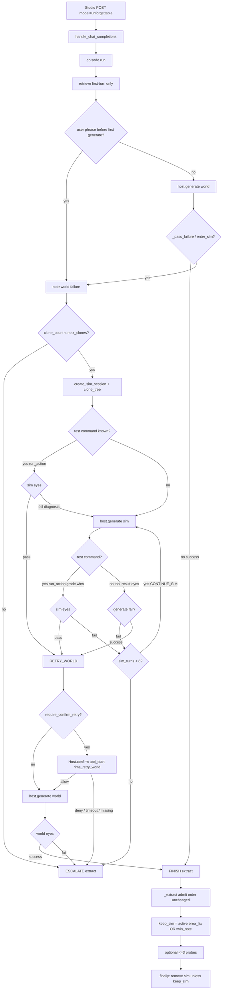
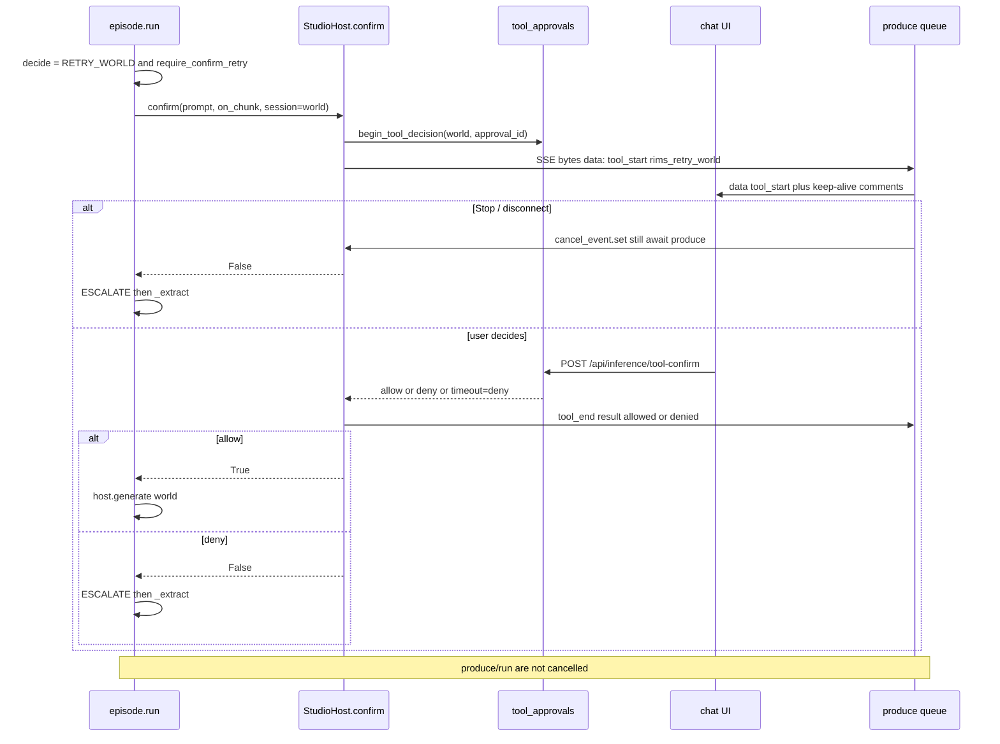

# Phase 3 — Rims and motion

**Author:** TBD  
**Date:** 2026-08-14  
**Status:** Draft  
**Companion to:** `MemoryWheels.md` (architecture), `MemoryPhases.md` (roadmap), `MemPhase1.md` (bones), `MemPhase2.md` (main car, shipped)

Third implementation slice. Phase 1 put every architectural piece in place. Phase 2 made B a notebook the stack trusts (extract, compact, drift, inspect, live stream). Phase 3 makes the two contact surfaces real: world and sim share one action interface, sim eyes grade tests instead of trusting the model’s last sentence, recognized failure is richer than a traceback regex, world retry can ask a human, rim teardown matches the charter, and gate eyes grow a handful of probes.

License rule unchanged: new brains in `unforgettable/` (Apache 2). Studio only grows if the public face needs it (`run_action`, `confirm`, `CONTACT_TOOLS` on `ALL_TOOLS`). Studio imports Apache; never the reverse.

Admit autonomy stays the Phase 2 lock. Do not reopen `admit()` order. Pack leakage is Phase 5. This phase locks the four MemoryWheels §15 items the charter assigned it: failure recognition thresholds, sim budget and escalate, when HITL is mandatory on world retry, and the minimal regression suite.

---

## Overview

Phase 2 left a working act path that is still “a second folder and a regex.” `run()` generates, `_pass_failure` greps the last non-memory tool result for a traceback / `Error:` / exit-code / “command failed”, `decide()` clones at most once, and sim “success” is `GenerateResult.finished` with no such grep hit. There is no `Host.run_action`, no nominated test command, no `rims_enter_sim`, no user-phrase enter-sim, no confirm-before-retry, and `keep_sim` is set when **any** `error_fix` is written — including the naive proposed row on the happy path.

Phase 3 makes fail-in-world → tests-in-clone → retry-world the default coding path. Shared action interface is `Host.run_action` (same `python` / `terminal` tools, different `session_id`). Sim success is sim-eyes graded when a test command is known. Confirm-before-retry is **available** (reuse Studio tool approval) and **off by default**. Rim teardown keeps the clone only on an admitted `error_fix` or a `twin_note`. Gate eyes v1 stores a handful of probes as `procedure` rows titled `Probe:…`.

No physics twins, no containers, no auto-calibration, no PEFT, no new record kinds, no new tables.

---

## Background & Motivation

### What shipped (cite the tree, not the plans)

Plans still describe Phase 1/2 “today” in places. The tree since the unsloth fork at `10f34dbf6919081a770a4393ffcf73e689e7d3f8` is the source of truth. Apache `unforgettable/` plus a thin AGPL Studio face: about 7.7k insertions on the package and host/tools wiring.

**Phase 1:** `a30475ce4` architecture note, `56eb8f748` package, `c71ba9f62` Studio wiring.

**Phase 2 (all landed):** `4be6e2e15` twin_note, `8578e4b88` CLI, `43fb70236` retrieve policy, `bcfc57456` live stream, `277c2e3f9` / `a61fbe1c2` compact, `14e284c10` episode + rollouts, `f5719cc8a` gate eyes v0, `babc59e20` / `c5b520c4b` LLM extract + `Host.complete`.

| Piece | Where it lives | What it actually does today |
|-------|----------------|-----------------------------|
| Episode runner | `unforgettable/loop/episode.py` `run()` | Retrieve inject → `host.generate` loop → `_pass_failure` via `inspect_tool_result` on the last failing **non-memory** tool → `decide()` → `ENTER_SIM` clones via `clone_tree` + `create_sim_session` / `RETRY_WORLD` / `CONTINUE_SIM` / `ESCALATE` / `FINISH` → `_extract`. Sim teardown in `finally` unless `state.keep_sim`. |
| `keep_sim` | `episode.py` `_extract` ~240–241 | Set when **any** `error_fix` is written with status `active` **or** `proposed`. **Not** set on `twin_note`. Hygiene gap vs MemoryPhases “keep on admitted error_fix / drift”. Happy-path test asserts `host.removed == []` because of this. |
| Throne | `unforgettable/throne/policy.py` | `Policy(max_clones=1, max_sim_turns=8)`. `decide`: world fail → `ENTER_SIM` unless `clone_count>=max`; sim success after world fail → `RETRY_WORLD`; world success → `FINISH`; world fail after clone → `ESCALATE`; sim fail until `max_sim_turns` then `ESCALATE`. No confirm, no user-failure event, no test-grade event. |
| World / sim eyes | `unforgettable/eyes/basic.py` | Traceback substring, `Error:` prefix, exit-code regex, “command failed” / “returned non-zero”. No pytest/jest/go fingerprints, no `enter_sim` tool, no user phrase. |
| Gate eyes | `unforgettable/eyes/gate.py` | Title-contradiction on active claims; `review_write`; `LogGateEyes`. No probes. |
| Clone | `unforgettable/rims/clone.py` | `copytree`, skip `.unsloth_sandbox` / remap json / `*.deleting-*`. **No** same-path refuse. |
| Host | `unforgettable/host.py` | `generate` + `complete`. `GenerateRequest.permission_mode` exists and is **unused**. No `run_action`, no `confirm`. |
| EpisodeRequest | `unforgettable/loop/context.py` | `stakes` only. No `test_command`, no confirm policy, no budget overrides. |
| Retrieve | `unforgettable/agents/retriever.py` + `run()` ~89–92 | Char budget, no `episode`, high-stakes drops sim/infer. **First-turn only.** Inject is reused on sim/retry with a one-line suffix. No sim-rehearse rerank. |
| Admissions | `unforgettable/agents/admissions.py` | Locked Phase 2 order (Decision 1). Do not change. |
| Studio face | `studio/backend/core/unforgettable_host.py` | `create_sim_session` → `sim-{episode_id[:8]}-{n}` via `get_sandbox_workdir`. `generate` sets `payload.session_id = req.session_id` so python/terminal already run in the active rim. Copies `enable_tools=True` and the rest of `payload` (including the desktop’s `enabled_tools` pill list). Stream drain + `complete` shipped. `handle_chat_completions` copies `stakes`; nothing else. No cancel Event. |
| Tool approval (reuse, do not invent UI) | `studio/backend/state/tool_approvals.py` + `studio_tool_loop.py` ~910–977 | `begin_tool_decision` / `wait_tool_decision` / `resolve_tool_decision` / `new_approval_id`. Emits `tool_start` with `approval_id` + `awaiting_confirmation`, waits, deny → `TOOL_REJECTED_MESSAGE`. Confirm only works while streaming. `_rewrite_inner_frame` already forwards `type: tool_start` unchanged. |
| `execute_tool` | `studio/backend/core/inference/tools.py` ~9387–9529 | Isolates python/terminal by `session_id`. `memory_*` dispatched to Apache. `ALL_TOOLS` is the five built-ins (`web_search`, `python`, `terminal`, `render_html`, `search_knowledge_base`) plus `*MEMORY_TOOLS` (~9222–9229). Unforgettable tools on that list are **only** `*MEMORY_TOOLS` today. Session ids matching `\A[A-Za-z0-9_\-]{1,64}\Z` are usable — `sim-a1b2c3d4-1` is valid. Default exec timeout **300s**. Timeout / cancel / block strings: `"Execution timed out after {n} seconds."`, `"Execution cancelled."`, `"Blocked command(s) for safety: …"` — none of these match today’s `inspect_tool_result`. |
| Tests to keep green | `unforgettable/tests/test_episode.py` | `test_episode_fail_sim_retry_writes_error_fix` (world-fail → sim-ok → **world-ok**), `test_episode_sim_ok_world_retry_fail_writes_twin_note`. FakeHost must grow any new Host method in the same PR that `run()` first calls it. |

### Why this phase

A client can already `POST /v1/chat/completions` with `model=unforgettable` and get remember/correct/drift/compact/stream. What it cannot do:

1. Grade a clone with the project’s tests instead of believing “I fixed it.”
2. Enter sim because the user said “that failed” or the model called `rims_enter_sim`.
3. See a pytest / jest / go failure that does not also match today’s traceback / `Error:` / exit-code regex (many runners do print an exit code — the hole is **sim success**, not world fail).
4. Ask a human before retrying the world after a high-stakes or `permission_mode=ask` episode.
5. Guarantee world and twin are not the same directory.
6. Delete the clone on a clean proposed-only happy path (today it is kept).
7. Store and run a handful of regression probes.

Those are MemoryWheels A5, A6-for-real, and A4 v1. They do not require C, containers, or a UI.

---

## Goals & Non-Goals

### Goals

1. **Sim as a test harness.** After clone, and after each sim generate when a command is known, sim eyes run the nominated/detected command via `Host.run_action` in the **sim** session. Pass unblocks `RETRY_WORLD`. Fail is a sim failure (`CONTINUE_SIM` / `ESCALATE` per budget). No command → today’s tool-result eyes.
2. **Richer recognized failure.** Keep traceback / `Error:` / exit-code / command-failed. Add runner fingerprints (only when a fingerprint is present). Add `rims_enter_sim`. Add a closed user-phrase list on last user text **before the first generate**.
3. **World retry policy.** Confirm-before-retry is available, default off. Deny / timeout / missing `confirm` when required → `ESCALATE`. Reuse Studio tool approval. Do not invent an SSE type. Do not send confirm through `host.generate`.
4. **Rim hygiene.** Refuse same-path clone. Never `sim_session == world_session`. `create_sim_session` ids must not start with `project-`. `keep_sim` only on **admitted** `error_fix` or any `twin_note` written this episode. Clean success deletes. This is the intentional Phase 3 fix to Phase 2’s “any error_fix keeps sim.”
5. **Gate eyes v1.** Probes are active `procedure` rows whose title starts with `Probe:`. CLI `python -m unforgettable probes [--run]`. Episode may run at most 3 after extract if a sim rim existed. No auto-deprecate. No CI product.

### Non-goals (explicitly out of Phase 3)

- Physics twins, extra isolation (containers), auto-calibration science.
- PEFT / sidecar, frontend memory browser, sqlite-vec.
- A8 procedure compilation, A9 trajectory library.
- Studio RAG as B, Grok Build in tree, `/v1/messages` / `/v1/responses`.
- Changing `admit()` order. LLM rewrite of probes. Scheduled compact.
- Rebuilding retrieve. Sim-rehearse retrieve bias is **parked** (see Decision 8).
- Always-on confirm on every world retry.

---

## Decisions locked (Phase 1 and 2 still hold)

Everything in MemPhase1 “Decisions locked by feedback” and MemPhase2 “Phase 2 additions” still holds: Unsloth is the engine room, Grok Build is reference only, face is the existing OpenAI API, world = project sandbox, sim = cloned session dir, store = `$STUDIO_HOME/memory/memory.db`, license split, internal agents, conservative admit autonomy, `Host.complete` same-deploy, compact deterministic, retrieve char budget, no vec.

**`admit()` total order is not reopened:**

1. namespace deny → rejected  
2. namespace propose → proposed  
3. `force_proposed_reason` → proposed  
4. `bookkeeping` → active  
5. sim claim **or** sim procedure → proposed  
6. `not explicit` → proposed  
7. `infer` and kind ≠ directive → proposed  
8. else → active  

### Phase 3 additions

| Topic | Decision |
|-------|----------|
| Shared action interface | `Host.run_action(session_id, name, arguments, *, timeout=None, on_chunk=None) -> str`. **Optional** on the Protocol (`getattr` skip). `name` is `"python"` or `"terminal"` only. No model, no episode loop. StudioHost → `execute_tool(..., session_id=session_id)` and ships in **PR 3** (first `run()` caller). FakeHost in **PR 2**. Apache does not import Studio. |
| Sim success | When a test command is known: **`grade_run_action` of `run_action`**, not “generate finished without a traceback.” Timeout / cancelled / blocked / `Execution error:` / allow-list reject / empty result are **fail**, never pass. When none is known: today’s `_pass_failure` / `finished`. Missing `run_action` on the Host → treat as **no command** (fall back to tool-result eyes). Never treat a missing harness as a pass. |
| Test command (total order) | (1) `EpisodeRequest.test_command` if set. (2) Else newest active `procedure` whose `normalize_title(title) == TEST_COMMAND_TITLE` (`"test command"`); command = first non-empty body line. (3) Else detector on the **sim** tree only, first match: `pytest.ini` or `[tool.pytest` in `pyproject.toml` → `pytest`; `package.json` `"scripts"."test"` → `npm test`; `go.mod` → `go test ./...`. (4) Else none. Resolve once, cache on `EpisodeState.test_command`. No network, no `pip`/`npm` install. |
| Failure thresholds | Locked fingerprints + phrases + `rims_enter_sim` below. Configurable constants in `eyes/basic.py`. Not NLP. |
| Sim budget | Keep `Policy.max_clones=1`, `max_sim_turns=8`. Optional `EpisodeRequest.max_clones` / `max_sim_turns` overrides. Escalate, do not loop. |
| HITL on world retry | **Available, default off.** `require_confirm_retry` True iff `confirm_retry is True` OR (`confirm_retry is not False` AND (`stakes=="high"` OR `permission_mode=="ask"`)). False when `confirm_retry is False`, or `permission_mode in {full, off, auto, None}` without high stakes. **Studio mapping:** product default `auto` → no retry card; desktop `ask` (legacy “confirm tool calls”) → retry card; API omit (`None`) → no retry card. Keep the `ask` coupling: the user asked to confirm consequential actions; world retry is one. Do not ignore `permission_mode`. |
| Confirm implementation | `Host.confirm` is **optional** on the Protocol. StudioHost reuses `begin_tool_decision` / `wait_tool_decision` and emits **exact SSE bytes** (`data: {json}\\n\\n`, keepalives `b": keep-alive\\n\\n"`) via `_as_sse_bytes`. `tool_name="rims_retry_world"`, `awaiting_confirmation=true`, `approval_id`. Deny / timeout / **cancel** / missing method when required / no `on_chunk` when required → **ESCALATE**. `handle_chat_completions` sets `StudioHost.cancel_event` on generator close / disconnect; Stop during HITL is **deny**, not hang. FakeHost returns True unless constructed otherwise. Do not cancel `produce()`/`run()`. Do not invent SSE types. Do not confirm via `generate`. |
| Same-deploy | First `run()` call to `host.run_action` ships with `StudioHost.run_action` **in PR 3**. PR 2 is Apache-only (protocol + FakeHost + detector). First `run()` call to `host.confirm` ships with `StudioHost.confirm` in PR 5. `getattr` skip is defense in depth only: missing `run_action` = no test command; missing `confirm` when required = ESCALATE. |
| Rim hygiene | Refuse `Path(src).resolve() == Path(dst).resolve()`. Never `sim_session == world_session`. Sim ids must not start with `project-`. `keep_sim` True only if this episode wrote an **admitted** (`status=active`) `error_fix` **or** a `twin_note`. Proposed-only `error_fix` does **not** keep. Clean success deletes. Optional one-liner `sim_path: …` on the keeping record body (clip; no new column). |
| Gate eyes v1 | Probes = active `procedure` whose title, after strip, casefold-startswith `probe:`. Body first non-empty line = command. CLI list default; `--run` executes. Episode post-extract: at most `MAX_EPISODE_PROBES=3` when a sim rim existed and `run_action` exists. Log `admissions_log` `probe: {title} pass\|fail`. **Do not** auto-deprecate. Do not add a kind. Leave retrieve alone. |
| Sim retrieve bias | **Parked.** `retrieve()` runs once before the first generate (`episode.py` ~89–92). A real sim bias needs a second retrieve on `ENTER_SIM`, which is more than a few lines and belongs with A9. Do not change default world retrieve. |
| Timeouts | `RUN_ACTION_TIMEOUT_SEC = 300` (matches Studio `_EXEC_TIMEOUT`). Confirm wait = Studio `_DECISION_TIMEOUT` (3600s), deny on timeout. |

**MemoryWheels §15 items this phase was required to lock** (not TBD):

| §15 question | Lock |
|--------------|------|
| Failure recognition thresholds | Fingerprints + `rims_enter_sim` + user phrases in §Proposed Design 2. |
| Sim budget and escalate | 1 clone / 8 sim turns, overridable; then `ESCALATE`. Post-clone diagnostic test fail does **not** consume a sim turn. |
| When HITL is mandatory on world retry | Available; on for `stakes=high` or `permission_mode=ask` or explicit `confirm_retry=True`; off otherwise. |
| Minimal regression suite | `Probe:` procedures, max 3 per episode, CLI `--run`, no auto-deprecate. |

---

## Target shape (what “done” means for Phase 3)

A real Studio `unforgettable` coding episode can:

1. Fail in the world (traceback, runner fingerprint, `rims_enter_sim`, or user “that failed”).
2. Clone onto a **different** session dir (`sim-{8hex}-{n}`).
3. Run the nominated/detected test command in that clone via the same `terminal` tool.
4. Keep rehearsing in sim until tests pass or the 8-turn budget escalates.
5. Retry the world, with an optional Allow/Deny card on high-stakes / `ask` / explicit confirm.
6. Keep the clone only if an active `error_fix` or a `twin_note` landed; delete on clean proposed-only success.
7. Optionally run up to three `Probe:` procedures after extract and log pass/fail.

```
POST /v1/chat/completions  { "model": "unforgettable", "stream": true, ... }
        │
        ▼
 handle_chat_completions
        │
        ▼
 loop.episode.run
   retrieve (first-turn, unchanged)
   [user phrase? → world failure, skip first generate]
   host.generate(session=world)  ── live chunks ──► client
   on recognized failure → clone + create_sim_session
   run_action(terminal, test_command) in sim
   host.generate(session=sim) ; run_action grade  (until pass or budget)
   [confirm?] → RETRY_WORLD or ESCALATE
   host.generate(session=world)
   _extract (admit order unchanged)
   keep_sim := active error_fix OR twin_note
   optional ≤3 probes
        │
        ▼
 python -m unforgettable probes [--run] [--world PATH]
```

**Done when:** fail in world → tests in clone → retry world is the default coding path, with drift notes and a human gate **available** on retry.

---

## Package layout deltas

Phase 1/2 tree stays. Additions in **bold**. No Studio imports inside `unforgettable/`.

```
unforgettable/
  host.py                          # + Host.run_action, Host.confirm
  cli.py                           # + probes [--run] [--world] [--db]
  agents/
    retriever.py                   # unchanged (bias parked)
    admissions.py                  # unchanged (order locked)
  eyes/
    basic.py                       # + runner fingerprints, enter_sim, user phrases, grade_run_action
    gate.py                        # unchanged v0
    probes.py                      # NEW — list / run Probe: procedures
    protocols.py                   # unchanged
  rims/
    clone.py                       # + same-path refuse
    detect.py                      # NEW — test-command resolution + tree detector (no raise)
    types.py                       # unchanged
  throne/
    policy.py                      # + require_confirm_retry; policy_from_request
  loop/
    episode.py                     # test harness, confirm, keep_sim, probes
    context.py                     # test_command, confirm_retry, permission_mode, budget overrides
  tools/
    specs.py                       # + CONTACT_TOOLS (rims_enter_sim)
    handlers.py                    # + rims_enter_sim no-op string
  tests/
    test_eyes.py                   # NEW — fingerprints vs “failed to import”
    test_rims_action.py            # NEW — run_action + detect + same-path
    test_probes.py                 # NEW — list / run
    test_episode.py                # extend (keep Phase 1/2 names)
    test_rims_throne.py            # extend decide / confirm policy
    test_cli.py                    # + probes
    test_import_hygiene.py         # unchanged
studio/backend/core/unforgettable_host.py   # enabled_tools union; run_action+SSE (PR 3); confirm+SSE (PR 5); cancel_event
studio/backend/core/inference/tools.py      # *CONTACT_TOOLS; rims_* dispatch
```

`rims/detect.py` owns command resolution (pure fs + store). `eyes/basic.py` owns “is this output a failure?” so generate traces and `run_action` results share one grader. `eyes/probes.py` owns probe identity and the run/log loop. SSE confirm frames stay in the AGPL host file — Apache does not grow a Studio-frame builder.

---

## Proposed Design

### 1. Sim as a test harness

**Gap.** After `ENTER_SIM`, `run()` clones and immediately `host.generate`s in the sim session (`episode.py` ~128–137). Sim success is `not _pass_failure(gen) and gen.finished` (~117–123). A model that says “I fixed it” without a failing tool result unblocks `RETRY_WORLD` (`policy.py` ~51–53). The clone is a folder; it is not a test harness.

`GenerateRequest.session_id` already selects the rim: `StudioHost.generate` assigns `payload.session_id = req.session_id` (`unforgettable_host.py` ~363). python/terminal already isolate by session (`execute_tool` ~9505–9528). What is missing is a way to run one of those tools **without** a model turn.

**Shared action interface.** Add to `unforgettable/host.py`:

```python
RUN_ACTION_NAMES = frozenset({"python", "terminal"})
RUN_ACTION_TIMEOUT_SEC = 300  # matches Studio _EXEC_TIMEOUT
RUN_ACTION_CLIP = 200         # command / result shown on the tool card

class Host(Protocol):
    ...
    async def run_action(
        self,
        session_id: str,
        name: str,            # "python" | "terminal" only
        arguments: dict,
        *,
        timeout: int | None = None,
        on_chunk: OnChunk | None = None,
    ) -> str:
        """Optional. Run one built-in tool in the given rim sandbox.
        No model, no episode loop. Hosts may omit this method;
        episode.run uses getattr and treats a miss as no test command."""
        ...
```

`StudioHost.run_action` ships in **PR 3** (first `run()` caller), not PR 2:

```python
async def run_action(self, session_id, name, arguments, *, timeout=None, on_chunk=None) -> str:
    from core.inference.tools import execute_tool
    if name not in RUN_ACTION_NAMES:
        return f"Error: run_action supports python|terminal only, got {name!r}"
    effective = RUN_ACTION_TIMEOUT_SEC if timeout is None else timeout
    tool_call_id = f"rims-action-{uuid.uuid4().hex[:16]}"
    if on_chunk is not None:
        start_event = {
            "type": "tool_start",
            "tool_name": name,
            "tool_call_id": tool_call_id,
            "arguments": _clip_action_args(name, arguments),
            "approval_id": "",
            "awaiting_confirmation": False,
        }
        await _emit_on_chunk(
            on_chunk,
            _as_sse_bytes("data: " + json.dumps(start_event, separators=(",", ":"))),
        )
    work = asyncio.create_task(asyncio.to_thread(
        execute_tool,
        name,
        arguments or {},
        session_id=session_id,
        timeout=effective,
        cancel_event=self.cancel_event,
    ))
    try:
        while True:
            done, _ = await asyncio.wait({work}, timeout=TOOL_HEARTBEAT_INTERVAL_S)  # 10s
            if done:
                break
            if on_chunk is not None:
                await _emit_on_chunk(on_chunk, b": keep-alive\n\n")
        result = work.result()
    finally:
        if not work.done():
            work.cancel()
    if on_chunk is not None:
        end_event = {
            "type": "tool_end",
            "tool_name": name,
            "tool_call_id": tool_call_id,
            "result": (result or "")[:RUN_ACTION_CLIP],
        }
        await _emit_on_chunk(
            on_chunk,
            _as_sse_bytes("data: " + json.dumps(end_event, separators=(",", ":"))),
        )
    return result
```

Exact SSE bytes (same contract as confirm; reuse `_as_sse_bytes` / `_emit_on_chunk` already in `unforgettable_host.py`). `_as_sse_bytes` only accepts `bytes | str` and only guarantees a trailing `\n\n` — it does **not** add the `data:` prefix:

| Frame | Bytes on `on_chunk` |
|-------|---------------------|
| `tool_start` / `tool_end` | `_as_sse_bytes("data: " + json.dumps(event, separators=(",", ":")))` ≡ `b"data: " + json.dumps(...).encode("utf-8") + b"\n\n"` |
| keepalive | `b": keep-alive\n\n"` (SSE comment, not a `data:` event) |

`_clip_action_args`: for `terminal`, `{"command": (arguments.get("command") or "")[:RUN_ACTION_CLIP]}`; for `python`, `{"code": (arguments.get("code") or "")[:RUN_ACTION_CLIP]}`. No `awaiting_confirmation` — this is a grade, not a HITL card.

`asyncio.to_thread` keeps pytest off the event loop. Do **not** call `host.generate` to run tests. Do **not** add a second sandbox API. Do **not** invent a new SSE `type`.

`FakeHost.run_action` implements against its tmp dirs (`self.world` / `self.sims[sid]`): `terminal` is `subprocess.run(command, shell=True, cwd=sandbox, capture_output=True, text=True, timeout=…)`; `python` is `sys.executable -c code` in that cwd. Non-zero exit appends `exit code N` so today’s eyes still fire. Tests that need canned output (including the exact Studio timeout string) pass a `run_action` callback into FakeHost. FakeHost may ignore `on_chunk`.

**`grade_run_action`** — `unforgettable/eyes/basic.py`. Sim success is **not** `not inspect_tool_result(...)`. Studio `_bash_exec` / `_python_exec` return strings that do **not** match today’s eyes (`tools.py` ~12735–12743, ~12808, ~12871–12878):

```python
RUN_ACTION_FAIL_PREFIXES = (
    "Execution timed out after ",          # f"Execution timed out after {timeout} seconds."
    "Execution cancelled.",
    "Blocked command(s) for safety:",
    "Execution error:",                    # f"Execution error: {e}" from Popen/setup (tools.py ~12895)
    "Error: run_action supports",
    "No command provided.",
)

def grade_run_action(name: str, result: str | None, *, contact: str = "sim") -> Optional[RecognizedFailure]:
    """Grade a harness result. Timeout / cancel / block / empty are fail, never pass."""
    text = "" if result is None else str(result)
    if not text.strip():
        return RecognizedFailure(summary=f"{name} empty result", source=contact)
    head = text.lstrip()
    for prefix in RUN_ACTION_FAIL_PREFIXES:
        if head.startswith(prefix):
            return RecognizedFailure(summary=head.splitlines()[0][:200], source=contact)
    return inspect_tool_result(name, text, contact=contact)
```

Prefix match (not equality) because Studio appends created-file sentinels after the timeout / cancel sentence. Fixture for tests: exactly `"Execution timed out after 300 seconds."` → fail, no `RETRY_WORLD`. FakeHost can return that string so the test is not Studio-only.

**Command resolution** — `unforgettable/rims/detect.py`, total order:

```python
TEST_COMMAND_TITLE = "test command"  # after normalize_title()

def first_nonempty_line(body: str) -> str:
    for line in (body or "").splitlines():
        if line.strip():
            return line.strip()
    return ""

def resolve_test_command(
    *,
    requested: str | None,
    db_path=None,
    tree: Path | None = None,
) -> str | None:
    if requested and requested.strip():
        return requested.strip()
    for rec in list_records(kinds=["procedure"], statuses=["active"], db_path=db_path):
        if normalize_title(rec["title"]) == TEST_COMMAND_TITLE:
            cmd = first_nonempty_line(rec["body"])
            if cmd:
                return cmd
            break
    if tree is not None:
        return detect_test_command(tree)
    return None

def detect_test_command(tree: Path) -> str | None:
    # sim tree only. first match wins. no network.
    # missing / not-a-dir / unreadable → None, never raise.
    try:
        root = Path(tree)
        if not root.is_dir():
            return None
    except OSError:
        return None

    def _read(path: Path) -> str | None:
        try:
            if not path.is_file():
                return None
            return path.read_text(encoding="utf-8", errors="replace")
        except OSError:
            return None

    if _read(root / "pytest.ini") is not None:
        return "pytest"
    pyproject = _read(root / "pyproject.toml")
    if pyproject is not None and "[tool.pytest" in pyproject:
        return "pytest"
    package_text = _read(root / "package.json")
    if package_text is not None:
        try:
            data = json.loads(package_text)
        except json.JSONDecodeError:
            data = None
        if isinstance(data, dict) and isinstance(data.get("scripts"), dict) and data["scripts"].get("test"):
            return "npm test"
    if _read(root / "go.mod") is not None:
        return "go test ./..."
    return None
```

`list_records(..., kinds=["procedure"], statuses=["active"])` is `ORDER BY updated_at DESC`. The **first matching row** (newest title hit) wins; if that row’s first non-empty body line is empty, fall through to the detector — do not scan older same-title procedures. All detector file reads are `utf-8` with `errors="replace"`. A missing, non-directory, or unreadable tree returns `None` and does **not** raise.

Studio copies `getattr(payload, "test_command", None)` onto `EpisodeRequest` (`ChatCompletionRequest` is `extra="allow"` at `models/inference.py` ~1140). No UI. Operator can also `memory_write` a procedure titled `test command`.

**When `run()` grades.** Extend the loop in `episode.py` without changing `decide()`’s meaning of success/failure:

1. **After `ENTER_SIM` clone completes**, `state.enter_sim(sim_id)` then **`set_contact("sim")` immediately** — before any diagnostic `run_action`. (`set_contact` today runs only at the top of the next `while` iteration, `episode.py` ~103; a diagnostic grade would otherwise be tagged `world`.) Resolve and cache `state.test_command`. If a command is known and `host.run_action` exists, `run_action(sim, "terminal", {"command": cmd}, on_chunk=request.on_chunk)` and **`grade_run_action`** (not bare `inspect_tool_result`).  
   - **Pass** → `note_success("tests: {cmd}", "sim")`, then `decide("success")` which is `RETRY_WORLD` when `had_world_failure`. Skip a wasted sim generate. Rare (clone of a failing world is usually red) but correct if the world fail was a one-off command and the suite is green.  
   - **Fail** → `note_failure("tests: {cmd}: {summary}", "sim")`. **Do not** call `decide("failure")` and **do not** increment `sim_turns`. Fall through to the next loop iteration, which `generate`s in sim. The post-clone run is a diagnostic grade, not a budgeted rehearsal turn.
2. **After every sim `generate`**, if `state.test_command` is set and `run_action` exists, run it again (contact is already `sim`). **This grade overrides the generate text.** Pass → event `success` (`RETRY_WORLD`). Fail → event `failure` (`CONTINUE_SIM` / `ESCALATE`). A model that says “I fixed it” while tests still fail does **not** retry the world. Studio timeout / cancelled / blocked / `Execution error:` / empty → fail, never `RETRY_WORLD`.
3. **If no command** (or no `run_action`): today’s `_pass_failure` / `finished` path. Do not invent `pytest`.

**Traces.** Let `execute_tool` → `note_tool_result` record the harness run on the bound episode list (`runtime.py` ~52–63). After `set_contact("sim")` that `ToolTrace.contact` is `sim`. `run()` also extends `state.traces` from `current_traces()` after `run_action` (same slice pattern as `generate`) so `llm_extract` sees the grade. **And** land `note_failure` / `note_success` on `trace_events` so `from_episode` / `from_drift` / rollouts still see sim pass/fail. Do not add a skip flag on `note_tool_result`.

`CONTINUE_SIM` still increments `sim_turns` then generates (`episode.py` ~138–140). Budget remains 8 **generate** turns after the diagnostic.

---

### 2. Richer recognized failure

**Gap.** `inspect_tool_result` (`eyes/basic.py` ~26–42) is four checks. Phase 1 named `rims.enter_sim` and never shipped it. There is no user-phrase path. `_pass_failure` already skips only `memory_*` / `memory.*` (~69–70), so a new contact tool is visible to eyes if we key off **name**.

**Keep** the existing four checks. **Add**, in this order, all as constants in `eyes/basic.py`:

```python
ENTER_SIM_TOOL_NAMES = frozenset({"rims_enter_sim", "rims.enter_sim"})

USER_FAIL_PHRASES = (
    "that failed",
    "that didn't work",
    "that did not work",
    "still broken",
    "still failing",
    "try in sim",
)

# Runner fingerprints: only fire when a fingerprint is present.
# Avoid bare "failed to import optional dep".
_PYTEST_FAILURES = re.compile(r"={3,}\s*FAILURES\b")
_PYTEST_FAILED_EQ = re.compile(r"(?i)\bfailed\s*=\s*[1-9]")          # last line
_PYTEST_N_FAILED = re.compile(r"(?i)\b[1-9]\d*\s+failed\b")          # last line
_FAILED_SPACE = re.compile(r"FAILED ")                                # pytest node / go
_UNITTEST_FAILED_PAREN = re.compile(r"FAILED\s*\(")                   # FAILED (failures=1)
_JEST_FAIL = re.compile(r"(?m)^FAIL ")
_JEST_TESTS_FAILED = re.compile(r"(?i)Tests:\s+(?:.*\b)?[1-9]\d*\s+failed")
_GO_FAIL_TAB = re.compile(r"FAIL\t")
```

`_PYTEST_N_FAILED` is a deliberate addition to the charter’s `failed=` token: stock pytest prints `===== 1 failed, 2 passed in 0.12s =====`, not `failed=`. Those two regexes apply only to the last non-empty line (algorithm step 4 below). Prose `"failed to import optional dep"` with no fingerprint is not a runner fail.

**`inspect_tool_result` order:**

1. `name` in `ENTER_SIM_TOOL_NAMES` → `RecognizedFailure(summary="enter_sim requested", source="tool")`.
2. Existing traceback.
3. Existing `Error:` prefix.
4. Runner fingerprints, **only** when `name` in `{"python", "terminal"}` (or the result is a `run_action` / `grade_run_action` of those). Split the blob:
   - Let `last` be the last non-empty line (strip; if none, skip this step).
   - On **`last` only**, apply `_PYTEST_FAILED_EQ` and `_PYTEST_N_FAILED`.
   - On the **full text**, apply `_PYTEST_FAILURES`, `_FAILED_SPACE` (`FAILED `), `_UNITTEST_FAILED_PAREN`, `_JEST_FAIL`, `_JEST_TESTS_FAILED`, `_GO_FAIL_TAB`.
   - Require at least one of those hits. Do not treat the word “failed” alone. Do not add a go `FAIL ` token — jest owns `^FAIL `.
5. Existing exit-code regex.
6. Existing “command failed” / “returned non-zero”.

**`_pass_failure` — `rims_enter_sim` wins.** Today last-failure-wins (`episode.py` ~66–75). An explicit enter-sim tool must not be hidden by a later successful `terminal` in the same generate. Lock:

```python
def _pass_failure(result: GenerateResult) -> Optional[str]:
    last = None
    for trace in result.tool_traces:
        if trace.name.startswith("memory.") or trace.name.startswith("memory_"):
            continue
        if trace.name.replace(".", "_") in ENTER_SIM_TOOL_NAMES:
            return "enter_sim requested"
        fail = inspect_tool_result(trace.name, trace.result, contact=trace.contact)
        if fail:
            last = fail.summary
    return last
```

Any `rims_enter_sim` / `rims.enter_sim` in that generate’s traces enters sim, even if a later tool succeeded. Test it.

**`rims_enter_sim` tool.** Underscores (OpenAI `function.name` / Studio validator). Spec in Apache `tools/specs.py`. **New list**, not stuffed into `MEMORY_TOOLS`:

```python
RIMS_ENTER_SIM = {
    "type": "function",
    "function": {
        "name": "rims_enter_sim",
        "description": (
            "Request a sim clone of the world tree after a recognized failure. "
            "Calling this tool is itself a recognized failure and enters sim."
        ),
        "parameters": {
            "type": "object",
            "properties": {
                "reason": {"type": "string"},
            },
        },
    },
}

CONTACT_TOOLS = [RIMS_ENTER_SIM]
CONTACT_TOOL_NAMES = frozenset(spec["function"]["name"] for spec in CONTACT_TOOLS)
```

`handlers.dispatch`: `rims_enter_sim` → `"enter_sim requested"` (no-op on B). Eyes key off **name**, not the string.

Unforgettable tools on `ALL_TOOLS` today are only `*MEMORY_TOOLS`; the five built-ins already occupy the rest of the list (`tools.py` ~9222–9229). Same PR:

```python
from unforgettable.tools.specs import CONTACT_TOOLS, MEMORY_TOOLS
ALL_TOOLS = [..., *MEMORY_TOOLS, *CONTACT_TOOLS]
```

and `execute_tool` dispatches `rims_*` / `rims.*` to the same Apache `dispatch` as `memory_*`. Without the dispatch the model would still trip eyes (name is recorded by `note_tool_result`) but would see `Unknown tool: rims_enter_sim`. Do not rely on that.

**`*CONTACT_TOOLS` on `ALL_TOOLS` is not enough.** `_select_request_tools` does `tools = [t for t in ALL_TOOLS if t["function"]["name"] in payload.enabled_tools]` when the client sent a list (`inference.py` ~3306–3307). The desktop always sends a pill list (`python`, `terminal`, `web_search`, …) and never `memory_*` or `rims_enter_sim` (`chat-adapter.ts` ~5284–5294). `StudioHost.generate` copies that list through (`unforgettable_host.py` ~360–367). In the **same PR** as `*CONTACT_TOOLS`, union the Apache names into the inner request when a list is present. **Do not** set `enabled_tools=None` (that would expose `web_search` / `render_html` if the user turned them off). This also fixes the pre-existing `memory_*` hole on the virtual model.

```python
# StudioHost.generate, after payload.model_copy
from unforgettable.tools.specs import CONTACT_TOOL_NAMES, MEMORY_TOOL_NAMES
if payload.enabled_tools is not None:
    payload.enabled_tools = list(
        dict.fromkeys(
            list(payload.enabled_tools) + list(MEMORY_TOOL_NAMES | CONTACT_TOOL_NAMES)
        )
    )
```

Unit-test: a copied payload with `enabled_tools=["python", "terminal"]` still lists `rims_enter_sim` and `memory_write` on the inner request. No frontend change.

`episode.run` passes `extra_tools=list(MEMORY_TOOLS)+list(CONTACT_TOOLS)` for non-Studio Hosts. Do not grow a second Studio catalog path beyond the union above.

Update `_MEMORY_PREAMBLE` to mention `rims_enter_sim`.

**User “that failed.”** Closed phrase list, casefold, curly apostrophe folded to `'`. Substring match on `last_user_text`. **Only before the first `generate`** (`contact==world`, `clone_count==0`, no generate yet). That is the previous turn’s verdict arriving as text.

```python
fail_summary = "user declared failure"
state.note_failure(fail_summary, "world")
event = "failure"
# do not call host.generate
action = decide(event, state, policy)  # ENTER_SIM
# ENTER_SIM branch interpolates fail_summary into the sim system suffix
```

Lock `fail_summary = "user declared failure"` so the existing `ENTER_SIM` message (`episode.py` ~132–136) does not interpolate an unbound name. Test: first `host.calls` is `sim-`, zero world generates, and the sim system text contains `user declared failure`.

Do not NLP. Do not scan assistant text. Do not re-fire the same user message after `RETRY_WORLD` (first generate already happened).

**Budget knobs.** `Policy.max_clones` / `max_sim_turns` remain. `policy_from_request(request)` applies optional `EpisodeRequest.max_clones` / `max_sim_turns` when set (must be `>=1`). Defaults stay 1 / 8.

---

### 3. World retry policy (HITL)

**Gap.** `decide` returns `RETRY_WORLD` the moment sim reports success (`policy.py` ~51–53). `GenerateRequest.permission_mode` is unused (`host.py` ~40). Studio already has a confirm gate that only works while streaming (`studio_tool_loop.py` ~910–977; `tool_approvals.py`). `_rewrite_inner_frame` already forwards `type: tool_start` unchanged (`unforgettable_host.py` ~207–209).

**When confirm is required** — `throne/policy.py`, total order:

```python
def require_confirm_retry(
    *,
    stakes: str | None,
    permission_mode: str | None,
    confirm_retry: bool | None,
) -> bool:
    if confirm_retry is False:
        return False
    if confirm_retry is True:
        return True
    if stakes == "high":
        return True
    if permission_mode == "ask":
        return True
    return False
```

`permission_mode in {full, off, auto, None}` without high stakes and without explicit `confirm_retry=True` → **False**. This is **not** Studio’s `_permission_mode_confirm` (`inference.py` ~2856–2874), which treats unset+stream as “gate tool calls.” World retry is a different question: the project sandbox is already the world; an extra click on every default coding retry would make the done-when path unusable. **Available** is the charter done-when, not always-on.

**Studio vs API (the desktop never omits `permission_mode`):**

| Client | `permission_mode` | Retry card (absent high stakes / `confirm_retry`) |
|--------|-------------------|---------------------------------------------------|
| Fresh Studio install | `auto` (product default, `loadPermissionMode`) | **No** |
| Studio “confirm tool calls” / `ask` | `ask` | **Yes** — user asked to confirm consequential actions; world retry is one. Keep this coupling. Do not ignore `permission_mode`. |
| API omit | `None` | **No** |

Studio `handle_chat_completions` copies `getattr(payload, "permission_mode", None)` and `getattr(payload, "confirm_retry", None)` onto `EpisodeRequest`. `permission_mode` is a real field on `ChatCompletionRequest` (~1288). `confirm_retry` rides `extra="allow"`.

**`Host.confirm`.** Do **not** send this through `host.generate` (that re-enters the tool loop). Do **not** invent an SSE type. Do **not** cancel `produce()` / `run()` while waiting (Phase 2 stream lock: extract and teardown must still run).

```python
async def confirm(
    self,
    prompt: str,
    *,
    kind: str = "retry_world",
    on_chunk: OnChunk | None = None,
    session_id: str | None = None,
) -> bool:
    """Optional. True = allow world retry. False = deny, timeout, or cancel.
    Hosts may omit this method; episode.run uses getattr (missing + required → ESCALATE)."""
    ...
```

**Cancel Event.** `StudioHost.__init__` creates `self.cancel_event = threading.Event()`. `handle_chat_completions` `gen()`:

```python
async def gen():
    try:
        while True:
            item = await queue.get()
            if item is None:
                break
            yield item
    finally:
        host.cancel_event.set()   # Stop / disconnect → deny in-flight confirm / run_action
        await task                # do NOT cancel produce()/run(); extract + teardown still run
```

Document: **Stop during HITL is deny**, not hang. A late Allow after Stop cannot retry the world (`wait_tool_decision` already treats `cancel_event` as `"deny"`). `StudioHost.run_action` passes the same Event to `execute_tool` (cancelled run grades as fail via `grade_run_action`). Non-stream path has no `gen()`; confirm is already fail-closed without `on_chunk`.

`StudioHost.confirm`:

1. If `on_chunk` is None → return `False` (non-stream cannot paint Allow/Deny; fail closed when the caller required confirm).
2. If `self.cancel_event.is_set()` → return `False`.
3. `approval_id = new_approval_id()`; `begin_tool_decision(session_id or world, approval_id)` **before** emitting (same race close as the tool loop).
4. Emit **exact SSE bytes** via `_as_sse_bytes` / `_emit_on_chunk` (already in this file). The desktop parser only paints Allow/Deny when `parseSseEvent` finds `data:` lines and `JSON.parse` yields `type: "tool_start"` — a bare dict or `json.dumps` without the wrapper never becomes `_toolEvent`.

```python
start_event = {
    "type": "tool_start",
    "tool_name": "rims_retry_world",
    "tool_call_id": approval_id,
    "arguments": {"prompt": prompt, "kind": kind},
    "approval_id": approval_id,
    "awaiting_confirmation": True,
}
await _emit_on_chunk(
    on_chunk,
    _as_sse_bytes("data: " + json.dumps(start_event, separators=(",", ":"))),
)
# ≡ b"data: " + json.dumps(..., separators=(",", ":")).encode("utf-8") + b"\n\n"
# _as_sse_bytes does not add the data: prefix; the caller must.
```

   Frontend already special-cases `awaiting_confirmation` + `approval_id` (`chat-adapter.ts` ~5542–5562). `rims_retry_world` is **not** a model tool and is **not** in `ALL_TOOLS`.
5. Wait with `wait_tool_decision(..., cancel_event=self.cancel_event)` on a worker thread. After `_TOOL_APPROVAL_FLUSH_DELAY_S` (0.05s), emit keepalives every `TOOL_HEARTBEAT_INTERVAL_S` (10s): **`on_chunk(b": keep-alive\n\n")`** — exact bytes, including the trailing blank line. Timeout / cancel → deny (`wait_tool_decision` already returns `"deny"`).
6. Emit `tool_end` the same way: `_as_sse_bytes("data: " + json.dumps({"type": "tool_end", "tool_name": "rims_retry_world", "tool_call_id": approval_id, "result": "allowed"|"denied"}, separators=(",", ":")))`.
7. Return `verdict == "allow"`.

Unit-test (no FastAPI required): collect bytes from `on_chunk`, parse with the same `_parse_sse_json` / `_rewrite_inner_frame` helpers, assert `type == "tool_start"`, `approval_id` set, `awaiting_confirmation is True`. Assert a keepalive frame equals `b": keep-alive\n\n"`.

`FakeHost.confirm` returns `self.confirm_result` (default `True`). If constructed with a set `cancel_event` (or `confirm_result=False`), returns `False`. Test: set cancel → `ESCALATE`, `len(host.calls)==2`.

**Wiring in `run()`** after `decide`, not inside `decide` (`decide` stays a pure function):

```python
action = decide(event, state, policy)
if action == Action.RETRY_WORLD and policy.require_confirm_retry:
    fn = getattr(host, "confirm", None)
    allowed = False
    if fn is not None:
        allowed = await fn(
            "Retry the repaired plan in the world?",
            kind="retry_world",
            on_chunk=request.on_chunk,
            session_id=state.world_session,
        )
    if not allowed:
        action = Action.ESCALATE
        LogGateEyes().note("retry_world: denied", db_path=db_path)
```

Missing `confirm` when required → `ESCALATE` (safer than silent retry). Missing `confirm` when **not** required → skip, allow. Deny / timeout → `ESCALATE`: write `error_fix` via existing `_extract`, do **not** loop, do **not** retry world. `from_drift` does not fire (no world-retry failure event). `from_episode` still sees world fail + sim success → proposed `error_fix`.

`rims_retry_world` is not dispatched by `execute_tool`. The user is approving a throne action, not running a tool.

---

### 4. Rim hygiene

**Gap vs charter.**

- `clone_tree` (`rims/clone.py` ~33–40) will `copytree` a tree onto itself if `src` and `dst` resolve equal (`dirs_exist_ok=True`). MemoryWheels §14: “One sandbox line that confuses world and twin.”
- `create_sim_session` already uses `sim-` (`unforgettable_host.py` ~346) and does not start with `project-`. FakeHost uses `sim-{episode_id}-1`. No Apache guard if a future Host returns the world id.
- `keep_sim` is True for proposed `error_fix` (`episode.py` ~240–241). Happy path therefore **keeps** the clone (`test_episode_fail_sim_retry_writes_error_fix` asserts `host.removed == []`). Charter: keep on **admitted** error_fix / drift; delete on clean success. Twin notes do **not** keep today — the other half of the gap.

**Locks.**

```python
# rims/clone.py
def clone_tree(src, dst) -> Path:
    source = Path(src).resolve()
    dest = Path(dst).resolve()
    if source == dest:
        raise ValueError("clone_tree refuses to copy a tree onto itself")
    ...
```

```python
# episode.py, after create_sim_session
if not sim_id or sim_id == world or sim_id.startswith("project-"):
    raise ValueError(f"refusing to share world sandbox as sim: {sim_id!r}")
clone_tree(host.sandbox_path(world), host.sandbox_path(sim_id))
```

`keep_sim` at the end of `_extract`, after all drafts **and** after scanning rows with `source_episode_id == state.episode_id` (so an explicit `memory_write` of an active `error_fix` during `generate` counts):

```python
state.keep_sim = False
for rec in list_records(db_path=db_path):
    if rec.get("source_episode_id") != state.episode_id:
        continue
    if rec["kind"] == "twin_note":
        state.keep_sim = True
    elif rec["kind"] == "error_fix" and rec["status"] == "active":
        state.keep_sim = True
```

Prefer filtering `kinds=["error_fix", "twin_note"]` so this is not a full-store walk.

Optional: if kept, append a clipped `sim_path: {host.sandbox_path(sim)}` line to the **keeping** record body (active `error_fix` if any, else the `twin_note`) and rewrite FTS. No new column.

**Test change (intentional).** `test_episode_fail_sim_retry_writes_error_fix` must flip `host.removed == []` to `host.removed == [host.calls[1]]`. Keep the test **name** and the fail→sim→world-ok assertions. The new keep_sim tests cover twin_note / active error_fix.

---

### 5. Gate eyes v1 — probes as B procedures

**Not** a new kind. `KINDS` stays as Phase 1. Compact still does not title-dedupe `error_fix` / `twin_note` / `episode`; it **will** title-dedupe `procedure`. Operators should give probes distinct titles (`Probe: old login`, `Probe: pytest collect`). Do not special-case compact for `Probe:`.

```python
# eyes/probes.py
PROBE_TITLE_PREFIX = "probe:"   # compared to title.strip().casefold()
MAX_EPISODE_PROBES = 3

def is_probe_title(title: str) -> bool:
    return (title or "").strip().casefold().startswith(PROBE_TITLE_PREFIX)

def list_probes(db_path=None) -> list[dict]:
    rows = []
    for rec in list_records(kinds=["procedure"], statuses=["active"], db_path=db_path):
        if not is_probe_title(rec["title"]):
            continue
        rows.append({**rec, "command": first_nonempty_line(rec["body"])})
    return rows  # already newest updated_at first
```

**CLI.** `python -m unforgettable probes [--run] [--world PATH] [--db PATH]`. The probes subparser **must** call `_add_db_flag` (every other subcommand does; without it `--db` 404s). List by default (table: id[:8], title, command). `--run` executes every listed probe. `--world` defaults to cwd. Always clone into a temp dir; always delete the clone. No Host required for CLI (local `clone_tree` + `subprocess` + `grade_run_action`). Log `admissions_log` via `LogGateEyes.note(f"probe: {title} pass|fail")`. Exit 1 if any probe fails; 0 if all pass or if listing.

**Episode path.** After `_extract`, before `return` (so `finally` still owns the episode sim):

- Skip if `state.sim_session` is None (no sim rim this episode).
- Skip if `getattr(host, "run_action", None)` is None.
- Take at most `MAX_EPISODE_PROBES` probes (newest first).
- For each: `create_sim_session` + `clone_tree` from **current world** (post-retry tree) + `run_action(sim, "terminal", {"command": cmd}, on_chunk=request.on_chunk)` + `grade_run_action` + `note` + `remove_sim_session`. Do **not** reuse the episode sim (probe mutations must not contaminate a kept tree).
- **`on_chunk` is required** on the episode path. `run()` has not returned; `produce()` has not sent `[DONE]`. Without it, up to 3 × 300s of probes would idle the outer SSE after the turn looks finished — the same hole the harness keepalives closed. Pass `on_chunk=request.on_chunk` so `StudioHost.run_action` emits the same `terminal` `tool_start`/`tool_end` cards (clipped command/result) and `b": keep-alive\n\n"` every 10s. Same `cancel_event` already on StudioHost fail-fasts Stop. CLI `--run` stays Host-less (local subprocess, no SSE).
- Failures do **not** change episode outcome, do **not** auto-deprecate, do **not** call `admit()`.

**Retrieve.** Probes remain `procedure` and stay in `DEFAULT_RETRIEVE_KINDS`. That is OK — they are playbooks. Do **not** exclude them. Do **not** add `max_probes` unless a later measurement shows crowding (same bar Phase 2 used for `max_twin_notes=1`). Prefer leave retrieve alone.

**Coverage.** Start with the ability to store and run a handful. Do not build a CI product. Do not LLM-rewrite probe bodies.

---

## API / Interface Changes

### Host protocol

```python
# unforgettable/host.py — additions only
RUN_ACTION_NAMES = frozenset({"python", "terminal"})
RUN_ACTION_TIMEOUT_SEC = 300

class Host(Protocol):
    def memory_db_path(self) -> Path: ...
    def world_session_id(self, request: Any) -> str: ...
    def create_sim_session(self, episode_id: str) -> str: ...
    def sandbox_path(self, session_id: str) -> Path: ...
    def remove_sim_session(self, session_id: str) -> None: ...
    async def generate(self, req: GenerateRequest) -> GenerateResult: ...
    async def complete(self, messages, *, max_tokens=EXTRACT_MAX_TOKENS) -> str: ...

    # Optional. Hosts (ExtractHost, NoCompleteHost, pre-PR-3 StudioHost) may omit
    # both. episode.run uses getattr: missing run_action → no test command;
    # missing confirm when required → ESCALATE. StudioHost and FakeHost still
    # implement each method in the PR that first calls it.

    async def run_action(
        self,
        session_id: str,
        name: str,
        arguments: dict,
        *,
        timeout: int | None = None,
        on_chunk: OnChunk | None = None,
    ) -> str:
        """May be absent. Run one python|terminal in the rim sandbox."""
        ...

    async def confirm(
        self,
        prompt: str,
        *,
        kind: str = "retry_world",
        on_chunk: OnChunk | None = None,
        session_id: str | None = None,
    ) -> bool:
        """May be absent. True = allow world retry; False = deny / timeout / cancel."""
        ...
```

`GenerateRequest.permission_mode` stays unused by `generate`. Confirm policy reads `EpisodeRequest.permission_mode`, not the inner DTO.

### EpisodeRequest / Policy

```python
# loop/context.py
@dataclass
class EpisodeRequest:
    messages: list[dict[str, Any]]
    world_session_id: Optional[str] = None
    thread_id: Optional[str] = None
    stream: bool = True
    inner_model: Optional[str] = None
    namespace: str = DEFAULT_NAMESPACE_ID
    on_chunk: Optional[OnChunk] = None
    stakes: Optional[str] = None
    test_command: Optional[str] = None
    confirm_retry: Optional[bool] = None
    permission_mode: Optional[str] = None
    max_clones: Optional[int] = None
    max_sim_turns: Optional[int] = None

# throne/policy.py
@dataclass(frozen=True)
class Policy:
    max_clones: int = 1
    max_sim_turns: int = 8
    require_confirm_retry: bool = False

def policy_from_request(request: EpisodeRequest) -> Policy: ...
```

`EpisodeState` gains `test_command: Optional[str] = None`. No other new episode fields.

### New / changed functions

```python
# eyes/basic.py
ENTER_SIM_TOOL_NAMES
USER_FAIL_PHRASES
def user_declares_failure(text: str) -> bool: ...
def inspect_tool_result(name, result, *, contact="world") -> Optional[RecognizedFailure]  # extended
def grade_run_action(name, result, *, contact="sim") -> Optional[RecognizedFailure]

# rims/detect.py
TEST_COMMAND_TITLE = "test command"
def resolve_test_command(*, requested, db_path=None, tree=None) -> str | None: ...
def detect_test_command(tree: Path) -> str | None: ...
def first_nonempty_line(body: str) -> str: ...

# rims/clone.py
def clone_tree(...) -> Path  # raises ValueError on same resolve()

# eyes/probes.py
PROBE_TITLE_PREFIX
MAX_EPISODE_PROBES = 3
def is_probe_title(title: str) -> bool: ...
def list_probes(db_path=None) -> list[dict]: ...
def run_probes(*, world: Path, host=None, db_path=None, limit=None, on_chunk=None) -> list[dict]: ...
# Episode path: on_chunk=request.on_chunk (keepalives + terminal cards).
# CLI --run: host=None, on_chunk=None (local subprocess).

# tools/specs.py
CONTACT_TOOLS
CONTACT_TOOL_NAMES
```

### New contact tool

`rims_enter_sim` as specified above. Studio picks it up via `*CONTACT_TOOLS` on `ALL_TOOLS` **and** `StudioHost.generate` unioning `MEMORY_TOOL_NAMES | CONTACT_TOOL_NAMES` into `payload.enabled_tools` when a list is present. Same PR as the eyes name-check so a live Studio episode can actually call it.

### CLI

```
python -m unforgettable probes [--run] [--world PATH] [--db PATH]
```

`--world` default: cwd. `--run` without probes listed: exit 0, print nothing to fail. Unknown command still argparse-errors.

### Studio `handle_chat_completions` copies

```python
episode = EpisodeRequest(
    ...
    stakes=getattr(payload, "stakes", None),
    test_command=getattr(payload, "test_command", None),
    confirm_retry=getattr(payload, "confirm_retry", None),
    permission_mode=getattr(payload, "permission_mode", None),
    max_clones=getattr(payload, "max_clones", None),
    max_sim_turns=getattr(payload, "max_sim_turns", None),
)
```

No new Pydantic fields required (`extra="allow"`). Optional docs-only mention of `test_command` / `confirm_retry` on `ChatCompletionRequest` — not required.

---

## Data Model Changes

**No new tables. No new record kinds. No `ALTER` on `records`.**

Probes are `kind=procedure`, `status=active`, title prefix `Probe:`. Test-command nomination is a `procedure` titled (normalized) `test command`. Confirm is ephemeral (approval slot). `run_action` results are not persisted beyond `trace_events` / rollout summaries.

Optional `sim_path: …` is a body suffix on an existing row, same class as compact’s deprecate suffix.

**Migration strategy.** None. Existing `memory.db` files work unchanged. First `Probe:` / `test command` rows appear when an operator `memory_write`s them or the CLI is used after writes.

**What is still not persisted.** Raw `ToolTrace` lists, KV, chat messages, probe stdout (log line only).

---

## Flows

### Default coding path (fail → tests in clone → retry)



### Confirm sequence (reuse Studio approval, no new SSE type)



### Probe run (CLI or post-extract)

```mermaid
flowchart LR
    P[active procedure title Probe:] --> C[first nonempty body line = command]
    C --> K[clone_tree world → fresh sim]
    K --> R[run_action terminal plus on_chunk]
    R --> E[grade_run_action]
    E --> L[admissions_log probe: title pass|fail]
    L --> T[remove_sim_session / delete tmp]
```

---

## Studio touchpoints (AGPL, keep tiny)

Dependency arrow remains **Studio → unforgettable**.

| File | Change | Why |
|------|--------|-----|
| `studio/backend/core/unforgettable_host.py` | **PR 1:** `StudioHost.generate` unions `MEMORY_TOOL_NAMES \| CONTACT_TOOL_NAMES` into `payload.enabled_tools` when a list is present. **PR 3:** `StudioHost.run_action` + `cancel_event`; emit `data:` `tool_start`/`tool_end` + `: keep-alive\n\n` while the harness runs; `gen()` finally sets `cancel_event`. **PR 5:** `StudioHost.confirm` via `begin_tool_decision` / `wait_tool_decision` + the same exact SSE bytes. Copy `test_command` / `confirm_retry` / `permission_mode` / budget getattr onto `EpisodeRequest`. | Public face; catalog union; cancel; harness visibility |
| `studio/backend/core/inference/tools.py` | `from unforgettable.tools.specs import CONTACT_TOOLS, MEMORY_TOOLS`; `*CONTACT_TOOLS` on `ALL_TOOLS`; `execute_tool` dispatches `rims_*` / `rims.*` to Apache `dispatch` | Spec is on the catalog; **union in generate** is what makes the desktop model see it |
| `studio/backend/state/tool_approvals.py` | **None.** Reuse as-is. | Confirm is not a new gate |
| `studio/backend/core/inference/studio_tool_loop.py` | **None.** Do not teach the inner loop about retry confirm. | Confirm is throne-level, outside `generate` |
| `studio/backend/routes/inference.py` | **None.** Virtual-model branch already calls `handle_chat_completions`. | Keep the route dumb |
| `studio/backend/models/inference.py` | Optional docs for `test_command` / `confirm_retry`. Not required (`extra="allow"`). | Docs only |
| Frontend | **None.** Existing `tool_start` + `awaiting_confirmation` path paints Allow/Deny **if the frame is valid SSE `data:` bytes**. Do not add pills for `memory_*` / `rims_enter_sim`; the Host union covers them. | Charter: reuse Studio tool approval |

No new SSE `type`. No cancel of `produce()` on client drop (Phase 2 lock) — **set `cancel_event` instead**. Confirm only works while streaming — same as today’s tool approval. A non-stream episode that **requires** confirm escalates rather than silently retrying. Stop during HITL is deny.

---

## Tests (Phase 3, no GPU)

Keep Phase 1/2 tests green, especially **keep the names** `test_episode_fail_sim_retry_writes_error_fix` (retry **success**) and `test_episode_sim_ok_world_retry_fail_writes_twin_note`. FakeHost grows `run_action` in the run_action PR and `confirm` in the confirm PR (default allow). `ExtractHost` / `NoCompleteHost` do not need the new methods (`getattr` skip).

`test_import_hygiene.py` stays.

New / extended tests under `unforgettable/tests/`:

| Test | Asserts |
|------|---------|
| `test_eyes.py` **NEW** | pytest `FAILURES` / `FAILED tests/…` / last-line `1 failed` → fail. Mid-blob `"1 failed to import optional dep"` with a clean last line is **not** a runner fail. `"failed to import optional dep"` **without** a fingerprint → **not** a runner fail. unittest `FAILED (failures=1)` → fail. jest `FAIL ` and `Tests: 1 failed` → fail. `FAIL\t` go → fail (no go `FAIL ` token). `rims_enter_sim` name → `source="tool"` even if result is `"enter_sim requested"`. `grade_run_action` on `"Execution timed out after 300 seconds."`, `"Execution cancelled."`, `"Blocked command(s) for safety: rm"`, `"Execution error: [Errno 12] Cannot allocate memory"`, `"Error: run_action supports python|terminal only, got 'web_search'"`, `""` → fail. `user_declares_failure("That didn't work.")` True; curly apostrophe True; `"please try again"` False. |
| `test_rims_throne.py` (extend) | Existing traceback / exit-code tests stay. `clone_tree` same-path raises. `require_confirm_retry` matrix: high stakes True; `ask` True; `confirm_retry=False` wins over high; `full`/`off`/`auto`/None False; `confirm_retry=True` True. Budget override `max_sim_turns=1` escalates after one `CONTINUE_SIM`. |
| `test_rims_action.py` **NEW** | FakeHost `run_action("terminal", {command: "false"})` in tmp dir returns text eyes treat as fail. `detect_test_command`: `pytest.ini` → `pytest`; `[tool.pytest]` in pyproject → `pytest`; `package.json` scripts.test → `npm test`; `go.mod` → `go test ./...`; first match wins (pytest.ini beats package.json). Missing path / file-as-tree / unreadable dir → `None`, no raise. `resolve_test_command` requested wins over procedure; procedure titled `Test Command` wins over detector (first matching `list_records` row). |
| `test_episode.py` (keep + add) | **Keep** fail→sim→world-ok and drift tests. **Update** happy-path `host.removed` to the sim id once hygiene ships (same PR as keep_sim). **Add** `test_episode_enter_sim_tool_enters_sim`: FakeHost first generate returns `rims_enter_sim` then a successful `terminal` in the **same** traces → still `ENTER_SIM`. **Add** `test_episode_user_phrase_enters_sim_before_generate`: user text `"that failed"` → first `host.calls` is `sim-`, no world generate, sim system text contains `user declared failure`. **Add** `test_episode_test_command_after_clone`: `test_command="pytest"`, FakeHost `run_action` returns a pytest-fail fixture after clone then a pytest-pass after sim generate → `RETRY_WORLD` only after the pass; generate text `"I fixed it"` with still-failing `run_action` → `CONTINUE_SIM` not `RETRY_WORLD`. **Add** `test_episode_timeout_is_sim_fail`: `run_action` returns `"Execution timed out after 300 seconds."` → `CONTINUE_SIM`, no `RETRY_WORLD`. **Add** `test_episode_confirm_deny_escalates_no_third_generate`: `confirm_retry=True`, FakeHost.confirm False → `ESCALATE`, `len(host.calls)==2`. **Add** `test_episode_confirm_cancel_escalates`: FakeHost cancel Event set → same. **Add** `test_episode_keep_sim_only_admitted_or_twin`: happy path proposed error_fix → removed; drift twin_note → not removed; explicit active error_fix → not removed. |
| `test_probes.py` **NEW** | `Probe: old login` listed; `probe: case` listed; `Not a probe` not listed. `--run` / `run_probes` clones, grades, logs `probe: … pass` / `fail`, does **not** deprecate the procedure. Episode path: sim existed → at most 3 notes; no `run_action` → skip; episode `run_probes(..., on_chunk=request.on_chunk)` (FakeHost records the kwarg). CLI `--run` does not pass `on_chunk`. |
| `test_cli.py` (extend) | `probes --db` prints the fixture title; `probes --run --world tmp` exit 1 on a failing command. |
| `test_tools.py` (extend) | `rims_enter_sim` in `CONTACT_TOOL_NAMES`; dispatch returns `"enter_sim requested"`; unknown contact tool still errors. |
| `test_import_hygiene.py` | Unchanged: no `from studio` / `import studio`. |

Studio: unit-test `StudioHost.confirm` and `StudioHost.run_action` emit parseable `data:` frames (`type=tool_start`, `approval_id` + `awaiting_confirmation` for confirm; `tool_name=terminal` for harness) plus a `b": keep-alive\n\n"` keepalive. Patch `wait_tool_decision` / `execute_tool`. Unit-test `StudioHost.generate` unions `memory_write` and `rims_enter_sim` onto `enabled_tools=["python","terminal"]`. If FastAPI import is heavy, keep the helpers module-level so they can be tested without booting the app. Optional curl smoke:

```
curl -N …/v1/chat/completions  {model: unforgettable, stream: true, stakes: "high", ...}
# expect a tool_start rims_retry_world after sim pass; POST /api/inference/tool-confirm
```

Do not boot a GPU. Do not require network for detector tests.

---

## Alternatives Considered

### Stream / confirm design

| Option | Pros | Cons |
|--------|------|------|
| **A. `Host.confirm` emits existing `tool_start` + `wait_tool_decision`; outside `generate`** (chosen) | Reuses Allow/Deny UI; no new SSE type; does not re-enter the tool loop; `produce()` stays alive so extract/teardown run | Must emit keepalives; non-stream cannot prompt (fail closed when required) |
| B. New SSE type `rims_confirm` | Clearer semantics | Frontend work; charter says reuse Studio tool approval; Phase 2 forbade new event types |
| C. Send confirm through `host.generate` as a fake tool | No new Host method | Re-enters the inner loop; can recurse the virtual model; confirm-only-while-streaming is already true *inside* generate, and we would mix throne policy with the model |
| D. Always escalate when confirm would be needed | No UI work | Violates “human gate **available** on retry” |

Chose A. Risk: desktop adapter keys cards on `approval_id` when `awaiting_confirmation` — we set both **on a `data:` SSE frame**, not a bare dict. Risk: confirm while `produce()` is running — that is the same shape as an in-loop tool approval, just called from Apache. Stop sets `cancel_event` and is deny.

### Auto-run-tests vs model-only sim success

| Option | Pros | Cons |
|--------|------|------|
| **A. `run_action` grade when a command is known; else today’s eyes** (chosen) | Sim success is a contact grade; coding done-when is real; no invented command | Extra 300s-capped subprocess per sim turn; detector can pick a surprising `npm test` |
| B. Model-only (today) | Zero new Host method | “I fixed it” retries the world; charter fails |
| C. Always invent `pytest` | Simple | Breaks non-Python trees; charter says do not invent a command |
| D. Parse the model’s last sentence for “tests passed” | No subprocess | Trusts the model; opposite of sim eyes |

Chose A. Detector is last resort and first-match, sim-tree only, no network.

### Always-confirm vs available-confirm

| Option | Pros | Cons |
|--------|------|------|
| **A. Available; default off; on for high stakes / `ask` / explicit** (chosen) | Default coding path stays one stream; gate exists where throne tightens | Unset Studio `permission_mode` still confirms **tools**, not retry — two different knobs |
| B. Always confirm | Matches a conservative reading of “human gate” | Extra click every retry; charter done-when becomes unusable in the project sandbox |
| C. Reuse `_permission_mode_confirm` (unset+stream → True) | One mental model with tool approval | Would turn **every** streaming Studio episode into a retry prompt |

Chose A. Document the knob split: `permission_mode` still gates inner tools; retry confirm is throne policy **and** Studio `ask` turns the retry card on (keep that coupling). Studio `auto` (product default) and API omit do not.

### `keep_sim` proposed vs admitted

| Option | Pros | Cons |
|--------|------|------|
| **A. Keep only on active `error_fix` or any `twin_note`** (chosen) | Matches MemoryPhases wording; happy-path clones do not accumulate; drift still inspectable | Changes Phase 2 happy-path test; proposed naive `error_fix` no longer pins a tree |
| B. Keep Phase 2 “any error_fix” | No test change | Charter gap remains; every fail→success episode leaks a clone |
| C. Keep on every sim | Easy debug | Disk leak; §14 anti-pattern |

Chose A. This is a bugfix of Phase 2 hygiene, called out in the keep_sim PR, not papered over.

### `CONTACT_TOOLS` vs stuffing `rims_enter_sim` into `MEMORY_TOOLS`

| Option | Pros | Cons |
|--------|------|------|
| **A. New `CONTACT_TOOLS` concatenated like `MEMORY_TOOLS`** (chosen) | Contact tools are not memory writes; Studio already concatenates lists | One-line AGPL import + dispatch |
| B. Append to `MEMORY_TOOLS` | Zero Studio spec edit | `execute_tool` `memory_*` prefix would not dispatch `rims_*` anyway; mixes catalogs |

Chose A. Dispatch must change either way.

### Sim retrieve bias now vs park

| Option | Pros | Cons |
|--------|------|------|
| **A. Park** (chosen) | Retrieve is first-turn only; a real bias needs a second retrieve on `ENTER_SIM` (episode.py + policy), more than a few lines; A9 will want this anyway | Sim rehearsal does not prefer twin notes until Phase 4 |
| B. Re-retrieve on `ENTER_SIM` with a tiny rank tweak | Matches MemoryWheels §7.5 | Scope creep; easy to disturb world retrieve; charter said park if not cheap |

Chose A.

---

## Security & Privacy

- **No new network surface.** `run_action` is the existing sandboxed python/terminal. Detector does not fetch. `npm test` / `go test` / `pytest` may touch the network **if the project’s tests do** — that is the project’s problem; we do not add a second isolation layer (containers are out).
- **`run_action` allow-list.** `python` and `terminal` only. A Host that is passed `web_search` returns `Error:` and does not execute.
- **Confirm is fail-closed when required.** Missing method, missing stream, timeout, deny, **cancel** → `ESCALATE`, not a silent world retry. Approval ids stay unguessable (`new_approval_id` = `token_urlsafe(16)`). Session-scope check on `resolve_tool_decision` is unchanged. Stop during HITL is deny.
- **Do not cancel `produce()` / `run()`** while confirm waits. Set `StudioHost.cancel_event` on generator close instead. Same Phase 2 reason: extract and sim teardown must run.
- **Rim confusion is a safety bug.** Same-path clone and `sim_session == world_session` are refused. Sim ids must not start with `project-` (Studio project workspaces are world).
- **Admit autonomy is unchanged.** Auto-extract cannot become `active` world truth. Probes do not write new facts; they log notes.
- **Probe / test command strings** come from B or the request. They run in a **clone**, not by default in world (episode probes clone from current world into a fresh sim; CLI `--run` clones). World retry after sim is still a model `generate`, not an automatic replay of the test command in world.
- **Secrets.** Same as Phase 1/2: B is a local file. Do not persist probe stdout. `sim_path` is a local filesystem path on a kept record.
- **License / relocatable.** New modules stay under `unforgettable/` with the Apache header. `test_import_hygiene.py` remains the tripwire. StudioHost is the only AGPL implementation of `run_action` / `confirm`.

---

## Observability

No metrics backend in the Apache package. Use structured, greppable strings and the store.

| Signal | Where |
|--------|--------|
| Recognized failure source | `trace_events.summary` (`enter_sim requested`, `user declared failure`, `tests: pytest: …`) |
| Test command chosen | `GateEyes.note` / `admissions_log` `test_command: {cmd} source=request\|procedure\|detect\|none` once per episode |
| Sim grade | `trace_events` + `state.traces` (execute_tool `note_tool_result` after `set_contact("sim")`) + existing `rollouts` (`sim`/`pass` or `sim`/`fail`). Outer SSE: `terminal` `tool_start`/`tool_end` + keepalives |
| Confirm | `admissions_log` `retry_world: allowed` / `retry_world: denied` |
| keep_sim | implicit in whether `remove_sim_session` ran; optional `sim_path:` body line |
| Probes | `admissions_log` `probe: {title} pass\|fail` |
| Twin-drift | existing `twin_note` row |

Do not log full test stdout (can be huge / secret-bearing). Clip summaries to ~200 chars (same order as today’s `_pass_failure` first-line clip).

Alerting: none. CLI `probes --run` and `admissions --limit 50` are the inspect surface.

---

## Rollout Plan

No feature flags in the Apache package. Stage by PR (see PR Plan). Each PR is mergeable and leaves tests green.

| Stage | What ships | Rollback |
|-------|------------|----------|
| 1 | Richer eyes + `rims_enter_sim` + user phrases + Studio `*CONTACT_TOOLS` / dispatch + `enabled_tools` union | Revert PR; without the union the desktop model cannot call the tool; eyes stay Phase 2 |
| 2 | Apache `Host.run_action` protocol + FakeHost + detector + `grade_run_action` (no StudioHost, no episode caller) | Revert; unused protocol method is harmless |
| 3 | Episode test harness + **`StudioHost.run_action`** (same-deploy) + harness SSE/keepalives + `cancel_event` + `test_command` getattr | Revert `episode.py` + `StudioHost.run_action`; getattr skip if a host is mid-upgrade |
| 4 | Rim hygiene (`keep_sim` + clone guards) | Revert; leftover `sim-*` dirs from the Phase 2 keep-any-error_fix era may still exist — operator deletes |
| 5 | Confirm-before-retry + `StudioHost.confirm` (same-deploy) | Revert; default path never required confirm |
| 6 | Probes + CLI | Revert; `Probe:` rows remain ordinary procedures |

Default coding path (no `test_command`, no `Probe:`, no `stakes=high`, unset `permission_mode`) after all six: richer eyes + enter_sim + user phrase + same-path guard + **stricter teardown**. Behavior change operators will notice: happy-path clones **delete**. Call that out in the hygiene PR.

---

## Risks

| Risk | Severity | Mitigation |
|------|----------|------------|
| Detector picks `npm test` on a mixed tree and burns 300s / network | Medium | First-match order prefers pytest.ini / `[tool.pytest]`; request and `test command` procedure win; no auto-install |
| `run_action` missing on StudioHost while episode grades tests | High | `StudioHost.run_action` in PR 3 with the first caller; `getattr` treats missing as **no command**, never as pass |
| `confirm` missing on StudioHost while policy requires it | High | Same-PR as first caller; missing → **ESCALATE**, never silent retry |
| Confirm / `run_action` idle-out the stream (no `data:` frame, no keepalive) | High | Exact `data: {json}\\n\\n` bytes via `_as_sse_bytes`; `b": keep-alive\\n\\n"` every 10s; unit-test parse |
| Confirm hangs after Stop (3600s waiter, late Allow retries world) | High | `handle_chat_completions` `gen()` finally sets `cancel_event`; `wait_tool_decision` denies; Stop during HITL is deny |
| Timeout / cancelled / blocked / `Execution error:` `run_action` graded pass | High | `grade_run_action` prefix-matches Studio strings (including `Execution error:`); empty is fail; fixtures are the exact timeout sentence and `"Execution error: [Errno 12] Cannot allocate memory"` |
| Runner fingerprints false-positive on prose “failed” | Medium | Require a fingerprint; `\d+ failed` only on last line; `FAILED ` is uppercase; skip non python/terminal names |
| User phrase false-positive (“if that failed, document it”) | Low | Closed list; only **before first generate**; operator can avoid the phrase or set `max_clones=0` later (not in this phase) |
| Same-path / shared session slips through a custom Host | High | Apache guards in `clone_tree` and `run()` after `create_sim_session` |
| Hygiene change leaks surprise (tests / operators expected kept clones) | Medium | Call out in PR 4; keep on twin_note and active error_fix; optional `sim_path` |
| Probe `--run` executes operator-stored commands | Medium | Clone, not in-place; same sandbox as terminal; no auto-run on retrieve |
| Three post-extract probes idle the outer SSE | Medium | Episode path **must** pass `on_chunk=request.on_chunk` (same keepalives + `terminal` cards as the harness). Cap 3; skip if no sim rim / no `run_action`. CLI `--run` is Host-less and has no stream. |
| `keep_sim` scan walks the whole store | Low | Filter `kinds=["error_fix","twin_note"]` |
| Large `copytree` of a monorepo | Accepted | Phase 1/2 already clone this way; incremental clone is out |

---

## Explicitly out of Phase 3

Same list as Goals / Non-Goals, restated so a reviewer can grep it:

- PEFT, `sidecar.pack_from_admitted_b`, any training job
- Frontend memory browser
- sqlite-vec
- Physics twins / containers / extra sandbox isolation / auto-calibration
- A8 procedure compilation, A9 trajectory library
- Changing `admit()` order; auto-admitting naive `error_fix`
- LLM rewrite of probes; scheduled compact; auto-deprecate of failing procedures
- Rebuilding retrieve; sim-rehearse retrieve bias (parked)
- Studio RAG or chat history as B
- Grok Build in the tree
- `/v1/messages`, `/v1/responses`
- Always-on confirm on every world retry
- A second sandbox API besides `Host.run_action`

Those remain named stubs (`sidecar.py`) or later-phase work.

---

## Implementation order

Apache first. Host method + first caller same PR. Matches the PR Plan.

1. **Richer eyes + `rims_enter_sim` + user phrases** — `eyes/basic.py`, `CONTACT_TOOLS`, handler no-op, Studio `*CONTACT_TOOLS` + `execute_tool` dispatch + **`StudioHost.generate` `enabled_tools` union**, episode pre-generate phrase + any-`rims_enter_sim`-wins `_pass_failure` (no `run_action` yet).
2. **Apache `Host.run_action` protocol + FakeHost + detector + `grade_run_action`** — no StudioHost, no episode caller. `getattr` is the safety net.
3. **Sim test harness in `episode.run` + `StudioHost.run_action`** — first caller and Studio implementation **same deploy**. Resolve + `grade_run_action` after clone / after sim generate; `set_contact("sim")` first; harness `tool_start`/`tool_end` + keepalives; `cancel_event` on `gen()` close; `EpisodeRequest.test_command`.
4. **Rim hygiene** — `clone_tree` same-path; session guards; `keep_sim` admitted / twin_note only; update happy-path `removed` assertion.
5. **Confirm-before-retry + `StudioHost.confirm`** — `policy_from_request`, exact SSE bytes, `cancel_event` deny, getattr fail-closed. Same-deploy.
6. **Gate eyes v1 probes + CLI** — `eyes/probes.py`, `python -m unforgettable probes` with `_add_db_flag`, optional post-extract N=3 with `on_chunk=request.on_chunk`.

Steps 2, 4, and 6 are Apache-only (6 uses `run_action` if present). Step 1 has the catalog + `enabled_tools` union. Steps 3 and 5 are Apache + required AGPL Host methods.

---

## Success criteria

- `unforgettable` still imports with no Studio on `sys.path`. `test_import_hygiene` green.
- FakeHost **happy path** (existing test, hygiene-updated): world fail → sim success → world success → `error_fix` proposed, **sim dir removed**, no twin_note required.
- FakeHost **drift path** (existing test): world fail → sim success → world fail → `twin_note` `active`, naive `error_fix` still `proposed`, sim dir **kept**.
- FakeHost `rims_enter_sim` then a successful `terminal` in the **same** generate → still `ENTER_SIM`. User phrase `"that failed"` → `ENTER_SIM` with **zero** world generates and `fail_summary == "user declared failure"`.
- Nominated `test_command` runs via `run_action` in the sim session after clone; generate “I fixed it” + failing tests → `CONTINUE_SIM`, not `RETRY_WORLD`; passing tests → `RETRY_WORLD`. Studio timeout string → sim fail, not retry.
- `confirm_retry=True` + FakeHost deny **or** cancel Event → `ESCALATE`, no third generate.
- `clone_tree` same-path raises. `create_sim_session` returning `project-…` or the world id is refused.
- `python -m unforgettable probes` lists `Probe:` procedures; `--run` grades and logs; does not deprecate.
- Studio: `ALL_TOOLS` contains `rims_enter_sim`; `StudioHost.generate` unions memory + contact names onto a desktop `enabled_tools` list; `StudioHost.run_action` and `StudioHost.confirm` exist in the deploys that first call them. Confirm / harness emit parseable `data:` SSE bytes with `approval_id` / `tool_call_id` (unit test).
- `git grep` of `unforgettable/` shows no `from studio` / `import studio`.

---

## Open Questions

MemoryWheels §15 items assigned to Phase 3 are **locked above**, not left open.

Remaining questions that are *not* blockers for this phase:

1. **A8 procedure compilation** — Phase 4. Standing prompt from repeated admitted procedures.
2. **A9 trajectory library** — Phase 4. That is also the right time to **re-retrieve on `ENTER_SIM`** and apply the tiny sim-lesson bias parked here.
3. **Automatic twin calibration** — out (charter). Twin notes stay manual-grade / drift-writer.
4. **Whether compact should ever run automatically** — Phase 2 parked this; still parked.
5. **Pack leakage / adapter lifecycle** — Phase 5.
6. **Whether a later tiny PR should auto-admit `error_fix` with `provenance in {world, mixed}`** — still a one-line `admit()` change after evidence; not this phase.
7. **Whether probe failures should ever force-propose the probed procedure** — no, not in v1.

---

## References

- `unforgettable/plans/MemoryWheels.md` — §6 act path, §7.5 retrieve, §9 eyes, §12 A5/A6/A4, §14 anti-patterns, §15 questions Phase 3 locks
- `unforgettable/plans/MemoryPhases.md` — Phase 3 charter (do not expand past it)
- `unforgettable/plans/MemPhase1.md` — Host contract, clone rules, Studio touchpoints
- `unforgettable/plans/MemPhase2.md` — admit order, stream/confirm-not-via-generate, same-deploy, retrieve budget
- Implementation: `unforgettable/loop/episode.py`, `throne/policy.py`, `eyes/{basic,gate,protocols}.py`, `rims/clone.py`, `host.py`, `loop/context.py`, `agents/{admissions,retriever,extractor}.py`, `tools/{specs,handlers}.py`
- Studio: `studio/backend/core/unforgettable_host.py`, `studio/backend/core/inference/tools.py` (`ALL_TOOLS`, `execute_tool`, `_SESSION_ID_RE`, `_EXEC_TIMEOUT=300`), `studio/backend/state/tool_approvals.py`, `studio/backend/core/inference/studio_tool_loop.py` ~910–977, `studio/frontend/src/features/chat/api/chat-adapter.ts` ~5542–5562
- Grok Build: reference only. Not in the tree.

---

## Key Decisions

1. **Shared action interface is `Host.run_action`, not a second sandbox API.** Apache must not import Studio. StudioHost is a thin `execute_tool(..., session_id=)` wrapper; FakeHost runs in tmp dirs. *Rationale:* python/terminal already isolate by `session_id`; the hole is “run one tool without a model.” A second API would fork the rim story.

2. **Sim success is `grade_run_action` when a test command is known.** `run_action` after clone (diagnostic, no budget burn on fail) and after every sim generate (grade **wins** over “I fixed it”). Timeout / cancelled / blocked / `Execution error:` / allow-list reject / empty are fail, never pass. No command → today’s tool-result eyes. Never invent `pytest`. Missing `run_action` ≠ pass. Harness **and episode probes** emit existing `terminal` `tool_start`/`tool_end` plus `: keep-alive\n\n` (`on_chunk=request.on_chunk`). *Rationale:* MemoryWheels §9.2 — sim eyes unblock world retry; Studio timeout / popen strings are not tracebacks.

3. **Failure thresholds are a closed, quantified set.** Keep traceback / `Error:` / exit-code / command-failed. Add runner fingerprints only when a fingerprint is present (`FAILURES`, last-line `\d+ failed` / `failed=`, `FAILED `, unittest `FAILED (`, jest `FAIL ` / `Tests:` failed>0, go `FAIL\t`). Add `rims_enter_sim` (name, `source=tool`; **any** call in the generate wins). Add six user phrases, substring, before first generate only (`fail_summary = "user declared failure"`). *Rationale:* §15 asked Phase 3 to lock thresholds; NLP is out; stock pytest does not print `failed=` so last-line `\d+ failed` is part of the lock; jest owns `^FAIL `.

4. **Sim budget stays 1 clone / 8 generate turns, overridable, then escalate.** Post-clone test fail does not increment `sim_turns`. *Rationale:* Phase 1 constants were already the budget; the charter said they stay; infinite sim is a §14 anti-pattern.

5. **HITL on retry is available, default off.** On for `stakes=high`, `permission_mode=ask`, or `confirm_retry=True`. Off for unset / `auto` / `full` / `off` and whenever `confirm_retry=False`. Studio `auto` → no retry card; Studio `ask` → retry card; API omit → no retry card. Implementation is `Host.confirm` emitting **exact** `data: {json}\n\n` `tool_start` bytes + `b": keep-alive\n\n"`, not `generate`, not a new SSE type, not a cancelled `produce()`. Stop sets `cancel_event` → deny → ESCALATE. Missing confirm when required → ESCALATE. *Rationale:* the project sandbox is already the world; always-on confirm would break the default coding path; `ask` already means “confirm consequential actions.”

6. **`keep_sim` is admitted `error_fix` or `twin_note`, not “any error_fix.”** Proposed-only happy path deletes. Same-path clone and shared session ids are refused. *Rationale:* charter + MemoryWheels §14; Phase 2’s keep-on-proposed is a documented hygiene bug this phase fixes.

7. **Probes are B procedures, not a new kind.** Title prefix `Probe:`, first body line is the command, CLI list/`--run`, episode cap 3, log only, no auto-deprecate, retrieve unchanged. *Rationale:* coverage is the hard part; start with a handful; schema soul stays Phase 1.

8. **Sim retrieve bias is parked.** Retrieve is first-turn only; a real bias needs a second retrieve on `ENTER_SIM` and belongs with A9. *Rationale:* charter allowed a few-line tweak only; the tree does not have a cheap hook.

---

## PR Plan

Each PR is independently reviewable and mergeable. Host method and its first production caller (and StudioHost implementation) ship together. Apache before AGPL except the catalog + `enabled_tools` union that must ride `CONTACT_TOOLS`.

### PR 1 — Richer eyes, `rims_enter_sim`, user phrases

- **Title:** `Unforgettable: richer failure eyes and rims_enter_sim`
- **Files/components:** `unforgettable/eyes/basic.py`, `unforgettable/tools/specs.py` (`CONTACT_TOOLS`), `unforgettable/tools/handlers.py`, `unforgettable/tools/__init__.py`, `unforgettable/loop/episode.py` (pre-generate `user_declares_failure` + `fail_summary`; `_pass_failure` any-`rims_enter_sim`-wins), preamble, `unforgettable/tests/test_eyes.py`, `unforgettable/tests/test_tools.py`, `unforgettable/tests/test_episode.py` (enter_sim tool after a successful terminal; user phrase), `studio/backend/core/inference/tools.py` (`*CONTACT_TOOLS` + `rims_*` dispatch), `studio/backend/core/unforgettable_host.py` (`enabled_tools` union)
- **Depends on:** none
- **Changes:** Lock fingerprints (last-line algorithm) + phrases + enter_sim tool. Studio catalog/dispatch **and** `StudioHost.generate` union so a desktop `enabled_tools=["python","terminal"]` episode still offers `rims_enter_sim` and `memory_write`. No `run_action`. Existing fail→sim→retry tests stay green (they already trip exit-code eyes).

### PR 2 — Apache `Host.run_action` protocol + FakeHost + detector

- **Title:** `Unforgettable: Host.run_action protocol and test-command detector`
- **Files/components:** `unforgettable/host.py` (optional Protocol method), `unforgettable/rims/detect.py`, `unforgettable/eyes/basic.py` (`grade_run_action`), `unforgettable/tests/test_rims_action.py`, `unforgettable/tests/test_eyes.py` (timeout/blocked/empty fixtures), `unforgettable/tests/test_episode.py` (`FakeHost.run_action` against tmp dirs)
- **Depends on:** PR 1 (eyes / `grade_run_action` shares fingerprints)
- **Changes:** **Apache-only.** Protocol + FakeHost + detector + `grade_run_action`. `episode.run` does **not** call `run_action` yet. No `StudioHost.run_action`. `getattr` remains the safety net.

### PR 3 — Sim test harness + `StudioHost.run_action`

- **Title:** `Unforgettable: grade sim with nominated or detected tests`
- **Files/components:** `unforgettable/loop/episode.py`, `unforgettable/loop/context.py` (`test_command`, budget overrides if not already needed), `unforgettable/throne/policy.py` (`policy_from_request` for budget only), `studio/backend/core/unforgettable_host.py` (`StudioHost.run_action`, `cancel_event`, `gen()` finally, `getattr(payload, "test_command", None)` and optional budget copies), `unforgettable/tests/test_episode.py` (command after clone; “I fixed it” still failing → `CONTINUE_SIM`; timeout string → no `RETRY_WORLD`)
- **Depends on:** PR 2
- **Changes:** Resolve command (request → procedure → sim-tree detector). `set_contact("sim")` then `run_action` after clone and after each sim generate. `grade_run_action` wins over generate text. Harness `tool_start`/`tool_end` + keepalives. First `run()` caller of `run_action` ships with `StudioHost.run_action`. No command → Phase 2 eyes.

### PR 4 — Rim hygiene

- **Title:** `Unforgettable: keep sim only on admitted error_fix or twin_note`
- **Files/components:** `unforgettable/rims/clone.py`, `unforgettable/loop/episode.py` (`keep_sim` rewrite + session guards + optional `sim_path` suffix), `unforgettable/tests/test_rims_throne.py`, `unforgettable/tests/test_episode.py` (happy-path `removed`; keep on twin_note / active error_fix)
- **Depends on:** none strictly; merge after PR 3 so harness tests see the new teardown. Can land after PR 1 if needed.
- **Changes:** Same-path refuse; refuse `project-` / shared session ids; `keep_sim` only admitted `error_fix` or `twin_note`. Intentional assertion change on the Phase 2 happy-path test. Apache-only.

### PR 5 — Confirm-before-retry

- **Title:** `Unforgettable: optional confirm before world retry`
- **Files/components:** `unforgettable/host.py` (`confirm`), `unforgettable/throne/policy.py` (`require_confirm_retry`, `policy_from_request`), `unforgettable/loop/context.py` (`confirm_retry`, `permission_mode`), `unforgettable/loop/episode.py` (post-`decide` confirm → ESCALATE), `unforgettable/tests/test_episode.py` (deny → no third generate), `unforgettable/tests/test_rims_throne.py` (policy matrix), `studio/backend/core/unforgettable_host.py` (`StudioHost.confirm` + getattr copies)
- **Depends on:** PR 3 so there is a real `RETRY_WORLD` after a test pass to hang the gate on. Can theoretically hang on today’s generate-success `RETRY_WORLD`.
- **Changes:** Same-deploy `StudioHost.confirm`. Exact `data:` SSE bytes + keepalives. `cancel_event` (from PR 3) → deny. Default path unchanged (confirm off). Deny / timeout / cancel / missing method when required / non-stream when required → `ESCALATE`. No new SSE type. Do not cancel `produce()`.

### PR 6 — Gate eyes v1 probes

- **Title:** `Unforgettable: Probe: procedures and probes CLI`
- **Files/components:** `unforgettable/eyes/probes.py`, `unforgettable/cli.py` (`_add_db_flag` on the probes subparser), `unforgettable/loop/episode.py` (optional post-extract N=3), `unforgettable/tests/test_probes.py`, `unforgettable/tests/test_cli.py`
- **Depends on:** PR 2 (`run_action` for the episode path; CLI `--run` can use local subprocess without a Host)
- **Changes:** List/run probes. Episode path passes `on_chunk=request.on_chunk` (keepalives + `terminal` cards). CLI `--run` stays Host-less. Log only. No auto-deprecate. No retrieve change. Apache-only. `--db` works.

---

*End of Phase 3 design. Do not expand past the MemoryPhases charter. Phase 4 owns A8/A9 (including the parked sim retrieve re-query). Phase 5 owns pack leakage.*
