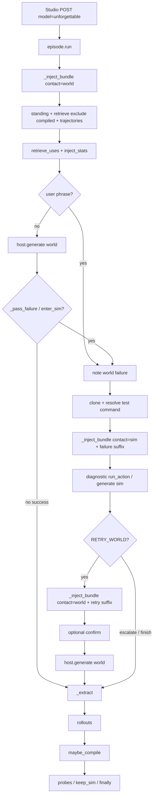
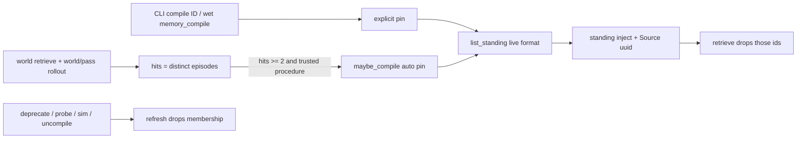

# Phase 4 — Compile B into the inner wheel

**Author:** TBD  
**Date:** 2026-08-14  
**Status:** Draft  
**Companion to:** `MemoryWheels.md` (architecture), `MemoryPhases.md` (roadmap), `MemPhase1.md` (bones), `MemPhase2.md` (main car), `MemPhase3.md` (rims and motion, now merged)

Fourth implementation slice. Phase 1 put every architectural piece in place. Phase 2 made B a notebook the stack trusts. Phase 3 made fail-in-world → tests-in-clone → retry-world the default coding path. Phase 4 makes stable lessons cheap: repeated admitted procedures become a standing inner-wheel block (A8), graded rollouts become a retrieveable trajectory library (A9), sim rehearsal finally re-retrieves with a lesson bias (parked in Phase 3), and we measure durable-redundant inject in chars.

License rule unchanged: new brains in `unforgettable/` (Apache 2). Studio only grows if the public face needs it. This phase **does not require AGPL edits** — `memory_compile` rides `MEMORY_TOOLS` the same way `memory_compact` already does.

Admit autonomy stays the Phase 2 lock. Do not reopen `admit()` order. Pack leakage is Phase 5. This phase locks the MemoryWheels §15 items the charter assigned it: retrieval bias by `world` vs `sim` (unparked from Phase 3), and an honest durable-redundant load metric (chars, not tokens).

---

## Overview

Phase 3 left a working act path whose inner prompt is still “FTS whatever matched the last user sentence, every turn.” `retrieve()` runs once before the first generate (`episode.py` ~135–147). `ENTER_SIM` and `RETRY_WORLD` reuse that same `inject` string plus a one-line suffix. Compiled procedures do not exist. Rollouts are written and shown by `cli get` on an episode id; nothing retrieves them. There is no hit counter, no standing block, no inject-size log.

Phase 4 compiles **repeated admitted procedures** into a standing prompt cache whose every section cites a B record id. Source of truth remains B; the standing block is membership + a live format of those bodies, not a rewritten skill file and not weights. Graded `rollouts` become a small trajectory library. On `ENTER_SIM` (and `RETRY_WORLD`) the runner re-retrieves with a sim- or world-biased policy. A char split (`standing` / `retrieve` / `trajectory`) is the shrink-without-drop metric.

No adapters. No new record kinds. No vec. No LLM rewrite of B.

---

## Background & Motivation

### What shipped (cite the tree, not the plans)

`unforge` now includes the Phase 3 stack (fast-forwarded from `execute-plan/b619b9c9-pr-*`). Apache `unforgettable/` plus the thin AGPL Studio face. The tree since the unsloth fork at `10f34dbf6` is the source of truth.

**Phase 1:** `a30475ce4` architecture note, `56eb8f748` package, `c71ba9f62` Studio wiring.

**Phase 2:** `4be6e2e15` twin_note, `8578e4b88` CLI, `43fb70236` retrieve policy, `bcfc57456` live stream, `277c2e3f9` / `a61fbe1c2` compact, `14e284c10` episode + rollouts, `f5719cc8a` gate eyes v0, `babc59e20` / `c5b520c4b` LLM extract + `Host.complete`.

**Phase 3 (now on `unforge`):** `844f68db2` richer eyes + `rims_enter_sim`, `a02e75251` `Host.run_action` + detector, `e6f57c822` sim test harness, `48b446d7c` `Probe:` CLI, `d9d011fa5` `keep_sim` hygiene, `46d9071bc` confirm-before-retry.

| Piece | Where it lives | What it actually does today |
|-------|----------------|-----------------------------|
| Episode runner | `unforgettable/loop/episode.py` `run()` | First-turn `retrieve` + `format_inject` (~135–147). `ENTER_SIM` / `RETRY_WORLD` reuse that `inject` plus a suffix (~215–218, ~249–254). No second retrieve. No standing block. |
| Retriever | `unforgettable/agents/retriever.py` | `RetrievePolicy(max_records=6, max_chars=2400, snippet_chars=280, high_stakes, max_twin_notes=1)`. `DEFAULT_RETRIEVE_KINDS` excludes `episode`. No `contact`. No compiled-id exclude. |
| `memory_search` | `unforgettable/tools/handlers.py` `_search` | Default `DEFAULT_RETRIEVE_KINDS` (no episode unless the caller opts in). |
| Rollouts | `store/schema.py` `rollouts`; `store/records.py` `insert_rollout` / `list_rollouts(episode_id=)` | Thin grades (world\|sim, pass\|fail, summary). CLI `get` on an episode prints them. **No retrieve into the prompt.** No list-without-episode-id. |
| Episode records | `extractor.episode_summary` | Bookkeeping `kind=episode`, last user clip 200, actions, events, draft ids. Active for CLI; excluded from default retrieve. |
| Compile / standing | — | **No module.** MemPhase1 named prompt compilation as later work; nothing was added. |
| Use counts | — | Retrieve hits are not persisted. Nothing knows a procedure was “repeated.” |
| Inject size | — | Not logged. Phase 2 locked chars, not tokens; nothing records them. |
| Sim retrieve bias | MemPhase3 Decision 8 | **Parked.** Charter said a real bias needs a second retrieve on `ENTER_SIM` and belongs with A9. |
| Admissions | `agents/admissions.py` | Locked Phase 2 order. Do not change. |
| Compact | `store/compact.py` | Title-dedupes `claim` / `procedure` / `entity`. Will collapse same-title procedures. Does not know about a compile cache. |
| Probes / test command | `eyes/probes.py`, `rims/detect.py` | `Probe:` procedures and the `test command` nomination are ordinary `procedure` rows. Must **not** become standing playbooks. |
| Sidecar C | `sidecar.py` | Still `pack_from_admitted_b` → `[]`. |
| Studio face | `studio/backend/core/unforgettable_host.py` | Copies `stakes` / `test_command` / `confirm_retry` / `permission_mode` / budgets. Unions `MEMORY_TOOL_NAMES \| CONTACT_TOOL_NAMES` into `enabled_tools`. No compile flag. |
| Tests to keep green | `unforgettable/tests/test_episode.py` | Keep names: `test_episode_fail_sim_retry_writes_error_fix` (sim **removed**), `test_episode_sim_ok_world_retry_fail_writes_twin_note` (sim **kept**), `test_retrieve_injects_before_generate`, user-phrase / enter_sim / test-command / confirm tests. Empty compiled set must not change them. |

### Why this phase

A client can already `POST /v1/chat/completions` with `model=unforgettable` and get remember / correct / stream / fail→tests-in-clone→retry. What it cannot do:

1. Stop re-paying FTS + a 280-char snippet for the same admitted playbook every turn.
2. Inject a boring procedure **even when this turn’s query would miss it**.
3. Point at the B record a standing prompt came from.
4. Pull graded world/sim rollouts when acting or rehearsing.
5. Prefer sim lessons and twin notes once the inner wheel is on the sim rim.
6. See whether standing inject actually shrank retrieve load.

Those are MemoryWheels A8, A9, the parked Phase 3 sim re-retrieve, and the Phase 4 metric. They do not require C, a vec index, or a UI.

---

## Goals & Non-Goals

### Goals

1. **Procedure compilation (A8).** Repeated admitted procedures (and operator-pinned ones) become a standing prompt block the episode injects by default. Each section cites `Source: {record_id}`. Source of truth remains B; compiled form is a **membership cache** plus a live format of those bodies.
2. **No double pay.** Default `retrieve()` / first-turn inject **excludes** compiled source ids. `memory_search` still returns them (inspect / model pull).
3. **Trajectory library (A9).** Retrieve a few graded `rollouts` rows when acting or rehearsing. Bias by contact. Do not inject episode bodies.
4. **Re-retrieve on rim switch.** `ENTER_SIM` rebuilds inject with a sim-biased policy (unpark MemPhase3 Decision 8). `RETRY_WORLD` rebuilds with the world policy so the just-finished sim grade can land in trajectories.
5. **Durable-redundant metric.** Persist char splits (`standing` / `retrieve` / `trajectory` / `total`) per retrieve. CLI `load` prints them. Unit is **chars**. Quality proxy is existing probes + the Phase 1–3 episode tests, not a new scorer.

### Non-goals (explicitly out of Phase 4)

- PEFT / Unsloth training / anything in `sidecar.py` except leaving the stub.
- Frontend memory browser or skill-file UI.
- sqlite-vec / embeddings / LLM rewrite of procedures into “skill.md”.
- New record kinds. New `admit()` predicates.
- Physics twins, containers, auto-calibration.
- Scheduled compact. Auto-admit of naive `error_fix`.
- Compiling claims, directives, error_fix, twin notes, episodes, `Probe:` procedures, or the `test command` nomination.
- Treating Studio RAG or chat history as B.
- `/v1/messages` / `/v1/responses`.
- Always-on standing of every active procedure (that is a dump, not “repeated”).

---

## Decisions locked (Phases 1–3 still hold)

Everything in MemPhase1 “Decisions locked by feedback”, MemPhase2 “Phase 2 additions”, and MemPhase3 “Phase 3 additions” still holds: Unsloth is the engine room, Grok Build is reference only, face is the existing OpenAI API, world = project sandbox, sim = cloned session dir, store = `$STUDIO_HOME/memory/memory.db`, license split, internal agents, conservative admit autonomy, `Host.complete` same-deploy, compact deterministic, retrieve char budget, no vec, `run_action` / `confirm` optional on the Protocol, `keep_sim` only admitted `error_fix` or `twin_note`.

**`admit()` total order is not reopened:**

1. namespace deny → rejected  
2. namespace propose → proposed  
3. `force_proposed_reason` → proposed  
4. `bookkeeping` → active  
5. sim claim **or** sim procedure → proposed  
6. `not explicit` → proposed  
7. `infer` and kind ≠ directive → proposed  
8. else → active  

### Phase 4 additions

| Topic | Decision |
|-------|----------|
| Compiled form | Membership cache in an additive `compiled` table, **not** a new kind and **not** a rewritten body. Standing markdown is formatted **live** from the B row at inject time so supersede / compact cannot leave a stale playbook in the prompt. |
| What may compile | `kind=procedure`, `status=active`, `provenance in {world, mixed, human}`, not `is_probe_title`, `normalize_title(title) != TEST_COMMAND_TITLE`. Sim / infer / proposed never compile. |
| “Repeated” | Distinct episodes where that procedure was in a **world** retrieve **and** that episode has a `rollouts` row `contact=world, outcome=pass`. Threshold `COMPILE_MIN_HITS = 2`. |
| Explicit pin | CLI `compile ID` / tool `memory_compile` with an id inserts `compiled.explicit=1` and **bypasses hits**. Still requires the trusted-procedure predicate. CLI `uncompile ID` drops membership. |
| Auto-compile | After `_extract` writes rollouts, `maybe_compile()` inserts non-explicit rows for newly eligible procedures. Never auto-uncompiles an **explicit** pin unless the source is no longer a trusted active procedure (`refresh_compiled`). |
| Standing inject | Query-independent. Rank: most hits, then newest `compiled_at`. Caps: `STANDING_MAX_RECORDS=4`, `STANDING_MAX_CHARS=1600`, per-body `COMPILE_BODY_CHARS=800`. Always keep the first compiled section (clip to budget), same rule as retrieve. |
| Double pay | `retrieve()` drops compiled source ids **after** FTS. `memory_search` does not. |
| Trajectories | Not a kind. `retrieve_trajectories` FTS-searches `kind=episode` (opt-in; still excluded from default retrieve) and joins `list_rollouts`. Empty query → newest rollouts. Cap `TRAJECTORY_MAX_ROWS=2`, `TRAJECTORY_MAX_CHARS=400`. Inject summaries + episode-id pointer only — **never** the episode body. |
| Trajectory rank | Matching `contact` first. World/acting: `pass` before `fail`. Sim/rehearsing: `fail` before `pass` (curriculum). Then recency. `high_stakes` drops `contact=sim` rollouts (world acting only). |
| Sim retrieve bias | `RetrievePolicy.contact` is `"world"` \| `"sim"`. World + `high_stakes` still drops `sim`/`infer` records. **Sim contact ignores `high_stakes` provenance filter** (rehearsal *is* the sim-lesson path) and sets `max_twin_notes=3`. After FTS, prefer `sim`/`mixed` for `error_fix` and `twin_note`; do not demote world procedures. |
| Re-retrieve | On `ENTER_SIM` after `enter_sim` + test-command resolve, rebuild inject with `contact="sim"` then append the existing failure suffix. On `RETRY_WORLD`, rebuild with `contact="world"` then append the existing retry suffix. Query stays `last_user_text`. |
| Metric unit | **Chars**, not tokens (Phase 2 lock). Persist one `inject_stats` row per retrieve (world first-turn, sim re-retrieve, retry-world refresh). |
| Quality half of shrink-without-drop | Do **not** invent a task-quality model. Proxy = existing probes + Phase 1–3 FakeHost tests still green with standing present. Operator reads `python -m unforgettable load`. |
| Studio | **No required AGPL change.** `memory_compile` is appended to `MEMORY_TOOLS`; the existing `enabled_tools` union already exposes new memory names. `EpisodeRequest.skip_standing` is Apache-only (tests). Optional later `getattr(payload, "skip_standing", None)` is not this phase. |
| Host protocol | **Unchanged.** No new Host method. |

**MemoryWheels §15 items this phase was required to lock** (not TBD):

| §15 question | Lock |
|--------------|------|
| Retrieval policy under token budgets; bias by `world` vs `sim` | Chars (already). World retrieve unchanged except compiled exclude + trajectories. Sim = second retrieve, no high-stakes provenance drop, `max_twin_notes=3`, prefer sim/mixed lessons. |
| Measuring durable-redundant context reduction honestly | `inject_stats` char split + compiled ids vs retrieved ids. Success is compiled source ids leaving `retrieve_chars` (excluded) while `standing_chars` holds a cited playbook. Not a tokenizer. Not an automatic quality score. |

---

## Target shape (what “done” means for Phase 4)

A real Studio `unforgettable` episode can:

1. Inject a standing procedure block that names `Source: {uuid}` even when this turn’s FTS would miss that title.
2. Not also inject that same procedure as a retrieve snippet.
3. After two world-pass episodes that retrieved a trusted procedure, auto-compile it — or the operator can `python -m unforgettable compile ID` once.
4. On world-fail → clone, re-retrieve with sim bias (twin notes + sim error_fix + sim rollouts) before the first sim generate.
5. Show `standing=… retrieve=… traj=… total=…` on `python -m unforgettable load`.

```
POST /v1/chat/completions  { "model": "unforgettable", "stream": true, ... }
        │
        ▼
 loop.episode.run
   standing(compiled) + retrieve(world, exclude compiled) + trajectories(world)
   write retrieve_uses + inject_stats
   host.generate(world)
   on ENTER_SIM → clone + resolve test command
                 → standing + retrieve(sim) + trajectories(sim) + failure suffix
                 → write retrieve_uses + inject_stats
   host.generate(sim) / run_action grade …
   on RETRY_WORLD → standing + retrieve(world) + trajectories(world) + retry suffix
   _extract (admit order unchanged)
   maybe_compile()
        │
        ▼
 python -m unforgettable compiled | compile ID | uncompile ID | load | rollouts
```

**Done when:** a boring procedure is no longer re-explained every turn, and you can point at the B record that compiled form came from.

---

## Package layout deltas

Phase 1–3 tree stays. Additions in **bold**. No Studio imports inside `unforgettable/`.

```
unforgettable/
  cli.py                           # + compiled, compile, uncompile, load, rollouts
  agents/
    retriever.py                   # contact, exclude compiled ids, twin-note cap by contact
    admissions.py                  # unchanged
  store/
    schema.py                      # + compiled, retrieve_uses, inject_stats
    records.py                     # CRUD for the three tables; list_rollouts filters
    compile.py                     # NEW — eligibility, refresh, pin, maybe_compile, format_standing
    trajectories.py                # NEW — retrieve_trajectories, format_trajectories
  loop/
    episode.py                     # standing + re-retrieve + uses/stats + maybe_compile
    context.py                     # skip_standing: bool = False
  tools/
    specs.py                       # + MEMORY_COMPILE
    handlers.py                    # + memory_compile dispatch
  tests/
    test_compile.py                # NEW
    test_trajectories.py           # NEW
    test_retrieve.py               # extend (exclude compiled; sim bias)
    test_episode.py                # extend (re-retrieve; keep Phase 1–3 names)
    test_cli.py                    # + compiled / compile / load / rollouts
    test_tools.py                  # + memory_compile dry-run default
    test_import_hygiene.py         # unchanged
```

`store/compile.py` owns eligibility and membership. `store/trajectories.py` owns rollout retrieve. `agents/retriever.py` stays the FTS policy. `episode.py` assembles the three inject parts and decides when to rebuild. Compact does **not** import compile — `refresh_compiled` on the next retrieve retires dead membership.

---

## Proposed Design

### 1. Procedure compilation (A8)

**Gap.** Admitted procedures only reach the inner wheel when FTS hits them, as a 280-char snippet, every turn. MemoryWheels A8 is “prompt/program compilation from repeated B procedures (still not weights).” MemoryPhases: source of truth remains B; compiled form is a cache.

**Membership, not a rewritten body.** A standing section is:

```markdown
### [abcd1234] How we run the formatter
<body clipped to COMPILE_BODY_CHARS>

Source: <full-uuid>
```

The body is `rec["body"]` at inject time. We do **not** store a second copy. We do **not** call `Host.complete`. We do **not** write `skill.md` files. Grok Build `/dream` is still reference only (Phase 2 compact already took the hygiene idea).

**Tables** (additive, `CREATE TABLE IF NOT EXISTS` in `ensure_schema`):

```sql
CREATE TABLE IF NOT EXISTS compiled (
    source_record_id TEXT NOT NULL PRIMARY KEY,
    explicit INTEGER NOT NULL DEFAULT 0,   -- 0 auto, 1 operator pin
    compiled_at TEXT NOT NULL,
    FOREIGN KEY (source_record_id) REFERENCES records(id)
);

CREATE TABLE IF NOT EXISTS retrieve_uses (
    id TEXT NOT NULL PRIMARY KEY,
    episode_id TEXT NOT NULL,
    record_id TEXT NOT NULL,
    contact TEXT NOT NULL,                 -- world | sim
    created_at TEXT NOT NULL
);
CREATE INDEX IF NOT EXISTS idx_retrieve_uses_record ON retrieve_uses(record_id);
CREATE INDEX IF NOT EXISTS idx_retrieve_uses_episode ON retrieve_uses(episode_id);
```

**Hits** (computed, not stored):

```sql
SELECT COUNT(DISTINCT ru.episode_id)
FROM retrieve_uses ru
JOIN rollouts ro ON ro.episode_id = ru.episode_id
WHERE ru.record_id = ?
  AND ru.contact = 'world'
  AND ro.contact = 'world'
  AND ro.outcome = 'pass'
```

**Eligibility** — `store/compile.py`:

```python
COMPILE_MIN_HITS = 2
COMPILE_PROVENANCE = frozenset({"world", "mixed", "human"})
COMPILE_BODY_CHARS = 800
STANDING_MAX_RECORDS = 4
STANDING_MAX_CHARS = 1600
STANDING_HEADER = "Standing procedures (compiled from B; Source: is the record id):"

def is_compile_candidate(rec: dict, *, hits: int, explicit: bool) -> bool:
    if rec is None or rec.get("kind") != "procedure":
        return False
    if rec.get("status") != "active":
        return False
    if rec.get("provenance") not in COMPILE_PROVENANCE:
        return False
    if is_probe_title(rec.get("title") or ""):
        return False
    if normalize_title(rec.get("title") or "") == TEST_COMMAND_TITLE:
        return False
    if explicit:
        return True
    return hits >= COMPILE_MIN_HITS
```

Import `is_probe_title` from `eyes/probes.py` and `TEST_COMMAND_TITLE` from `rims/detect.py`. Do not duplicate the predicates.

**`refresh_compiled(db_path)`** — walk `compiled`, `get_record`, drop the row if `is_compile_candidate(..., explicit=bool(row["explicit"]))` is false. Call at the start of `list_standing` and `maybe_compile`. Cheap; membership is small.

**`pin_compiled(record_id, *, explicit=False)`** / **`unpin_compiled(record_id)`**. Pin of a non-candidate raises `ValueError` with a reason (CLI prints it, exit 2). Auto pin of an already-explicit row leaves `explicit=1`.

**`maybe_compile(db_path)`** — `refresh_compiled`, then every active procedure that is a non-explicit candidate and not yet a member → `pin_compiled(..., explicit=False)`. Called from `_extract` **after** `_write_rollouts` so this episode’s world/pass counts. Do not compile during retrieve (would race the exclude set).

**`list_standing(db_path) -> list[dict]`** — refresh, load members, attach live records + hits, sort `(-hits, compiled_at desc)`, clip to `STANDING_MAX_RECORDS`.

**`format_standing(rows, *, max_chars=STANDING_MAX_CHARS) -> str`** — header + sections. First section always kept (clip body / block to budget). Stop before exceeding `max_chars`. Empty members → `""`.

**Write `retrieve_uses`** in `episode.run` right after each retrieve, one row per retrieved **and** standing id (standing is a use too — a compiled playbook that is injected counts toward “this episode saw it”). `contact` is the retrieve policy’s contact. Do not write uses when `skip_standing` is true **and** we skipped standing; still write uses for whatever FTS returned.

**`EpisodeRequest.skip_standing: bool = False`.** Tests that want a bare FTS inject can set it. Default false. Existing tests stay green because the compiled set is empty.

**Standing + retrieve assembly** (`episode.py`):

```python
def _inject_bundle(query, *, contact, stakes, skip_standing, db_path) -> tuple[str, InjectStats]:
    refresh is inside list_standing
    standing_rows = [] if skip_standing else list_standing(db_path)
    compiled_ids = {r["id"] for r in standing_rows}
    policy = RetrievePolicy(
        high_stakes=(stakes == "high" and contact == "world"),
        contact=contact,
        exclude_ids=compiled_ids,
        max_twin_notes=3 if contact == "sim" else 1,
    )
    retrieved = retrieve(query, policy=policy, db_path=db_path)
    trajectories = retrieve_trajectories(
        query, contact=contact, high_stakes=(stakes == "high" and contact == "world"),
        db_path=db_path,
    )
    parts = [
        _MEMORY_PREAMBLE,
        format_standing(standing_rows),
        format_inject(retrieved, policy=policy),
        format_trajectories(trajectories),
    ]
    text = "\n\n".join(p for p in parts if p)
    stats = InjectStats(...)  # char lens of the three bodies + ids
    return text, stats
```

First-turn: `inject, stats = _inject_bundle(..., contact="world")`. Persist uses + stats. Then `_with_system`.

### 2. Trajectory library (A9)

**Gap.** Phase 2 shipped the table so A9 would have something to read. Nothing reads it except `cli get` on an episode.

**Module.** `unforgettable/store/trajectories.py`

```python
TRAJECTORY_MAX_ROWS = 2
TRAJECTORY_MAX_CHARS = 400
TRAJECTORY_OVERFETCH = 8
TRAJECTORY_HEADER = "Prior rollouts:"

def retrieve_trajectories(
    query: str,
    *,
    contact: str = "world",
    high_stakes: bool = False,
    max_rows: int = TRAJECTORY_MAX_ROWS,
    db_path=None,
) -> list[dict]:
    ...
```

**Lookup:**

1. If `query.strip()`: `search_records(query, top_k=TRAJECTORY_OVERFETCH, kinds=["episode"], statuses=["active"])`. For each hit, `episode_id = source_episode_id or id`, then `list_rollouts(episode_id=...)`.
2. If query empty: `list_rollouts(limit=TRAJECTORY_OVERFETCH)` newest first (new optional filters on the existing function).
3. Flatten to `{**rollout, episode_title, episode_record_id, episode_provenance}`.
4. If `high_stakes`: drop `contact == "sim"` rows.
5. Sort: `(0 if row.contact == contact else 1, outcome_rank, -created_at)`.  
   `outcome_rank` = `0` for `pass` when `contact=="world"`, `0` for `fail` when `contact=="sim"`.
6. Dedup by `rollout.id`. Return `[:max_rows]`.

**`list_rollouts` extension** — keep today’s callers valid:

```python
def list_rollouts(
    *,
    episode_id: str | None = None,
    contact: str | None = None,
    outcome: str | None = None,
    limit: int | None = None,
    db_path=None,
) -> list[dict]:
    # ORDER BY created_at DESC when episode_id is None (library);
    # ASC when episode_id is set (existing CLI get order).
```

**`format_trajectories`:**

```
Prior rollouts:
- [ep8hex] world/fail: traceback in app.py
- [ep8hex] sim/pass: tests: pytest
```

`ep8hex` is `episode_id[:8]` (the runtime episode id on the rollout row), so `cli get` / future search can find the episode record via `source_episode_id`. Clip the whole block to `TRAJECTORY_MAX_CHARS`; always keep the first line if present.

**Do not** add rollout FTS. Episode FTS already indexes last-user text and event summaries. **Do not** put `kind=episode` into `DEFAULT_RETRIEVE_KINDS`.

**CLI.** `python -m unforgettable rollouts [--contact world|sim] [--outcome pass|fail] [--limit N] [--db]`. Table: episode[:8], contact, outcome, summary clip. Inspect only.

### 3. Re-retrieve on `ENTER_SIM` / `RETRY_WORLD` (unpark)

**Gap.** `inject` is computed once (`episode.py` ~135–147) and reused. MemoryWheels §7.5: “On sim-rehearse branch, retrieval may bias toward prior sim lessons and twin notes.” Phase 3 parked this because a real bias is a second retrieve.

**Change.** After `state.enter_sim` + `set_contact("sim")` + `resolve_test_command` (keep that order — diagnostic `run_action` still needs contact=sim), rebuild:

```python
inject, stats = _inject_bundle(
    last_user_text(request.messages),
    contact="sim",
    stakes=request.stakes,
    skip_standing=request.skip_standing,
    db_path=db_path,
)
_write_uses_and_stats(...)
messages = _with_system(
    request.messages,
    inject + f"\n\nYou are in a sim clone of the world tree. Previous world failure: {fail_summary}",
)
```

On `RETRY_WORLD`, same with `contact="world"` and the existing `"Retry in the world with the repaired plan."` suffix.

Do **not** change `decide()`. Do **not** retrieve inside `continue_sim` (budgeted rehearsal turns keep the sim inject). Diagnostic post-clone `run_action` happens after the rebuild so a green suite can still skip the wasted sim generate with the new inject already recorded.

**`RetrievePolicy` additions:**

```python
@dataclass(frozen=True)
class RetrievePolicy:
    max_records: int = DEFAULT_MAX_RECORDS
    max_chars: int = DEFAULT_MAX_CHARS
    snippet_chars: int = DEFAULT_SNIPPET_CHARS
    high_stakes: bool = False
    max_twin_notes: int = DEFAULT_MAX_TWIN_NOTES
    contact: str = "world"                 # world | sim
    exclude_ids: frozenset[str] = frozenset()
```

`retrieve()`:

1. Existing `search_records` call. `high_stakes` still passes `HIGH_STAKES_PROVENANCE` **only when `contact=="world"`**.
2. Drop `rec["id"] in policy.exclude_ids`.
3. Existing twin-note cap (`max_twin_notes`).
4. If `contact=="sim"`: stable re-sort so `error_fix` / `twin_note` with provenance `sim` or `mixed` sort before other lessons; world procedures stay. Do **not** change `search_records`.

`format_inject` header stays `"Durable memories relevant to this task:"`. Standing has its own header. Tests that look for `"Build uses pytest"` still pass.

### 4. Durable-redundant load metric

**Gap.** MemoryWheels §8.4 / Phase 4 charter: shrink durable-redundant prompt while holding quality. Apache has no tokenizer (Phase 2). Nothing logs inject size.

**Table:**

```sql
CREATE TABLE IF NOT EXISTS inject_stats (
    id TEXT NOT NULL PRIMARY KEY,
    episode_id TEXT NOT NULL,
    contact TEXT NOT NULL,
    standing_chars INTEGER NOT NULL,
    retrieve_chars INTEGER NOT NULL,
    trajectory_chars INTEGER NOT NULL,
    total_chars INTEGER NOT NULL,
    compiled_ids TEXT NOT NULL,     -- comma-separated, may be empty
    retrieved_ids TEXT NOT NULL,
    created_at TEXT NOT NULL
);
CREATE INDEX IF NOT EXISTS idx_inject_stats_episode ON inject_stats(episode_id);
```

Write one row per `_inject_bundle` call. Char counts are `len(format_*)` of each part (0 if absent), `total_chars = len(joined inject without the rim suffix)`. Suffixes (`You are in a sim clone…`) are **not** in the metric — they are episode A, not durable B.

**CLI.** `python -m unforgettable load [--limit N] [--db]`. Table: episode[:8], contact, standing, retrieve, traj, total, n_compiled. Newest first. Default limit 20.

**What “shrink-without-drop” means here, honestly:**

| Signal | Expect after a procedure compiles |
|--------|-----------------------------------|
| That id in `retrieved_ids` | Goes to **absent** (excluded) |
| That id in `compiled_ids` / `standing_chars` | Present; section cites `Source: {id}` |
| `retrieve_chars` | Down by roughly that snippet (or more if it used to crowd the 6-hit cap) |
| `standing_chars` | Up by the standing section (often **larger** than the 280-char snippet — a full playbook once) |
| `total_chars` | May rise on the first compile. The redundancy that dies is **re-explaining the same playbook via FTS every turn**, and **paying for it twice**. |
| Quality | Probes still pass; Phase 1–3 episode tests still pass with a compiled fixture present |

Do not claim tokenizer-true token savings. Do not add a hidden eval model.

Optional `admissions_log` note per retrieve: `inject: standing=.. retrieve=.. traj=.. compiled=n`. Nice for `admissions --limit`; not a substitute for `inject_stats`.

### 5. CLI and `memory_compile`

```
python -m unforgettable compiled
python -m unforgettable compile ID
python -m unforgettable uncompile ID
python -m unforgettable load [--limit N]
python -m unforgettable rollouts [--contact C] [--outcome O] [--limit N]
```

Every subparser calls `_add_db_flag`. `compiled` prints a table: id[:8], hits, explicit (`yes`/`no`), title. `compile` / `uncompile` print JSON of the membership row or exit 2 on unknown / ineligible id. `compile` of an already-compiled id is idempotent (sets `explicit=1` if it was auto).

**Tool** — append to `MEMORY_TOOLS` (Studio union already picks it up):

```python
MEMORY_COMPILE = {
    "type": "function",
    "function": {
        "name": "memory_compile",
        "description": (
            "Pin an admitted procedure into the standing prompt cache, or "
            "preview/run auto-compile of procedures that have enough world-pass hits. "
            "Source of truth stays the B record. dry_run defaults true."
        ),
        "parameters": {
            "type": "object",
            "properties": {
                "id": {
                    "type": "string",
                    "description": "Procedure id to pin. Omit to run maybe_compile.",
                },
                "dry_run": {
                    "type": "boolean",
                    "description": "Default true (preview). Pass false to mutate.",
                    "default": True,
                },
            },
        },
    },
}
```

`handlers.dispatch`: `dry_run = args.get("dry_run", True)`. Missing/None is preview. With `id`: preview eligibility + hits, or `pin_compiled(..., explicit=True)` when wet. Without `id`: preview/run `maybe_compile`. Never unpin via the tool (operator `uncompile` only) — a wet model call must not silently drop standing playbooks.

`_extract` / episode end never call `memory_compile`. Auto-compile is `maybe_compile` in Python, not a tool.

---

## API / Interface Changes

### Host protocol

**None.** `generate` / `complete` / `run_action` / `confirm` stay as Phase 3.

### EpisodeRequest

```python
# loop/context.py — addition only
skip_standing: bool = False
```

### Retriever

```python
@dataclass(frozen=True)
class RetrievePolicy:
    ...
    contact: str = "world"
    exclude_ids: frozenset[str] = frozenset()

def retrieve(query: str, *, policy: RetrievePolicy | None = None, db_path=None) -> list[dict]:
    # drops exclude_ids; sim contact skips high-stakes provenance filter
```

### Compile / trajectories / stats

```python
# store/compile.py
COMPILE_MIN_HITS = 2
COMPILE_PROVENANCE
COMPILE_BODY_CHARS = 800
STANDING_MAX_RECORDS = 4
STANDING_MAX_CHARS = 1600
def procedure_hits(record_id, *, db_path=None) -> int: ...
def is_compile_candidate(rec, *, hits: int, explicit: bool) -> bool: ...
def refresh_compiled(db_path=None) -> list[str]: ...          # dropped ids
def pin_compiled(record_id, *, explicit: bool = False, db_path=None) -> dict: ...
def unpin_compiled(record_id, *, db_path=None) -> None: ...
def maybe_compile(db_path=None) -> list[str]: ...             # newly pinned ids
def list_standing(db_path=None) -> list[dict]: ...
def format_standing(rows, *, max_chars=STANDING_MAX_CHARS) -> str: ...

# store/trajectories.py
def retrieve_trajectories(query, *, contact="world", high_stakes=False, max_rows=2, db_path=None) -> list[dict]: ...
def format_trajectories(rows, *, max_chars=TRAJECTORY_MAX_CHARS) -> str: ...

# store/records.py
def insert_retrieve_use(...) -> dict: ...
def insert_inject_stats(...) -> dict: ...
def list_inject_stats(*, limit=20, db_path=None) -> list[dict]: ...
def list_rollouts(*, episode_id=None, contact=None, outcome=None, limit=None, db_path=None) -> list[dict]: ...
```

### New memory tool

`memory_compile` as specified. `dry_run` default **true**. Studio: **no spec edit**.

---

## Data Model Changes

**No new record kinds. No `ALTER` on `records`.** Phase 1 still owns the soul of `records`.

**Additive tables:** `compiled`, `retrieve_uses`, `inject_stats` (DDL above). Same `CREATE TABLE IF NOT EXISTS` strategy as `rollouts`. Existing `memory.db` files grow them lazily.

**`list_rollouts` gains optional filters**; default when `episode_id` is set stays “all rows for that episode, `created_at ASC`.”

**What is still not persisted.** Raw `ToolTrace` lists, KV, chat messages, standing markdown (rebuilt live), probe stdout.

**Compact interaction.** Compact may deprecate a compiled source. Next `refresh_compiled` drops membership. Hits stay on `retrieve_uses` (history); they do not resurrect a deprecated procedure. If compact keeps a same-title **winner**, that winner must earn hits or be explicitly compiled — do **not** silently transfer membership.

---

## Flows

### Episode with standing / trajectories / re-retrieve



### Compile membership



---

## Studio touchpoints (AGPL, keep tiny)

Dependency arrow remains **Studio → unforgettable**.

| File | Change | Why |
|------|--------|-----|
| `studio/backend/core/unforgettable_host.py` | **None required.** | Standing / re-retrieve / stats are Apache `run()`. |
| `studio/backend/core/inference/tools.py` | **None required.** Confirm `memory_compile` rides `*MEMORY_TOOLS` + the existing `enabled_tools` union. | Catalog |
| `studio/backend/routes/inference.py` | **None.** | Route stays dumb |
| Frontend | **None.** | No new SSE type, no pill |

If a later A/B wants to disable standing from the API, `getattr(payload, "skip_standing", None)` is a one-liner on `EpisodeRequest` — not this phase.

---

## Tests (Phase 4, no GPU)

Keep Phase 1–3 tests green, **especially names** `test_episode_fail_sim_retry_writes_error_fix`, `test_episode_sim_ok_world_retry_fail_writes_twin_note`, `test_retrieve_injects_before_generate`, `test_episode_user_phrase_enters_sim_before_generate`. Empty compiled membership must not change their assertions (`removed`, twin_note, `memory_write` in preamble, `user declared failure` suffix).

`test_import_hygiene.py` stays.

New / extended tests under `unforgettable/tests/`:

| Test | Asserts |
|------|---------|
| `test_compile.py` **NEW** | Trusted world procedure with 0 hits is not a candidate. After two distinct episodes of `retrieve_uses(contact=world)` + `rollouts(world, pass)`, `maybe_compile` pins it. Sim-only retrieve uses do **not** count. `Probe: old login` and title `Test Command` never pin, even with hits or `explicit=True` (`ValueError`). `provenance=sim` / `status=proposed` never pin. `pin_compiled` explicit bypasses hits. `refresh_compiled` drops a pin after `deprecate_record`. `format_standing` contains `Source: {full id}` and the title. `STANDING_MAX_CHARS` still keeps ≥1 section. |
| `test_retrieve.py` (extend) | `exclude_ids={compiled}` → that title is absent from `format_inject` but `search_records` still finds it. `contact="sim"` + `high_stakes=True` still returns a `sim` `error_fix` (filter off). `contact="world"` + `high_stakes=True` still drops `sim`. A second twin_note still drops when `max_twin_notes=1`; sim policy with `max_twin_notes=3` keeps three. |
| `test_trajectories.py` **NEW** | Two episode records + rollouts; query matches episode user text → returns the matching episode’s rollout, not the other. Empty query → newest. `contact="sim"` ranks a sim/fail above a world/pass. `high_stakes=True` drops sim rollouts. `format_trajectories` has no episode body / last user paragraph. Cap 2. |
| `test_episode.py` (keep + add) | **Keep** happy-path / drift / user-phrase / enter_sim / test-command / confirm tests. **Add** `test_episode_standing_excludes_from_retrieve`: pin a long procedure, first generate system text contains `Source: {id}` and the title **once** (standing) and does not repeat it under `Durable memories relevant to this task:`. **Add** `test_episode_re_retrieve_on_enter_sim`: insert a `sim` `error_fix` and a `world` claim; after ENTER_SIM, `last_messages` (sim generate) contains the sim error_fix; first world generate need not. **Add** `test_episode_maybe_compile_after_second_world_pass`: two `run()` calls that retrieve the same active world procedure and world-pass → second `_extract` leaves a `compiled` row. **Add** `test_episode_skip_standing`: pin a procedure, `skip_standing=True` → no `Standing procedures` header. |
| `test_cli.py` (extend) | `compiled` lists a pin. `compile` / `uncompile` round-trip. `compile` of a probe exits 2. `load` prints a standing/retrieve/total after one `run()`. `rollouts --contact sim` shows the drift fixture’s sim/pass. `--db` works on every new subparser. |
| `test_tools.py` (extend) | `memory_compile` in `MEMORY_TOOL_NAMES`. Dispatch with no args is dry-run (`compiled` unchanged). `dry_run=false` without id runs `maybe_compile`. `dry_run=false` + id pins. There is no unpin via the tool. |
| `test_import_hygiene.py` | Unchanged: no `from studio` / `import studio`. |

Do not boot a GPU. Do not require FastAPI for these tests.

---

## Alternatives Considered

### Compiled body: live format vs stored cache vs LLM skill

| Option | Pros | Cons |
|--------|------|------|
| **A. Membership table + live format of B** (chosen) | Always cites the current body; supersede/compact cannot serve a stale playbook; `Source: {id}` is trivial; CLI/tests are deterministic | Not a byte cache; format cost is tiny |
| B. Store a compiled markdown blob, invalidate on `updated_at` | Closer to “cache” literally | Stale-body bugs; two sources of truth |
| C. `Host.complete` rewrites a skill.md | Pretty; closer to a Grok skill | LLM rewrite of B is what Phase 2 compact rejected; CLI compile would need a Host; cannot relocate |

Chose A. “Compiled form is a cache” in the architecture sense (prompt cache of B, not weights). The standing block is the cache the inner wheel sees.

### What “repeated” means

| Option | Pros | Cons |
|--------|------|------|
| **A. Distinct world-retrieve + world-pass episodes ≥ 2, plus explicit pin** (chosen) | Ties compile to *useful* repetition; operator escape hatch; testable without logging tokens | Procedures never retrieved (operator-only knowledge) need `compile ID` |
| B. Compile every trusted active procedure | Simple | Standing dump; charter said **repeated** |
| C. Age (`updated_at` older than N days) | No new tables | A stale unused playbook would stand; a new twice-used one would not |
| D. Count FTS hits only, ignore outcome | Simpler SQL | Compiles playbooks that keep failing |

Chose A. Sim retrieve uses do not count — we do not promote sim-only glory into standing (same spirit as admit Decision 8).

### Standing always vs standing only on FTS miss

| Option | Pros | Cons |
|--------|------|------|
| **A. Always inject compiled, exclude from FTS** (chosen) | Done-when: a boring procedure is present even when this query would miss; no double pay | First compile can **raise** `total_chars`; must cap 4 / 1600 |
| B. Only inject if FTS missed | Smaller prompt | Still a lottery; “by default” in the charter fails |
| C. Replace retrieve entirely with standing | Maximum shrink | Task-specific claims / error_fix disappear |

Chose A. The metric is allowed to show a larger `standing_chars` than the old snippet; the redundancy that dies is re-retrieve + double inject.

### Sim bias now vs keep parked

| Option | Pros | Cons |
|--------|------|------|
| **A. Second retrieve on ENTER_SIM / RETRY_WORLD** (chosen) | Matches MemoryWheels §7.5 and the Phase 3 park note | Extra FTS per rim switch |
| B. Rank-tweak the first-turn inject | No second call | World acting would start seeing sim lessons |
| C. Leave parked again | Smaller phase | Charter A9 + Phase 3 open question 2 assigned it here |

Chose A.

### Trajectory storage

| Option | Pros | Cons |
|--------|------|------|
| **A. Episode FTS + join rollouts** (chosen) | No new FTS; episode bodies already hold last user + events | Depends on episode rows existing (Phase 2 already writes them) |
| B. FTS on `rollouts.summary` | Direct | Extra virtual table for one-line summaries |
| C. New `kind=trajectory` | Uniform retrieve | Phase 1 locked kinds; rollouts are grades, not notebook prose |

Chose A.

---

## Security & Privacy

- **No new network surface.** Compile / trajectories / stats are local SQLite. Tools stay inside the existing Studio tool loop.
- **Standing is trusted B only.** Sim / infer / proposed / probes / test-command cannot stand. Explicit pin still has to pass that predicate.
- **`memory_compile` is fail-closed.** `dry_run` defaults true. No unpin via the tool. Wet no-id path only auto-pins *eligible* procedures.
- **Admit autonomy unchanged.** Auto-extract stays proposed; proposed procedures cannot compile.
- **Do not persist episode bodies into trajectories.** Rollout summaries are already clipped event lines.
- **`retrieve_uses` / `inject_stats` are bookkeeping**, not notebook kinds. They are not retrieved into the prompt.
- **Secrets.** Same as Phases 1–3: B is a local file. A compiled standing section is a clip of a procedure body the operator already admitted. Do not teach compile to copy env dumps.
- **License / relocatable.** New modules stay under `unforgettable/` with the Apache header. `test_import_hygiene.py` remains the tripwire. No new Studio imports.

---

## Observability

No metrics backend. The store is the inspect surface.

| Signal | Where |
|--------|--------|
| Standing membership | `compiled` + CLI `compiled` |
| Hits | `procedure_hits()` from `retrieve_uses` ⨝ `rollouts` |
| Inject split | `inject_stats` + CLI `load` |
| Auto-compile | `admissions_log` optional `compile: auto {id}` / `compile: explicit {id}` via `LogGateEyes.note` |
| Trajectories | CLI `rollouts`; inject header `Prior rollouts:` |
| Twin-drift / probes / confirm | unchanged |

Alerting: none. Operator loop: `compiled`, `load --limit 20`, `list --kind procedure --status active`.

---

## Rollout Plan

No feature flags in the Apache package. Stage by PR (see PR Plan). Each PR is mergeable and leaves tests green.

| Stage | What ships | Rollback |
|-------|------------|----------|
| 1 | Schema + explicit compile + standing inject + retrieve exclude + `retrieve_uses` / `inject_stats` writes | Revert; extra tables unused are fine. Empty membership = Phase 3 inject. |
| 2 | `maybe_compile` after extract | Revert; leftover `compiled` rows can `uncompile`. |
| 3 | Trajectory retrieve + CLI `rollouts` | Revert; rollouts table unchanged. |
| 4 | Re-retrieve on ENTER_SIM / RETRY_WORLD + sim bias | Revert `episode.py` rebuilds; first-turn-only inject returns. |
| 5 | CLI `load` + `memory_compile` | Revert; stats rows remain queryable via sqlite if needed. |

Default coding path with an empty compiled set after all five: **identical inject to Phase 3** plus empty `inject_stats` / `retrieve_uses` rows (harmless). Behavior operators will notice only after `compile` or two successful world-pass retrieves of the same playbook: a `Standing procedures` block appears.

---

## Risks

| Risk | Severity | Mitigation |
|------|----------|------------|
| Standing dump blows the prompt | Medium | Caps 4 / 1600 / 800; trusted procedures only; probes / test-command excluded |
| First compile **increases** `total_chars` | Low (accepted) | Document in the metric; shrink is no double-pay + no FTS lottery for that playbook |
| Auto-compile of a bad but twice-used playbook | Medium | Only `active` trusted provenance; still CLI `uncompile`; proposed never compiles |
| Hits SQL double-counts | Low | `COUNT(DISTINCT episode_id)`; world retrieve + world/pass only |
| Re-retrieve changes `last_messages` and breaks phrase / preamble tests | Medium | Keep failure / retry suffixes; preamble unchanged; add tests that assert suffix **and** new sim lesson |
| `list_rollouts` order change breaks CLI `get` | High | Keep `ASC` when `episode_id` is set; `DESC` only for the library path |
| Compact deprecates a compiled source, standing serves a ghost | High | Live format + `refresh_compiled` before every `list_standing` |
| `memory_compile` wet no-id floods membership | Medium | `maybe_compile` still requires hits + predicate; dry-run default |
| Episode FTS for trajectories injects last-user text | High (if we slip) | `format_trajectories` only uses rollout summary + ids; test asserts no user paragraph |
| Sim high-stakes still dropping sim lessons | High | `contact=="sim"` forces `high_stakes` provenance filter **off** inside `retrieve()` even if the request is high-stakes |

---

## Explicitly out of Phase 4

Same list as Goals / Non-Goals, restated so a reviewer can grep it:

- PEFT, `sidecar.pack_from_admitted_b`, any training job
- Frontend memory browser; writing `.md` skill files to disk
- sqlite-vec; LLM rewrite of procedures
- New record kinds; changing `admit()` order
- Compiling claims / error_fix / twin_note / episode / `Probe:` / `test command`
- Physics twins / containers / auto-calibration
- Scheduled compact; auto-admit of naive `error_fix`
- Studio RAG or chat history as B
- Grok Build in the tree
- `/v1/messages`, `/v1/responses`
- Required AGPL / Studio file edits

Those remain named stubs (`sidecar.py`) or later-phase work. Phase 5 owns pack leakage and adapters.

---

## Implementation order

Apache only. Each step independently reviewable. Matches the PR Plan.

1. **Schema + explicit standing** — `compiled` / `retrieve_uses` / `inject_stats` tables, `store/compile.py` (pin/unpin/refresh/format), `RetrievePolicy.exclude_ids`, first-turn standing + exclude, write uses/stats, CLI `compiled` / `compile` / `uncompile`. No auto-compile. No re-retrieve.
2. **Auto-compile** — `procedure_hits` + `maybe_compile` after `_write_rollouts`. Two world-pass + retrieve episodes pin. Tests for probes / test-command / sim provenance refusal.
3. **Trajectory library** — `store/trajectories.py`, `list_rollouts` filters, include `format_trajectories` in `_inject_bundle`, CLI `rollouts`.
4. **Re-retrieve + sim bias** — `RetrievePolicy.contact`, rebuild inject on `ENTER_SIM` and `RETRY_WORLD`, sim twin-note cap / no high-stakes drop.
5. **Metric face + tool** — CLI `load`, `memory_compile` (`dry_run` default true), optional `LogGateEyes.note` on pin.

Steps 1–5 are Apache-only. No Host method. No StudioHost change.

---

## Success criteria

- `unforgettable` still imports with no Studio on `sys.path`. `test_import_hygiene` green.
- FakeHost **happy path** (existing test): world fail → sim success → world success → `error_fix` proposed, sim dir **removed**, no twin_note required. Still true with an empty compiled set **and** with an unrelated compiled fixture present.
- FakeHost **drift path** (existing test): twin_note `active`, naive `error_fix` `proposed`, sim dir **kept**.
- Pinning procedure `P` puts `Source: {P.id}` in the first generate system text and **not** under the retrieve header.
- Two world-pass episodes that retrieved `P` leave a `compiled` row; a third episode injects `P` as standing without a retrieve snippet.
- `Probe:` and `test command` cannot be compiled (CLI exit 2 / `ValueError`).
- `ENTER_SIM` last_messages include a sim-provenance `error_fix` that the first world generate did not need to include; `user declared failure` suffix still present on the user-phrase path.
- `python -m unforgettable compiled` / `compile` / `uncompile` / `load` / `rollouts` work against a tmp db in tests.
- `memory_compile` without args is dry-run; `git grep` of `unforgettable/` shows no `from studio` / `import studio`.

---

## Open Questions

MemoryWheels §15 items assigned to Phase 4 are **locked above**, not left open.

Remaining questions that are *not* blockers for this phase:

1. **Whether compact should ever run automatically** — still parked (Phase 2).
2. **Whether a later tiny PR should auto-admit `error_fix` with `provenance in {world, mixed}`** — still a one-line `admit()` change after evidence; not this phase.
3. **Whether compiled procedures should ever leave retrieve’s `DEFAULT_RETRIEVE_KINDS` entirely** (so even `memory_search` hides them) — no; inspect/search must still find B.
4. **Whether standing should shrink `COMPILE_BODY_CHARS` once C exists** — Phase 5 / MemoryWheels §11.3 (“middle may drop redundant standing prompt once C proven”).
5. **Pack leakage / adapter lifecycle** — Phase 5.
6. **Whether `skip_standing` should be a Studio payload field** — not until someone A/Bs it.

---

## References

- `unforgettable/plans/MemoryWheels.md` — §7.5 retrieve, §8.4 shrink metric, §12 A8/A9, §15 questions Phase 4 locks
- `unforgettable/plans/MemoryPhases.md` — Phase 4 charter (do not expand past it)
- `unforgettable/plans/MemPhase1.md` — Host contract, kinds, Studio face
- `unforgettable/plans/MemPhase2.md` — admit order, char budget, rollouts table, no vec, no LLM compact
- `unforgettable/plans/MemPhase3.md` — Decision 8 parked sim retrieve; probes / test-command predicates this phase must reuse
- Implementation: `unforgettable/loop/episode.py` (~135–147 first-turn inject; ~203–254 rim suffixes), `agents/retriever.py`, `store/{schema,records,search,compact}.py`, `eyes/probes.py` (`is_probe_title`), `rims/detect.py` (`TEST_COMMAND_TITLE`), `tools/{specs,handlers}.py`, `cli.py`
- Studio: `studio/backend/core/unforgettable_host.py` (`handle_chat_completions` getattr copies ~559–564; `enabled_tools` union). No required edit.
- Grok Build: reference only (first-turn inject already exists; dream-as-hygiene is compact). Not in the tree.

---

## Key Decisions

1. **Compiled form is membership + a live format of B, not a rewritten skill and not weights.** Additive `compiled` table. Every standing section ends with `Source: {record_id}`. *Rationale:* charter “source of truth remains B; compiled form is a cache”; a stored blob or `Host.complete` rewrite would fork the notebook.

2. **“Repeated” is two distinct world-retrieve + world-pass episodes; operators can pin earlier.** Hits ignore sim retrieves. Probes and the `test command` nomination cannot compile. *Rationale:* MemoryWheels “repeated B procedures”; do not stand up failing or sim-only playbooks; Phase 3 already reserved those two procedure titles for harnesses.

3. **Standing is always-on for members and excluded from FTS inject.** Caps 4 / 1600 / 800. First section always kept. `memory_search` still returns the B row. *Rationale:* done-when is “no longer re-explained every turn,” including FTS misses; exclude prevents double pay.

4. **Trajectories stay a table, not a kind.** Episode FTS + `list_rollouts`. Inject two one-line grades, never episode bodies. World ranks pass first; sim ranks fail first. High-stakes acting drops sim rollouts. *Rationale:* Phase 2 built the table for this; §7.5 prefers procedures when acting and sim lessons when rehearsing.

5. **Sim retrieve bias is a second retrieve on `ENTER_SIM` (and a world rebuild on `RETRY_WORLD`).** Sim contact turns off the high-stakes provenance filter and raises `max_twin_notes` to 3. `CONTINUE_SIM` does not retrieve again. *Rationale:* Phase 3 parked exactly this hook; first-turn-only rank tweaks would leak sim lessons into world acting.

6. **The metric is chars in `inject_stats`, not tokens and not a quality model.** Success is compiled ids leaving retrieve while remaining cited in standing. Total chars may rise on the first compile. *Rationale:* Phase 2 already refused a fake tokenizer; MemoryWheels asked for an honest shrink of durable-redundant load.

7. **No Host change and no required Studio change.** `memory_compile` rides `MEMORY_TOOLS` with `dry_run` default true and no unpin. *Rationale:* Phase 4 is an inner-wheel prompt concern; AGPL stays wiring-only.

---

## PR Plan

Each PR is independently reviewable and mergeable. Apache only. Empty compiled set leaves Phase 3 behavior.

### PR 1 — Standing compile (explicit) and retrieve exclude

- **Title:** `Unforgettable: compile admitted procedures into a standing prompt`
- **Files/components:** `unforgettable/store/schema.py`, `unforgettable/store/records.py` (`retrieve_uses`, `inject_stats` writers + `list_inject_stats`), `unforgettable/store/compile.py`, `unforgettable/agents/retriever.py` (`exclude_ids`), `unforgettable/loop/episode.py` (first-turn `_inject_bundle` without trajectories/re-retrieve), `unforgettable/loop/context.py` (`skip_standing`), `unforgettable/cli.py` (`compiled` / `compile` / `uncompile` + `_add_db_flag`), `unforgettable/tests/test_compile.py`, `unforgettable/tests/test_retrieve.py`, `unforgettable/tests/test_cli.py`, `unforgettable/tests/test_episode.py` (`test_episode_standing_excludes_from_retrieve`, `test_episode_skip_standing`)
- **Depends on:** none (Phase 3 already on `unforge`)
- **Changes:** Additive tables. Explicit pin only. Standing header + `Source: {id}`. Retrieve drops those ids. Write uses/stats on the first-turn retrieve. No `maybe_compile`. No sim rebuild. Existing episode tests stay green (empty membership).

### PR 2 — Auto-compile after repeated world-pass

- **Title:** `Unforgettable: auto-compile procedures after two world-pass hits`
- **Files/components:** `unforgettable/store/compile.py` (`procedure_hits`, `maybe_compile`), `unforgettable/loop/episode.py` (call after `_write_rollouts`), `unforgettable/tests/test_compile.py`, `unforgettable/tests/test_episode.py` (`test_episode_maybe_compile_after_second_world_pass`)
- **Depends on:** PR 1
- **Changes:** Hits SQL. Auto pin of trusted procedures at `COMPILE_MIN_HITS`. Probe / test-command / sim / proposed still refused. Explicit pins remain.

### PR 3 — Trajectory library

- **Title:** `Unforgettable: retrieve graded world and sim rollouts`
- **Files/components:** `unforgettable/store/trajectories.py`, `unforgettable/store/records.py` (`list_rollouts` filters), `unforgettable/loop/episode.py` (include `format_trajectories` in `_inject_bundle`), `unforgettable/cli.py` (`rollouts`), `unforgettable/tests/test_trajectories.py`, `unforgettable/tests/test_cli.py`
- **Depends on:** PR 1 (bundle helper). Can land before or after PR 2.
- **Changes:** Episode FTS + join. Caps 2 / 400. No episode bodies in inject. CLI inspect.

### PR 4 — Re-retrieve on rim switch + sim bias

- **Title:** `Unforgettable: re-retrieve on enter-sim with sim lesson bias`
- **Files/components:** `unforgettable/agents/retriever.py` (`contact`, sim twin-note cap, no high-stakes drop on sim), `unforgettable/loop/episode.py` (rebuild inject on `ENTER_SIM` / `RETRY_WORLD`), `unforgettable/tests/test_retrieve.py`, `unforgettable/tests/test_episode.py` (`test_episode_re_retrieve_on_enter_sim`; user-phrase suffix still present)
- **Depends on:** PR 1; should include PR 3 so sim inject has trajectories to bias
- **Changes:** Unpark MemPhase3 Decision 8. `CONTINUE_SIM` does not retrieve again. Write uses/stats per rebuild.

### PR 5 — Load metric and `memory_compile`

- **Title:** `Unforgettable: inject load CLI and memory_compile tool`
- **Files/components:** `unforgettable/cli.py` (`load`), `unforgettable/tools/specs.py` (`MEMORY_COMPILE`), `unforgettable/tools/handlers.py`, `unforgettable/tools/__init__.py` if it re-exports names, `unforgettable/tests/test_cli.py`, `unforgettable/tests/test_tools.py`
- **Depends on:** PR 1 (stats rows already written); nicer after PR 2 so dry-run `maybe_compile` has meaning
- **Changes:** CLI table of char splits. Tool `dry_run` default true; wet + id = explicit pin; wet no id = `maybe_compile`; no unpin via the tool. Studio catalog/union already covers the new name.

---

*End of Phase 4 design. Do not expand past the MemoryPhases charter. Phase 5 owns the side car (packs, adapters, pack leakage).*
