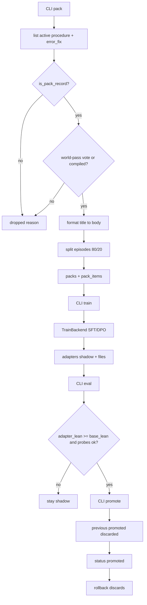
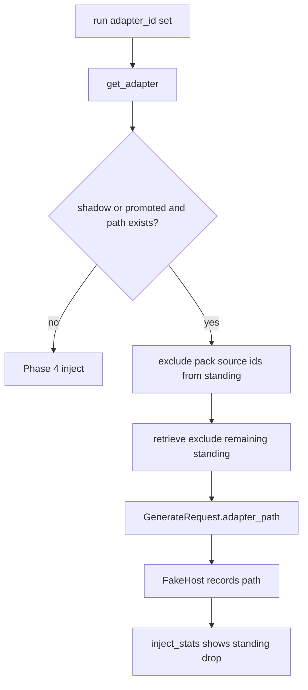

# Phase 5 — Side car C (MemoryWheels Tier B)

**Author:** TBD  
**Date:** 2026-08-14  
**Status:** Draft  
**Companion to:** `MemoryWheels.md` (architecture), `MemoryPhases.md` (roadmap), `MemPhase1.md` (bones), `MemPhase2.md` (main car), `MemPhase3.md` (rims), `MemPhase4.md` (compile B into the inner wheel, now merged)

Fifth implementation slice. Phase 1 put every architectural piece in place. Phase 2 made B a notebook the stack trusts. Phase 3 made fail-in-world → tests-in-clone → retry-world the default coding path. Phase 4 compiled repeated admitted procedures into a standing prompt and retrieved graded rollouts. Phase 5 is the first time Unsloth earns its keep: curated packs from admitted B + graded **world** traces, batched PEFT / QLoRA on an adapter, shadow → eval → promote or discard, offline distill if the pack is still retrieval-heavy, and outcome-conditioned preference if SFT is not enough.

License rule unchanged: new brains in `unforgettable/` (Apache 2). Studio training UI is **optional and out**. A recipe/job from the Apache package is enough. This phase **does not require AGPL edits**.

Admit autonomy stays the Phase 2 lock. Do not reopen `admit()` order. Do not auto-train at episode end. Do not fine-tune on raw session logs. This phase locks the MemoryWheels §15 items the charter assigned it: pack construction without leakage, adapter lifecycle, training signal (SFT vs distill vs preference, and how eyes enter the loss). Durable-redundant load stays the Phase 4 char metric; Phase 5 adds an honest holdout “works with less retrieval?” score.

---

## Overview

Phase 4 left a working inner wheel whose durable skill still lives in B (standing + retrieve + trajectories). `sidecar.py` is still the Phase 1 stub: `pack_from_admitted_b(*_args, **_kwargs) -> []`. There is no pack, no adapter registry, no train job, no eval, no promote/rollback.

Phase 5 builds the outer **side car C**. Pack text comes only from admitted `procedure` / `error_fix` bodies. Graded world traces **vote** (and form preference pairs); they do not donate episode user text. Training goes through a `TrainBackend` protocol so default tests stay no-GPU. The real recipe lazy-imports Unsloth (`FastLanguageModel.from_pretrained` + `get_peft_model` + TRL `SFTTrainer`) and writes a LoRA directory. Base weights stay frozen. Shadow adapters are not served. Promote is an operator CLI after eval. Rollback = drop the adapter row (and stop shrinking standing). Never merge into base.

No new record kinds. No `admit()` change. No `memory_train` tool. No Studio training UI.

---

## Background & Motivation

### What shipped (cite the tree, not the plans)

`unforge` now includes the Phase 4 stack. Apache `unforgettable/` plus the thin AGPL Studio face. The tree since the unsloth fork at `10f34dbf6` is the source of truth.

**Phase 1:** `a30475ce4` architecture note, `56eb8f748` package, `c71ba9f62` Studio wiring.

**Phase 2:** `4be6e2e15` twin_note, `8578e4b88` CLI, `43fb70236` retrieve policy, `bcfc57456` live stream, `277c2e3f9` / `a61fbe1c2` compact, `14e284c10` episode + rollouts, `f5719cc8a` gate eyes v0, `babc59e20` / `c5b520c4b` LLM extract + `Host.complete`.

**Phase 3:** `844f68db2` richer eyes + `rims_enter_sim`, `a02e75251` `Host.run_action` + detector, `e6f57c822` sim test harness, `48b446d7c` `Probe:` CLI, `d9d011fa5` `keep_sim` hygiene, `46d9071bc` confirm-before-retry.

**Phase 4 (now on `unforge`):** `b4fc89957` standing compile, `cbfd07f13` auto-compile, `a48b55b55` trajectories, `0ef5bf27f` / `02f5c2863` re-retrieve + sim bias, `3109ad797` / `e4bb47b20` `load` + `memory_compile`.

| Piece | Where it lives | What it actually does today |
|-------|----------------|-----------------------------|
| Sidecar C | `unforgettable/sidecar.py` | `pack_from_admitted_b` returns `[]`. Docstring: Phase 1 stub. |
| Standing compile | `store/compile.py` | Membership + live format. Trusted `procedure` only (`world`/`mixed`/`human`, not probe, not `test command`). Hits = distinct world-retrieve + world/pass episodes ≥ 2. |
| Rollouts | `store/records.py` `list_rollouts` | Filters by episode / contact / outcome. Library path newest first. |
| Retrieve uses | `retrieve_uses` | Per-retrieve + standing id, tagged `world`\|`sim`. |
| Inject metric | `inject_stats` + CLI `load` | Char split `standing` / `retrieve` / `traj` / `total`. |
| Episode bodies | `extractor.episode_summary` | Last user clip 200, actions, events, draft ids. Active for CLI; excluded from default retrieve. **Must not enter a pack.** |
| Probes / test command | `eyes/probes.py`, `rims/detect.py` | Ordinary `procedure` rows. Phase 4 already refused them as standing. Pack must refuse them too. |
| Admissions | `agents/admissions.py` | Locked Phase 2 order. Do not change. Sim procedures stay proposed. |
| Host | `unforgettable/host.py` | `generate` / `complete` / `run_action` / `confirm`. No adapter field. |
| Episode runner | `loop/episode.py` `_inject_bundle` | Standing + retrieve (exclude compiled) + trajectories. Re-retrieve on rim switch. No adapter, no shrink-for-C. |
| Studio face | `studio/backend/core/unforgettable_host.py` | Copies stakes / test_command / confirm / budgets. Unions memory + contact tools. No adapter attach. |
| Studio training | `studio/backend/core/training/trainer.py` | AGPL UnslothTrainer. **Do not import.** Phase 5 writes its own Apache recipe against public Unsloth APIs. |
| Unsloth public train | `unsloth/models/loader.py` `FastLanguageModel.from_pretrained` (`load_in_4bit=True`, `full_finetuning=False`); `unsloth/models/llama.py` `get_peft_model` (`r=16`, `lora_alpha=16`, `random_state=3407`); `trl.SFTTrainer` via `unsloth/trainer.py` | The engine room the recipe must call. |
| Tests to keep green | `unforgettable/tests/test_episode.py` | Keep names: `test_episode_fail_sim_retry_writes_error_fix`, `test_episode_sim_ok_world_retry_fail_writes_twin_note`, `test_retrieve_injects_before_generate`, standing / re-retrieve / maybe_compile tests. Empty adapter set must not change them. |

### Why this phase

A client can already `POST /v1/chat/completions` with `model=unforgettable` and get remember / correct / stream / fail→tests-in-clone→retry / standing playbooks / trajectory inject. What it cannot do:

1. Build a curated training pack from B without stuffing episode transcripts or sim-only glory into weights.
2. Train a domain adapter with Unsloth while leaving the base frozen.
3. Hold that adapter out, score “does it work with less retrieval?”, and refuse a bad one.
4. Promote one adapter, then roll it back by dropping it — not by editing base weights.
5. Distill a still-heavy standing block into the adapter as a student-without-B curriculum.
6. Use world pass/fail grades as preference pairs when SFT is not enough.

Those are MemoryWheels B10–B13. They do not require a Studio training UI, online distillation, live weight updates, or parametric unlearning.

---

## Goals & Non-Goals

### Goals

1. **Pack construction (B10, leakage lock).** `pack_from_admitted_b` builds a versioned pack from admitted trusted `procedure` / `error_fix` bodies. Graded **world** traces vote (and hold out by episode). Trusted sim is opt-in and never sim-only glory.
2. **Batched PEFT / QLoRA (B11 train).** A `TrainBackend` protocol. Fake backend for tests. Unsloth backend lazy-imports `FastLanguageModel` + `get_peft_model` + `SFTTrainer`, `full_finetuning=False`, writes a LoRA dir. Base stays frozen.
3. **Shadow → eval → promote / discard (B11 lifecycle).** Train lands `shadow`. Eval is holdout completion + optional probes. Promote is an operator CLI with a refuse-unless-eval-passed gate. Rollback = discard the promoted row. Never merge into base. One promoted adapter at a time.
4. **Offline distill (B12).** If packs stay retrieval-heavy, a student-without-B format of the same gold bodies (title → body). Not a live teacher. Not online.
5. **Outcome-conditioned preference (B13).** If SFT is not enough: world/fail rejected vs world/pass chosen pairs from the same episode. Fake backend always; Unsloth/TRL DPO is optional.
6. **Works with less retrieval.** Holdout score with adapter and **no** B inject, compared to base with no B. When an episode actually attaches an adapter (`EpisodeRequest.adapter_id`), standing members that are pack sources are dropped from inject (MemoryWheels §11.3). Live Studio default does **not** attach and does **not** shrink.

### Non-goals (explicitly out of Phase 5)

- Studio training UI, wrapping `studio/backend/core/training/trainer.py`, or importing `unsloth_cli`.
- Required AGPL / StudioHost edits (including live LoRA attach on `model=unforgettable`).
- Auto-train at episode end. `memory_train` / `memory_pack` tools (C is never an inner-model firehose).
- Fine-tuning on raw chat logs, `rag.db`, episode bodies, or unadmitted / `infer` / `proposed` rows.
- Packing claims, entities, directives, twin notes, probes, or the `test command` nomination.
- Full fine-tune, merge-to-base, or touching serving weights.
- Online / near-online teacher-student distillation, attention-map matching, continual learning on live weights, productized parametric unlearn, auto-calibration (Phase 6 / Tier C).
- New record kinds. New `admit()` predicates. sqlite-vec. Frontend memory / adapter browser.
- Traffic-splitting canary in Studio. “Canary” = holdout eval before promote.

---

## Decisions locked (Phases 1–4 still hold)

Everything in MemPhase1 “Decisions locked by feedback”, MemPhase2 “Phase 2 additions”, MemPhase3 “Phase 3 additions”, and MemPhase4 “Phase 4 additions” still holds: Unsloth is the engine room, Grok Build is reference only, face is the existing OpenAI API, world = project sandbox, sim = cloned session dir, store = `$STUDIO_HOME/memory/memory.db`, license split, internal agents, conservative admit autonomy, `Host.complete` same-deploy, compact deterministic, retrieve char budget, no vec, `run_action` / `confirm` optional, `keep_sim` only admitted `error_fix` or `twin_note`, compiled form is membership + live format, sim retrieve bias is a second retrieve.

**`admit()` total order is not reopened:**

1. namespace deny → rejected  
2. namespace propose → proposed  
3. `force_proposed_reason` → proposed  
4. `bookkeeping` → active  
5. sim claim **or** sim procedure → proposed  
6. `not explicit` → proposed  
7. `infer` and kind ≠ directive → proposed  
8. else → active  

### Phase 5 additions

| Topic | Decision |
|-------|----------|
| Home | Convert `sidecar.py` into package `unforgettable/sidecar/` (`__init__.py` re-exports `pack_from_admitted_b`). No Studio imports. No module-level `import unsloth` / `import torch`. |
| Pack text | **Only** `kind in {procedure, error_fix}`, `status=active`, `provenance in {world, mixed, human}`. User = record title; assistant = record body clipped to `PACK_BODY_CHARS=1200`. |
| Trace role | Rollouts **vote** and **pair**. They do not donate episode bodies or last-user text. A world/pass rollout makes a trusted procedure/error_fix retrieved in that episode pack-eligible even below compile-hit count. |
| Trusted sim | `include_sim` default **False**. When True: a sim/pass rollout may vote only if the same episode also has world/pass **and** no `twin_note` with that `source_episode_id`. Sim rows never become assistant gold. |
| Never pack | Episode bodies; `proposed` / `rejected` / `deprecated` / `superseded`; `infer` / `sim` provenance records; claims; entities; directives; twin notes as targets; `Probe:` procedures; `test command`; raw `ToolTrace` / stdout. |
| Holdout | Split by **episode_id** (not row). `HOLDOUT_FRACTION=0.2`. If `n_eligible_episodes >= 5`, at least one holdout episode; else eval is probes-only / operator `--force`. Holdout items never train. |
| Min train size | `PACK_MIN_TRAIN=4`. Pack may be smaller (inspect). `train` refuses below 4. Real Unsloth jobs should aim at 16+; that is operator advice, not a hard refuse. |
| TrainBackend | `train(examples, *, output_dir, base_model, recipe) -> TrainResult` and `complete(messages, *, adapter_path, max_tokens=80) -> str`. Tests use `FakeTrainBackend`. |
| Unsloth recipe | Lazy import inside `UnslothTrainBackend` only. `FastLanguageModel.from_pretrained(..., load_in_4bit=True, full_finetuning=False)` → `get_peft_model(r=16, lora_alpha=16, lora_dropout=0.0, bias="none", use_gradient_checkpointing="unsloth", random_state=3407)` → TRL `SFTTrainer` / `SFTConfig` → `save_pretrained(output_dir)`. Refuse full FT (`full_finetuning=True` or `UNSLOTH_ENABLE_FULL_FINETUNING=1`). |
| Base model | `--base` **required** for `--backend unsloth`. No silent 1B download. Fake backend ignores `--base` (stored as `"fake"`). |
| Adapter files | `{memory.db parent}/adapters/{adapter_id}/`. Studio operators: `$STUDIO_HOME/memory/adapters/<id>/`. |
| Lifecycle | `shadow` after train. `promoted` after CLI `promote`. `discarded` after rollback or being replaced. **One** promoted row at a time. Previous promoted → discarded (files kept). Rollback does **not** auto-repromote. Never merge to base. Never auto-promote. |
| Eval | Holdout `TrainBackend.complete` with adapter, **no** B inject, vs the same prompt with `adapter_path=None`. Score = clipped-char overlap with gold assistant (`EVAL_CLIP=200`). Optional `--world` runs existing `Probe:` suite (tree regression; probes do not load C). |
| Promote gate | Refuse unless last eval on that adapter has `adapter_lean >= base_lean` (not worse) **and** (`adapter_lean >= base_lean` is enough to ship a first adapter; `--force` bypasses). Empty holdout + no probes → refuse without `--force`. |
| Distill | Format flag, not a second model. Student prompt is title-only (already the SFT default). Retrieval-heavy trigger: mean `standing_chars+retrieve_chars` over last 20 world `inject_stats` ≥ `DISTILL_CHAR_THRESHOLD=2000`, **or** `n_compiled >= 3`. Distill pack is the same gold bodies; train recipe `distill` is SFT on that format. No `Host.complete` teacher. |
| Preference | Pairs from the same episode: user = fail summary or linked procedure title; `chosen` = world/pass summary or the admitted error_fix body; `rejected` = world/fail summary. Never chosen = sim-only. Fake backend writes `pairs.jsonl`. Unsloth/TRL `DPOTrainer` is optional (`--recipe preference`); missing TRL → clear error, not a crash of `pack` / SFT. |
| Eyes in the loss | Pack filter is the dataset eye. Preference uses world pass/fail grades as chosen/rejected. Probes are post-train regression, not a reward model. No RL. |
| Serving | **No required Studio attach.** `EpisodeRequest.adapter_id` is Apache-only (tests + explicit CLI-driven eval episodes). `GenerateRequest.adapter_path` is set when `adapter_id` is set; `FakeHost` records it; `StudioHost` may ignore it. Operator serving path: load the saved LoRA as an existing Studio LoRA model. |
| Standing shrink | Only when `request.adapter_id` is set (or `request.shrink_standing is True`). Drop standing members whose source id is in that adapter’s pack sources. Default live Studio (`adapter_id is None`) is **unchanged Phase 4 inject**. Do not shrink on promote alone — that would strip playbooks from a generate that is still the base model. |
| Tools | **None.** No `memory_pack`, no `memory_train`. C is an outer-wheel operator job. |
| Host protocol methods | **Unchanged.** Additive optional field `GenerateRequest.adapter_path: Optional[str] = None` only. `complete` / `run_action` / `confirm` signatures stay. |
| Import hygiene | `test_import_hygiene` still forbids `studio`. Add: importing `unforgettable.sidecar` must not import `unsloth` or `torch` (lazy train backend only). |

**MemoryWheels §15 items this phase was required to lock** (not TBD):

| §15 question | Lock |
|--------------|------|
| Pack construction from B without leaking episode junk or untrusted sim | Pack text = admitted trusted procedure/error_fix bodies only. Traces vote / pair / hold out by episode. `include_sim` default off; when on, sim/pass votes only if world/pass and no twin_note. Claims / episode bodies / probes / infer / proposed never pack. |
| Adapter lifecycle (shadow, canary, merge, roll back) | shadow → eval → operator promote. One promoted. Rollback = discard. No merge. Canary = holdout eval, not traffic split. |
| Training signal: SFT vs preference vs distill; how eyes enter the loss | Default SFT. Distill = student-without-B format of the same gold. Preference = world fail/pass pairs if SFT is not enough. Eyes = pack filter + graded pairs; probes after, not in the loss. |
| Measuring durable-redundant context reduction honestly | Phase 4 chars stay. Phase 5 adds holdout lean-with-C vs lean-without-C (char overlap). Standing shrink is measured in `inject_stats` only on episodes that attach an adapter. Not a tokenizer. Not an automatic quality model. |

---

## Target shape (what “done” means for Phase 5)

An operator can, against a real `memory.db` that already has admitted procedures and world-pass rollouts:

1. `python -m unforgettable pack` and get a pack whose items cite B record ids, with a JSON filter report (kept / dropped reasons).
2. `python -m unforgettable train --backend fake` (CI) or `--backend unsloth --base <model>` (GPU box) and get a `shadow` adapter directory next to the db.
3. `python -m unforgettable eval <id>` and see `adapter_lean` vs `base_lean` on holdout titles.
4. `python -m unforgettable promote <id>` only if eval did not regress; `rollback` discards it.
5. An episode with `adapter_id` set injects standing **without** those pack-source procedures, and `FakeHost.last_generate.adapter_path` points at the LoRA dir.

```
python -m unforgettable pack [--include-sim] [--dry-run]
        │
        ▼
  packs + pack_items   (train / holdout by episode)
        │
        ▼
python -m unforgettable train [--backend fake|unsloth] [--recipe sft|distill|preference]
        │
        ▼
  adapters status=shadow   files at <db>/../adapters/<id>/
        │
        ▼
python -m unforgettable eval ID [--world PATH]
        │
        ▼
python -m unforgettable promote ID     or     discard / rollback
        │
        ▼
 episode.run(adapter_id=ID) → standing shrink + GenerateRequest.adapter_path
```

**Done when:** one domain adapter can be trained from B, held out, and rolled back without touching base weights.

---

## Package layout deltas

Phase 1–4 tree stays. Additions in **bold**. Delete the stub file `sidecar.py` in the same PR that adds the package (keep `from unforgettable.sidecar import pack_from_admitted_b`).

```
unforgettable/
  sidecar.py                       # DELETE — replaced by package
  sidecar/
    __init__.py                    # NEW — pack_from_admitted_b, public façade
    pack.py                        # NEW — eligibility, votes, holdout split, persist
    format.py                      # NEW — SFT / distill messages; preference pairs
    adapters.py                    # NEW — registry CRUD, promote, rollback
    train.py                       # NEW — TrainBackend, FakeTrainBackend, UnslothTrainBackend
    eval.py                        # NEW — holdout complete + probe optional
  cli.py                           # + pack, packs, train, adapters, eval, promote, rollback
  store/
    schema.py                      # + packs, pack_items, adapters
    records.py                     # optional thin wrappers; prefer sidecar.* owning C tables
  loop/
    episode.py                     # standing shrink when adapter_id set; pass adapter_path
    context.py                     # adapter_id, shrink_standing
  host.py                          # GenerateRequest.adapter_path optional
  tests/
    test_sidecar_pack.py           # NEW
    test_sidecar_train.py          # NEW (fake backend only)
    test_sidecar_eval.py           # NEW
    test_sidecar_adapters.py       # NEW
    test_episode.py                # extend shrink + adapter_path; keep Phase 1–4 names
    test_cli.py                    # + pack / train / eval / promote / rollback
    test_import_hygiene.py         # + sidecar import does not pull unsloth/torch
```

`sidecar/pack.py` owns leakage. `sidecar/format.py` owns message JSON. `sidecar/adapters.py` owns lifecycle. `sidecar/train.py` is the only file allowed to import Unsloth, and only inside `UnslothTrainBackend` methods. Compact / compile / admissions do **not** import sidecar.

---

## Proposed Design

### 1. Pack construction (B10)

**Gap.** `sidecar.pack_from_admitted_b` returns `[]`. MemoryWheels §8.3 / §15: curated pack from admitted B + graded world traces + optional calibrated sim; no episode junk; no untrusted sim.

**Eligibility — records** (`sidecar/pack.py`):

```python
PACK_KINDS = frozenset({"procedure", "error_fix"})
PACK_PROVENANCE = frozenset({"world", "mixed", "human"})
PACK_BODY_CHARS = 1200
PACK_MIN_TRAIN = 4
HOLDOUT_FRACTION = 0.2
HOLDOUT_MIN_EPISODES = 5
DISTILL_CHAR_THRESHOLD = 2000
DISTILL_MIN_COMPILED = 3

def is_pack_record(rec: dict) -> bool:
    if rec is None or rec.get("kind") not in PACK_KINDS:
        return False
    if rec.get("status") != "active":
        return False
    if rec.get("provenance") not in PACK_PROVENANCE:
        return False
    if rec.get("kind") == "procedure":
        if is_probe_title(rec.get("title") or ""):
            return False
        if normalize_title(rec.get("title") or "") == TEST_COMMAND_TITLE:
            return False
    if not (rec.get("title") or "").strip():
        return False
    if not (rec.get("body") or "").strip():
        return False
    return True
```

Import `is_probe_title` and `TEST_COMMAND_TITLE`. Do not duplicate.

**Votes — rollouts** (not text sources):

A record is **voted** if any of:

1. It is already in `compiled` (Phase 4 already required trusted + hits or explicit pin), or
2. Some `retrieve_uses` row for that `record_id` shares an `episode_id` with a `rollouts` row `contact=world, outcome=pass`, or
3. (`include_sim` and) a `retrieve_uses` row shares an episode with `contact=sim, outcome=pass` **and** that episode also has `world/pass` **and** `list_records(kinds=["twin_note"], ...)` has no row with `source_episode_id == episode_id`.

Unvoted but otherwise eligible records (operator wrote a trusted procedure that never retrieved) are **dropped** from auto-pack. Operator escape: they can `compile ID` first (explicit pin) and re-pack — compiled membership is a vote. Do not add a separate “force pack this id” flag this phase.

**Holdout split.** Collect the set of episode ids that voted at least one train-candidate. Sort by episode id (stable). Last `ceil(n * HOLDOUT_FRACTION)` episodes are holdout when `n >= HOLDOUT_MIN_EPISODES`. Every pack item whose vote episodes are **all** in the holdout set goes to `role=holdout`. Items voted only by train episodes → `train`. Items voted by both → **train** (the record is not held out; the holdout episodes still contribute eval queries via their titles / linked records that are holdout-only). Simpler lock that tests can assert:

- Build the candidate list of `(record_id, vote_episode_ids)`.
- An item is holdout iff **every** vote episode is in the holdout episode set.
- If that would leave `n_train < PACK_MIN_TRAIN` and there are holdout items, move the newest holdout items back to train until `n_train == PACK_MIN_TRAIN` or holdout is empty. Prefer a smaller holdout over an untrainable pack.

**`pack_from_admitted_b(*, include_sim=False, dry_run=False, db_path=None) -> PackReport`**

```python
@dataclass(frozen=True)
class PackReport:
    pack_id: Optional[str]
    n_train: int
    n_holdout: int
    dropped: list[tuple[str, str]]   # (id or kind, reason)
    include_sim: bool
    dry_run: bool
```

Dry run does not insert. Wet insert writes `packs` + `pack_items` (`messages` already formatted).

**Dropped reasons** (stable strings for tests / CLI JSON): `not a pack kind`, `not active`, `untrusted provenance`, `probe`, `test command`, `empty title`, `empty body`, `no world-pass vote`, `sim vote without world-pass`, `sim vote has twin_note`.

**`format.py` SFT messages:**

```python
def format_sft_item(rec: dict) -> list[dict]:
    title = (rec.get("title") or "").strip()
    body = _clip((rec.get("body") or "").strip(), PACK_BODY_CHARS)
    return [
        {"role": "user", "content": title},
        {"role": "assistant", "content": body},
    ]
```

Distill format is the same (title-only user is already student-without-B). Do **not** prepend standing or retrieve to the user side. That would train the model to need B — the opposite of §8.4.

**Keep the function name** `pack_from_admitted_b` so the Phase 1 stub’s contract is filled, not renamed.

### 2. Batched PEFT / QLoRA (B11 train)

**Gap.** Nothing trains. Charter: batched PEFT / QLoRA via **existing Unsloth training APIs**; base stays frozen. Studio trainer is AGPL — do not call it.

**`sidecar/train.py`:**

```python
@dataclass(frozen=True)
class TrainResult:
    adapter_id: str
    path: str
    backend: str          # fake | unsloth
    recipe: str           # sft | distill | preference
    n_examples: int

class TrainBackend(Protocol):
    def train(
        self,
        examples: list[dict],          # pack_items role=train, or pairs for preference
        *,
        output_dir: Path,
        base_model: str,
        recipe: str = "sft",
    ) -> None: ...

    def complete(
        self,
        messages: list[dict],
        *,
        adapter_path: Optional[str],
        max_tokens: int = 80,
    ) -> str: ...
```

**`FakeTrainBackend`.** `train` writes `output_dir / "adapter_config.json"` `{"fake": true, "recipe": ..., "n": ...}` and `output_dir / "fake_gold.json"` mapping user content → assistant gold (from the examples). `complete` returns that gold when `adapter_path` is that dir, else `""`. No torch.

**`UnslothTrainBackend`.** Import only inside methods:

```python
def train(self, examples, *, output_dir, base_model, recipe="sft"):
    if os.environ.get("UNSLOTH_ENABLE_FULL_FINETUNING") == "1":
        raise RuntimeError("sidecar refuses full fine-tune; unset UNSLOTH_ENABLE_FULL_FINETUNING")
    from unsloth import FastLanguageModel
    from trl import SFTTrainer, SFTConfig
    from datasets import Dataset

    model, tokenizer = FastLanguageModel.from_pretrained(
        base_model,
        max_seq_length=2048,
        load_in_4bit=True,
        full_finetuning=False,
    )
    model = FastLanguageModel.get_peft_model(
        model,
        r=16,
        lora_alpha=16,
        lora_dropout=0.0,
        bias="none",
        use_gradient_checkpointing="unsloth",
        random_state=3407,
    )
    # Map examples through tokenizer.apply_chat_template when available;
    # else concatenate "user\n{u}\nassistant\n{a}".
    ...
    trainer = SFTTrainer(model=model, processing_class=tokenizer, train_dataset=ds, args=SFTConfig(
        output_dir=str(output_dir),
        per_device_train_batch_size=2,
        num_train_epochs=1,
        logging_steps=1,
        seed=3407,
        report_to=[],
    ))
    trainer.train()
    model.save_pretrained(output_dir)
    tokenizer.save_pretrained(output_dir)
```

Exact `SFTConfig` / `processing_class` vs `tokenizer` kwarg must match the TRL version Unsloth already patches (`unsloth/trainer.py` wraps `SFTTrainer`). Prefer the kwargs Studio’s Apache-adjacent public examples use: if `SFTTrainer` rejects `processing_class`, fall back to `tokenizer=`. One try/except on TypeError is enough. Do not vendor Studio’s `UnslothTrainer`.

`complete` for Unsloth: load base + `PeftModel.from_pretrained` (or Unsloth’s load-adapter path) only when evaluating on a GPU box. Tests never construct this backend.

**`train_pack(pack_id, *, backend, base_model, recipe="sft", db_path) -> TrainResult`**

1. Load `pack_items` with `role=train`.
2. If `len < PACK_MIN_TRAIN`: raise `ValueError`.
3. If `recipe == "preference"`: build pairs via `format.preference_pairs` (may be empty → raise).
4. Allocate `adapter_id`, `path = adapters_root(db_path) / adapter_id`.
5. `backend.train(...)`.
6. Insert `adapters` row `status=shadow`.

**`adapters_root(db_path)`** = `Path(db_path).resolve().parent / "adapters"`.

Default backend for CLI: `unsloth` if `importlib.util.find_spec("unsloth")` else `fake`. Tests pass `--backend fake`.

### 3. Shadow → eval → promote / discard (B11 lifecycle)

**Tables** (additive, `CREATE TABLE IF NOT EXISTS` in `ensure_schema`):

```sql
CREATE TABLE IF NOT EXISTS packs (
    id TEXT NOT NULL PRIMARY KEY,
    created_at TEXT NOT NULL,
    n_train INTEGER NOT NULL,
    n_holdout INTEGER NOT NULL,
    include_sim INTEGER NOT NULL DEFAULT 0,
    report TEXT NOT NULL
);

CREATE TABLE IF NOT EXISTS pack_items (
    id TEXT NOT NULL PRIMARY KEY,
    pack_id TEXT NOT NULL,
    role TEXT NOT NULL,                 -- train | holdout
    source TEXT NOT NULL,               -- record
    source_id TEXT NOT NULL,
    episode_id TEXT,                    -- primary vote episode, may be null
    kind TEXT NOT NULL,
    provenance TEXT NOT NULL,
    contact TEXT NOT NULL DEFAULT 'world',
    messages TEXT NOT NULL,             -- JSON array
    created_at TEXT NOT NULL,
    FOREIGN KEY (pack_id) REFERENCES packs(id)
);
CREATE INDEX IF NOT EXISTS idx_pack_items_pack ON pack_items(pack_id);

CREATE TABLE IF NOT EXISTS adapters (
    id TEXT NOT NULL PRIMARY KEY,
    pack_id TEXT NOT NULL,
    status TEXT NOT NULL,               -- shadow | promoted | discarded
    backend TEXT NOT NULL,
    base_model TEXT NOT NULL,
    recipe TEXT NOT NULL,
    path TEXT NOT NULL,
    metrics TEXT,                       -- JSON, null until eval
    created_at TEXT NOT NULL,
    promoted_at TEXT,
    FOREIGN KEY (pack_id) REFERENCES packs(id)
);
CREATE INDEX IF NOT EXISTS idx_adapters_status ON adapters(status);
```

No `ALTER` on `records`. No new kinds.

**`sidecar/adapters.py`:**

```python
ADAPTER_STATUSES = frozenset({"shadow", "promoted", "discarded"})

def insert_adapter(...) -> dict: ...
def get_adapter(adapter_id, *, db_path=None) -> dict | None: ...
def list_adapters(*, status=None, db_path=None) -> list[dict]: ...
def get_promoted_adapter(*, db_path=None) -> dict | None: ...
def promote_adapter(adapter_id, *, force=False, db_path=None) -> dict: ...
def rollback_adapter(*, db_path=None) -> dict | None: ...  # discards current promoted
def discard_adapter(adapter_id, *, db_path=None) -> dict: ...
```

**`promote_adapter`:**

1. Load adapter. Unknown id → `KeyError`.
2. If status is `discarded` and not `force` → `ValueError` (re-eval first).
3. If not `force`: require `metrics` JSON with `adapter_lean >= base_lean` (missing metrics → refuse).
4. Any existing `status=promoted` → `discarded` (do not delete files).
5. This row → `promoted`, `promoted_at=now`.

**`rollback_adapter`:** current promoted → discarded. Returns the discarded row or `None`. Does not promote a previous adapter.

Files stay on disk. Optional later `adapters gc` is **out**. Operator can `rm -r` a discarded dir.

### 4. Eval — gate eyes + “works with less retrieval?”

**Gap.** Phase 3 probes grade the **tree**, not the model. Phase 4 `inject_stats` grades prompt size, not C. MemoryWheels §8.3 / §9.3: task metrics + regressions + works with less retrieval; no promote on sim-only false glory.

**`sidecar/eval.py` `eval_adapter(adapter_id, *, backend, world=None, db_path=None) -> EvalReport`:**

```python
@dataclass(frozen=True)
class EvalReport:
    adapter_id: str
    n_holdout: int
    adapter_lean: float     # mean overlap [0, 1]
    base_lean: float
    probes_pass: int
    probes_fail: int
    passed: bool            # adapter_lean >= base_lean and probes_fail == 0
```

**Holdout completion.** For each `pack_items.role=holdout`:

- `gold` = assistant content.
- `adapter_out = backend.complete(user_only, adapter_path=adapter.path, max_tokens=80)`
- `base_out = backend.complete(user_only, adapter_path=None, max_tokens=80)`
- overlap = `len(lcs_chars(clip(out, 200), clip(gold, 200))) / max(len(clip(gold, 200)), 1)` — or simpler: `1.0` if `clip(gold, 40).casefold() in out.casefold()` else character precision on the shorter string. Lock the simple containment score so FakeTrainBackend (exact gold) gets `1.0` and empty base gets `0.0`:

```python
def completion_score(output: str, gold: str, *, clip: int = 200) -> float:
    g = (gold or "")[:clip].strip().casefold()
    o = (output or "")[:clip].strip().casefold()
    if not g:
        return 0.0
    if g in o:
        return 1.0
    # longest common prefix / len(g) so partial echoes are not a zero
    n = 0
    for a, b in zip(g, o):
        if a != b:
            break
        n += 1
    return n / len(g)
```

Mean over holdout items. No holdout → `adapter_lean = base_lean = 0.0`, `n_holdout = 0`.

**Probes.** If `world` is set, `run_probes(world=world, host=None, db_path=db_path)` (existing CLI path). Count pass/fail. If `world` is omitted, `probes_pass = probes_fail = 0` (not a fail).

**Persist** `adapters.metrics` as JSON of the report. `passed` is `adapter_lean >= base_lean and probes_fail == 0`. `n_holdout == 0` and no probes run → `passed=False` so `promote` needs `--force`.

Do **not** call `Host.complete` (that path is extract, no adapter). Do **not** boot Studio.

### 5. Offline distill (B12) and preference (B13)

**Distill.** Charter: offline prompt/context distillation for stable curricula if packs stay retrieval-heavy.

`pack_is_retrieval_heavy(db_path) -> bool`:

- Last 20 world rows of `list_inject_stats`: mean(`standing_chars + retrieve_chars`) ≥ `DISTILL_CHAR_THRESHOLD` (2000), or
- `len(list_compiled(db_path)) >= DISTILL_MIN_COMPILED` (3).

CLI `train --recipe distill` uses the same pack items (title → body). It is SFT. The difference is documentary + default when heavy: `train` without `--recipe` picks `distill` if heavy else `sft`. Both hit `TrainBackend.train(..., recipe=...)`.

Do not sample a teacher with B still in context (MemoryWheels §14: “Calling imitation of a context-rich teacher ‘reality-tested’ without outcome terms”). Gold is the admitted B body, already outcome-gated.

**Preference.** `format.preference_pairs(db_path) -> list[dict]`:

For each episode that has both a world/fail and a later world/pass rollout:

```python
{
  "prompt": [{"role": "user", "content": fail_summary or linked_procedure_title}],
  "chosen": pass_summary,     # or admitted error_fix body if from_episode wrote one and operator admitted it — prefer the error_fix body when status=active
  "rejected": fail_summary,
  "episode_id": ...,
}
```

Skip episodes that have a `twin_note` (world/sim disagreement — not a clean preference). Skip if pass contact is sim and world did not pass. Cap `PREFERENCE_MAX_PAIRS=32`.

`FakeTrainBackend.train` with `recipe=preference` writes `pairs.jsonl` and a fake adapter dir. `UnslothTrainBackend` may call `trl.DPOTrainer` when present; otherwise raise `RuntimeError("preference recipe needs trl.DPOTrainer")`. SFT/distill must not require DPO.

### 6. Episode hook (standing shrink + adapter_path)

**Gap.** MemoryWheels §11.3: “middle may drop redundant standing prompt once C proven.” Phase 4 open question 4 assigned that here. Doing it on every live Studio turn without attaching C would **hurt** quality.

**`EpisodeRequest`** (`loop/context.py`):

```python
adapter_id: Optional[str] = None
shrink_standing: Optional[bool] = None  # None → True iff adapter_id set
```

**`GenerateRequest.adapter_path: Optional[str] = None`.**

**`_inject_bundle`** grows `exclude_standing_ids: frozenset[str] = frozenset()`. When shrink is on, `list_standing` results drop ids in the promoted/attached pack’s `source_id` set before `pack_standing`. Retrieve exclude still uses whatever standing **remains** (compiled ids that still stand). Pack-source procedures that were standing become absent from **both** standing and retrieve (they are the C skill). They remain in `memory_search`.

**`run()`:** if `request.adapter_id`: `get_adapter` → set `GenerateRequest.adapter_path`. Missing / discarded adapter → ignore (no raise; log `LogGateEyes.note("adapter: missing or discarded")`). `FakeHost.generate` stores `req.adapter_path` on `self.last_adapter_path`.

Do **not** auto-read `get_promoted_adapter()` in `run()`. Live default stays Phase 4. Tests and a future Studio one-liner can pass `adapter_id`.

**`Host.complete` unchanged.** Extract must not load C (would mix notebook extract with adapter drift).

### 7. CLI

```
python -m unforgettable pack [--dry-run] [--include-sim]
python -m unforgettable packs [--limit N]
python -m unforgettable train [--pack ID] [--backend fake|unsloth] [--base MODEL] [--recipe sft|distill|preference]
python -m unforgettable adapters [--status shadow|promoted|discarded]
python -m unforgettable eval ID [--world PATH]
python -m unforgettable promote ID [--force]
python -m unforgettable rollback
```

Every new subparser calls `_add_db_flag`.

| Command | Default / notes |
|---------|-----------------|
| `pack` | Wet. `--help` says first pack is inspectable with `--dry-run`. Prints `PackReport` JSON. |
| `packs` | Table: id[:8], n_train, n_holdout, include_sim, created. |
| `train` | Latest pack if `--pack` omitted. `--backend` default = unsloth if importable else fake. `--base` required when backend is unsloth (exit 2). `--recipe` default = `distill` if `pack_is_retrieval_heavy` else `sft`. |
| `adapters` | Table: id[:8], status, recipe, backend, pack[:8], path clip. |
| `eval` | Writes metrics; prints `EvalReport` JSON. Exit 1 if not `passed`. |
| `promote` | Exit 2 on unknown / refuse. `--force` documented as “skip eval gate”. |
| `rollback` | JSON of discarded row or `{"promoted": null}`. |

No `memory_*` tool. No console_scripts entry required.

---

## API / Interface Changes

### Host protocol

Methods unchanged. Additive field only:

```python
@dataclass
class GenerateRequest:
    ...
    adapter_path: Optional[str] = None
```

`StudioHost.generate` does not have to read it this phase. `FakeHost.generate` must record it (`self.last_adapter_path = req.adapter_path`) in the PR that first sets it from `run()`.

### EpisodeRequest

```python
adapter_id: Optional[str] = None
shrink_standing: Optional[bool] = None
```

### Sidecar

```python
# sidecar/__init__.py — fills the Phase 1 stub
def pack_from_admitted_b(*, include_sim: bool = False, dry_run: bool = False, db_path=None) -> PackReport: ...

# sidecar/pack.py
PACK_KINDS, PACK_PROVENANCE, PACK_BODY_CHARS, PACK_MIN_TRAIN
def is_pack_record(rec) -> bool: ...
def pack_is_retrieval_heavy(db_path=None) -> bool: ...

# sidecar/format.py
def format_sft_item(rec) -> list[dict]: ...
def preference_pairs(*, db_path=None) -> list[dict]: ...

# sidecar/adapters.py
def get_adapter(...) -> dict | None: ...
def list_adapters(...) -> list[dict]: ...
def get_promoted_adapter(...) -> dict | None: ...
def promote_adapter(adapter_id, *, force=False, db_path=None) -> dict: ...
def rollback_adapter(*, db_path=None) -> dict | None: ...

# sidecar/train.py
def train_pack(pack_id, *, backend: TrainBackend, base_model: str, recipe="sft", db_path=None) -> TrainResult: ...
class FakeTrainBackend: ...
class UnslothTrainBackend: ...

# sidecar/eval.py
def eval_adapter(adapter_id, *, backend: TrainBackend, world=None, db_path=None) -> EvalReport: ...
def completion_score(output, gold, *, clip=200) -> float: ...
```

### Memory tools

**None.**

---

## Data Model Changes

**No new record kinds. No `ALTER` on `records`.** Phase 1 still owns the soul of `records`.

**Additive tables:** `packs`, `pack_items`, `adapters` (DDL above). Same `CREATE TABLE IF NOT EXISTS` strategy as `rollouts` / `compiled`. Existing `memory.db` files grow them lazily.

**What is still not persisted.** Raw `ToolTrace` lists, KV, chat messages, standing markdown, Unsloth checkpoints except the adapter dir on disk, probe stdout.

**Compact interaction.** Compact may deprecate a pack source. Next pack build simply will not include it. Existing pack_items stay (historical). `refresh_compiled` already drops standing membership; shrink uses the **pack’s** source ids, not live compiled, so a deprecated source still shrinks if that pack is attached (the adapter was trained on it). `promote` does not re-validate source liveness.

---

## Flows

### Pack → train → eval → promote



### Episode with attached adapter (tests / explicit)



---

## Studio touchpoints (AGPL, keep tiny)

Dependency arrow remains **Studio → unforgettable**.

| File | Change | Why |
|------|--------|-----|
| `studio/backend/core/unforgettable_host.py` | **None required.** | Train/eval/promote are Apache CLI. `GenerateRequest.adapter_path` may be ignored. |
| `studio/backend/core/training/trainer.py` | **Do not import.** | AGPL; wrong license arrow. |
| `studio/backend/core/inference/tools.py` | **None.** | No new tool. |
| `studio/backend/routes/inference.py` | **None.** | Route stays dumb. |
| Frontend | **None.** | No training UI, no adapter picker. |

Operator serving (documented in CLI `--help` / this plan, not a Studio feature): add the adapter directory as a Studio LoRA model (`is_lora=True`) using the existing catalog. Virtual model `unforgettable/<that-id>` already strips to the inner id (`inner_model_id`).

If a later PR wants live attach, `StudioHost.generate` can call the existing `load_adapter` / `load_for_eval` when `req.adapter_path` is set — **not this phase**. Same bar Phase 4 used for `skip_standing` on the payload.

---

## Tests (Phase 5, no GPU)

Keep Phase 1–4 tests green, **especially names** `test_episode_fail_sim_retry_writes_error_fix`, `test_episode_sim_ok_world_retry_fail_writes_twin_note`, `test_retrieve_injects_before_generate`, `test_episode_standing_excludes_from_retrieve`, `test_episode_re_retrieve_on_enter_sim`, `test_episode_maybe_compile_after_second_world_pass`. Empty adapters / no `adapter_id` must not change their assertions.

`test_import_hygiene.py` stays and **gains** “`import unforgettable.sidecar` does not import `unsloth` or `torch`” (inspect `sys.modules` after import, or grep module-level imports in `sidecar/__init__.py`, `pack.py`, `format.py`, `adapters.py`, `eval.py`).

New / extended tests under `unforgettable/tests/`:

| Test | Asserts |
|------|---------|
| `test_sidecar_pack.py` **NEW** | Active world procedure with a world-pass vote is packed (title→body). Proposed / infer / sim-provenance / claim / episode / probe / test-command / empty body are dropped with the locked reason strings. Episode body text does **not** appear in any `messages`. `include_sim=False` ignores a sim/pass-only episode. `include_sim=True` still drops sim/pass when world failed or a twin_note exists; accepts a vote when world/pass and no twin_note. Holdout is by episode: two episodes → with `HOLDOUT_MIN_EPISODES` monkeypatched to 2, one episode’s items are holdout. `dry_run=True` inserts nothing. `pack_from_admitted_b` name still exists. |
| `test_sidecar_train.py` **NEW** | `train_pack` with 3 items raises. With 4+ fake examples, `FakeTrainBackend` writes `adapter_config.json`, adapter row is `shadow`, `base_model` stored. `UnslothTrainBackend` is not constructed. Preference recipe writes `pairs.jsonl` and refuses sim-only chosen. |
| `test_sidecar_eval.py` **NEW** | Fake backend + holdout gold → `adapter_lean == 1.0`, `base_lean == 0.0`, `passed`. Empty holdout and no world → `passed is False`. Containment score: gold prefix in output → 1.0; empty output → 0.0. |
| `test_sidecar_adapters.py` **NEW** | Promote without metrics refuses. After eval pass, promote sets `promoted`; a second promote discards the first. `rollback_adapter` discards current; `get_promoted_adapter` is None. Discarded files still exist. |
| `test_episode.py` (keep + add) | **Keep** Phase 1–4 names. **Add** `test_episode_adapter_shrinks_pack_standing`: pin procedure P, pack+fake-train+promote, `run(adapter_id=that)` → first generate system text has **no** `Source: {P.id}` and `last_adapter_path` ends with the adapter id. **Add** `test_episode_promoted_without_adapter_id_keeps_standing`: same fixture, `adapter_id=None` → `Source: {P.id}` still present (live default unchanged). |
| `test_cli.py` (extend) | `pack --dry-run` JSON has `n_train`. `train --backend fake` against that pack exits 0. `eval` then `promote` then `adapters` shows promoted. `promote` before eval exits 2. `rollback` clears promoted. `--db` on every new subparser. `train --backend unsloth` without `--base` exits 2 (do not import Unsloth to assert this — check argparse / CLI guard). |
| `test_import_hygiene.py` | Unchanged studio ban + sidecar lazy-import guard. |

Do not boot a GPU. Do not require FastAPI. Do not call `UnslothTrainBackend.train` in CI.

---

## Alternatives Considered

### Where training lives

| Option | Pros | Cons |
|--------|------|------|
| **A. Apache `TrainBackend` + lazy Unsloth recipe** (chosen) | Relocatable; tests stay no-GPU; license arrow clean; Unsloth still earns its keep on a GPU box | Second, thinner trainer than Studio’s |
| B. Call `studio/backend/core/training/trainer.py` | Reuse battle-tested worker | AGPL import from Apache; violates MemPhase1; pulls FastAPI/training stack into `python -m unforgettable` |
| C. Pack JSONL only; tell the operator to use Unsloth notebooks | Smallest code | Fails done-when (no train/holdout/rollback in-tree); easy to FT the firehose |

Chose A. Risk: TRL `SFTTrainer` kwargs drift — mitigate by TypeError fallback and not wrapping Studio’s class.

### Pack leakage

| Option | Pros | Cons |
|--------|------|------|
| **A. Pack text = admitted procedure/error_fix bodies; traces vote/pair** (chosen) | Episode user text and stdout cannot leak; matches “C is fluent skill, not the notepad”; testable | Rollout summaries never become SFT gold (they become preference rejected/chosen only) |
| B. SFT on episode bodies + last user | Closer to “train on traces” | Charter and MemoryWheels §14 forbid raw logs; secrets; episode kind is excluded from retrieve for this reason |
| C. Include claims/entities | More data | MemoryWheels §8.2: C is bad for atomic facts; B remains the notebook |

Chose A.

### Trusted sim

| Option | Pros | Cons |
|--------|------|------|
| **A. Opt-in; vote only if world/pass and no twin_note; never assistant gold** (chosen) | No sim-only glory in weights | Small sim contribution this phase |
| B. Default-include calibrated sim rollouts as SFT | More data | Twin notes are disagreement logs, not a numeric calibration; too easy to train false competence |
| C. Ban all sim forever | Simplest | Charter said “trusted sim optional” |

Chose A.

### Live Studio attach vs Apache-only C

| Option | Pros | Cons |
|--------|------|------|
| **A. No required AGPL attach; shrink only when `adapter_id` set** (chosen) | Cannot strip standing from a base-only generate; matches “recipe/job is enough”; FakeHost still proves the wire | Live `model=unforgettable` does not load C until a later one-liner or the operator loads a Studio LoRA |
| B. `run()` always attaches `get_promoted_adapter()` and shrinks | C actually serves | Without StudioHost.load_adapter, quality drops; same-deploy trap |
| C. Required StudioHost.load_adapter this phase | Unsloth serves in the virtual model | AGPL + inference-engine coupling; LoraSpec path is diffusion catalog ids, not a raw dir |

Chose A. Document the operator LoRA-catalog path. Park payload `adapter_id` copy the way Phase 4 parked `skip_standing`.

### Distill as a second model vs a format

| Option | Pros | Cons |
|--------|------|------|
| **A. Same gold, student-without-B format, still SFT** (chosen) | Outcome-gated; no teacher-with-answer-in-context; no extra GPU | Not “CAS” |
| B. `Host.complete` teacher with full inject, student without | Looks like classic distill | Anti-pattern in MemoryWheels §14; extract-style complete has no adapter and can re-enter policy if mis-wired |
| C. Skip distill | Smaller phase | Charter B12 is explicit |

Chose A. CAS dual-model remains Phase 6.

---

## Security & Privacy

- **No new network surface.** Pack / train / eval / promote are local CLI. No memory tool can start a train job.
- **Pack leakage is a safety control.** Episode bodies, last-user text, infer/proposed, sim-only records, probes, and test-command cannot enter C.
- **Secrets.** Same as Phases 1–4: B is a local file. A pack item is a clip of an admitted procedure/error_fix the operator already trusted. Do not teach pack to copy env dumps.
- **Full FT refused.** Sidecar will not run if `full_finetuning=True` or `UNSLOTH_ENABLE_FULL_FINETUNING=1`.
- **Promote is fail-closed.** No metrics → no promote without `--force`.
- **Rollback does not delete files** (avoid surprising disk wipes). Status is the serve/shrink switch.
- **Unsloth/torch stay off the import path** for `python -m unforgettable list` and pack/eval on a CPU box.
- **License / relocatable.** New modules under `unforgettable/sidecar/` with the Apache header. `test_import_hygiene.py` remains the tripwire. No `from studio`. No `unsloth_cli`.

---

## Observability

No metrics backend. The store + adapter dir are the inspect surface.

| Signal | Where |
|--------|--------|
| Pack filter | `packs.report` JSON + CLI `pack` stdout |
| Holdout split | `pack_items.role` |
| Adapter lifecycle | `adapters.status` + CLI `adapters` |
| Eval | `adapters.metrics` + CLI `eval` JSON |
| Standing shrink | `inject_stats` on episodes that set `adapter_id` |
| Auto notes | `LogGateEyes.note("pack: n_train=..")`, `train: shadow {id}`, `eval: lean=..`, `promote: {id}`, `rollback: {id}`, `adapter: missing or discarded` |

Alerting: none. Operator loop: `packs`, `adapters`, `eval ID`, `load --limit 20`.

---

## Rollout Plan

No feature flags in the Apache package. Stage by PR (see PR Plan). Each PR is mergeable and leaves tests green.

| Stage | What ships | Rollback |
|-------|------------|----------|
| 1 | Schema + pack filters + CLI `pack` / `packs` + real `pack_from_admitted_b` | Revert; extra tables unused are fine |
| 2 | Fake train + adapter registry + CLI `train --backend fake` / `adapters` / `rollback` | Revert; leftover dirs under `adapters/` are harmless |
| 3 | Eval + promote gate + episode shrink when `adapter_id` set | Revert `episode.py`; live default inject unchanged even if leftover |
| 4 | `UnslothTrainBackend` lazy recipe | Revert `train.py` Unsloth class; fake path remains |
| 5 | Distill default-when-heavy + preference pairs | Revert format/recipe; SFT still works |

Default coding path with no pack/adapter after all five: **identical to Phase 4**. Operators notice C only after an explicit `pack` + `train` + `eval` + `promote`, and live Studio inject still does not shrink until something passes `adapter_id`.

---

## Risks

| Risk | Severity | Mitigation |
|------|----------|------------|
| Episode / secret text in the pack | High | Pack text = title+body of admitted procedure/error_fix only; test asserts episode body absent |
| Sim-only glory in weights | High | `include_sim` default off; world/pass + no twin_note required; sim never assistant gold |
| Live standing shrink without C attached | High | Shrink only when `adapter_id` set; promote alone does not change `run()` |
| Unsloth/torch imported by `python -m unforgettable list` | High | Lazy import inside `UnslothTrainBackend` only; hygiene test |
| Full fine-tune of base | High | Refuse `full_finetuning` and `UNSLOTH_ENABLE_FULL_FINETUNING` |
| Noisy / tiny pack trains junk | Medium | Votes required; `PACK_MIN_TRAIN=4`; promote fail-closed |
| TRL `SFTTrainer` signature drift | Medium | TypeError fallback; do not wrap Studio’s trainer |
| Fake eval is tautological (gold when adapter set) | Low (accepted) | Fake proves wiring; real score is Unsloth `complete` on a GPU box |
| DPO API missing | Low | Optional recipe; SFT does not import DPO |
| Compact deprecates a source still in an old pack | Low | Historical pack_items stay; next pack omits; shrink uses attached pack ids by design |

---

## Explicitly out of Phase 5

Same list as Goals / Non-Goals, restated so a reviewer can grep it:

- Studio training UI; importing `studio.backend.core.training` or `unsloth_cli`
- Required AGPL / `StudioHost` LoRA attach
- Auto-train at episode end; `memory_pack` / `memory_train` tools
- Fine-tune on chat logs, `rag.db`, episode bodies, infer/proposed
- Packing claims / entities / directives / twin_note targets / `Probe:` / `test command`
- Full FT, merge-to-base, live serving-weight updates
- Online distill, attention match, parametric unlearn, auto-calibration (Phase 6)
- New record kinds; changing `admit()` order
- sqlite-vec; frontend adapter browser
- Traffic-splitting canary
- Required Host method additions (`complete` signature stays)

Those remain Phase 6, operator docs, or a later one-liner (`getattr(payload, "adapter_id", None)`).

---

## Implementation order

Apache only for PRs 1–3 and 5. PR 4 may import Unsloth **inside** one class. Each step independently reviewable. Matches the PR Plan.

1. **Pack** — package conversion, schema, eligibility + votes + holdout, CLI `pack` / `packs`, fill `pack_from_admitted_b`.
2. **Fake train + registry** — `TrainBackend`, `FakeTrainBackend`, `train_pack`, CLI `train --backend fake` / `adapters` / `rollback`.
3. **Eval + promote + episode shrink** — `eval_adapter`, promote gate, `EpisodeRequest.adapter_id`, standing exclude, `GenerateRequest.adapter_path` on FakeHost.
4. **Unsloth recipe** — `UnslothTrainBackend`, `--base` required, full-FT refuse, `--help` names the public APIs.
5. **Distill + preference** — heavy-pack default recipe, `preference_pairs`, optional DPO path.

Steps 1–3 and 5 are no-GPU. Step 4 is untested-on-GPU in CI (import/guard tests only).

---

## Success criteria

- `unforgettable` still imports with no Studio on `sys.path`. `import unforgettable.sidecar` does not import `unsloth` or `torch`. `test_import_hygiene` green.
- FakeHost **happy path** and **drift path** (existing names) still pass with no `adapter_id` **and** with an unrelated promoted adapter present.
- `pack_from_admitted_b` on a fixture of one voted world procedure + one proposed infer claim → train item for the procedure only; dropped reason for the claim; episode body not in JSON.
- Sim/pass + world/fail + twin_note cannot vote even with `--include-sim`.
- `train --backend fake` with ≥4 train items creates a `shadow` adapter dir and row; `<4` refuses.
- `eval` on that adapter: `adapter_lean > base_lean`. `promote` without eval exits 2. After eval, `promote` then `rollback` leaves `get_promoted_adapter() is None` and base files untouched (no `pytorch_model.bin` / safetensors in the Unsloth sense — fake dir has only the marker JSON).
- `run(adapter_id=promoted)` drops `Source: {pack procedure id}` from standing; `run()` without `adapter_id` still injects it.
- `python -m unforgettable pack|packs|train|adapters|eval|promote|rollback` work against a tmp db in tests.
- `git grep` of `unforgettable/` shows no `from studio` / `import studio`.

---

## Open Questions

MemoryWheels §15 items assigned to Phase 5 are **locked above**, not left open.

Remaining questions that are *not* blockers for this phase:

1. **Whether `adapter_id` / `shrink_standing` should be Studio payload fields** — not until someone A/Bs live C. Same as Phase 4 `skip_standing`.
2. **Whether StudioHost should call `load_adapter` when `GenerateRequest.adapter_path` is set** — later AGPL one-PR; needs a same-deploy FakeHost + StudioHost pair.
3. **Whether compact should ever run automatically** — still parked (Phase 2).
4. **Whether a later tiny PR should auto-admit `error_fix` with `provenance in {world, mixed}`** — still after evidence; not this phase.
5. **Whether compiled procedures should leave `memory_search`** — no; inspect must still find B.
6. **Online distill / live weights / unlearning / auto-calibration** — Phase 6.

---

## References

- `unforgettable/plans/MemoryWheels.md` — §3 substrate C, §8 side car, §9.3 / §9.4 gates + throne promotion, §11.3 outer C loop, §12 B10–B13, §14 anti-patterns, §15 questions Phase 5 locks
- `unforgettable/plans/MemoryPhases.md` — Phase 5 charter (do not expand past it)
- `unforgettable/plans/MemPhase1.md` — Host contract, kinds, no `unsloth_cli`, sidecar stub
- `unforgettable/plans/MemPhase2.md` — admit order, char budget, no vec, extract stays proposed
- `unforgettable/plans/MemPhase3.md` — probes / test-command predicates pack must reuse
- `unforgettable/plans/MemPhase4.md` — compile votes this phase reuses; standing shrink parked here; pack leakage assigned here
- Implementation: `unforgettable/sidecar.py` (stub), `store/{schema,records,compile,trajectories}.py`, `loop/{episode,context}.py`, `agents/admissions.py`, `eyes/probes.py`, `rims/detect.py`, `cli.py`, `host.py`
- Unsloth (call, do not wrap Studio): `unsloth/models/loader.py` `FastLanguageModel.from_pretrained`, `unsloth/models/llama.py` `get_peft_model`, `unsloth/trainer.py` `SFTTrainer`
- Studio (do not import): `studio/backend/core/training/trainer.py`, `studio/backend/core/inference/inference.py` `load_adapter` / `load_for_eval` (future attach only)
- Grok Build: reference only. Not in the tree.

---

## Key Decisions

1. **Pack text is admitted trusted procedure/error_fix bodies; traces vote, pair, and hold out by episode.** Never episode bodies, claims, infer/proposed, probes, or sim-only gold. *Rationale:* MemoryWheels §8.2 / §15 leakage; Phase 2 already excluded episode rows from retrieve for this reason.

2. **Trusted sim is opt-in and can only vote, never teach.** `include_sim` default False. Vote requires world/pass and no twin_note on that episode. *Rationale:* charter “never sim-only glory”; twin notes are disagreement, not a calibration certificate.

3. **Training is a `TrainBackend`; Unsloth is lazy and PEFT-only.** Fake backend for CI. Recipe is `FastLanguageModel.from_pretrained` + `get_peft_model` + `SFTTrainer`. Full FT refused. No Studio trainer import. *Rationale:* Unsloth earns its keep; Apache stays relocatable and no-GPU testable.

4. **Lifecycle is shadow → eval → operator promote; rollback discards; never merge; one promoted.** Canary is holdout eval, not traffic split. Promote without metrics refuses. *Rationale:* MemoryWheels §8.3 / §10; throne owns promotion; C is never an unsupervised firehose.

5. **Distill is student-without-B SFT on the same gold; preference is world fail/pass pairs.** No live teacher. Eyes enter as pack filters and graded pairs, not a reward model. *Rationale:* charter B12–B13; §14 rejects context-rich teacher imitation as “reality-tested.”

6. **Live Studio inject does not shrink until an episode attaches `adapter_id`.** Promote alone is a registry flag. `GenerateRequest.adapter_path` is recorded by FakeHost; StudioHost may ignore it. *Rationale:* shrinking standing without C attached would violate “hold task quality”; charter said a recipe/job is enough.

7. **No Host method change, no memory tool, no required Studio change.** C is an outer-wheel CLI. *Rationale:* same license and same-deploy discipline as Phase 4.

---

## PR Plan

Each PR is independently reviewable and mergeable. Apache only except PR 4’s lazy Unsloth class. Empty adapter set leaves Phase 4 behavior.

### PR 1 — Pack construction and leakage filters

- **Title:** `Unforgettable: build PEFT packs from admitted B and world-pass votes`
- **Files/components:** `unforgettable/sidecar.py` (delete), `unforgettable/sidecar/__init__.py`, `unforgettable/sidecar/pack.py`, `unforgettable/sidecar/format.py` (SFT messages), `unforgettable/store/schema.py`, `unforgettable/cli.py` (`pack` / `packs` + `_add_db_flag`), `unforgettable/tests/test_sidecar_pack.py`, `unforgettable/tests/test_cli.py`, `unforgettable/tests/test_import_hygiene.py` (package still has no `studio`)
- **Depends on:** none (Phase 4 already on `unforge`)
- **Changes:** Additive `packs` / `pack_items`. Real `pack_from_admitted_b`. Dry-run. Locked drop reasons. No train.

### PR 2 — Fake train and adapter registry

- **Title:** `Unforgettable: shadow adapters via a fake TrainBackend`
- **Files/components:** `unforgettable/sidecar/adapters.py`, `unforgettable/sidecar/train.py` (`TrainBackend`, `FakeTrainBackend`, `train_pack`; Unsloth class can be a `NotImplementedError` stub), `unforgettable/store/schema.py` (`adapters` table), `unforgettable/cli.py` (`train` / `adapters` / `rollback`), `unforgettable/tests/test_sidecar_train.py`, `unforgettable/tests/test_sidecar_adapters.py` (rollback without promote gate), `unforgettable/tests/test_cli.py`
- **Depends on:** PR 1
- **Changes:** `PACK_MIN_TRAIN` refuse. Shadow rows + `adapters/` dir. No eval gate yet (`promote` can wait for PR 3 or land as `--force` only).

### PR 3 — Eval, promote gate, standing shrink

- **Title:** `Unforgettable: eval adapters and shrink standing when C is attached`
- **Files/components:** `unforgettable/sidecar/eval.py`, `unforgettable/sidecar/adapters.py` (`promote_adapter` gate), `unforgettable/cli.py` (`eval` / `promote`), `unforgettable/loop/context.py`, `unforgettable/loop/episode.py`, `unforgettable/host.py` (`GenerateRequest.adapter_path`), `unforgettable/tests/test_sidecar_eval.py`, `unforgettable/tests/test_sidecar_adapters.py`, `unforgettable/tests/test_episode.py` (`test_episode_adapter_shrinks_pack_standing`, `test_episode_promoted_without_adapter_id_keeps_standing`), `unforgettable/tests/test_episode.py` FakeHost `last_adapter_path`
- **Depends on:** PR 2
- **Changes:** Holdout lean score. Promote refuse without metrics. Shrink only with `adapter_id`. Live default inject unchanged.

### PR 4 — Unsloth QLoRA recipe

- **Title:** `Unforgettable: train domain adapters with Unsloth QLoRA`
- **Files/components:** `unforgettable/sidecar/train.py` (`UnslothTrainBackend`), `unforgettable/cli.py` (`--backend unsloth`, `--base` required), `unforgettable/tests/test_sidecar_train.py` (full-FT refuse via env; CLI `--base` missing; **do not** call `from_pretrained` in CI), `unforgettable/tests/test_import_hygiene.py` (sidecar import still has no `unsloth` / `torch`)
- **Depends on:** PR 2
- **Changes:** Lazy import. `full_finetuning=False`. Refuse `UNSLOTH_ENABLE_FULL_FINETUNING`. Public APIs only. Can land in parallel with PR 3.

### PR 5 — Distill format and preference pairs

- **Title:** `Unforgettable: distill lean curricula and world pass/fail preference pairs`
- **Files/components:** `unforgettable/sidecar/format.py` (`preference_pairs`, `pack_is_retrieval_heavy` if not already in pack.py), `unforgettable/sidecar/train.py` (recipe branch), `unforgettable/cli.py` (default recipe when heavy), `unforgettable/tests/test_sidecar_pack.py` / `test_sidecar_train.py` / `test_cli.py`
- **Depends on:** PR 2; nicer after PR 1’s `inject_stats` already exist (they do)
- **Changes:** Distill is SFT on title→body (documented recipe). Preference writes pairs; Fake backend persists them; Unsloth DPO optional. No `Host.complete` teacher.

---

*End of Phase 5 design. Do not expand past the MemoryPhases charter. Phase 6 stays parked research (online distill, live weights, attention match, unlearning, auto-calibration).*
